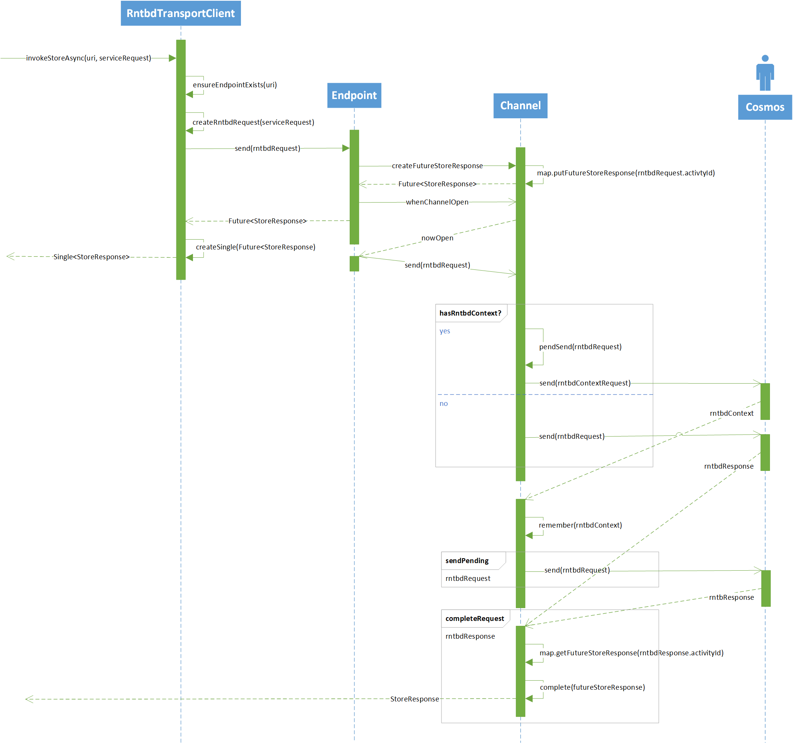

This specification describes a Netty-based Java implementation for direct-mode access to Azure Cosmos using its proprietary RNTBD protocol. This enables a Java client to create direct channels to Azure Cosmos back-end endpoints.

RNTBD is intended to be the high-performance TCP transport alternative to HTTP for Cosmos. At its core, the transport stack must implement the `Microsoft.Azure.Documents.TransportClient` contract. It must be able to: 

* Accept requests intended for a Cosmos DB replica.
  
* Serialize and send the requests to the intended endpoint ,
  
* De-serialize the response and return a StoreResponse in a timely fashion or fail with an appropriate error.

The `RntbdTransportClient` implements this contract. It extends `TransportClient` and implements its one-and-only-one overridable method:
```
    @Override
    public Single<StoreResponse> invokeStoreAsync(
        URI physicalAddress, 
        ResourceOperation operation, 
        RxDocumentServiceRequest request)
```

The `physicalAddress` address in the call to `invokeStoreAsync` is a request URI of the form:

   **rntbd://**_\<host>_**:**_\<port>_**/**_\<replica-path>_
   
Netty channel pipelines are created dynamically based on the host and port portion of the URI. The replica path is opaque to the `RntbdTransportClient`. 

Having one connection per remote endpoint might suffice in many cases, but there are reasons to believe the client will benefit from additional connections to the same endpoint in at least two cases:

* Head-of-line blocking
  
  Requests or responses can become bottle-necked behind large payloads, as they all must pass sequentially through the same stream.

* Object contention
  
  Machines with many cores might attempt to send requests to the same endpoint simultaneously, causing all requests to be sent serially, and then all responses to be dispatched serially.

For these reasons, the `RntbdTransportClient` supports multiple connections to an endpoint. At least one channel is created for each unique combination of host name and port number. Additional channels are created when the number of pending requests on existing channels gets too high. The set of channels created for a host name and port number are represented as an `RntbdTransportClient.Endpoint`. 

The criteria and thresholds for deciding when to create new channels, when to close existing channels, how to balance traffic among multiple connections, and whether to limit the total number of requests pending to an `RntbdTransportClient.Endpoint` are to be determined. The following section briefly describes the RNTBD protocol and the `RntbdTransportClient` channel pipeline.

## RNTBD Protocol and the RntbdTransportClient Channel Pipeline

Following creation of a channel upon receipt of the first `RxDocumentServiceRequest` to an endpoint, the RNTBD protocol requires a two-step context negotiation to complete before message exchange begins.

1. SSL Handshake

   At the end of this step all future messages will be encrypted. All SSL-related work--negotiation, encryption, and decryption--is performed by Netty's built-in `SSLHandler`. An RNTBD client must only negotiate TLS 1.2 or higher. This is subject to change as security requirements become more stringent over time. 
   
2. RNTBD context negotiation

   In this step the transport client makes a single request--an `RntbdContextRequest`--and awaits a single response--an `RntbdContext` message.

Request messages that arrive during context negotiation are queued. After context negotiation is complete all pending requests are sent. Request messages are framed and sent one at a time in arrival order on the channel's outgoing message stream. Response messages may be received in any order. Because of this pending promises of replies are matched with incoming response messages based on Activity ID. The lifetime of an RNTBD channel is illustrated in Figure 1.

```
┌────────────────────────────────────────────────────────────────────────────────────┐
│                               RNTBD Channel Timeline                               │
└────────────────────────────────────────────────────────────────────────────────────┘

┌──────────┐                                     ┌──────────┐
│          │                                     │          │
│  Client  │                                     │ Service  │
│          │                                     │          │
└──────────┘                                     └──────────┘
┌──────────┐                                     ┌──────────┐ ──────────────────────┐
│          │                                     │          │                       │
│          ├─────────────────┐                   │          │                       │
│          │                 │                   │          │                       │
│          │ ┌─────────────┐ └──────────────────▶│          │                       │
│          │ │SSL Handshake│                     │          │                       │
│          │ └─────────────┘                     │          │    Negotiate context  │
│          │                  ┌──────────────────┤          │                       │
│          │◀─────────────────┘                  │          │                       │
│          │                                     │          │                       │
│          ├─RntbdContextRequest────────────────▶│          │                       │
│          │                                     │          │                       │
│          │◀──────────────────────RntbdContext──│          │                       │
│          │                                     │          │ ──────────────────────┘
│          │                                     │          │ ──────────────────────┐
│          │                                     │          │                       │
│          │                                     │          │                       │
│          ├─RntbdRequest[1]────────────────────▶│          │                       │
│          │                                     │          │                       │
│          │                                     │          │                       │
│          ├─RntbdRequest[2]────────────────────▶│          │                       │
│          │                                     │          │                       │
│          │                                     │          │                       │
│          │◀───────────────────RntbdResponse[2]─│          │                       │
│          │                                     │          │                       │
│          │                                     │          │                       │
│          ├──RntbdRequest[3]───────────────────▶│          │                       │
│          │                                     │          │    Exchange messages  │
│          │                                     │          │                       │
│          │◀───────────────────RntbdResponse[1]─│          │                       │
│          │                                     │          │                       │
│          │                                     │          │                       │
│          │◀───────────────────RntbdResponse[3]─│          │                       │
│          │                                     │          │                       │
│          │                                     │          │                       │
│          │                 .                   │          │                       │
│          │                 .                   │          │                       │
│          │                 .                   │          │                       │
│          │                                     │          │                       │
│          │                                     │          │                       │
└──────────┘                                     └──────────┘ ──────────────────────┘
```
*Figure 1. RNTBD Channel Timeline*

Figure 2 illustrates the `RntbdTransportClient` implementation of the RNTBD protocol. It diagrams the happy-path. Channel management, error handling, and the details of the channel pipeline will be discussed later in this document.
<br>


*Figure 2. RNTBD Channel Implementation Overview*

The next section describes the `RntbdTransportClient` channel implementation.

## RNTBD Channel Implementation

Once a connection is established on a channel, the `RntbdTransportClient` begins exchanging messages. Messages written to an RNTBD channel move through a pipeline. This pipeline is the heart of the RNTBD channel implementation. 

There are four outgoing (request) message types and three incoming (response) message types:

| Request type              | Response type   | Description
| ------------------------- | ----------------| ------------------------------------------------------------------------
| `RntbdContextRequest`     | `RntbdContext`  | Sent on receipt of the first request on a channel. The response indicates that the connected Cosmos Service is either ready or rejects the request to exchange messages.
| `RntbdReadRequest`        | `RntbdResponse` | A request to read data with an error or non-error response.
| `RntbdHealthCheckRequest` | `RntbdHealth`   | Sent before each write operation on a channel. A response indicates that the connected Cosmos Service is in good health.
| `RntbdWriteRequest`       | `RntbdResponse` | A request to write data with an error or non-error response.

Request and response message types share a common base: `RntbdRequest` and `RntbdResponse`, respectively. 

The RNTBD pipeline is composed of a small number of Netty pipeline handlers:

| Pipeline class                | Role
| ----------------------------- | --------------------------------------------------------------------------------------
| `SslHandler`                  | Negotiates a secure connection. Subsequently encrypts data written to the channel's output stream and decrypts data read from the channel's input stream. The `SslHandler` reads/writes bytes. It knows nothing about RNTBD messages.
| `RntbdClientMessageFormatter` | Encodes `RntbdRequest` messages (to bytes) and decodes `RntbdResponse` messages (from bytes).
| `RntbdContextNegotiator`      | Injects an `RntbdContextRequest` message upon receipt of the first `RntbdRequest` message on a channel. `RntbdRequest` messages are queued and left pending until receipt of an `RntbdContext` message. If the response acknowledges that the connected Cosmos service is ready to exchange messages, all pending messages are  sent down the pipeline. On rejection, failure, cancellation, or timeout, the channel is closed and all pending responses are completed exceptionally.
| `RntbdHealthChecker`          | Injects an `RntbdHealthCheckRequest` message upon receipt of an `RntbdWriteRequest` message. The `RntbdWriteRequest` is left pending until an associated `RntbdHealth` response is received. The `RntbdWriteRequest` message is then sent down the pipeline. On failure, cancellation, or timeout, the `RntbdWriteRequest` is completed exceptionally with an indication that the `RntbdWriteRequest` is retry-able.
| `RntbdClientMessageManager`   | Creates and completes `CompletableFuture<StoreResponse>` instances. Handles cancellations, exceptions, and timeouts. Maintains the `RntbdContext`.

## Health Checks, Write Operations, and Channel Failures

Cosmos writes are not idempotent at the server. For this reason, the `RntbdTransportClient` must avoid sending writes through failed channels to whatever extent possible. This is the reason for sending write requests in two stages:

* Check that the channel is healthy and then--only if the server reports that the connection is healthy--
  
* Proceed with the write operation
  
The sequence of health check followed by write operation introduces a [time-of-check to time-of-use (TOCTOU)](https://en.wikipedia.org/wiki/Time_of_check_to_time_of_use) race condition. Even if the health check succeeds, the write operation could fail any time before the client receives a response--before sending the payload, while sending, or while waiting for a response. 

There is no way to close the race. The race window should be as small as possible. For this reason success responses to health checks aren't cached. That said, it’s not possible to reduce the probability of write failures to zero. When a failure is detected (on read, write, or health check operation), the channel will be closed and the `CompletableFuture<StoreResponse>` associated with each pending request will be completed exceptionally. The error associated with a failed `CompletableFuture<StoreResponse>` will indicate whether a failed request is retry-able.

## Cancellations, Exceptions, and Timeouts

Cancellations may be initiated by `RntbdTransportClient` consumers using the `Single<StoreResponse>` returned by `RntbdTransportClient.invokeStoreAsync`. 

Four types of exceptions are thrown by elements of the RNTBD pipeline:

* IllegalArgumentException is thrown when the argument to a function doesn't conform to the contract for a method and is indicative of a bug in the RNTBD channel pipeline code.

* IllegalStateException is thrown when the state of a pipeline, request, or response object doesn't conform to expectations. It is indicative of a bug in the RNTBD channel pipeline code or  an object passed to it.

* CorruptedFrameException is thrown when an IO error is detected. This means there was a problem reading/writing bytes to the wire. It is indicative of a channel health issue.

* SocketException (or one of its derivatives) are raised when a connection cannot be established or an established connection drops or hangs.

## Exception propagation

Exception propagate through the `RntbdTransportClient` like this:

* Connection exceptions associated with opening a channel propagate to the future listener added by RntbdTransportClient.Endpoint.write.

* Outbound channel exceptions propagate to the future listener added by RntbdTransportClient.Endpoint.doWrite

* Inbound channel exceptions are caught by RntbdRequestManager.exceptionCaught and propagate to the RxJava Single emitter returned by RntbdTransportClient.invokeStoreAsync.

#### Exception mapping

TODO: DANOBLE

## Performance Requirements

The performance requirements of the transport client stack are somewhat fuzzy. As it’s one of the core components of the system, the per-request overhead must be minimal. The overhead is best emphasized by tiny reads (<1 KiB) at eventual consistency, in the same region (1 ms RTT). 

Each connection should be able to handle around 2,500-5,000 requests per second. Given enough cores and memory, the transport stack must be able to handle around 30,000-60,000 requests per second, per endpoint. 

The current version of the protocol performs worse than necessary because all headers are in a flat structure. As such, the (inherently single-threaded) logic that decodes a request header to determine which pending I/O to complete must parse more data than necessary, lowering the peak attainable throughput per connection. Fixing that requires a protocol breaking change (incrementing the protocol version number and rolling out in a deliberate fashion). 

## Confidentiality & Integrity 

The client must only negotiate TLS 1.2 or newer. This is subject to change, as security requirements become more stringent over time. 

## Pass-through Tokens

RNTBD requests carry a correlation ID which is called `activityID` throughout the `RntbdTransportClient` implementation. An `activityID` is propagated to remote endpoints on every request.
The same holds for the user agent string which is included in the `RntbdContext` associated with a channel.

## RNTBD Message Formats

Each RNTBD message type consists of two parts:

* a head frame followed by
* an optional body frame.

Each frame begins with a 32-bit integer `length` field followed by a payload.

```
┌─────────────┬──────────────────┐
│ length (32) │ payload (0...) ...
└─────────────┴──────────────────┘
```

The definition of the `length` field is different for the head and body frames.

| Frame | Definition of `length` field
| ----- | --------------------------------------------------------------------------------------------------------------
| head  | Length of the frame (four plus the length of the payload) expressed as an unsigned 32-bit integer in little-endian order. Values greater than `Integer.MAX_VALUE` must not be sent.
| body  | Length of the payload expressed as a 32-bit integer in little-endian order. Values greater than `Integer.MAX_VALUE` must not be sent.

The `RntbdTransportClient` sends request messages and receives response messages. Following RNTBD context negotiation there is no guarantee that responses will be received in the order that requests are sent. Hence, it is the job of the `RntbdTransportClient` to match requests to responses based on *Activity ID*.

## RNTBD Request Messages

RNTBD request messages have this format:

```
RntbdRequestHead frame
┌────────────────────────────────────┬──────────────────┬──────────────────┬────────────────────────────────────────────
│length (32)                         │resourceType (16) │operationType (16)│activityID (128)                            
└────────────────────────────────────┴──────────────────┴──────────────────┴────────────────────────┬──────────────────┐
                                                                                                    │headers (0...)  ...
────────────────────────────────────────────────────────────────────────────────────────────────────┴──────────────────┘

RntbdRequestBody frame
┌────────────────────────────────────┬─────────────────────────────────────────────────────────────────────────────────┐
│length (32)                         │ payload (0...)                                                                ...
└────────────────────────────────────┴─────────────────────────────────────────────────────────────────────────────────┘
```

The fields of the `RntbdRequestHead` are defined as:

| Field         | Definition
| ------------- | -----------------------------------------------------------------------------------------------------
| length        | Length of the frame expressed as an unsigned 32-bit integer in little-endian order. Values greater than `Integer.MAX_VALUE` must not be sent.
| resourceType  | A 16-bit `RntbdResourceType.id()` value in little-endian order.
| operationType | A 16-bit `RntbdOperationType.id()` value in little-endian order.
| activityId    | A 128-bit Activity ID that uniquely identifies the request message. It is a `UUID` serialized as an `int` followed by three `short` and six `byte` values in little-endian order. This serialization yields the same sequence of bytes as produced by `System.Guid.ToByteArray`.
| headers       | A variable-length sequence of RNTBD headers expressed as `RntbdToken` values.

A description of each message type follows.

### RntbdContextRequest

An `RntbdContextRequest` consists of a single frame: an `RntbdRequestHead` with three headers.

```
┌──────────────────────────────┬──────────────┬──────────────┬─────────────────────────────────────────────────────────┬
│length (32)                   │0x0000 (16)   │0x0000 (16)   │activityID (128)                                       ...
└──────────────────────────────┴──────────────┴──────────────┴─────────────────────────────────────────────────────────┴
┬─────────────────────────────────────────────┬ ┬───────────────────────────────────────────────────────┐
│protocolVersion: RntbdTokenType.ULong (56) ... │clientVersion: RntbdTokenType.SmallString (32..2072) ...
┴─────────────────────────────────────────────┴ ┴───────────────────────────────────────────────────────┘
┬───────────────────────────────────────────────────────────┐
│userAgent: RntbdTokenType.SmallString (32..2072)         ...
┴───────────────────────────────────────────────────────────┘
```

The fields of the `RntbdContextRequest` are defined as follows:

| Field           | Definition
| --------------- | ----------------------------------------------------------------------------------------------------
| length          | Length of the frame expressed as an unsigned 32-bit integer in little-endian order.
| resourceType    | A 16-bit value of zero. This is the value of `RntbdResourceType.Connection.id()`.
| operationType   | A 16-bit value of zero. This is the value of `RntbdOperationType.Connection.id()`.
| protocolVersion | The protocol version to be negotiated. It is represented as a 56-bit long `RntbdToken` of type `RntbdTokenType.ULong`. Its token  identifier is `RntbdContextRequestHeader.ProtocolVersion.id()`.
| clientVersion   | The client version string. It is represented as a variable-length `RntbdToken` of type `RntbdTokenType.ShortString`. Its token identifier is `RntbdContextRequestHeader.ClientVersion.id()`.
| userAgent       | A string identifying the user agent. It is represented as a variable-length `RntbdToken` of type `RntbdTokenType.ShortString`. Its token identifier is `RntbdContextRequestHeader.UserAgent.id()`.


### RntbdHealthCheckRequest

TODO: DANOBLE

### RntbdReadRequest

TODO: DANOBLE

### RntbdWriteRequest

TODO: DANOBLE

## RNTBD Response Messages

RNTBD response messages have this format:

```
RntbdResponseHead frame
┌────────────────────────────────────┬──────────────────┬───────────────────────────────────────────────────────────────
│length (32)                         │status (16)       │activityID (128)                                               
└────────────────────────────────────┴──────────────────┴────────────────────────┬─────────────────────────────────────┐
                                                                                 │headers (0...)                     ...
─────────────────────────────────────────────────────────────────────────────────┴─────────────────────────────────────┘

RntbdResponseBody frame
┌────────────────────────────────────┬─────────────────────────────────────────────────────────────────────────────────┐
│length (32)                         │ payload (0...)                                                                ...
└────────────────────────────────────┴─────────────────────────────────────────────────────────────────────────────────┘
```

The fields of the `RntbdResponseHead` are defined as:

| Field         | Definition
| ------------- | ------------------------------------------------------------------------------------------------------
| length        | Length of the frame expressed as an unsigned 32-bit integer in little-endian order. Values greater than `Integer.MAX_VALUE` must not be sent.
| status        | A 32-bit `HttpResponseStatus` code in little-endian order.
| activityId    | A 128-bit Activity ID that uniquely identifies the request message. It is a `UUID` serialized as an `int` followed by three `short` and six `byte` values in little-endian order. This serialization yields the same sequence of bytes as produced by `System.Guid.ToByteArray`.
| headers       | A variable-length sequence of RNTBD headers expressed as `RntbdToken` values.


## RNTBD Headers

RNTBD headers are expressed as a sequence of `RntbdToken` instances with this wire format:

```
┌────────────────┬────────┬────────────────────────────┐
│id (16)         │type (8)│value (0...)              ...
└────────────────┴────────┴────────────────────────────┘
```

The fields of an `RntbdToken` instance are defined as:

| Field         | Definition
| ------ | ------------------------------------------------------------------------------------------------------
| id     | A 16-bit `RntbdRequestHeader` or `RntbdResponseHeader` identifier in little-endian order.
| type   | An 8-bit `RntbdTokenType` ID.
| value  | Value of the header identified by `id`. The format and length of the value depend on the `type`.

Here are the formats of `RntbdToken` instance values by `RntbdTokenType`.

### RntbdTokenType.Byte (0x00)

An `RntbdToken` of type `RntbdTokenType.UShort` represents an unsigned 8-bit integer-valued header. It has a fixed 
length of 4 bytes (32 bits).

```
┌────────────────┬────────┬────────┐
│id (16)         │0x00 (8)│val (8) │
└────────────────┴────────┴────────┘
```

### RntbdTokenType.UShort (0x01)

An `RntbdToken` of type `RntbdTokenType.UShort` represents an unsigned 16-bit integer-valued header. It has a fixed 
length of 5 bytes (40 bits).

```
┌────────────────┬────────┬────────────────┐
│id (16)         │0x01 (8)│ value (16)     │
└────────────────┴────────┴────────────────┘
```

### RntbdTokenType.ULong (0x02)

An `RntbdToken` of type `RntbdTokenType.ULong` represents an unsigned 32-bit integer-valued header. It has a fixed 
length of 7 bytes (56 bits).

```
┌────────────────┬────────┬────────────────────────────────┐
│id (16)         │0x02 (8)│value (32)                      │
└────────────────┴────────┴────────────────────────────────┘
```

### RntbdTokenType.Long (0x03)

An `RntbdToken` of type `RntbdTokenType.Long` represents an signed 32-bit integer-valued header. It has a fixed length of 7 bytes (56 bits).

```
┌────────────────┬────────┬────────────────────────────────┐
│id (16)         │0x03 (8)│value (32)                      │
└────────────────┴────────┴────────────────────────────────┘
```

### RntbdTokenType.ULongLong (0x04)

An `RntbdToken` of type `RntbdTokenType.ULongLong` represents an unsigned 64-bit integer-valued header. It has a fixed length of 11 bytes (88 bits).

```
┌────────────────┬────────┬────────────────────────────────────────────────────────────────┐
│id (16)         │0x04 (8)│value (64)                                                      │
└────────────────┴────────┴────────────────────────────────────────────────────────────────┘
```

### RntbdTokenType.LongLong (0x05)

An `RntbdToken` of type `RntbdTokenType.LongLong` represents a signed 64-bit integer-valued header. It has a fixed
length of 11 bytes (88 bits).

```
┌────────────────┬────────┬────────────────────────────────────────────────────────────────┐
│id (16)         │  0x05  │ (64)                                                           │
└────────────────┴────────┴────────────────────────────────────────────────────────────────┘
```

### RntbdTokenType.Guid (0x06)

An `RntbdToken` of type `RntbdTokenType.Guid` represents a 128-bit UUID serializes using an algorithm that produces
the same byte sequence as [`System.Guid.ToByteArray`](https://docs.microsoft.com/en-us/dotnet/api/system.guid.tobytearray?view=netframework-4.7.2). It has a fixed length of 19 bytes (152 bits).

```
┌────────────────┬────────┬─────────────────────────────────────────────────────────────────────────────────────────────
│id (16)         │0x06 (8)│ value (128)                                                                                   
└────────────────┴────────┴─────────────────────────────────────────────────────────────────────────────────────────────
───────────────────────────────────┐
                                   │
───────────────────────────────────┘
```

### RntbdTokenType.SmallString (0x07)

An `RntbdToken` of type `RntbdTokenType.SmallString` represents a UTF-8 encoded string-valued header. It has a variable length between 4 bytes (32 bits) and 259 bytes (2,072 bits). Its encoded string value can be as large as 255 bytes.

```
┌────────────────┬────────┬────────┬────────────────────────────┐
│id (16)         │0x07 (8)│len (8) │ val (0..0xFF)            ...
└────────────────┴────────┴────────┴────────────────────────────┘
```

### RntbdTokenType.String (0x08)

An `RntbdToken` of type `RntbdTokenType.String` represents a UTF-8 encoded string-valued header. It has a variable length between 5 bytes (40 bits) and 2,147,483,654 bytes (524,320 bits). Its encoded string value can be as large as
65,535 bytes (64 KiB - 1 byte).

```
┌────────────────┬────────┬────────────────┬────────────────────────────┐
│id (16)         │0x08 (8)│len (16)        │ val (0..0xFFFF)          ...
└────────────────┴────────┴────────────────┴────────────────────────────┘
```

### RntbdTokenType.ULongString (0x09)

An `RntbdToken` of type `RntbdTokenType.ULongString` represents a UTF-8 encoded string-valued header. It has a variable length between 7 bytes (56 bits) and 2,147,483,654 bytes (a little more than 16 gibits). Its encoded string value can be as large as 2,147,483,647 (2**31 - 1) bytes.

```
┌────────────────┬────────┬────────────────────────────────┬────────────────────────────┐
│id (16)         │0x09 (8)│len (32)                        │ val (0..0x7FFFFFFF)      ...
└────────────────┴────────┴────────────────────────────────┴────────────────────────────┘
```

### RntbdTokenType.SmallBytes (0x0A)

```
┌────────────────┬────────┬────────┬────────────────────────────┐
│id (16)         │  0x0A  │len (8) │ val (0..0xFF)            ...
└────────────────┴────────┴────────┴────────────────────────────┘
```

### RntbdTokenType.Bytes (0x0B)

```
┌────────────────┬────────┬────────────────┬────────────────────────────┐
│id (16)         │  0x0B  │len (16)        │ val (0..0xFFFF)          ...
└────────────────┴────────┴────────────────┴────────────────────────────┘
```

### RntbdTokenType.ULongBytes (0x0C)

```
┌────────────────┬────────┬────────────────────────────────┬────────────────────────────┐
│id (16)         │  0x0C  │len (32)                        │ val (0..0x7FFFFFFF)      ...
└────────────────┴────────┴────────────────────────────────┴────────────────────────────┘
```

### RntbdTokenType.Float (0x0D)

```
┌────────────────┬────────┬────────────────────────────────┐
│id (16)         │  0x0D  │ val (32)                       │
└────────────────┴────────┴────────────────────────────────┘
```

### RntbdTokenType.Double (0x0E)

```
┌────────────────┬────────┬────────────────────────────────────────────────────────────────┐
│id (16)         │  0x0E  │ val (64)                                                       │
└────────────────┴────────┴────────────────────────────────────────────────────────────────┘
```

### RntbdTokenType.Invalid (0xFF)

```
┌────────────────┬────────┐
│id (16)         │  0x0F  │
└────────────────┴────────┘
```
