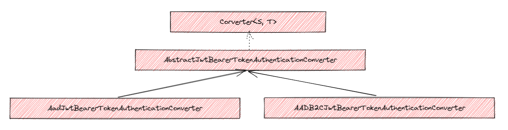
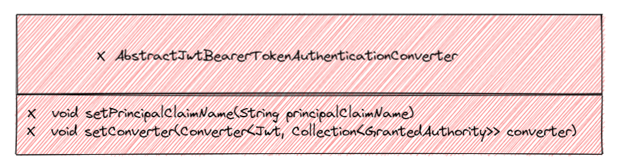
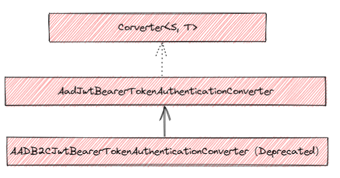
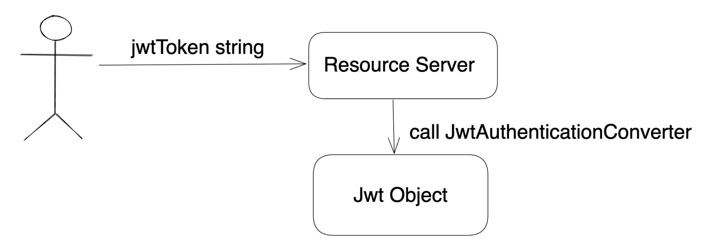
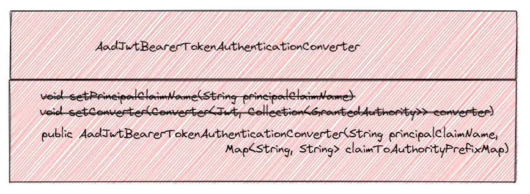
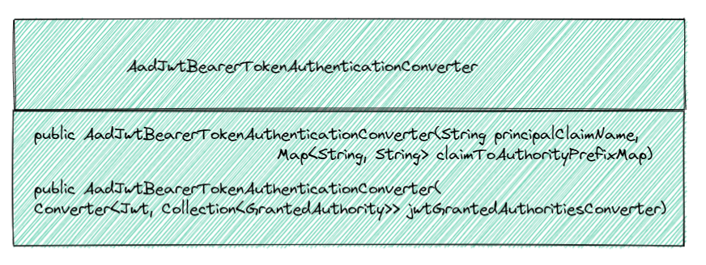

* [1 Context](#1-context)
  * [1.1 Class diagram relationship before version 3.7](#11-class-diagram-relationship-before-version-37)
  * [1.2 Breaking changes since 3.8](#12-breaking-changes-since-38)
* [2 Cause analysis](#2-cause-analysis)
  * [2.1 Analyze the PR motivations](#21-analyze-the-pr-motivations)
  * [2.2 Subjective reasons](#22-subjective-reasons)
* [3 Solution design](#3-solution-design)
  * [3.1 Goal](#31-goal)
  * [3.2 Token authentication Converter](#32-token-authentication-converter)
    * [3.2.1 Enhance the deprecated AadJwtBearerTokenAuthenticationConverter for 4.x](#321-enhance-the-deprecated-aadjwtbearertokenauthenticationconverter-for-4x)
    * [3.2.2 Use Spring Security JwtAuthenticationConverter for 6.x](#322-use-spring-security-jwtauthenticationconverter-for-6x)
  * [3.3 Security configurer for Resource Server](#33-security-configurer-for-resource-server)
    * [3.3.1 How a security configurer is used in a Resource Server application](#331-how-a-security-configurer-is-used-in-a-resource-server-application)
      * [3.3.1.1 Spring Boot 2.x](#3311-spring-boot-2x)
      * [3.3.1.2 Spring Boot 3.x](#3312-spring-boot-3x)
    * [3.3.2 Enhance configurer for 4.x](#332-enhance-configurer-for-4x)
    * [3.3.3 Enhance configurer for 6.x](#333-enhance-configurer-for-6x)

# 1 Context
The customer reported the issue [AAD braking changes blocked the SCA upgrade from 3.6 to 4.0](https://github.com/Azure/azure-sdk-for-java/issues/28665), not support a custom granted author converter anymore in the AAD token authentication converter.

Let's see the related classes structure and what happened:

## 1.1 Class diagram relationship before version 3.7



- The `AADJwtBearerTokenAuthenticationConverter` was used in the default configuration `AADResourceServerWebSecurityConfigurerAdapter` as a custom JWT authentication converter for the Resource Server scenario.

- The `AADB2CJwtBearerTokenAuthenticationConverter` can be used in a customer Resource Server configuration, as a custom JWT authentication converter for the Resource Server scenario. SCA does not provide a default configuration to use for Azure AD B2C side.

  The customer wants the feature implemented in class `AbstractJwtBearerTokenAuthenticationConverter`.

## 1.2 Breaking changes since 3.8
The PR [Deprecate AADB2CJwtBearerTokenAuthenticationConverter](https://github.com/Azure/azure-sdk-for-java/pull/23444) deleted the class `AbstractJwtBearerTokenAuthenticationConverter`,

The below methods are removed, and they are not added back to the subclass `AADJwtBearerTokenAuthenticationConverter`.



# 2 Cause analysis
This PR [Deprecate AADB2CJwtBearerTokenAuthenticationConverter](https://github.com/Azure/azure-sdk-for-java/pull/23444) has removed the class `AbstractJwtBearerTokenAuthenticationConverter` and hardcoded the Aad JWT granted authorities converter `AADJwtGrantedAuthoritiesConverter`, this is the blocker for the customer upgrade to 3.8 or 4.0.

## 2.1 Analyze the PR motivations
- Reduce code redundancy(`AADJwtBearerTokenAuthenticationConverter` and `AADB2CJwtBearerTokenAuthenticationConverter`).
- Simplify the class `AADJwtBearerTokenAuthenticationConverter`.

New Class diagram relationship:



## 2.2 Subjective reasons
- There was no design review to ensure the rationality and accuracy of this modification
- The PR reviewer did not check carefully.
- The SCA release pipeline has not set up an API review process to monitor and do approval.

# 3 Solution design

## 3.1 Goal
- Keep the API unchanged.
- Enhance the deprecated token authentication converter to add back the customized JWT granted authorities converter support.
- Enhance the configurer to support the Jwt-granted authorities converter.

## 3.2 Token authentication Converter

A token authentication converter is required to define a security configurer `JwtConfigurer`, which is a part of the security configurer `OAuth2ResourceServerConfigurer`.



### 3.2.1 Enhance the deprecated AadJwtBearerTokenAuthenticationConverter for 4.x

At present, the converter [AadJwtBearerTokenAuthenticationConverter](https://github.com/Azure/azure-sdk-for-java/blob/e62ae49cc9d0c6a3cf9d5bfd56ff1840db175772/sdk/spring/spring-cloud-azure-autoconfigure/src/main/java/com/azure/spring/cloud/autoconfigure/aad/AadJwtBearerTokenAuthenticationConverter.java#L74) has missing function and does not support customized JWT granted authorities converter.



**Solution**
Make the class `AadJwtBearerTokenAuthenticationConverter` support customized JWT granted authorities converter, not only the converter `AadJwtGrantedAuthoritiesConverter`.



### 3.2.2 Use Spring Security JwtAuthenticationConverter for 6.x

❌ AadJwtBearerTokenAuthenticationConverter: this converter has been deleted in 6.x ([PR](https://github.com/Azure/azure-sdk-for-java/issues/31330#issuecomment-1283280151))
✅ JwtAuthenticationConverter: recommend user use this Spring security built-in converter for the resource server.   🛎️  The `JwtAuthenticationConverter` already supports `setPrincipalClaimName()` and `setJwtGrantedAuthoritiesConverter`.

**Solution**
No changes needed.

## 3.3 Security configurer for Resource Server

### 3.3.1 How a security configurer is used in a Resource Server application

#### 3.3.1.1 Spring Boot 2.x

Sample code for using `WebSecurityConfigurerAdapter`

```java
@EnableWebSecurity
@EnableGlobalMethodSecurity(prePostEnabled = true)
public static class ResourceServerWebSecurityConfigurerAdapter extends
    WebSecurityConfigurerAdapter {

    @Override
    protected void configure(HttpSecurity http) throws Exception {
      http.oauth2ResourceServer()
            .jwt()
              .jwtAuthenticationConverter(new JwtAuthenticationConverter());
    }
}
```

Sample code for using **Azure AD configurer adapter**:

```java
@EnableWebSecurity
@EnableGlobalMethodSecurity(prePostEnabled = true)
public static class EnhancedResourceServerWebSecurityConfigurerAdapter extends
	AadResourceServerWebSecurityConfigurerAdapter {

	@Override
	protected void configure(HttpSecurity http) throws Exception {
	    super.configure(http);
	}
}
```

#### 3.3.1.2 Spring Boot 3.x

Sample code for using `AbstractHttpConfigurer`:
```java
@EnableWebSecurity
@EnableMethodSecurity
static class EnhancedResourceServerConfiguration {
    
    @Bean
    SecurityFilterChain enhancedResourceServerFilterChain(HttpSecurity http) throws Exception {
        http.apply(EnhancedResourceServerHttpSecurityConfigurer.enhancedResourceServer());
        return http.build();
    }
}

public class EnhancedResourceServerHttpSecurityConfigurer extends AbstractHttpConfigurer<EnhancedResourceServerHttpSecurityConfigurer, HttpSecurity> {

    @Override
    public void init(HttpSecurity builder) throws Exception {
        super.init(builder);
        builder.oauth2ResourceServer()
                 .jwt()
                   .jwtAuthenticationConverter(new JwtAuthenticationConverter());
    }
    
    public static EnhancedResourceServerHttpSecurityConfigurer enhancedResourceServer() {
        return new EnhancedResourceServerHttpSecurityConfigurer();
    }
}
```

Sample code for using **Azure AD Security Configurer**:

```java
@EnableWebSecurity
@EnableMethodSecurity
static class EnhancedResourceServerConfiguration {

    @Bean
    SecurityFilterChain enhancedResourceServerFilterChain(HttpSecurity http) throws Exception {
        http.apply(AadResourceServerHttpSecurityConfigurer.aadResourceServer());
        return http.build();
    }
}
```

### 3.3.2 Enhance configurer for 4.x

Make the default configurer `AadResourceServerWebSecurityConfigurerAdapter` support the customized JWT granted authorities converter.

**Solution**:

```java
class AadResourceServerWebSecurityConfigurerAdapter extends WebSecurityConfigurerAdapter {

  public AadResourceServerWebSecurityConfigurerAdapter(AadResourceServerProperties properties,
					Converter<Jwt, Collection<GrantedAuthority>> jwtGrantedAuthoritiesConverter) {}

  protected Converter<Jwt, Collection<GrantedAuthority>> jwtGrantedAuthoritiesConverter() {}
} 

```

### 3.3.3 Enhance configurer for 6.x

Make the default configurer [AadResourceServerHttpSecurityConfigurer](https://github.com/Azure/azure-sdk-for-java/blob/602c3a4bede67fc9208d222f0d41a0f424366fdb/sdk/spring/spring-cloud-azure-autoconfigure/src/main/java/com/azure/spring/cloud/autoconfigure/aad/AadResourceServerHttpSecurityConfigurer.java#L54) support the customized JWT granted authorities converter through the custom [DSL](https://docs.spring.io/spring-security/reference/servlet/configuration/java.html#jc-custom-dsls).

**Solution**:

```java
public class AadResourceServerHttpSecurityConfigurer extends AbstractHttpConfigurer<AadResourceServerHttpSecurityConfigurer, HttpSecurity> {

    public AadResourceServerHttpSecurityConfigurer jwtGrantedAuthoritiesConverter(
        Converter<Jwt, Collection<GrantedAuthority>> jwtGrantedAuthoritiesConverter) {
    }
} 
```
