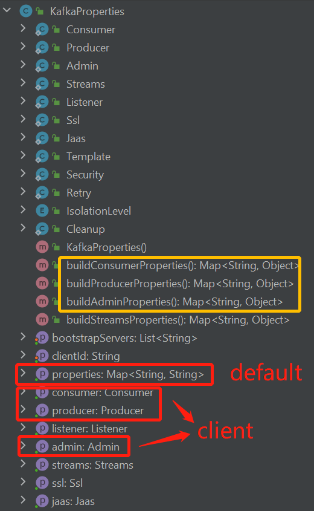
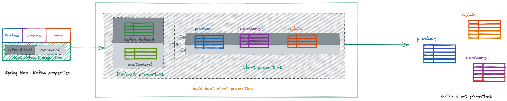
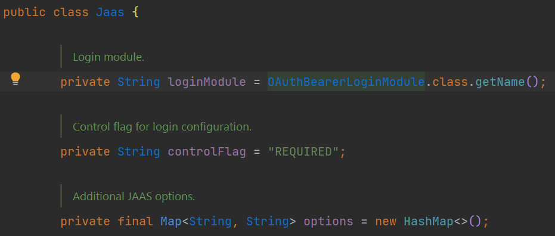
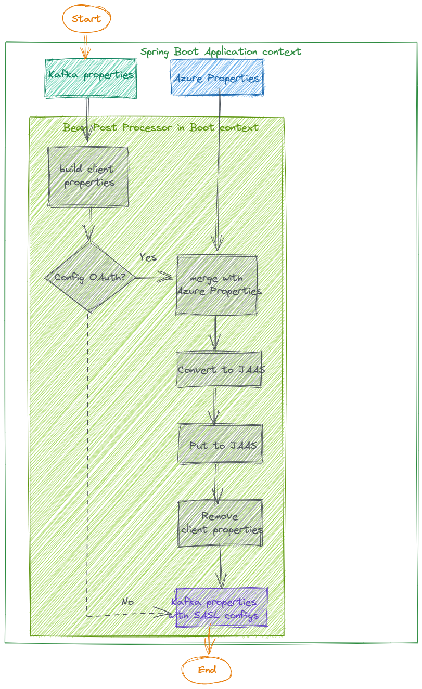
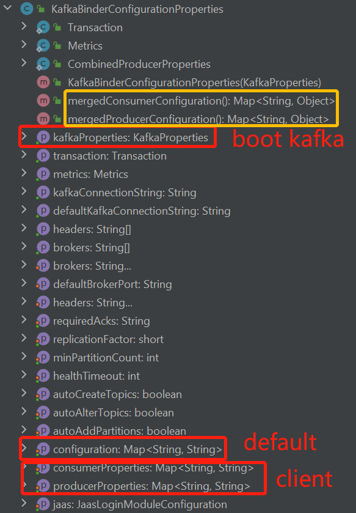
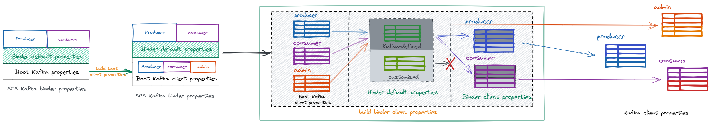
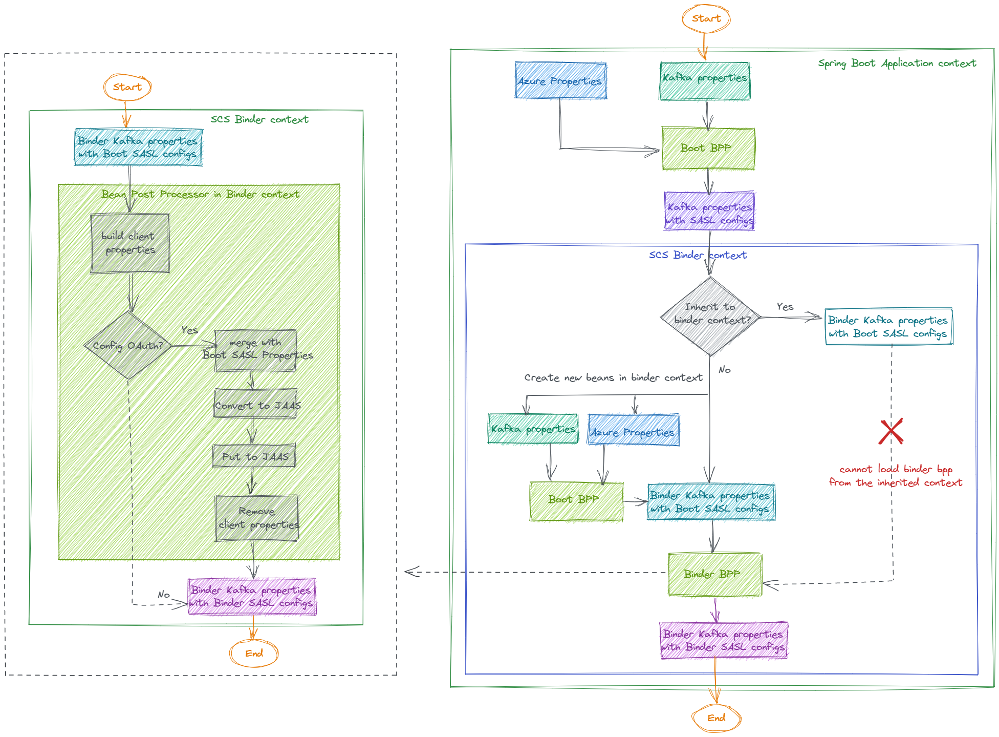

##  1. <a name='Context'></a>Context
As is reported in https://github.com/Azure/azure-sdk-for-java/issues/30800#issuecomment-1254620865, when using Event Hubs for Kafka passwordless-connection, there are a batch of warning logs saying, "The configuration 'xxx' was supplied but isn't a known config".
We should consider preventing those warning logs being printed.
```java
2022-09-22 14:51:10.825  WARN 30520 --- [           main] o.a.k.clients.consumer.ConsumerConfig    : The configuration 'azure.profile.environment.gallery-endpoint' was supplied but isn't a known config.
2022-09-22 14:51:10.825  WARN 30520 --- [           main] o.a.k.clients.consumer.ConsumerConfig    : The configuration 'azure.profile.cloud-type' was supplied but isn't a known config.
2022-09-22 14:51:10.825  WARN 30520 --- [           main] o.a.k.clients.consumer.ConsumerConfig    : The configuration 'azure.profile.environment.azure-data-lake-store-file-system-endpoint-suffix' was supplied but isn't a known config.
2022-09-22 14:51:10.825  WARN 30520 --- [           main] o.a.k.clients.consumer.ConsumerConfig    : The configuration 'azure.profile.environment.azure-data-lake-analytics-catalog-and-job-endpoint-suffix' was supplied but isn't a known config.
2022-09-22 14:51:10.825  WARN 30520 --- [           main] o.a.k.clients.consumer.ConsumerConfig    : The configuration 'azure.credential.managed-identity-enabled' was supplied but isn't a known config.
2022-09-22 14:51:10.825  WARN 30520 --- [           main] o.a.k.clients.consumer.ConsumerConfig    : The configuration 'azure.profile.environment.azure-application-insights-endpoint' was supplied but isn't a known config.
2022-09-22 14:51:10.825  WARN 30520 --- [           main] o.a.k.clients.consumer.ConsumerConfig    : The configuration 'azure.profile.environment.resource-manager-endpoint' was supplied but isn't a known config.
2022-09-22 14:51:10.825  WARN 30520 --- [           main] o.a.k.clients.consumer.ConsumerConfig    : The configuration 'azure.profile.environment.azure-log-analytics-endpoint' was supplied but isn't a known config.
2022-09-22 14:51:10.825  WARN 30520 --- [           main] o.a.k.clients.consumer.ConsumerConfig    : The configuration 'azure.profile.environment.sql-management-endpoint' was supplied but isn't a known config.
```
##  2. <a name='Causeanalysis'></a>Cause analysis
The warning logs are caused because, in the mentioned 3 cases from the feature spec, there are spring cloud azure credential/profile related properties in the application context, and we put all those credential/profile properties to the client portion of Kafka properties. Here the client portion of Kafka properties refers to:
1. For Spring Boot Kafka properties with the prefix as `spring.kafka.`, we put those Azure properties to KafkaProperties bean in the portion like spring.kafka.producer.properties.{key};

2. For SCS Kafka binder properties with the prefix as `spring.cloud.stream.kafka.binder.`, we put those Azure properties to the KafkaBinderConfigurationProperties bean in the portion like [spring.cloud.stream.kafka.binder.producer-properties.{key}](https://github.com/spring-cloud/spring-cloud-stream-binder-kafka/blob/main/spring-cloud-stream-binder-kafka-core/src/main/java/org/springframework/cloud/stream/binder/kafka/properties/KafkaBinderConfigurationProperties.java#L89).

Those properties are treated as configuration targeted to Kafka clients and will be passed to clients, however since the properties are not Kafka-defined so when Kafka tries to parse them, it fails to recognize and then starts to print warning logs.

##  3. <a name='Solutiondesign'></a>Solution design
In the above cases, there are Azure credential/profile properties placed to Kafka client properties. Those Azure properties are valuable since they provide the way to customizd the credentials used in password-less connection, and also mark the information about the target Event Hubs server, which will be picked by our callback handler when execute OAuth2 authentication. The thing is that we chose to place them in Kafka client configs, which breaks Kafka design to some extent. In that case, we need to consider placing those properties via other ways.

According to Kafka [documentation](https://kafka.apache.org/documentation/#security_sasl), Kafka protocol supports SASL and SSL mechanism to go authentication and establish secured connection. In our case of password-less connection, we choose Kafka's [SASL/OAUTHBEARER](https://kafka.apache.org/documentation/#security_sasl_oauthbearer) mechanism for the authentication procedure to connect Azure Event Hubs, which uses the OAuth2 protocol. And all of our provided credential/profile properties are used for the SASL/OAUTHBEARER authentication purpose. Referring to Kafka's [security documentation](https://kafka.apache.org/documentation/#security_sasl_jaasconfig), Kafka uses the Java Authentication and Authorization Service (JAAS) for SASL configuration, thus, a more proper position to place our Azure properties should be the [JAAS configuration](https://kafka.apache.org/documentation/#security_jaas_client), which means we should place all the Azure properties from the client portion of Kafka properties to the JAAS portion, and to avoid causing warning logs, all Azure properties configured in client portion should be removed.

The JAAS configuration for Kafka is keyed as `sasl.jaas.config`, with the [pattern](https://docs.oracle.com/javase/7/docs/technotes/guides/security/jgss/tutorials/LoginConfigFile.html) of `<LoginModule> <flag> <LoginModule options>;`, where in our password-less support, the login module is `org.apache.kafka.common.security.oauthbearer.OAuthBearerLoginModule` and flag is `required`. Then the login-module options can be used to place our Azure credential/profile properties, we can move Azure properties to Kafka JAAS configs and make it with the format like `org.apache.kafka.common.security.oauthbearer.OAuthBearerLoginModule required azure.credential.managed-identity-enabled="true" key2="xxxxx";`.

In conclusion, we will convert all sources of Azure properties to JAAS configuration and fill in Kafka JAAS configs in the background. However, this change is transparent to users, and they can continue to configure their application the same way they do today.

For example, when a user configures Kafka as below, we should convert Azure credential/profile properties to JAAS configuration with the format as `org.apache.kafka.common.security.oauthbearer.OAuthBearerLoginModule required azure.credential.managed-identity-enabled="true" azure.credential.client-Id="ASDF";` 
```properties
# When using org.springframework.cloud:spring-cloud-starter-stream-kafka
spring.cloud.stream.kafka.binder.brokers=<namespace>.servicebus.windows.net:9093
spring.cloud.azure.credential.managed-identity-enabled=true
spring.cloud.stream.kafka.binder.producer-properties.azure.credential.client-Id=ASDF
```

##  4. <a name='Implementationdesign'></a>Implementation design
The core principle about removing warning logs is to move the Azure properties from client portion of Kafka properties to the JAAS portion. Thus, to do this, we should implement the following 4 steps:
1. For each Kafka client, merge all Azure properties from different sources with priorities.
2. Convert the merged properties to a set of string following JAAS pattern.
3. Configure each Kafka client's JAAS config with its JAAS string.
4. Remove all Azure configuration from Kafka properties.

For each step, since there are some inconsistencies for Spring Boot Kafka properties and SCS Kafka binder properties, so we need to consider them separately.

###  4.1. <a name='SpringKafkainSpringBootapplications'></a>Spring Kafka in Spring Boot applications

####  4.1.1. <a name='MergeAzureproperties'></a>Merge Azure properties
For the Spring Boot Kafka autoconfiguration, the properties can be divided into 4 parts:
1. The `default` properties which can be passed to all the Kafka clients with the lowest priority.
2. `Producer` client properties which can only apply to the KafkaProducer client.
3. `Consumer` client properties which can only apply to the KafkaConsumer client.
4. `Admin` client properties which can only apply to the KafkaAdmin client.

<p align="center">
   
</p>

For each of the above 4 parts, the properties can be further divided into `kafka-defined` and `customized` ones, where the `sasl.jaas.config` is the former one, and any our Azure properties are the latter. The below picture shows the workflow of how the client properties are finally built from Spring Boot Kafka properties. Taking the producer as an example, the `kafka-defined` properties in default part will be passed upward to `kafka-defined` properties in the producer and get merged/overridden. Same for the `customized` configs.



When merging Azure credential/profile properties, we should take configuration from 3 sources into consideration with the priority from low to high: Spring Cloud Azure properties, Kafka default properties and client properties. To make the merging process easier, we can use a Map for the merged properties and then just iterate the sources and store to the Map. Thus, we can use an Object of `Jaas` to abstract those configurations which are actually the LoginModule-option member within it. And use an Object of `JaasResolver` to perform the merge process.



####  4.1.2. <a name='ConverttoJAASconfiguration'></a>Convert to JAAS configuration
To convert the merged properties to a String of JAAS patter, we can just override the `toString` method of `Jaas`.

####  4.1.3. <a name='PuttoKafkaclientproperties'></a>Put to Kafka client properties
Here we should make sure every Kafka client will be configured with its associated JAAS configuration. Therefore, we should put the configuration to the `Kafka-defined` client part of Kafka properties.

####  4.1.4. <a name='RemoveAzureconfiguration'></a>Remove Azure configuration
We should make sure both the client and default parts get removed. To make sure that the removed properties won't have side effects, we can remove after the properties have converted.

So, the whole flow for Spring Boot Kafka application should be:

<p align="center">
    
</p>

###  4.2. <a name='SCSKafkaapplications'></a>SCS Kafka applications

####  4.2.1. <a name='MergeAzureproperties-1'></a>Merge Azure properties
For the SCS Kafka autoconfiguration, the properties can be divided into 4 parts:
1. The Spring Boot Kafka properties.
2. The `default` properties which can be passed to all the Kafka clients with the lowest priority.
3. `Producer` client properties which can only apply to the KafkaProducer client.
4. `Consumer` client properties which can only apply to the KafkaConsumer client.

<p align="center">
   
</p>

For each of the above 4 parts, the properties can be further divided into `kafka-defined` and `customized` ones. However, the difference between SCS and Spring Boot Kafka is that the `customized` configs in `default` properties won't be passed upwards to the producer or consumer. The below picture shows the workflow of how the client properties are finally built from SCS Kafka Binder properties. 



When merging Azure credential/profile properties, we should take configuration from 3 sources into consideration with the priority from low to high: Spring Boot Kafka properties (merged with Spring Cloud Azure), Binder Kafka default properties and client properties. However, when parsing the default portion, we should manually collect the Azure properties if any.

####  4.2.2. <a name='ConverttoJAASconfiguration-1'></a>Convert to JAAS configuration
Same as boot.

####  4.2.3. <a name='PuttoKafkaclientproperties-1'></a>Put to Kafka client properties
Here we should make sure every Kafka client will be configured with its associated JAAS configuration. Therefore, we should put the configuration to the `Kafka-defined` client part of Kafka properties.
Since there is no admin part in binder properties, and Kafka binder handles both Spring Boot and binder default properties for admin. The we should put the JAAS configuration to default portion since it has the highest priority for admin. And the handling of admin should be the last to avoid it pollutes the property sources of producer and consumer.

####  4.2.4. <a name='RemoveAzureconfiguration-1'></a>Remove Azure configuration
Same as boot.

So, the whole flow for SCS Kafka Binder application should be:



##  5. <a name='Needstoconfirm'></a>Needs to confirm
1. What if developers configure JAAS configuration via [static JAAS config file](https://kafka.apache.org/documentation/#security_client_staticjaas)?

   In our implementation of Kafka passwordless support as well as this design doc, we will analyse the `sasl.jaas.config` configuration and modify it if needed. However, according to Apache Kafka [doc](https://kafka.apache.org/documentation/#security_jaas_client), the JAAS configuration can be specified by two alternatives: client property of `sasl.jaas.config` or static JAAS configuration system property `java.security.auth.login.config`. And the former has higher priority.

   So here are two things we need to consider:
   * Should we detect both two JAAS configuration alternatives?  --> We may need to detect both to make a complete feature, but to detect `java.security.auth.login.config` may need other efforts, thus we may consider regarding it as another topic/task?
   * Where should we put our converted JAAS configuration? --> We should put to the highest priority to make sure it can take effects.

2. When developers set JAAS configuration for `KafkaJaasLoginModuleInitializer`, should we take it into consideration?

   `KafkaJaasLoginModuleInitializer` is the way to configure JAAS options provided by spring-kafka, and SCS Kafka binder also supports it. It is used to replace the static JAAS configuration system property `java.security.auth.login.config` to provide a more flexible way of configuration. Taking spring boot kafka application as an example, developers can leverage it instead of using `java.security.auth.login.config`:
   ```yaml
   spring:
     kafka:
       jaas:
         control-flag: required
         enabled: true
         login-module: com.sun.security.auth.module.Krb5LoginModule
         options:
           useKeyTab: true
           keyTab: keytab-value
           storeKey: true
           debug: true
           serviceName: kafka
           principal: principal-value
   ```
   But in both boot and binder, such properties won't be passed to Kafka client portion. So, should we take it into consideration when detecting user configurations?

3. We have required that `flag` of JAAS configuration to be `required`, can it be [requisite](https://docs.oracle.com/middleware/1212/wls/SECMG/atn.htm#SECMG172)?

   The flag controls the overall behavior as authentication proceeds down the stack. However, it usually is meaningful when there are multiple login modules. While for Kafka client applications, according to the [doc](https://kafka.apache.org/documentation/#security_sasl_clientconfig), the client side should only configure one mechanism. Thus, it would be ok for us to use either `required` or `requisite`.

   However, should we allow developers to use other flags if they have pre-configured the JAAS configuration? Should we make the flag as a configurable option?

4. How should we treat the original JAAS configuration options configured by users?

   Since we decided to convert Azure credential/profiles properties to JAAS configuration, then we should also consider what if there are other JAAS configuration options from users.
   
   ```properties
   # When using org.springframework.cloud:spring-cloud-starter-stream-kafka
   spring.cloud.stream.kafka.binder.consumer-properties.sasl.jaas.config=org.apache.kafka.common.security.oauthbearer.OAuthBearerLoginModule required user.configured.key="xxxxx";
   ```

   The user-defined options can be divided into two types:
   1. When developers set non-Azure-properties via LoginModule options with our expected pattern (JAAS login module and flag), then those options should not be overridden.
   2. When developers set Azure-properties via LoginModule options with our expected pattern (JAAS login module, flag and property key/values), then we can have two kinds of action to them:

       * We also count those options and should think about the priority of such options. Also, if so, we need to introduce it in our doc since it exports new configuration API.
       * We just discard them.

   The conclusion for this question is, we will neglect the `sasl.jaas.config` configuration from users. And if they really want to customize such option, they can choose to disable our passwordless autoconfiguration and configure on their own. Besides, we should document this behavior and also guidance about how users can only leverage our callback handler for the passwordless connection.