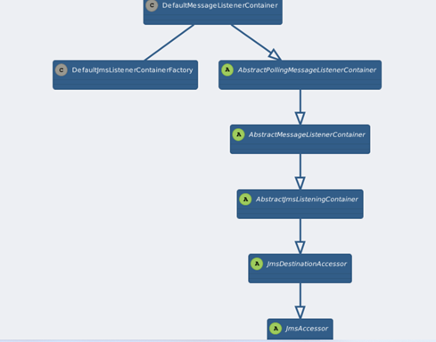
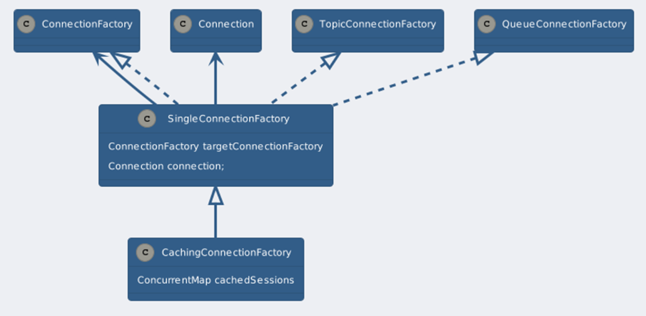
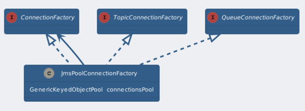

## Spring Cloud Azure  ServiceBus Spring Jms Support Design

## Overview
For Spring Jms support for service bus, we provide the package of `spring-cloud-azure-starter-servicebus-jms`  and jms module in the package of `spring-cloud-azure-auto-configure`.

This module aims to provide Spring JMS implementation integrated with Service Bus, which should provide the following components:

- All kinds of configuration provider
- Connection Factory to provide AMQP connection to Service Bus

## Problems

1. Only direct native ServiceBusJmsConnectionFactory implementation is used, which does not provide the caching feature for JMS administered resources, e.g. Connection, Session, Consumer, and producer.
2. The direct implementation is not production ready for its low workload as per consuming efficiency.
3. Dependency on azure-servicebus-jms lib is unnecessary.

## Goals

1. Spring integration simplifies the API of JMS API for sending and receiving messages.
2. Implement caching and pooled implementation for JMS ConnectionFactory for performance enhancement.
3. Provide auto-configure options for the connection factory and listener container.

## Spring JMS API
Out Auto-configuration is based on the Spring JMS API.

### MessageListenerContainer

A message listener container is used to receive messages from a JMS message queue and drive the MessageListener that is injected into it. The following is the class paradigm.

### **CachingConnectionFactory**

- SingleConnectionFactory subclass that adds Session caching as well MessageProducer caching.

- By default, only one single Session will be cached, with further requested Sessions being created and disposed on demand. Consider raising the "sessionCacheSize" value in case of a high-concurrency environment

- Spring's message listener containers support the use of a shared Connection within each listener container instance.

  The following is the class paradigm.

### JmsPoolConnectionFactory

- A JMS provider which pools Connection, Session and MessageProducer instances.

- While this implementation does allow the creation of a collection of active consumers, it does not 'pool' consumers.

  The following is the class paradigm.

## Auto-Configure
In the spring-cloud-azure-auto-configure lib, under the package of `com.azure.spring.cloud.autoconfigure.jms`, provive the auto-configure configuration for spring jms support for Service Bus.
- ServiceBusJmsAutoConfiguration is the entry class for the auto-configuration.
- ServiceBusJmsConnectionFactoryConfiguration declares implementations for Caching and Pooled Support of ConnectionFactory. i.e. CachingConnectionFactory,JmsPoolConnectionFactory.
- ServiceBusJmsContainerConfiguration declares bean of JmsListenerContainerFactory both for queue and topic of Service Bus.
- Under the properties folder, ServiceBusJmsProperties provide the auto-configure properties.

## Configuration
- CachingConnectionFactory is the default JmsConnectionFactory.

- JmsPoolConnectionFactory is activated when spring.jms.servicebus.pool.enabled=true.

## Recommendations

- In general, we should use the default config of CachingConnectionFactory which need no config explicitly, and just tune the concurrency to expand consumers.

- You should not increase the number of concurrent consumers for a JMS topic. This leads to concurrent consumption of the same message, which is hardly ever desirable.

- JmsPoolConnectionFactory provide multiple connections which should be used if one connection does not satisfy your need.
