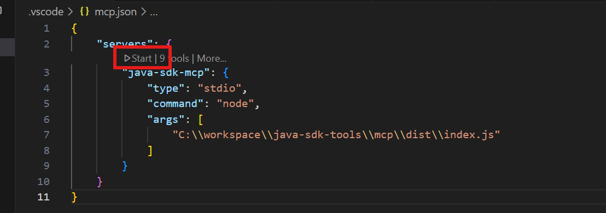

# Azure Java SDK Tools - MCP Server

A Model Context Protocol (MCP) server that provides comprehensive tools for generating, building, and managing Java SDKs from TypeSpec definitions for Azure services. This server integrates with GitHub Copilot and other MCP-compatible clients to streamline the Azure SDK development workflow.

## Features

This MCP server provides the following tools:

1. **sync_typespec_source_files** - Synchronize/Download TypeSpec source files for Java SDK generation from local or remote sources
2. **generate_java_sdk** - Generate or update Java SDK code from TypeSpec definitions 
3. **build_java_sdk** - Compile and build the Java SDK with Maven for Azure services
4. **get_java_sdk_changelog** - Generate and retrieve changelog information for the Java SDK
5. **update_java_sdk_changelog** - Update the CHANGELOG.md file for a Java SDK module
6. **instruction_migrate_typespec** - Provide step-by-step instructions for migrating from Swagger to TypeSpec
7. **update_client_name** - Guide through updating client class and property names in TypeSpec and Java SDK
8. **prepare_java_sdk_environment** - Provide environment setup instructions and dependency requirements

## Prerequisites

Before using this MCP server, ensure you have:

1. **Project Structure** - The tools can be run from either:
   - A service module directory containing `tsp-location.yaml` (e.g., `/azure-sdk-for-java/sdk/batch/azure-compute-batch`)
   - The SDK root directory (e.g., `/azure-sdk-for-java`)
2. **Node.js** - Version 20.0.0 or higher installed.
3. **MCP Client** - A compatible MCP client such as GitHub Copilot or Claude Desktop

## Configure MCP Server in VSCode

**Suggest to use 'Claude Sonnet 4' model**


### Step 1: Start the MCP Server

Click the 'Start' button in mcp.json.


You can verify that the MCP server is working by:
1. Opening GitHub Copilot Chat in VSCode
2. Asking Copilot to list available tools
3. You should see the Java SDK tools listed


## Sample Prompts

Here are some example prompts you can use with GitHub Copilot to interact with the Java SDK tools:

### Basic SDK Operations
- `generate java sdk for azure-analytics-purview-datamap` -> this will read configuration from tsp-location.yaml
- `generate java sdk for azure-analytics-purview-datamap from local TypeSpec: C:\workspace\azure-rest-api-specs\specification\purview\Azure.Analytics.Purview.DataMap\tspconfig.yaml`
- `update java sdk for "azure-compute-batch" from local TypeSpec source: C:\workspace\azure-rest-api-specs\specification\batch\Azure.Batch\tspconfig.yaml`
- `sync TypeSpec source for azure-developer-devcenter from remote: https://github.com/Azure/azure-rest-api-specs/blob/main/specification/devcenter/DevCenter/tspconfig.yaml`

### Generate SDK after Migrating from Swagger to TypeSpec 
- `generate sdk after migrating to typespec for "azure-mgmt-dnsresolver"`
- `get instructions for migrating from swagger to typespec`

### Environment and Tooling
- `prepare java sdk environment`

### Client Name Updates
- `update client name: EnableBatchJobOptions to BatchJobEnableOptions`
- `update client name: MediaMessageContent.mediaUri to MediaMessageContent.mediaUrl`

### Build and Changelog
- `build the java sdk for com.azure:azure-compute-batch`
- `get changelog for the java sdk`
- `update changelog for the java sdk`


## Development

To run in development mode with automatic recompilation:
```bash
npm run dev
```

To run tests:
```bash
npm test              # Run tests in watch mode
npm run test:run      # Run tests once
```

## Tools Documentation

### 1. sync_typespec_source_files
Synchronize/Download the TypeSpec source for a target service to generate Java SDK from. Always ask user to provide local tspconfig.yaml path or remote tspconfig.yaml url. The tool takes local tspconfig.yaml path or remote tspconfig.yaml url as input parameter.

**Parameters:**
- `localTspConfigPath` (optional): The local absolute path to the tspconfig.yaml file (e.g., `C:\workspace\azure-rest-api-specs\specification\communication\Communication.Messages\tspconfig.yaml`)
- `remoteTspConfigUrl` (optional): The remote URL to the tspconfig.yaml file (URL should contain commit ID instead of branch name. e.g., `https://github.com/Azure/azure-rest-api-specs/blob/dee71463cbde1d416c47cf544e34f7966a94ddcb/specification/contosowidgetmanager/Contoso.WidgetManager/tspconfig.yaml`)

**Note:** Provide either `localTspConfigPath` OR `remoteTspConfigUrl`, not both.

**Example:**
```json
{
  "name": "sync_typespec_source_files",
  "arguments": {
    "localTspConfigPath": "C:\\workspace\\azure-rest-api-specs\\specification\\communication\\Communication.Messages\\tspconfig.yaml"
  }
}
```

### 2. generate_java_sdk
Generate SDK from TypeSpec source from 'TempTypeSpecFiles' for a target service module. If there is a directory named 'TempTypeSpecFiles' in the current working directory, call this tool directly. If the directory is not present, ask user whether to generate from local TypeSpec source or remote TypeSpec source, then call the sync_java_sdk tool first.

**Parameters:**
- `cwd` (required): The absolute path to the current working directory which contains the 'TempTypeSpecFiles' directory with TypeSpec source files (e.g., `C:\workspace\azure-sdk-for-java\sdk\communication\communication-messages`)

**Example:**
```json
{
  "name": "generate_java_sdk",
  "arguments": {
    "cwd": "C:\\workspace\\azure-sdk-for-java\\sdk\\communication\\communication-messages"
  }
}
```


### 3. build_java_sdk
Build the Java SDK for a service sub module whose groupId starts with `com.azure`. The tool takes the module directory, root directory, groupId and artifactId as input parameters.

**Parameters:**
- `moduleDirectory` (required): The absolute path to the service sub module directory containing tsp-location.yaml
- `rootDirectory` (required): The absolute path to the azure-sdk-for-java directory, where the moduleDirectory is a submodule of it
- `groupId` (required): The group ID for the Java SDK
- `artifactId` (required): The artifact ID for the Java SDK

**Example:**
```json
{
  "name": "build_java_sdk",
  "arguments": {
    "moduleDirectory": "/path/to/java/sdk/module",
    "rootDirectory": "/path/to/azure-sdk-for-java",
    "groupId": "com.azure.myservice",
    "artifactId": "azure-myservice"
  }
}
```

### 4. get_java_sdk_changelog
Get the changelog for a service sub module whose groupId starts with `com.azure`. The tool takes the jarPath, groupId and artifactId as input parameters.

**Parameters:**
- `jarPath` (required): The absolute path to the JAR file of the Java SDK (should be under the `target` directory of the Java SDK module)
- `groupId` (required): The group ID for the Java SDK
- `artifactId` (required): The artifact ID for the Java SDK

**Example:**
```json
{
  "name": "get_java_sdk_changelog",
  "arguments": {
    "jarPath": "/path/to/target/azure-myservice-1.0.0.jar",
    "groupId": "com.azure.myservice",
    "artifactId": "azure-myservice"
  }
}
```

### 5. update_java_sdk_changelog
Update the CHANGELOG.md file for a service sub module whose groupId starts with `com.azure`. The tool takes the absolute path to the JAR file, groupId and artifactId as input parameters.

**Parameters:**
- `jarPath` (required): The absolute path to the JAR file of the Java SDK (should be under the `target` directory of the Java SDK module)
- `groupId` (required): The group ID for the Java SDK
- `artifactId` (required): The artifact ID for the Java SDK

**Example:**
```json
{
  "name": "update_java_sdk_changelog",
  "arguments": {
    "jarPath": "/path/to/target/azure-myservice-1.0.0.jar",
    "groupId": "com.azure.myservice",
    "artifactId": "azure-myservice"
  }
}
```

### 6. instruction_migrate_typespec
Get instructions for generating Java SDK after migrating from Swagger to TypeSpec.

**Parameters:**
- None

**Example:**
```json
{
  "name": "instruction_migrate_typespec",
  "arguments": {}
}
```

### 7. update_client_name
Update client name for both client.tsp and the generated java sdk. Follow the returned instruction to update old client name to new client name, be sure to ask for old client name and new client name. e.g. MediaMessageContent.mediaUri to MediaMessageContent.mediaUrl

**Parameters:**
- None (the tool returns instructions that guide you through the update process)

**Example:**
```json
{
  "name": "update_client_name",
  "arguments": {}
}
```

### 8. prepare_java_sdk_environment
Prepare the development environment for Java SDK generation, including 3 main areas: Node.js/npm, Java environment, and TypeSpec tools.

**Parameters:**
- `cwd` (required): The absolute path to the working directory where the environment should be prepared

**Example:**
```json
{
  "name": "prepare_java_sdk_environment",
  "arguments": {
    "cwd": "/path/to/workspace"
  }
}
```

## Usage

This server is designed to be used with MCP-compatible clients. The server communicates via stdio and provides tools for the complete Java SDK generation workflow.

### Working Directory Flexibility

The MCP tools support running from two different working directory locations:

1. **Service Module Directory**: Open the specific service directory (e.g., `azure-sdk-for-java/sdk/batch/azure-compute-batch`) that contains `tsp-location.yaml`
2. **SDK Root Directory**: Open the Azure SDK for Java root directory (e.g., `azure-sdk-for-java`) and the tools will automatically locate the appropriate service modules

This flexibility allows you to work at the level that best suits your workflow.

## Contributing

1. Make changes to the TypeScript source files in `src/`
2. Add tests for new functionality in `src/**/*.spec.ts`
3. Build the project with `npm run build`
4. Test your changes with `npm test` and `npm start`
5. Format and lint your code with `npm run format` and `npm run lint`

## License

MIT

