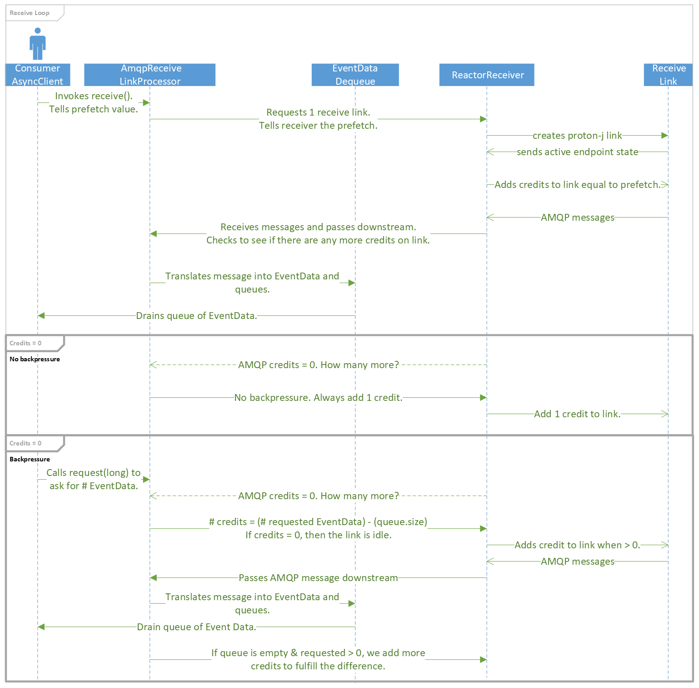

# Architecture Docs

## Prefetch and AMQP Link Credits

In Reactor, prefetch is the initial number of items to request upstream, afterwards, 75% of the
initial prefetch is used for subsequent `request(long)`.

In Event Hubs, prefetch is the number of AMQP link credits to put on the link when it is first
created.  After those initial link credits have been consumed, we have different ways of calculating
how many credits are added to the link.

The diagram below illustrates how it happens. Things to note:

* Large `EventData` use multiple AMQP link credits.
* There is no backpressure for `EventHubConsumerAsyncClient`.
* `EventProcessorClient` uses backpressure because of `publishOn(Scheduler)`.
  * Backpressure is 32.
* EventHubConsumerAsyncClient.receiveFromPartition() returns `EventData` on `Scheduler.single("<name>")`.
  * All Proton-J events run on the single scheduler because it is not thread-safe.

