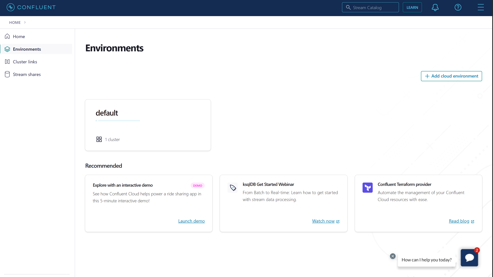

# Confluent Cloud Setup

This guide walks through setting up Confluent Cloud using Docker containers.

## Prerequisites

- Bash shell
    - Will not work in Cloud Shell or WSL1
- Java 11+ ([download](https://www.oracle.com/java/technologies/javase-jdk11-downloads.html))
- Maven ([download](https://maven.apache.org/download.cgi))
- Docker ([download](https://www.docker.com/products/docker-desktop))
- CosmosDB [Setting up an Azure Cosmos DB Instance](https://github.com/Azure/azure-sdk-for-java/blob/main/sdk/cosmos/azure-cosmos-kafka-connect/docs/CosmosDB_Setup.md)

## Setup

### Create Confluent Cloud Account and Setup Cluster
Go to [create account](https://www.confluent.io/get-started/) and fill out the appropriate fields.


---

Select environments. 


---

Select default which is an environment automatically setup by confluent. 



---

- Select add cluster. 


---

- Select Azure create the cluster and choose the same region as the Cosmos DB instance you created.


---

- Name the cluster, and then select launch cluster.


### Create ksqlDB Cluster
From inside the cluster select ksqlDB. Select add cluster. Select continue, name the cluster, and then select launch.


### Update Configurations
- The cluster key and secret can be found under api keys in the cluster. Choose the one for ksqlDB. Or generate client config using the CLI and Tools. 
- The `BOOTSTRAP_SERVERS` endpoint can be found in the cluster under cluster settings and end endpoints. Or generate client config using the CLI and Tools. 
- The schema registry key and secret can be found on the bottom of the right panel inside the confluent environment under credentials.
- The schema registry url can be found on the bottom of the right panel inside the confluent environment under Endpoint.
  


### Run Integration Tests
To run the integration tests against a confluent cloud cluster, create ~/kafka-cosmos-local.properties with the following content:
```
ACCOUNT_HOST=[emulator endpoint or you cosmos masterKey]
ACCOUNT_KEY=[emulator masterKey or your cosmos masterKey]
ACCOUNT_TENANT_ID=[update if AAD auth is required in the integration tests]
ACCOUNT_AAD_CLIENT_ID=[update if AAD auth is required in the integration tests]
ACCOUNT_AAD_CLIENT_SECRET=[update is AAD auth is required in the integration tests]
SASL_JAAS=[credential configured on the confluent cloud cluster]
BOOTSTRAP_SERVER=[bootstrap server endpoint of the confluent cloud cluster]
SCHEMA_REGISTRY_URL=[schema registry url of the cloud cluster]
SCHEMA_REGISTRY_KEY=[schema registry key of the cloud cluster]
SCHEMA_REGISTRY_SECRET=[schema registry secret of the cloud cluster]
CONNECT_CONFIG_STORAGE_REPLICATION_FACTOR=3
CONNECT_OFFSET_STORAGE_REPLICATION_FACTOR=3
CONNECT_STATUS_STORAGE_REPLICATION_FACTOR=3
```
Integration tests are having ITest suffix. Use following command to run integration tests([create the topic ahead of time](#create-topic-in-confluent-cloud-ui) )
```bash
mvn -e -Dgpg.skip -Dmaven.javadoc.skip=true -Dcodesnippet.skip=true -Dspotbugs.skip=true -Dcheckstyle.skip=true -Drevapi.skip=true -pl ,azure-cosmos-kafka-connect test package -Pkafka-integration
```

### Run a local sink/source workload by using confluent platform locally
- Following [Install Confluent Platform using ZIP and TAR](https://docs.confluent.io/platform/current/installation/installing_cp/zip-tar.html#prod-kafka-cli-install) to download the library
- Copy src/docker/resources/sink.example.json to the above unzipped confluent folder
- Copy src/docker/resources/source.example.json to the above unzipped confluent folder
- Update the sink.example.json and source.example.json with your cosmos endpoint
- Build the cosmos kafka connector jar
```bash
mvn -e -DskipTests -Dgpg.skip -Dmaven.javadoc.skip=true -Dcodesnippet.skip=true -Dspotbugs.skip=true -Dcheckstyle.skip=true -Drevapi.skip=true -pl ,azure-cosmos,azure-cosmos-tests -am clean install
mvn -e -DskipTests -Dgpg.skip -Dmaven.javadoc.skip=true -Dcodesnippet.skip=true -Dspotbugs.skip=true -Dcheckstyle.skip=true -Drevapi.skip=true -pl ,azure-cosmos-kafka-connect clean install
```
- Copy the built cosmos kafka connector jar to the plugin path folder (you can find from the etc/distributed.properties plugin.path config)
- ```cd unzipped confluent folder```
- Update the etc/distributed.properties file with your confluent cloud cluster config
- Run ./bin/connect-distributed ./etc/distributed.properties
- Start your sink connector or source connector: ```curl -s -H "Content-Type: application/json" -X POST -d @<path-to-JSON-config-file> http://localhost:8083/connectors/ | jq .```
- Monitor the logs and check any exceptions, and also monitor the throughput and other metrics from your confluent cloud cluster

> If you want to delete your connector: ```curl -X DELETE http://localhost:8083/connectors/cosmosdb-source-connector-v2```. The connector name should match the one in your json config.

> If you want to restart your connector: ```curl -s -H "Content-Type: application/json" -X POST http://localhost:8083/connectors/cosmosdb-source-connector-v2/restart | jq .```

> Follow [Kafka Connect REST Interface for Confluent Platform](https://docs.confluent.io/platform/current/connect/references/restapi.html) to check other options.

### Create Topic in Confluent Cloud UI
For some cluster type, you will need to create the topic ahead of time. You can use the UI or through the [Confluent Cli](https://docs.confluent.io/cloud/current/client-apps/topics/manage.html#:~:text=Confluent%20CLI%20Follow%20these%20steps%20to%20create%20a,aren%E2%80%99t%20any%20topics%20created%20yet%2C%20click%20Create%20topic.) (Requires installing the Confluent Cli first). 

Inside the Cluster Overview, scroll down and select topics and partitions.


---

Select add topic.


---

Name the topic and select create with defaults. Afterward, a prompt will appear about creating a schema. This can be
skipped as the tests will create the schemas.

## Resources to Improve Infrastructure
- [Docker Configurations](https://docs.confluent.io/platform/current/installation/docker/config-reference.html)
- [Configuration Options](https://docs.confluent.io/platform/current/installation/configuration/index.html)
- [Connect Confluent Platform Components to Confluent Cloud](https://docs.confluent.io/cloud/current/cp-component/index.html)
