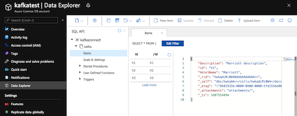
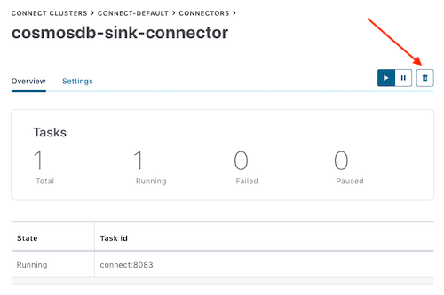

# Kafka Connect Cosmos DB Sink Connector

The Azure Cosmos DB sink connector allows you to export data from Apache Kafka® topics to an Azure Cosmos DB database.
The connector polls data from Kafka to write to container(s) in the database based on the topics subscription.

## Topics covered

- [Quickstart](#quickstart)
- [Sink configuration properties](#sink-configuration-properties)
- [Supported Data Types](#supported-data-types)
- [Single Message Transforms (SMTs)](#single-message-transforms)
- [Troubleshooting common issues](#troubleshooting-common-issues)
- [Limitations](#limitations)

## Quickstart

### Prerequisites

- It is recommended to start with the Confluent Platform (recommended to use this [setup](https://github.com/Azure/azure-sdk-for-java/blob/main/sdk/cosmos/azure-cosmos-kafka-connect/docs/Confluent_Platform_Setup.md) as this gives you a complete environment to work with. 
  - If you do not wish to use Confluent Platform, then you need to install and configure Zookeper, Apache Kafka, Kafka Connect, yourself. You will also need to install and configure the  Cosmos DB connectors manually.
- Cosmos DB Instance ([setup guide](https://github.com/Azure/azure-sdk-for-java/blob/main/sdk/cosmos/azure-cosmos-kafka-connect/docs/CosmosDB_Setup.md)
- Bash shell
  - Will not work in Cloud Shell or WSL1
- Java 11+ ([download](https://www.oracle.com/java/technologies/javase-jdk11-downloads.html))
- Maven ([download](https://maven.apache.org/download.cgi))

### Install sink connector

If you are using the Confluent Platform setup from this repo, the Cosmos DB Sink Connector is included in the installation and you can skip this step.
  
Otherwise, you can download the JAR file from the latest [Release](https://mvnrepository.com/artifact/com.azure.cosmos.kafka/azure-cosmos-kafka-connect) or package this repo to create a new JAR file. To install the connector manually using the JAR file, refer to these [instructions](https://docs.confluent.io/current/connect/managing/install.html#install-connector-manually).
  
You can also package a new JAR file from the source code.

```bash
# clone the azure-cosmos repo if you haven't done so already
git clone https://github.com/Azure/azure-sdk-for-java.git
cd sdk/cosmos

mvn -e -DskipTests -Dgpg.skip -Dmaven.javadoc.skip=true -Dcodesnippet.skip=true -Dspotbugs.skip=true -Dcheckstyle.skip=true -Drevapi.skip=true -pl ,azure-cosmos,azure-cosmos-tests -am clean install
mvn -e -DskipTests -Dgpg.skip -Dmaven.javadoc.skip=true -Dcodesnippet.skip=true -Dspotbugs.skip=true -Dcheckstyle.skip=true -Drevapi.skip=true -pl ,azure-cosmos-kafka-connect clean install

# include the following JAR file in Kafka Connect installation
ls target/azure-cosmos-kafka-connect-*.jar
```

### Create Kafka topic and write data

If you are using the Confluent Platform, the easiest way to create a Kafka topic is by using the supplied Control Center UX. 
Otherwise, you can create a Kafka topic manually using the following syntax:

```bash
./kafka-topics.sh --create --zookeeper <ZOOKEEPER_URL:PORT> --replication-factor <NO_OF_REPLICATIONS> --partitions <NO_OF_PARTITIONS> --topic <TOPIC_NAME>
```

For this quickstart, we will create a Kafka topic named `hotels` and will write JSON data (non-schema embedded) to the topic.

To create a topic inside Control Center, see [here](https://docs.confluent.io/platform/current/quickstart/ce-docker-quickstart.html#step-2-create-ak-topics).

Next, start the Kafka console producer to write a few records to the `hotels` topic.

```powershell

# Option 1: If using Codespaces, use the built-in CLI utility
kafka-console-producer --broker-list localhost:9092 --topic hotels

# Option 2: Using this repo's Confluent Platform setup, first exec into the broker container
docker exec -it broker /bin/bash
kafka-console-producer --broker-list localhost:9092 --topic hotels

# Option 3: Using your Confluent Platform setup and CLI install
<path-to-confluent>/bin/kafka-console-producer --broker-list <kafka broker hostname> --topic hotels

```

In the console producer, enter:

```json

{"id": "h1", "HotelName": "Marriott", "Description": "Marriott description"}
{"id": "h2", "HotelName": "HolidayInn", "Description": "HolidayInn description"}
{"id": "h3", "HotelName": "Motel8", "Description": "Motel8 description"}

```

The three records entered are published to the `hotels` Kafka topic in JSON format.

### Create the sink connector

Create the Cosmos DB Sink Connector in Kafka Connect

The following JSON body defines the config for the Cosmos DB Sink Connector.

> Note: You will need to fill out the values for `azure.cosmos.account.endpoint` and `azure.cosmos.account.key`, which you should have saved from the [Cosmos DB setup guide](https://github.com/Azure/azure-sdk-for-java/blob/main/sdk/cosmos/azure-cosmos-kafka-connect/docs/CosmosDB_Setup.md).

Refer to the [sink properties](#sink-configuration-properties) section for more information on each of these configuration properties.

```json

{
  "name": "cosmosdb-sink-connector-v2",
  "config": {
    "connector.class": "com.azure.cosmos.kafka.connect.CosmosSinkConnector",
    "tasks.max": "5",
    "topics": "{topic}",
    "value.converter": "org.apache.kafka.connect.json.JsonConverter",
    "value.converter.schemas.enable": "false",
    "key.converter": "org.apache.kafka.connect.json.JsonConverter",
    "key.converter.schemas.enable": "false",
    "azure.cosmos.account.endpoint":"{endpoint}",
    "azure.cosmos.account.key":"{masterKey}",
    "azure.cosmos.applicationName": "{applicationName}",
    "azure.cosmos.sink.database.name":"{databaseName}",
    "azure.cosmos.sink.containers.topicMap":"{topic}#{container}"
  }
}

```

Once you have all the values filled out, save the JSON file somewhere locally. You can use this file to create the connector using the REST API.

#### Create connector using Control Center

An easy option to create the connector is by going through the Control Center webpage.

Follow this [guide](https://docs.confluent.io/platform/current/quickstart/ce-docker-quickstart.html#step-3-install-a-ak-connector-and-generate-sample-data) to create a connector from Control Center but instead of using the `DatagenConnector` option, use the `CosmosSinkConnector` tile instead. When configuring the sink connector, fill out the values as you have filled in the JSON file.

Alternatively, in the connectors page, you can upload the JSON file from earlier by using the `Upload connector config file` option.


#### Create connector using REST API

Create the sink connector using the Connect REST API

```bash

# Curl to Kafka connect service
curl -H "Content-Type: application/json" -X POST -d @<path-to-JSON-config-file> http://localhost:8083/connectors

```

### Confirm data written to Cosmos DB

Check that the three records from the `hotels` topic are created in Cosmos DB.

Navigate to your Cosmos DB instance on Azure portal You should see something like this:



### Cleanup

To delete the connector from the Control Center, navigate to the sink connector you created and click the `Delete` icon.



Alternatively, use the Connect REST API.

```bash
# Curl to Kafka connect service
curl -X DELETE http://localhost:8083/connectors/cosmosdb-sink-connector
```

To delete the created Azure Cosmos DB service and its resource group using Azure CLI, refer to these [steps](https://github.com/Azure/azure-sdk-for-java/blob/main/sdk/cosmos/azure-cosmos-kafka-connect/docs/CosmosDB_Setup.md#cleanup).

## Sink configuration properties

The following settings are used to configure the Cosmos DB Kafka Sink Connector. These configuration values determine which Kafka topics data is consumed, which Cosmos DB containers data is written into and formats to serialize the data. For an example configuration file with the default values, refer to [this config](https://github.com/Azure/azure-sdk-for-java/blob/main/sdk/cosmos/azure-cosmos-kafka-connect/src/docker/resources/sink.example.json).

- [Generic Configs For Sink And Source](https://github.com/Azure/azure-sdk-for-java/blob/main/sdk/cosmos/azure-cosmos-kafka-connect/docs/configuration-reference.md#generic-configurations)
- [Configs only for Sink](https://github.com/Azure/azure-sdk-for-java/blob/main/sdk/cosmos/azure-cosmos-kafka-connect/docs/configuration-reference.md#sink-connector-configurations)

Data will always be written to the Cosmos DB as JSON without any schema.

## Supported Data Types
Azure Cosmos DB sink connector converts SinkRecord in to JSON Document supporting below schema types from listed valid [Schema.Types](https://kafka.apache.org/21/javadoc/org/apache/kafka/connect/data/Schema.Type.html)

| Schema Type | JSON Data Type |
| :--- | :--- |
| Array | Array |
| Boolean | Boolean | 
| Float32 | Number |
| Float64 | Number |
| Int8 | Number |
| Int16 | Number |
| Int32 | Number |
| Int64 | Number|
| Map | Object (JSON)|
| String | String<br> Null |
| Struct | Object (JSON) |

Cosmos DB sink Connector also supports the following AVRO logical types:

| Schema Type | JSON Data Type |
| :--- | :--- |
| Date | Number |
| Time | Number |
| Timestamp | Number |

>**Note:** Byte deserialization is currently not supported by Azure Cosmos DB sink connector.

## Single Message Transforms

Along with the Sink connector settings, you can specify the use of Single Message Transformations (SMTs) to modify messages flowing through the Kafka Connect platform. Refer to the [Confluent SMT Documentation](https://docs.confluent.io/platform/current/connect/transforms/overview.html) for more information.

### Using the InsertUUID SMT to automatically add item IDs

With the custom `InsertUUID` SMT, you can insert the `id` field with a random UUID value for each message, before it is written to Cosmos DB.

> WARNING: Only use this SMT if the messages do **NOT** contain the `id` field. Otherwise, the `id` values will be **overwritten** and you may end up with duplicate items in your database.

Note: Using UUIDs as the message ID can be quick and easy but are [not an ideal partition key](https://stackoverflow.com/questions/49031461/would-using-a-substring-of-a-guid-in-cosmosdb-as-partitionkey-be-a-bad-idea) to use in Cosmos DB.

#### Install the SMT

Before you can use the `InsertUUID` SMT, you will need to install this transform in your Confluent Platform setup. If you are using the Confluent Platform setup from this repo, the transform is already included in the installation and you can skip this step.

Alternatively, you can package the [InsertUUID source](https://github.com/confluentinc/kafka-connect-insert-uuid) to create a new JAR file. To install the connector manually using the JAR file, refer to these [instructions](https://docs.confluent.io/current/connect/managing/install.html#install-connector-manually).

```bash

# clone the kafka-connect-insert-uuid repo
https://github.com/confluentinc/kafka-connect-insert-uuid.git
cd kafka-connect-insert-uuid

# package the source code into a JAR file
mvn clean package

# include the following JAR file in Confluent Platform installation
ls target/*.jar

```

#### Configure the SMT

Inside your Sink connector config, add the following properties to set the `id`.

```json

"transforms": "insertID",
"transforms.insertID.type": "com.github.cjmatta.kafka.connect.smt.InsertUuid$Value",
"transforms.insertID.uuid.field.name": "id"

```

Refer to the [InsertUUID repository](https://github.com/confluentinc/kafka-connect-insert-uuid) for more information on using this SMT.

### Using SMTs to configure Time to live (TTL) for Cosmos DB items

Using both the `InsertField` and `Cast` SMTs, you can add specify the TTL on each item created in Cosmos DB.

> Note: You will need to enable TTL on the Cosmos DB container to enable TTL at an item level. Refer to the [Cosmos DB setup guide](https://github.com/Azure/azure-sdk-for-java/blob/main/sdk/cosmos/azure-cosmos-kafka-connect/docs/CosmosDB_Setup.md) or the [Cosmos DB docs](https://learn.microsoft.com/azure/cosmos-db/nosql/how-to-time-to-live?tabs=dotnet-sdk-v3#enable-time-to-live-on-a-container-using-azure-portal) for more information on setting the TTL.

Inside your Sink connector config, add the following properties to set the TTL (in seconds). In this following example, the TTL is set to 100 seconds.

> Note: If the message already contains the `TTL` field, the `TTL` value will be overwritten by these SMTs.

```json

"transforms": "insertTTL,castTTLInt",
"transforms.insertTTL.type": "org.apache.kafka.connect.transforms.InsertField$Value",
"transforms.insertTTL.static.field": "ttl",
"transforms.insertTTL.static.value": "100",
"transforms.castTTLInt.type": "org.apache.kafka.connect.transforms.Cast$Value",
"transforms.castTTLInt.spec": "ttl:int32"

```

Refer to the [InsertField](https://docs.confluent.io/platform/current/connect/transforms/insertfield.html) and [Cast](https://docs.confluent.io/platform/current/connect/transforms/cast.html) documentation for more information on using these SMTs.

## Troubleshooting common issues

Here are solutions to some common problems that you may encounter when working with the Cosmos DB Kafka Sink Connector.

### Reading non-JSON data with JsonConverter

If you have non-JSON data on your source topic in Kafka and attempt to read it using the JsonConverter, you will see the following exception:

```none

org.apache.kafka.connect.errors.DataException: Converting byte[] to Kafka Connect data failed due to serialization error:
…
org.apache.kafka.common.errors.SerializationException: java.io.CharConversionException: Invalid UTF-32 character 0x1cfa7e2 (above 0x0010ffff) at char #1, byte #7)

```

This is likely caused by data in the source topic being serialized in either Avro or another format (like CSV string).

**Solution**: If the topic data is actually in Avro, then change your Kafka Connect sink connector to use the AvroConverter as shown below.

```json

"value.converter": "io.confluent.connect.avro.AvroConverter",
"value.converter.schema.registry.url": "http://schema-registry:8081",

```

### Reading non-Avro data with AvroConverter

When you try to use the Avro converter to read data from a topic that is not Avro. This would include data written by an Avro serializer other than the Confluent Schema Registry’s Avro serializer, which has its own wire format.

```none

org.apache.kafka.connect.errors.DataException: my-topic-name
at io.confluent.connect.avro.AvroConverter.toConnectData(AvroConverter.java:97)
…
org.apache.kafka.common.errors.SerializationException: Error deserializing Avro message for id -1
org.apache.kafka.common.errors.SerializationException: Unknown magic byte!

```

**Solution**: Check the source topic’s serialization format. Then, either switch Kafka Connect’s sink connector to use the correct converter, or switch the upstream format to Avro.

### Reading a JSON message without the expected schema/payload structure

Kafka Connect supports a special structure of JSON messages containing both payload and schema as follows.

 ```json

{
  "schema": {
    "type": "struct",
    "fields": [
      {
        "type": "int32",
        "optional": false,
        "field": "userid"
      },
      {
        "type": "string",
        "optional": false,
        "field": "name"
      }
    ]
  },
  "payload": {
    "userid": 123,
    "name": "Sam"
  }
}

```

If you try to read JSON data that does not contain the data in this structure, you will get this error:

```none

org.apache.kafka.connect.errors.DataException: JsonConverter with schemas.enable requires "schema" and "payload" fields and may not contain additional fields. If you are trying to deserialize plain JSON data, set schemas.enable=false in your converter configuration.

```

To be clear, the only JSON structure that is valid for schemas.enable=true has schema and payload fields as the top-level elements (shown above).

As the message itself states, if you just have plain JSON data, you should change your connector’s configuration to:

```json

"value.converter": "org.apache.kafka.connect.json.JsonConverter",
"value.converter.schemas.enable": "false",

```

## Limitations

- Auto-creation of databases and containers within Cosmos DB are not supported. The database and containers must already exist, and they must be configured to use these.
