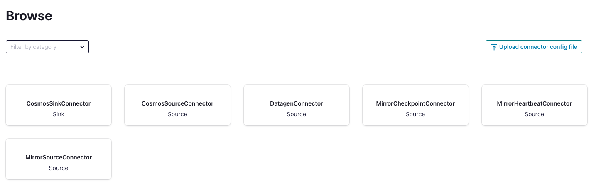
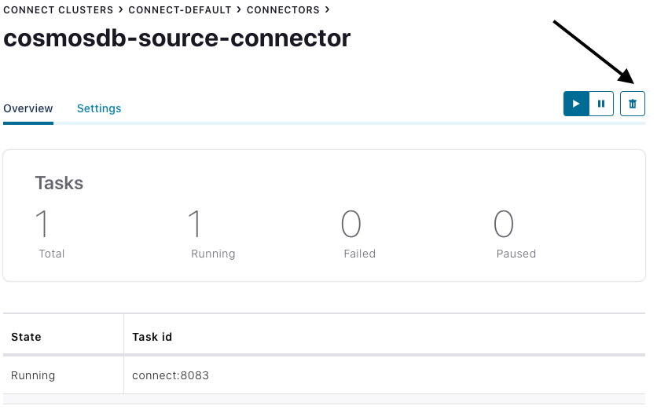

# Kafka Connect Cosmos DB Source Connector

The Azure Cosmos DB Source connector provides the capability to read data from the Cosmos DB Change Feed and publish this data to a Kafka topic.

## Topics covered

- [Quickstart](#quickstart)
- [Source configuration properties](#source-configuration-properties)
- [Supported Data Types](#supported-data-types)

## Quickstart

### Prerequisites

- It is recommended to start with the Confluent Platform (recommended to use this setup) as this gives you a complete environment to work with.
    - If you do not wish to use Confluent Platform, then you need to install and configure Zookeper, Apache Kafka, Kafka Connect, yourself. You will also need to install and configure the Cosmos DB connectors manually.
- Cosmos DB Instance ([setup guide](https://github.com/Azure/azure-sdk-for-java/blob/main/sdk/cosmos/azure-cosmos-kafka-connect/docs/CosmosDB_Setup.md)
- Bash shell
  - Will not work in Cloud Shell or WSL1
- Java 11+ ([download](https://www.oracle.com/java/technologies/javase-jdk11-downloads.html))
- Maven ([download](https://maven.apache.org/download.cgi))

### Install source connector

If you are using the Confluent Platform setup from this repo, the Cosmos DB Source Connector is included in the installation and you can skip this step.

Otherwise, you can use JAR file from latest [Release](https://mvnrepository.com/artifact/com.azure.cosmos.kafka/azure-cosmos-kafka-connect) and install the connector manually, refer to these [instructions](https://docs.confluent.io/current/connect/managing/install.html#install-connector-manually).

You can also package a new JAR file from the source code.

```bash
# clone the azure-cosmos repo if you haven't done so already
git clone https://github.com/Azure/azure-sdk-for-java.git
cd sdk/cosmos

mvn -e -DskipTests -Dgpg.skip -Dmaven.javadoc.skip=true -Dcodesnippet.skip=true -Dspotbugs.skip=true -Dcheckstyle.skip=true -Drevapi.skip=true -pl ,azure-cosmos,azure-cosmos-tests -am clean install
mvn -e -DskipTests -Dgpg.skip -Dmaven.javadoc.skip=true -Dcodesnippet.skip=true -Dspotbugs.skip=true -Dcheckstyle.skip=true -Drevapi.skip=true -pl ,azure-cosmos-kafka-connect clean install

# include the following JAR file in Kafka Connect installation
ls target/azure-cosmos-kafka-connect-*.jar

```

### Create Kafka topic

Create a Kafka topic using Confluent Control Center. For this quickstart, we will create a Kafka topic named `apparels` and will write JSON data (non-schema embedded) to the topic.

To create a topic inside Control Center, see [here](https://docs.confluent.io/platform/current/quickstart/ce-docker-quickstart.html#step-2-create-ak-topics).

### Create the source connector

#### Create the Cosmos DB Source Connector in Kafka Connect

The following JSON body defines the config for the Cosmos DB Source Connector.

>Note: You will need to replace placeholder values for below properties which you should have saved from the [Cosmos DB setup guide](https://github.com/Azure/azure-sdk-for-java/blob/main/sdk/cosmos/azure-cosmos-kafka-connect/docs/CosmosDB_Setup.md).  
>`azure.cosmos.account.endpoint`  
>`azure.cosmos.account.key`  

Refer to the [source properties](#source-configuration-properties) section for more information on each of these configuration properties.

```json
{
  "name": "cosmosdb-source-connector-v2",
  "config": {
    "connector.class": "com.azure.cosmos.kafka.connect.CosmosSourceConnector",
    "tasks.max": "5",
    "value.converter": "org.apache.kafka.connect.json.JsonConverter",
    "value.converter.schemas.enable": "false",
    "key.converter": "org.apache.kafka.connect.json.JsonConverter",
    "key.converter.schemas.enable": "false",
    "azure.cosmos.account.endpoint":"{endpoint}",
    "azure.cosmos.account.key":"{masterKey}",
    "azure.cosmos.application.name": "{applicationName}",
    "azure.cosmos.source.database.name":"{database}",
    "azure.cosmos.source.containers.includedList":"{container}",
    "azure.cosmos.source.changeFeed.maxItemCountHint":"500",
    "azure.cosmos.source.containers.topicMap":"{topic}#{container}",
    "azure.cosmos.source.metadata.storage.type":"Cosmos",
    "azure.cosmos.source.metadata.storage.name":"{metadataContainerName}"
  }
}

```

Once you have all the values filled out, save the JSON file somewhere locally. You can use this file to create the connector using the REST API.

#### Create connector using Control Center

An easy option to create the connector is by going through the Control Center webpage.

Follow this [guide](https://docs.confluent.io/platform/current/quickstart/ce-docker-quickstart.html#step-3-install-a-ak-connector-and-generate-sample-data) to create a connector from Control Center but instead of using the `DatagenConnector` option, use the `CosmosSourceConnector` tile instead. When configuring the source connector, fill out the values as you have filled in the JSON file.

Alternatively, in the connectors page, you can upload the JSON file from earlier by using the `Upload connector config file` option.



#### Create connector using REST API

Create the source connector using the Connect REST API

```bash

# Curl to Kafka connect service
curl -H "Content-Type: application/json" -X POST -d @<path-to-JSON-config-file> http://localhost:8083/connectors

```

### Insert document in to Cosmos DB

Use [Cosmos DB setup guide](https://github.com/Azure/azure-sdk-for-java/blob/main/sdk/cosmos/azure-cosmos-kafka-connect/docs/CosmosDB_Setup.md) to create and set up Cosmos DB Instance.

- Sign into the [Azure portal](https://portal.azure.com/learn.docs.microsoft.com) using the account you activated.
- On the Azure portal menu (left hand side blue lines at the top), select All services.
- Select Databases > Azure Cosmos DB. Then select the DB you just created, click Data Explorer at the top.
- To create a new JSON document, in the SQL API pane, expand `kafka`, select Items, then select New Item in the toolbar.
- Now, add a document to the container with the following structure. Paste the following sample JSON block into the Items tab, overwriting the current content:

  ``` json

  {
    "id": "2",
    "productId": "33218897",
    "category": "Women's Outerwear",
    "manufacturer": "Contoso",
    "description": "Black wool pea-coat",
    "price": "49.99",
    "shipping": {
      "weight": 2,
      "dimensions": {
        "width": 8,
        "height": 11,
        "depth": 3
      }
    }
  }

  ```

- Select Save.
- Confirm the document has been saved by clicking Items on the left-hand menu.

### Confirm data written to Kafka Topic

- Open Kafka Topic UI on <http://localhost:9000>
- Select the Kafka topic `apparels` you created
- Verify that the document inserted in to Cosmos DB earlier appears in the Kafka topic.

### Cleanup

To delete the connector from the Control Center, navigate to the source connector you created and click the `Delete` icon.



Alternatively, use the Connect REST API.

```bash

# Curl to Kafka connect service
curl -X DELETE http://localhost:8083/connectors/cosmosdb-source-connector

```

To delete the created Azure Cosmos DB service and its resource group using Azure CLI, refer to these [steps](https://github.com/Azure/azure-sdk-for-java/blob/main/sdk/cosmos/azure-cosmos-kafka-connect/docs/CosmosDB_Setup.md#cleanup).

## Source configuration properties

The following settings are used to configure the Cosmos DB Kafka Source Connector. These configuration values determine which Cosmos DB container is consumed, which Kafka topics data is written into and formats to serialize the data. For an example configuration file with the default values, refer to [this config](https://github.com/Azure/azure-sdk-for-java/blob/main/sdk/cosmos/azure-cosmos-kafka-connect/src/docker/resources/source.example.json).

- [Generic Configs For Sink And Source](https://github.com/Azure/azure-sdk-for-java/blob/main/sdk/cosmos/azure-cosmos-kafka-connect/docs/configuration-reference.md#generic-configurations)
- [Configs only for Source](https://github.com/Azure/azure-sdk-for-java/blob/main/sdk/cosmos/azure-cosmos-kafka-connect/docs/configuration-reference.md#source-connector-configurations)
