# Live Migrate Azure Cosmos DB SQL API Containers data with Spark Connector and Azure Databricks

This sample shows how to live migrate between Azure Cosmos DB SQL API containers using the [Azure Cosmos DB Spark Connector](https://learn.microsoft.com/azure/cosmos-db/sql/create-sql-api-spark). 

# Setup Azure Databricks

## Prerequisites

* [Provision an Azure Databricks cluster](https://learn.microsoft.com/azure/databricks/scenarios/quickstart-create-databricks-workspace-portal?tabs=azure-portal).

* Ensure it has network access to your source and target Azure Cosmos DB Containers.


## Provision a Spark cluster

Select the latest Azure Databricks runtime version which supports Spark 3.5 or higher.

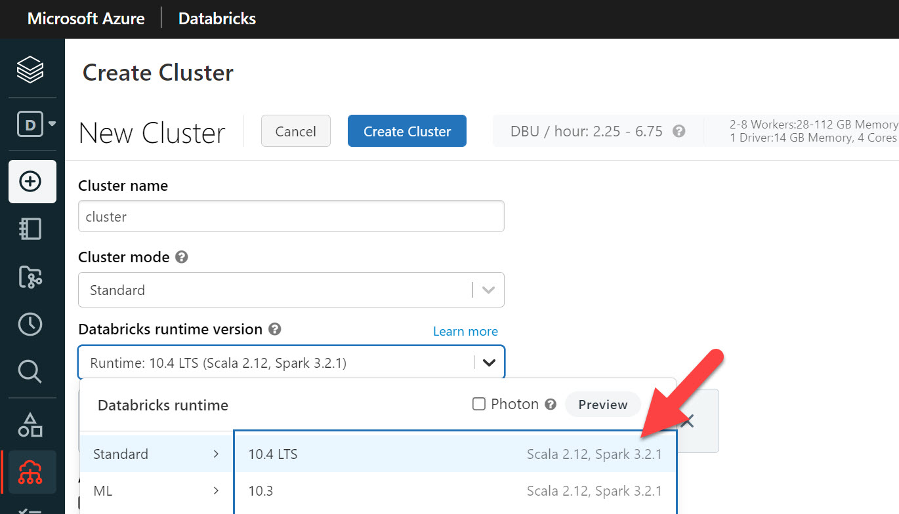

## Install Azure Cosmos DB Spark Connector jar

* Install the Azure Cosmos DB Spark Connector jar on the cluster by providing maven co-ordinates `com.azure.cosmos.spark:azure-cosmos-spark_3-5_2-12:4.37.1`:

    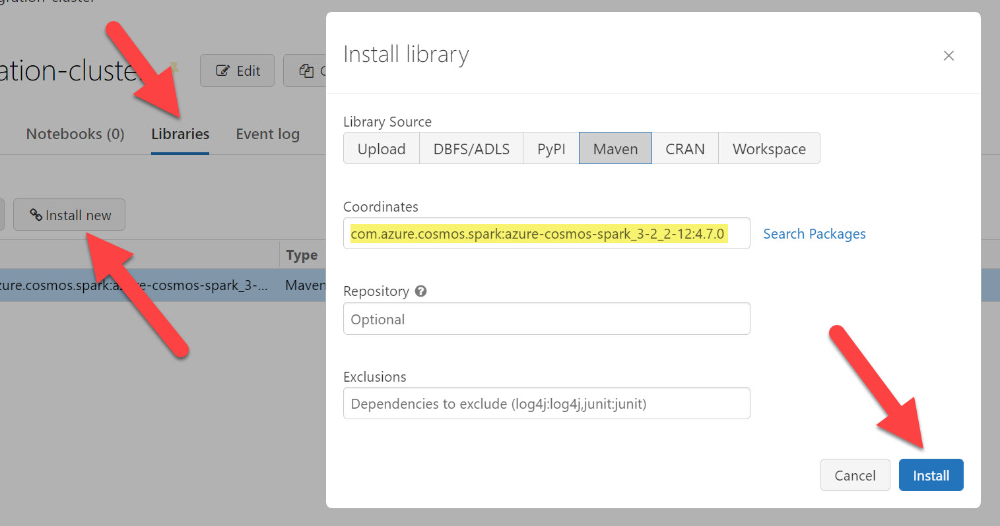

* Select **Install**, and then restart the cluster when installation is complete.

    > [!NOTE]
    > Make sure that you restart the Databricks cluster after the jar has been installed.

## Import notebooks

* Download the Scala notebooks in this repo (or import them directly from their url) to your Azure Databricks workspace:

    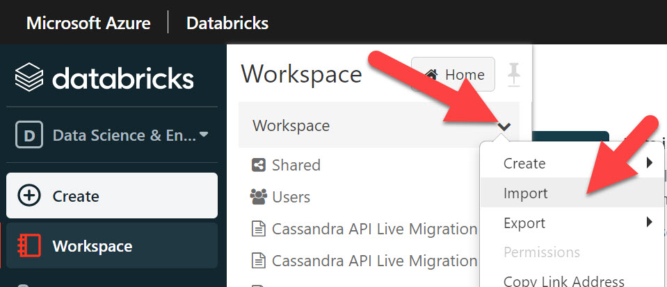

## Attach cluster and Run

* In the `CosmosDBLiveSingleContainerMigration` notebook, attach the cluster you created earlier:

    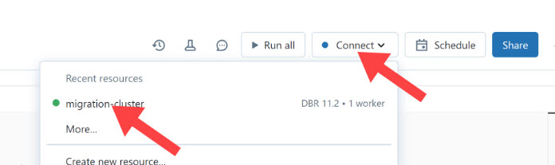

* Locate the below, and enter/replace the highlighted fields for Cosmos DB account URI, key, region, source database/container, target database/container, and target container partition key values as appropriate. Then you are ready to click "Run all":

    

* As long as everything has been configured correctly, all cells should run in sequence. The final cell, which is writing data received from the source container's [change feed](https://learn.microsoft.com/azure/cosmos-db/change-feed) to the target container, will run continually. It will process all historic data from the beginning of the source container's change feed record, as well as any new changes that occur. It will not stop unless there is an error, or the notebook is explicitly stopped. 

    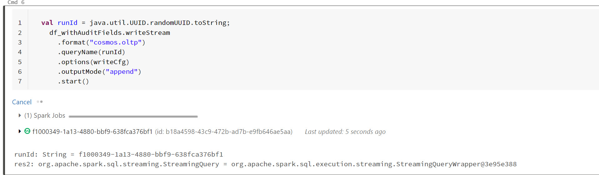


## Synthetic partition key (optional)

* The `CosmosDBLiveSingleContainerMigration` notebook contains code which will map existing field(s) to a different partition key in the target container, or create a new [synthetic partition key](https://learn.microsoft.com/azure/cosmos-db/nosql/synthetic-partition-keys). To enable this, first locate the following cell.

    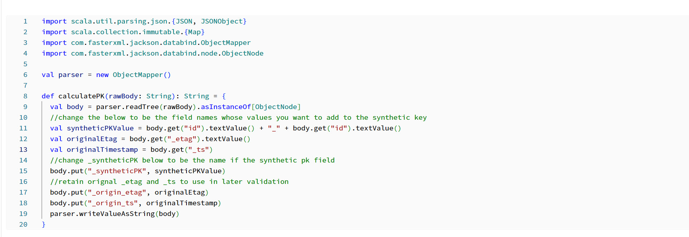

* Edit the `syntheticPKValue` variable so it concatenates values from the existing document as required. Change `_syntheticPK` to be the name of target partition key (this can be an existing field, or a new field in the case of synthetic partition key). Then, enable the transformation by un-commenting the code in the following cell:

    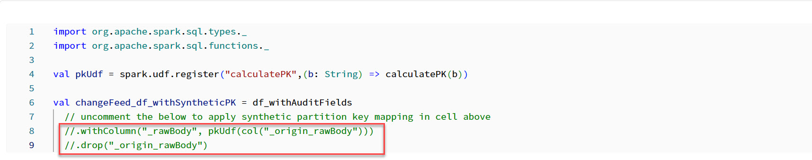

## Validation

* Open the `CosmosDBLiveSingleContainerMigrationValidation` notebook, and attach the same cluster. Replace the references to Cosmos DB account URI, key, source database/container, target database/container, and target container partition key values as appropriate that are contained within each cell (see comments in each cell for guidance). 

* Select "Run All". The final two cells will show any records still present in the source container which are not yet in target container, and a count of those records. The closer this is to zero, the closer the process is to having migrated all of the historic data in the source container. 

    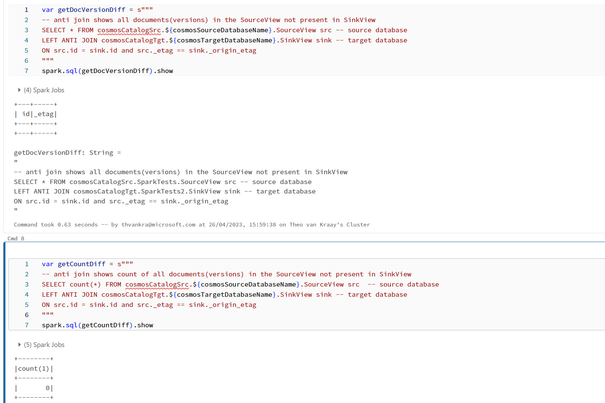

    > [!NOTE]
    > It is always be possible for records to still be in source and not in target, while your application code is still pointing to your source container. However, when you are confident that all historic data has been moved, it may be useful to run this validation again after cutting over application code, to identify whether there are still any records that have not been processed, and thus whether the live migration notebook can now finally be stopped.

## Failures and check point

* You will notice there is a variable which defines checkpoint location.

    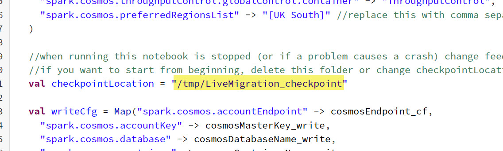

* This will be used to create a temp directory in the Azure Databricks file system to manage checkpointing. The Spark job will fail if there is a bad document. The notebook can be restarted after the document is corrected, and processing will start from the check point. If you want to restart from the beginning, you need to either change the value of this variable (so that a new directory is created), or delete the current directory.

* To delete any checkpoint directory, create a new cell in the notebook, add a line like the following ("LiveMigration_checkpoint" is the name of the directory in this case), and run it:

```shell
    %sh rm -r /dbfs/tmp/LiveMigration_checkpoint
```

## Attach cluster and Run - multiple containers migration

* In the `CosmosDBLiveParallelContainerMigration` notebook, attach the cluster you created earlier:

    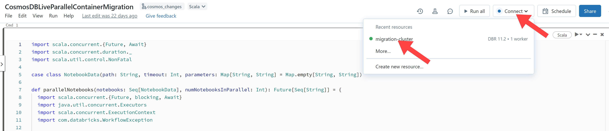

* In the `cosmosDBLiveMigrationList` csv, replace the references to Cosmos DB account URI, key, region, source database/container, target database/container/provisioned throughput, and target container partition key values as approprate:

    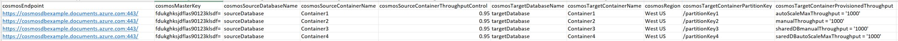

* Upload `cosmosDBLiveMigrationList` csv to dbfs:
    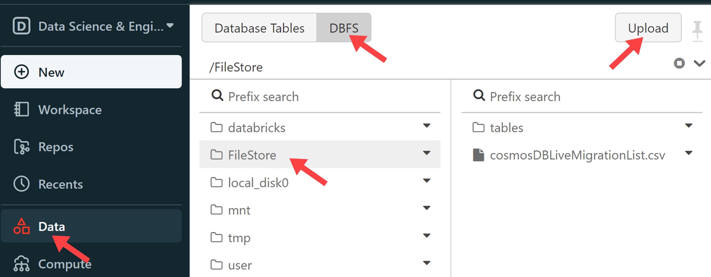

* Change the number of containers you want to be migrated in parallel:

    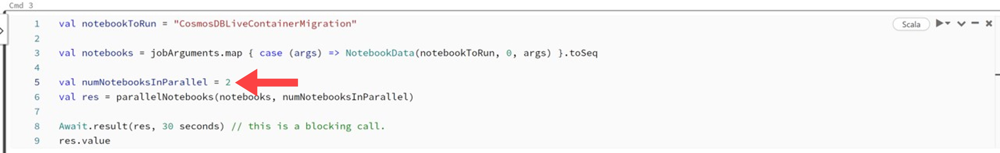

* As long as everything has been configured correctly, all cells should run in sequence. The final cell is executing `CosmosDBLiveContainerMigration` notebook, which is detailed below:

    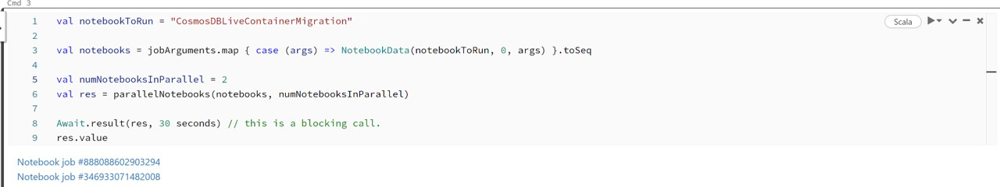

## Validation

* Open the `CosmosDBLiveContainerMigrationValidation` notebook, and attach the same cluster. Replace the references to Cosmos DB account URI, key, source database/container, target database/container, and target container partition key values as appropriate that are contained within each cell (see comments in each cell for guidance). 

* Select "Run All". The final two cells will show any records still present in the source container which are not yet in target container, and a count of those records. The closer this is to zero, the closer the process is to having migrated all of the historic data in the source container. 

    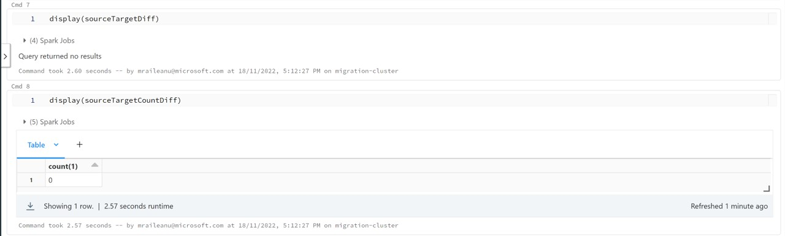

    > [!NOTE]
    > It is always be possible for records to still be in source and not in target, while your application code is still pointing to your source container. However, when you are confident that all historic data has been moved, it may be useful to run this validation again after cutting over application code, to identify whether there are still any records that have not been processed, and thus whether the live migration notebook can now finally be stopped.

## Failures and check point

* You will notice there is a variable which defines checkpoint location.

    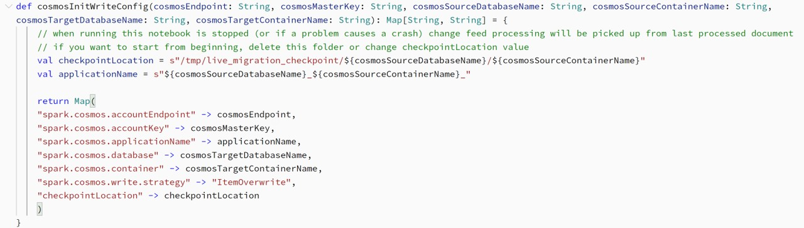

* This will be used to create a temp directory in the Azure Databricks file system to manage checkpointing. The Spark job will fail if there is a bad document. The notebook can be restarted after the document is corrected, and processing will start from the check point. If you want to restart from the beginning, you need to either change the value of this variable (so that a new directory is created), or delete the current directory.

* To delete any checkpoint directory, create a new cell in the notebook, add a line like the following ("${cosmosSourceDatabaseName}/${cosmosSourceContainerName}/live_migration_checkpoint" is the name of the directory in this case), and run it:

```shell
    %sh rm -rf /dbfs/tmp/${cosmosSourceDatabaseName}/${cosmosSourceContainerName}/live_migration_checkpoint
```


