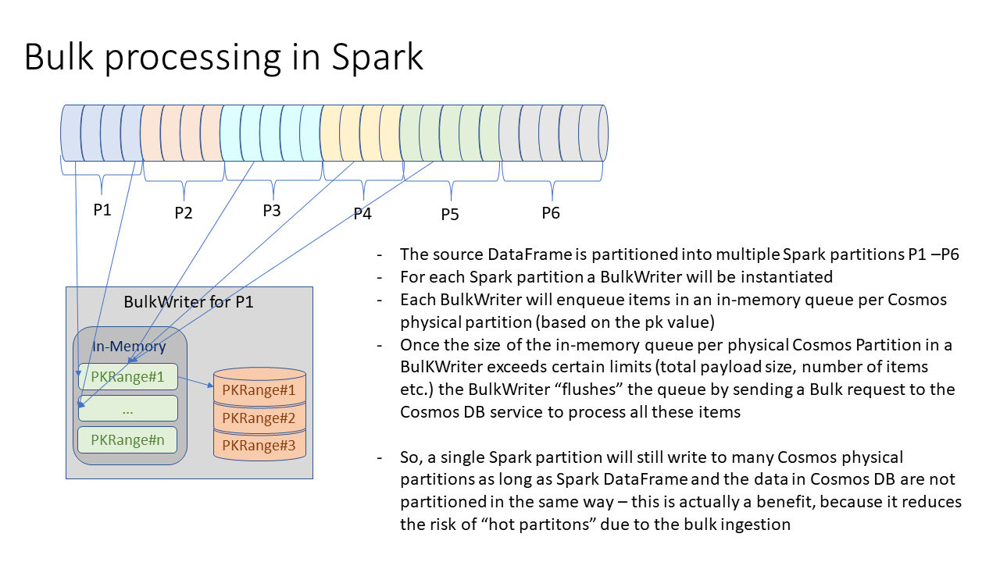

# Ingesting data into Azure Cosmos DB via the Spark Connector for Spark 3.*

## Checklist
The checklist below can help to identify which sections of this document will be relevant for your scenario.
- [ ] Target container has been provisioned with reasonable number of physical partitions and sufficient RUs. - [Creating a new container](#creating-a-new-container-if-the-ingestion-via-the-cosmos-spark-connector-is-for-the-initial-migration)
- [ ] The chosen partition key on the target container allows for reasonable distribution of documents and load. - [Choosing a good partition key](#choosing-a-good-partition-key)
- [ ] The indexing policy of the target container has been tuned to minimize the RU-charge overhead necessary for indexing purposes. - [Indexing policy](#indexing-policy)
- [ ] An `id` column exists in the input data frame (and values are immutable or DF has been persisted) being written to Cosmos DB. - [Populating "id" column](#populating-id-column)
- [ ] The incoming data frame, which is written to Cosmos DB, has a reasonable number of Spark partitions and distribution of data across physical partitions in Cosmos DB. - [Check whether repartitioning is required](#check-whether-repartitioning-is-required) and [Optimization recommendations when migrating  into large containers (>> 100 physical partitions or >> 5 TB of data)](#optimization-recommendations-when-migrating-into-large-containers--100-physical-partitions-or--5-tb-of-data)
- [ ] The serialization settings have been checked to achieve the right behaviour for skipping json properties with null/default values if desired. - [Serialization settings](#serialization-settings)
- [ ] Bulk mode is enabled when writing to Cosmos DB.
- [ ] The ThroughputControl has been configured to avoid consuming more RUs for the ingestion than intended. - [Client-side throughput control](#throughput-control)

## Introduction
The `cosmos.oltp` data source can be used to write a data frame into Cosmos DB. By default the ingestion will happen using bulk mode and parameters like the `micro batch size` are automatically modified behind the scenes depending on the rate of throttled requests and transient errors like request timeouts. The `cosmos.oltp` data source will attempt to saturate the available throughput. So, a certain amount of 429 (Throttled requests) are expected and are actually a good sign, because it means, the available throughput is really  saturated. If it is not desired to saturate the entire available throughput, [client-side throughput control](#throughput-control) can be enabled - which means the ingestion will only attempt to saturate the throughput budget provided via throughput control. A good conceptual overview of the `bulk mode` protocol can be found here [Introducing bulk support in the .Net SDK](https://devblogs.microsoft.com/cosmosdb/introducing-bulk-support-in-the-net-sdk/) and here [Bulk support improvements](https://devblogs.microsoft.com/cosmosdb/bulk-improvements-net-sdk/) -the blog post is for the .Net SDK but the concept and protocol used is identical in the Java SDK as well.

### How bulk ingestion works
In Spark the data frame containing the input data will usually be partitioned. For each partition of the input data, Spark will create a Spark task, which will process this partition (a slice of the input data) independently of other Spark tasks.


The `cosmos.oltp` data source will create one single `CosmosAsyncClient` per Executor/Driver-node - so, this client instance will be shared across multiple Spark tasks being executed concurrently on a single Executor node. But it will create one `BulkWriter` for each Spark task/partition - this `BulkWriter` will only be responsible for ingesting the data of a single Spark partition.



Each `BulkWriter` will buffer data in-memory for each physical partition in Cosmos DB and "flush" it by sending a single request ingesting multiple documents. The buffers are flushed when certain thresholds are met. Thresholds resulting in "flushing" documents for a physical partition into the Cosmos DB backend are based on the currently determined micro batch size, the total payload size for all buffered documents and an interval, measuring how long the documents buffered have not been persisted yet. This "flush interval" makes sure that even on partitions with just a few documents, the documents get persisted after a couple of seconds at least.
The benefit of this model where each `BulkWriter` can write data across all Cosmos partitions independently is that it maintains the isolation of Spark tasks and partitions, and plays well with built-in Spark retry policies and its scalability behaviour. On the other hand, the drawback is that when ingesting a large data volume into a target Cosmos DB container with many physical partitions (significantly above 100 physical partitions or 5 TB of data), there is a relatively large client-side compute overhead, because each Spark Task will create its own `BulkWriter` which will have to buffer data for hundreds of partitions. As an example, when using a Spark Cluster with Executor nodes with 16 or 32 cores - there will be 16 (or 32) `BulkWriter` instances all buffering data (and processing it in separate reactor pipelines) for several hundred partitions. In this use case it can be beneficial to repartition the input data first - to avoid that each Spark partition contains data for all Cosmos partitions (see the [Optimization recommendations when migrating  into large containers (>> 100 physical partitions or >> 5 TB of data)](#optimization-recommendations-when-migrating-into-large-containers--100-physical-partitions-or--5-tb-of-data) section below)

### Throughput control
The client-throughput control capability in the `cosmos.oltp` data source allows you to limit the "RU budget" that can be used for a certain Spark job from the client-side, it is a best effort enforcement and no hard guarantee - usually you will see that the average RU consumption follows the configured restrictions very well (plus/minus a few single digit percent). The client-side throughput control happens across all Spark executors and the driver - so, it is a global throughput enforcement. To be able to coordinate the "RU budget" each executor can consume, a dedicated Cosmos DB container is used, to store the meta-data and balance the load and RU-usage between executors. NOTE - this extra container for metadata to allow limiting the throughput needs to be created by customers upfront with certain settings (partition key must be `groupId`, default indexing policy should be used and TTL needs to be disabled (with default TTL of -1 - so, unless specified otherwise no document would be automatically deleted))

**The below SQL statement can be used to create such a throughput control container**

```
%sql
CREATE TABLE IF NOT EXISTS cosmosCatalog.SampleDatabase.ThroughputControl
USING cosmos.oltp
TBLPROPERTIES(partitionKeyPath = '/groupId', autoScaleMaxThroughput = '4000', indexingPolicy = 'AllProperties', defaultTtlInSeconds = '-1');
```


**The below sample configuration would limit the "RU budget" for a Spark job to 60% of the total provisioned throughput (manually provisioned RU or max. AutoScale RU) of the container.**

```
df \
   .write \
   .format("cosmos.oltp") \
   .options(**cfg) \
   .option("spark.cosmos.throughputControl.enabled", "true") \
   .option("spark.cosmos.throughputControl.name", "MyTestIngestionJobWithLimitedRU") \
   .option("spark.cosmos.throughputControl.targetThroughputThreshold", "0.6") \
   .option("spark.cosmos.throughputControl.globalControl.database", "YourDatabase") \
   .option("spark.cosmos.throughputControl.globalControl.container", "ThroughputControl") \
   .mode("APPEND") \
   .save()
```


### Write strategies

Different write strategies in the `spark.cosmos.write.strategy` configuration parameter can be used to determine what activity shoudl be processed for the records in the DataFrame "written" to Cosmos DB.

- `ItemOverwrite` (the default write strategy): All items of the source DataFrame will be inserted or updated. If the Cosmos DB container contains a document with the same pk+id, it will be updated otherwise a new documented will be created. Existing documents will be replaced independent of when they have been last updated or if the content would actually change.
- `ItemAppend`: For all items in the source DataFrame an attempt will be made to insert a  new document - if a document with the same pk+id exists already, the 409/Conflict response will be ignore and the existing document will not be modified.
- `ItemOverwriteIfNotModified`:  If an etag value exists it will attempt to replace the document with etag pre-condition. If the document changed since being read into the source DataFrame - identified by precondition failure - the update is skipped and the document is not updated with the content of the data frame row. This write strategy can be used when it is important to not override changes made by a different job/application between the time when spark read the document from Cosmos DB.
- `ItemDelete`: Will delete all documents with a pk+id as in the source DataFrame. This is the most robust option to bulk delete documents in Cosmos DB - deletes in Cosmos DB are having the same high RU charge as replacing a document - so deleting a large number of documents can be challenging - using this write strategy will allow to delete documents in bulk - and also use the client throughput control mechanism also used for bulk ingestion to limit the "RU budget" for this operations.
- `ItemDeleteIfNotModified`: Same as `ItemDelete` - except that it will only delete documents when the etag value hasn't changed. This is helpful when trying to delete documents based on a query. You would read the result of the query into a source DataFrame - then "write" it to Cosmos DB with the `ItemDeleteIfNotModified` write strategy. Using the etag pre-condition check will avoid deleting documents that have been changed since running the query (because the updated document might not match the query filter conditions anymore)

### Retry policies and data validation

All transient errors (Throttled requests, network timeouts, any recoverable service errors etc.) are retried automatically by the `cosmos.oltp` data source. Any non-transient errors - for example "400-Bad request" when the value of the "id" column is invalid - which would not be recoverable by retries, will result in the Spark job failing. 

#### Handling of 409/Conflict due to "unique key constraint policy"

When your container has a "unique key constraint policy" any 409 "Conflict" (indicating violation of unique key constraint) handling will depend on the `spark.cosmos.write.strategy`.

- For `ItemOverwrite` a 409 - Conflict due to unique key violation will result in an error - and the Spark job will fail. *NOTE: Conflicts due to pk+id being identical to another document  won't even result in a 409 - because with Upsert the existing document would simply be updated.*
- For `ItemAppend` like conflicts on pk+id any unique key policy constraint violation will be ignored.

## Preparation
Below are a couple of tips/best-practices that can help you to prepare for a data migration into a Cosmos DB container.

### Choosing a good partition key
To be able to fully saturate the provisioned throughput of a container, it is important to choose a partition key that ensures the ingested data is spread over all physical partitions. A really bad choice for example would be a date/time based partition key. Imagine a daily batch job ingests telemetry events and a partition key of the form YYYYMMDD is used. In this case all documents being ingested daily would target a single logical partition. So independent of the total provisioned throughput at most 10,000 RU (current maximum throughput per physical/logical partition) could be used for the ingestion job. You can find some more info abut [partitioning in Cosmos DB](https://docs.microsoft.com/azure/cosmos-db/partitioning-overview) and (how to choose a good partition key)[https://docs.microsoft.com/azure/cosmos-db/partitioning-overview#choose-partitionkey] in the documentation.

### Indexing policy
The RU-charge when inserting or updating a document in Cosmos DB depends on the size of the document as well as the number of "tokens" that need to be indexed. You can think of the number of tokens as the number of json properties that need to be indexed. So, to optimize throughput for the ingestion it would be beneficial to use a scoped indexing policy (not the default policy of indexing all properties, but only the properties that really need to be indexed). The two documents below contain more information about how to choose the right indexing policy.
- [Indexing policies in Azure Cosmos DB](https://docs.microsoft.com/azure/cosmos-db/index-policy)
- [Indexing in Azure Cosmos DB - Overview](https://docs.microsoft.com/azure/cosmos-db/index-overview)

*Sample 01: How to create a new container with default indexing policy (index all properties) in Spark*
```
%sql
CREATE TABLE IF NOT EXISTS cosmosCatalog.SampleDatabase.ThroughputControl
USING cosmos.oltp
TBLPROPERTIES(partitionKeyPath = '/groupId', autoScaleMaxThroughput = '4000', indexingPolicy = 'AllProperties', defaultTtlInSeconds = '-1');
```

*Sample 02: How to create a new container with minimal indexing policy (index only required system properties) in Spark*
```
%sql
CREATE TABLE IF NOT EXISTS cosmosCatalog.SampleDatabase.GreenTaxiRecords
USING cosmos.oltp
TBLPROPERTIES(partitionKeyPath = '/id', autoScaleMaxThroughput = '100000', indexingPolicy = 'OnlySystemProperties');
```

*Sample 03: How to create a new container with custom indexing policy in Spark*
```
myCustomIndexPolicyJson = '{"indexingMode":"consistent","automatic":true,"includedPaths":[{"path":"\/somePropertyName\/?"},{"path":"\/mypk\/?"}],"excludedPaths":[{"path":"\/*"}]}'
spark.sql("""
CREATE TABLE IF NOT EXISTS cosmosCatalog.SampleDatabase.TableWithCustomIndexingPolicy
USING cosmos.oltp
TBLPROPERTIES(partitionKeyPath = '/id', manualThroughput = '400', indexingPolicy = '{customIndexingPolicy}');
""".format(customIndexingPolicy = myCustomIndexPolicyJson))
```

### Creating a new container if the ingestion via the Cosmos Spark connector is for the initial migration
This section will briefly describe how you can create a new Cosmos DB container with the desired number of physical partitions (based on the estimated total storage size after the migration). It will also provide some recommendations how far you can scale-up temporarily during the migration to accelerate the ingestion without causing unnecessary/unwanted partition splits. It can be skipped if you are looking for best-practices on how to ingest data into an already existing container.

Below is a formula that can be used to determine an estimate for the desired number of physical partitions. The total Storage Size is the total size of the input data (in Json) with an estimated Indexing-overhead (rule of thumb (5-10 percent if only system properties are indexed or the indexing policy is very restrictive, 20-30 percent if all properties are getting indexed or the custom indexing policy enables indexing for many properties)
`DesiredPartitionCount = TotalStorageSize_in_GB / 30` - this function assumes, the goal is to roughly fill 30 out-of 50 available GB per physical partition. It is possible to increase the density (use 40 instead of 30 for example), if you don't expect much data growth after the initial migration.

You can create a container that immediately has the desired number of partitions by specifying the right level of RUs when creating the container
`TargetInitialThroughput_in_RU = DesiredPartitionCount * 6000`

During the migration you can scale-up subsequently up-to `DesiredPartitionCount * 10000` RUs synchronously (will be effective immediately and not cause any additional partition splits)

There are a couple of additional configuration settings to decide on when creating a new container:
- Partition key (see above)
- Partition key hash versioning (V1 is the default, V2 is recommended and required if your partition key values exceed 100 bytes)
- Any unique key constraint need to be configured when creating the container - it is immutable
- Indexing policy (see above)

### Input data considerations
This section will briefly explain how you can prepare the input data to ensure an efficient data ingestion into Cosmos DB.

#### Populating "id" column
Unlike the Cosmos DB connector for Spark 2.* the new connector for Spark 3.* and above `cosmos.oltp` requires you to pre-populate an `id` column in the data frame containing the data you want to write into Cosmos DB. In the previous version it was possible to let the Spark connector auto-generate a value for the `id` column. We changed this, because the auto-generation of `id` values in the connector has an intrinsic problem whenever Spark retries a task. A different `id` value would be generated for each retry - which means you might end-up with duplicate records when using the `ItemOverwrite` (Upsert) or `ItemAppend` (only insert new documents) item write strategies. It is important that the `id` value is immutable when the writing to the Cosmos DB data source `cosmos.oltp` begins.
This can be achieved by either mapping an existing value of your input data as the `id` column or by generating a random value and subsequently persisting the data frame before starting the write process.

*Sample 01: Creating a new `id` column with a random value*
```
# Add a column id with random unique id
uuidUdf= udf(lambda : str(uuid.uuid4()),StringType())
df_input = df_input.withColumn("id", uuidUdf())

# Persist the data frame so that even on retries no new unique id is generated but the
# value is immutable across retries
df_input.persist()
[...]
# Write the data to Cosmos DB
writeCfg = {
  "spark.cosmos.accountEndpoint": cosmosEndpoint,
  "spark.cosmos.accountKey": cosmosMasterKey,
  [...]
}

df_input \
  .write \
  .format("cosmos.oltp") \
  .mode("Append") \
  .options(**writeCfg) \
  .save()
[...]

# Unpersist the data frame after writing it to Cosmos DB to free up any memory/disk-space
df_input.unpersist()
```

*Sample 02: Creating a new `id` column using the value of an existing column*
```
# Add a column id with the value of another already existing column (needs to be unique at least per logical partition)
df_input = df_input.withColumn("id", col("SomeOtherColumn"))

# Persist the data frame so that even on retries no new unique id is generated but the
# value is immutable across retries
df_input.persist()
[...]
# Write the data to Cosmos DB
writeCfg = {
  "spark.cosmos.accountEndpoint": cosmosEndpoint,
  "spark.cosmos.accountKey": cosmosMasterKey,
  [...]
}

df_input \
  .write \
  .format("cosmos.oltp") \
  .mode("Append") \
  .options(**writeCfg) \
  .save()
[...]

# Unpersist the data frame after writing it to Cosmos DB to free up any memory/disk-space
df_input.unpersist()
```

#### Check whether repartitioning is required
The number of Spark partitions in the data frame written to Cosmos DB is determined by the data source used to read the data. Except for very large containers (with hundreds of physical partitions and >> 5 TB of data - see next section in this case) the only reason why a repartitioning would be recommended is, if the data frame contains fewer Spark partitions than number of Cores for executors in your Spark cluster. In this case writing to Cosmos DB would be restricted to only a subset of your executors - which means you would have unused compute capacity.

#### Optimization recommendations when migrating into large containers (>> 100 physical partitions or >> 5 TB of data)
As described above for each Spark Partition a `BulkWriter` instance will be responsible for writing all its data into Cosmos DB and will maintain internal buffers per physical partition in Cosmos DB. When a target container is very large (with hundreds of physical partitions) this causes unnecessary Compute overhead. As an optimization it can be beneficial to repartition the input data frame to make sure each Spark partition only contains data for a smaller subset of physical partitions in Cosmos DB. This reduces the compute overhead.
The necessary steps to reshuffle the input data are:
- Using the user defined function `com.azure.cosmos.spark.udf.GetFeedRangeForPartitionKeyValue` to identify the "feed range" - a value that can be used to identify collocated documents based on their partition key values.
- Create a sequential number, indexing the incoming data ordered by the "feed range" value
- Partition the incoming data into targeted number of batches/partitions with documents collocated in Cosmos DB (not necessarily all of them will be stored in the same physical partition, but depending on the batch size they will span only one up to a small number of partitions). A reasonable number of target Partitions is a single digit > 1 multiplied by the number of total executor cores.

Overall this optimization will mostly reduce the compute overhead - which will result in more stable saturation of the provisioned throughput in the target container with fewer Spark executors and reduce the memory pressure on the Spark executors. In our tests it can result in reducing the latency of an ingestion run against a large target container by 10 to 20 percent.

*Sample 01: Repartitioning the data frame containing the incoming data into Spark partitions only containing data of 10-20 physical partitions.*
```
from pyspark.sql import functions as F
from pyspark.sql.window import *
from pyspark.sql.types import *
from pyspark.sql.functions import *

# Register the UDF provided in the Cosmos Spark Connector to be used from PySpark
spark.udf.registerJavaFunction( \
  "getFeedRangeForPK", \
  "com.azure.cosmos.spark.udf.GetFeedRangeForPartitionKeyValue", \
  StringType())

# The DESCRIBE TABLE EXTENDED command can be used to get additional metadata of the
# target Cosmos DB container - for example the partition key definition or the number
# of physical partitions
tblProperties = spark.sql('DESCRIBE TABLE EXTENDED cosmosCatalog.SampleDatabase.GreenTaxiRecords')
tblPropertiesString=tblProperties.filter(col("col_name") == "Table Properties").first()["data_type"]

# Determine the physical partition count of the target container - this can be used to identify
# whether this optimization is even needed
startPos = tblPropertiesString.index("CosmosPartitionCount='") + len("CosmosPartitionCount='")
physicalPartitionCount=int(tblPropertiesString[startPos:tblPropertiesString.index("'", startPos)])
print("PartitionCount: ", physicalPartitionCount)

# Determine the partition key definition of the target container which needs to be
# passed into the `com.azure.cosmos.spark.udf.GetFeedRangeForPartitionKeyValue` user
# defined function as parameter
startPos = tblPropertiesString.index("CosmosPartitionKeyDefinition='") + len("CosmosPartitionKeyDefinition='")
partitionKeyDefinition=tblPropertiesString[startPos:tblPropertiesString.index("'", startPos)]
print("PK Definition: ", partitionKeyDefinition)

# Create the UDF expression that can be used to add a column calculating the FeedRange
# the first parameter is the partition key definition
# the second parameter is the column name of the partition key (in this sample id is also the partition key)
getFeedRangeExpression = "getFeedRangeForPK('" + partitionKeyDefinition + "', id)"
print("UDF-Expression: ", getFeedRangeExpression)

writeCfg = {
  "spark.cosmos.accountEndpoint": cosmosEndpoint,
  "spark.cosmos.accountKey": cosmosMasterKey,
  [...]
}

df_input = (df_input
  # Determine the feed range for each document
  .withColumn('feedRange', F.expr(getFeedRangeExpression))
  # Create a sequential number indexing the data frame ordered by the "feed range"
  .withColumn('rowNo',row_number().over(Window.orderBy(col('feedRange'))))
  # Repartition the data frame into targeted number of batches/partitions with
  # documents collocated in Cosmos DB. The factor 10 multiplied with the number of physical
  # partitions means each Spark partition will contain data of up to 10-20 physical partitions
  # (instead of hundreds of partitions). The factor can be modified
  # when needed of course
  .withColumn('batchNo', floor(col('rowNo')/(partitionCount * 10)).cast(IntegerType()))
  .repartition(128, 'batchNo'))

df_input \
  .write \
  .format("cosmos.oltp") \
  .mode("Append") \
  .options(**writeCfg) \
  .save()
```

## Data migration
This section covers a few considerations that need to be made for the actual data migration.

### Serialization settings
By default the `cosmos.oltp` data source will always create a json property for each column in the source data frame - even if the value for the row/record is 'null' or the default value of the data type (like "" for Strings or 0 for numbers). This means the resulting json document is somewhat larger than strictly necessary (because it contains json properties even for these values). The main motivation behind this default behaviour was to ensure that
- there is no dependency on whatever json library is used to deserialize the json and
- the schema inference allows identifying the schema easily

If you prefer not creating any json properties for `null`, `empty` or `default` values, you can use the configuration property `spark.cosmos.serialization.inclusionMode` to change the default behaviour.
- `Always`: Determines whether null/default values will be serialized to json or whether properties with null/default value will be skipped. The behaviour follows the same ideas as [Jackson's JsonInclude.Include](https://github.com/FasterXML/jackson-annotations/blob/d0820002721c76adad2cc87fcd88bf60f56b64de/src/main/java/com/fasterxml/jackson/annotation/JsonInclude.java#L98-L227). `Always` means json properties are created even for null and default values.
- `NonNull` means no json properties will be created for explicit null values.
- `NonEmpty` means json properties will not be created for empty string values or empty arrays/maps.
- `NonDefault` means json properties will be skipped not just for null/empty but also when the value is identical to the default value `0` for numeric properties for example.

### Choosing the right Spark cluster size for the migration job
As a rule of thumb, one executor (with one Core) can easily saturate at least 3,000 - 5,000 RU - so, when you plan to ingest data into a container with 100,000 RU/s provisioned throughput, it should be perfectly sufficient to use a Spark cluster with about 32 Cores for executors. If you allocate more Cores for executors, it means the throttling will increase and ultimately your job won't finish faster, because the provisioned throughput of the target container will be your bottleneck. But of course it would also not be impossible to use more than 32 Cores for executors in this case - writing to Cosmos DB will still finish - the only impact you might see is a higher throttling rate.

### Estimating the necessary duration for the migration
For most Spark jobs writing to Cosmos DB, the provisioned throughput (or if throughput control is enabled the RU budget) of the target container is the bottleneck. It will drive the latency of the ingestion. You can get a good estimate of the total time a certain ingestion job will need by capturing the RU charge per create/replace operation and use that to estimate the total RU usage needed. Divide it by the provisioned throughput and you have the estimated duration of the ingestion run in seconds. To identify the RU charge for certain operations you can either run a test with a small number of documents and monitor the RU-usage or use the [Cosmos DB Capacity Calculator](https://cosmos.azure.com/capacitycalculator/)

## Troubleshooting
TBD - will add any known issues or frequently asked questions here