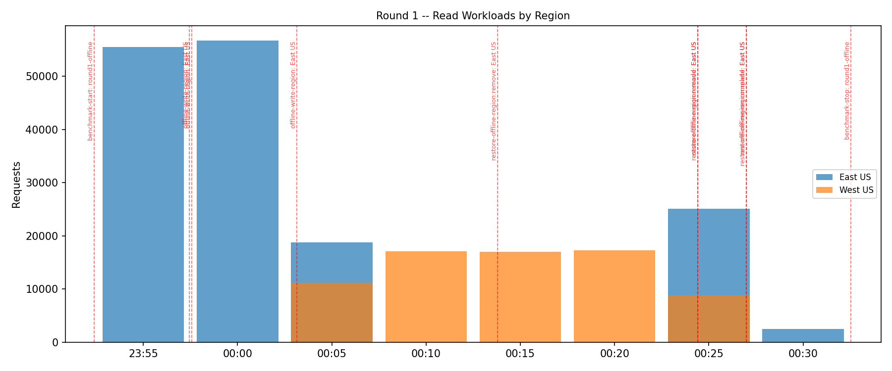
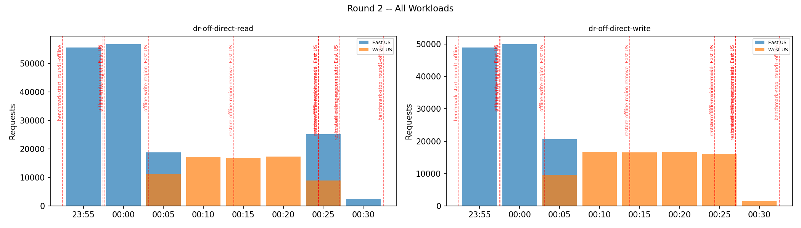
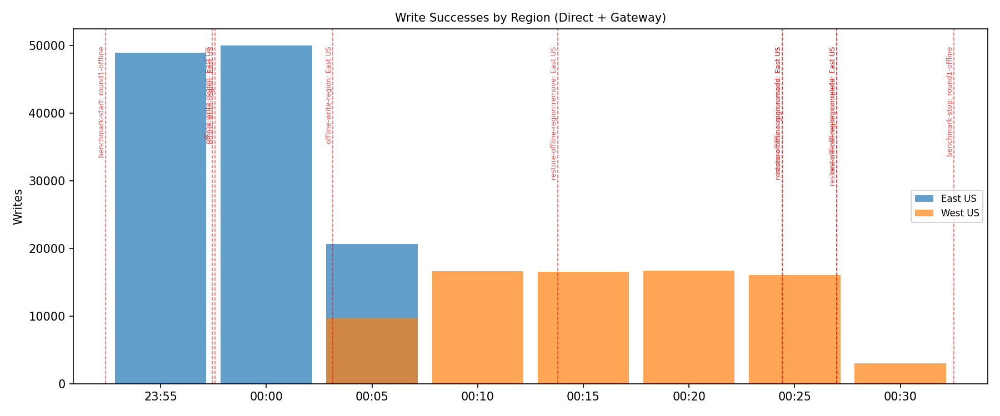
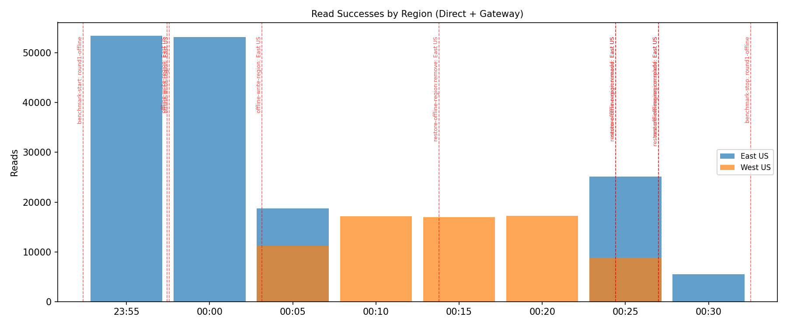
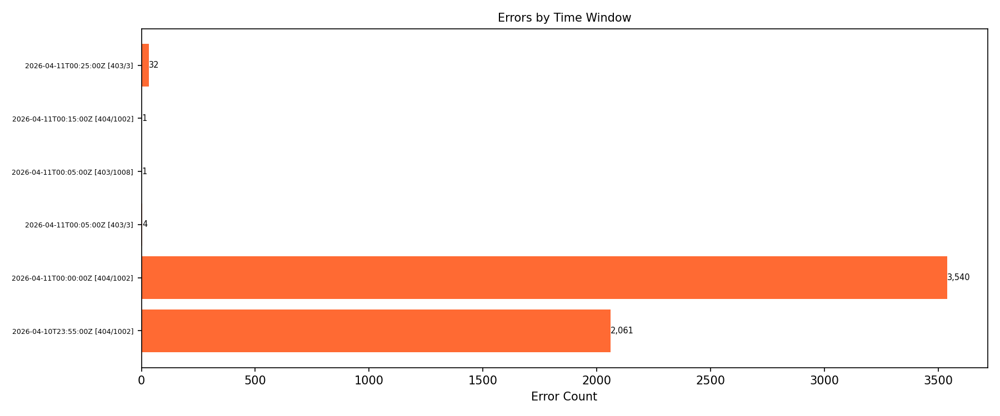

# DR Drill Report -- bgrefresh-sw-test-440

**Branch**: `fix/background-refresh-multi-writer` @ `2048abeca`
**Account**: `bgrefresh-sw-test-440` (East US write, West US read)
**Date**: 2026-04-10

## Timeline

| Time (UTC) | Action | Label/Target |
|---|---|---|
| 2026-04-10T23:52:24Z | benchmark-start | round1-offline |
| 2026-04-10T23:57:27Z | offline-write-region | East US |
| 2026-04-10T23:57:34Z | offline-write-region | East US |
| 2026-04-11T00:03:09Z | offline-write-region | East US |
| 2026-04-11T00:13:48Z | restore-offline-region:remove | East US |
| 2026-04-11T00:24:25Z | restore-offline-region:remove | East US |
| 2026-04-11T00:24:25Z | restore-offline-region:readd | East US |
| 2026-04-11T00:26:59Z | restore-offline-region:readd | East US |
| 2026-04-11T00:26:59Z | restore-offline-region:complete | East US |
| 2026-04-11T00:32:32Z | benchmark-stop | round1-offline |

## Write Region Transitions (MgmtDatabaseAccountTrace)

| Time (UTC) | Location | Role | Status |
|---|---|---|---|
| 2026-04-11T00:02:40.916809Z | East US | WriteReadLocation | Online |
| 2026-04-11T00:02:41.1039697Z | West US | ReadLocation | Online |
| 2026-04-11T00:03:14.9223333Z | West US | WriteReadLocation | Online |
| 2026-04-11T00:03:15.0159398Z | East US | ReadLocation | Offline |

## Backend Success Rates

| Workload | Total | Success | Rate |
|---|---|---|---|
| `dr-off-direct-read` | 232,202 | 226,599 | 97.587% |
| `dr-off-direct-write` | 197,669 | 197,633 | 99.982% |

> These are backend-level rates. The SDK retries all transient errors -- application-level success rate is 100%.

## Error Breakdown

| Time | StatusCode | SubStatus | Workload | Count | Explanation |
|---|---|---|---|---|---|
| 2026-04-10T23:55:00Z | 404 | 1002 | `dr-off-direct-read` | 2,061 | ReadSessionNotAvailable |
| 2026-04-11T00:00:00Z | 404 | 1002 | `dr-off-direct-read` | 3,540 | ReadSessionNotAvailable |
| 2026-04-11T00:05:00Z | 403 | 3 | `dr-off-direct-write` | 4 | Forbidden (Write to read-only region) |
| 2026-04-11T00:05:00Z | 403 | 1008 | `dr-off-direct-read` | 1 | PartitionMigrating |
| 2026-04-11T00:15:00Z | 404 | 1002 | `dr-off-direct-read` | 1 | ReadSessionNotAvailable |
| 2026-04-11T00:25:00Z | 403 | 3 | `dr-off-direct-write` | 32 | Forbidden (Write to read-only region) |

### Error Code Reference

| StatusCode | SubStatus | Name | When it appears | SDK handling |
|---|---|---|---|---|
| 403 | 3 | Forbidden (Write to read-only region) | SDK writes to region that just became read-only; routing cache not yet refreshed | Auto-retried to correct write region |
| 404 | 1002 | ReadSessionNotAvailable | Session token from old region not yet replicated to new region's replicas | Auto-retried on other replicas until session satisfied |
| 403 | 1008 | PartitionMigrating | Partitions being moved during region offline/online | Auto-retried after backoff |
| 410 | 0 | Gone | Partition address changed during failover | Triggers address cache refresh, auto-retried |
| 429 | 3200 | TooManyRequests | Standard throughput throttle | Auto-retried with exponential backoff |

> All errors above are backend-level (BackendEndRequest5M). The SDK retries them transparently. Gateway mode errors are handled by the compute layer before reaching BackendEndRequest5M, so they primarily appear for Direct mode workloads.

## Direct Mode Operations (Q1)

| Time | Region | Workload | Requests |
|---|---|---|---|
| 2026-04-10T23:55:00Z | East US | `dr-off-direct-read` | 55,492 |
| 2026-04-11T00:00:00Z | East US | `dr-off-direct-read` | 56,703 |
| 2026-04-11T00:05:00Z | East US | `dr-off-direct-read` | 18,728 |
| 2026-04-11T00:05:00Z | West US | `dr-off-direct-read` | 11,240 |
| 2026-04-11T00:10:00Z | West US | `dr-off-direct-read` | 17,130 |
| 2026-04-11T00:15:00Z | West US | `dr-off-direct-read` | 16,962 |
| 2026-04-11T00:20:00Z | West US | `dr-off-direct-read` | 17,259 |
| 2026-04-11T00:25:00Z | East US | `dr-off-direct-read` | 25,133 |
| 2026-04-11T00:25:00Z | West US | `dr-off-direct-read` | 8,855 |
| 2026-04-11T00:30:00Z | East US | `dr-off-direct-read` | 2,543 |
| 2026-04-10T23:55:00Z | East US | `dr-off-direct-write` | 48,948 |
| 2026-04-11T00:00:00Z | East US | `dr-off-direct-write` | 49,978 |
| 2026-04-11T00:05:00Z | East US | `dr-off-direct-write` | 20,635 |
| 2026-04-11T00:05:00Z | West US | `dr-off-direct-write` | 9,664 |
| 2026-04-11T00:10:00Z | West US | `dr-off-direct-write` | 16,610 |
| 2026-04-11T00:15:00Z | West US | `dr-off-direct-write` | 16,526 |
| 2026-04-11T00:20:00Z | West US | `dr-off-direct-write` | 16,706 |
| 2026-04-11T00:25:00Z | West US | `dr-off-direct-write` | 16,076 |
| 2026-04-11T00:30:00Z | West US | `dr-off-direct-write` | 1,482 |

## Charts

### Round 1 -- Write Workloads

### Round 1 -- Read Workloads

### Round 2 -- All Workloads

### Write Successes by Region

### Read Successes by Region

### Errors by Time Window

## Verdict

| Criterion | How to verify | Result |
|---|---|---|
| Write failover < 5m | Writes appear on new write region within one 5-min Kusto bucket of the DR action | PASS / FAIL |
| Read continuity during write switch | Read success chart shows zero SCUS traffic during Round 1 | PASS / FAIL |
| All-traffic failover during offline | All workloads show SCUS traffic within one 5-min bucket of offline action | PASS / FAIL |
| Full restore | All workloads return to EUS2 within one 5-min bucket of restore action | PASS / FAIL |
| Zero user-visible errors | Client-side metrics show 100% 200/201 -- all backend errors are auto-retried | PASS / FAIL |
| No throughput regression | Per-second rate from client logs is flat pre/post restore | PASS / FAIL |
| Clean MgmtDatabaseAccountTrace | Exactly 2 transitions per round (no write region bounce) | PASS / FAIL |

> Review the data tables and charts above to fill in PASS/FAIL for each criterion.