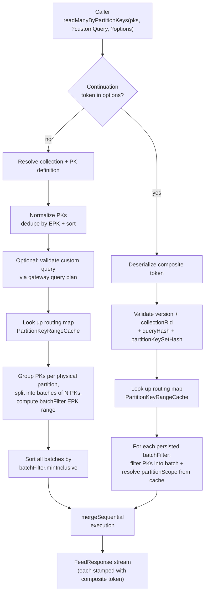
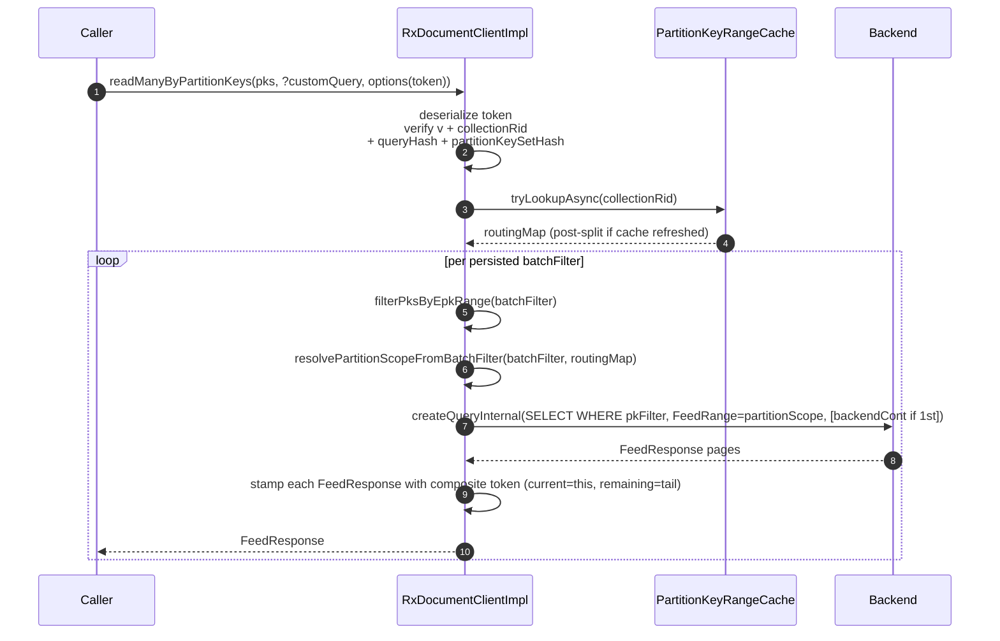

# readManyByPartitionKeys - Design & Implementation

## Overview

New `readManyByPartitionKeys` methods on `CosmosAsyncContainer` / `CosmosContainer` that accept a
`List<PartitionKey>` (without item ids). The SDK splits the PK values by physical partition,
generates batched streaming queries per physical partition, and returns results as
`CosmosPagedFlux<T>` / `CosmosPagedIterable<T>`. The result stream is strictly batch-by-batch
ordered (see Phase 4) so each `FeedResponse` carries a usable composite continuation token.

An optional `SqlQuerySpec` parameter lets callers supply a custom query for projections
and additional filters. The SDK appends the auto-generated PK WHERE clause to it and rejects
non-streamable shapes (aggregates / ORDER BY / DISTINCT / etc.) up front via a one-time
gateway query-plan validation.

## High-level flow



## Decisions

| Topic                   | Decision                                                                                                                                                                   |
|-------------------------|----------------------------------------------------------------------------------------------------------------------------------------------------------------------------|
| API name                | `readManyByPartitionKeys` - distinct name to avoid ambiguity with existing `readMany(List<CosmosItemIdentity>)`                                                            |
| Return type             | `CosmosPagedFlux<T>` (async) / `CosmosPagedIterable<T>` (sync)                                                                                                             |
| Custom query format     | `SqlQuerySpec` - full query with parameters; SDK ANDs the PK filter                                                                                                        |
| Partial HPK             | Supported from the start; prefix PKs fan out via `getOverlappingRanges`                                                                                                    |
| PK deduplication        | SDK normalizes and deduplicates the partition-key set by EPK before batching; Spark callers should still dedupe the input DataFrame when practical for efficiency         |
| Spark UDF               | New `GetCosmosPartitionKeyValue` UDF                                                                                                                                       |
| Custom query validation | Gateway query plan via the standard SDK query-plan retrieval path; reject aggregates/ORDER BY/DISTINCT/GROUP BY/DCount/OFFSET/LIMIT/non-streaming ORDER BY/vector/fulltext |
| PK list size            | No hard upper-bound enforced; SDK batches internally per physical partition (default 100 PKs per batch, configurable via `COSMOS.READ_MANY_BY_PK_MAX_BATCH_SIZE`)          |
| Eager validation        | Null and empty PK list rejected eagerly (not lazily in reactive chain)                                                                                                     |
| Telemetry               | Separate span name `readManyByPartitionKeys.<containerId>` (distinct from existing `readManyItems`)                                                                       |
| Query construction      | Table alias auto-detected from FROM clause; string literals and subqueries handled correctly                                                                               |
| Continuation tokens     | Composite token persists only the per-batch EPK FILTER; the routing scope (`FeedRange`) is rederived from the live `PartitionKeyRangeCache` per batch on resume so post-split refreshes are reflected automatically |

## Phase 1 - SDK Core (`azure-cosmos`)

### Step 1: New public overloads in CosmosAsyncContainer

```java
<T> CosmosPagedFlux<T> readManyByPartitionKeys(List<PartitionKey> partitionKeys, Class<T> classType)
<T> CosmosPagedFlux<T> readManyByPartitionKeys(List<PartitionKey> partitionKeys,
                                               CosmosReadManyByPartitionKeysRequestOptions requestOptions,
                                               Class<T> classType)
<T> CosmosPagedFlux<T> readManyByPartitionKeys(List<PartitionKey> partitionKeys,
                                               SqlQuerySpec customQuery,
                                               Class<T> classType)
<T> CosmosPagedFlux<T> readManyByPartitionKeys(List<PartitionKey> partitionKeys,
                                               SqlQuerySpec customQuery,
                                               CosmosReadManyByPartitionKeysRequestOptions requestOptions,
                                               Class<T> classType)
```

All four overloads delegate to a private `readManyByPartitionKeyInternalFunc(...)`.

> **Note:** the request-options type for `readManyByPartitionKeys` is the dedicated
> `CosmosReadManyByPartitionKeysRequestOptions` class (not the shared
> `CosmosReadManyRequestOptions` used by `readMany(List<CosmosItemIdentity>)`). It exposes
> `setContinuationToken(String)` / `getContinuationToken()` directly on the public surface
> and a `setMaxConcurrentBatchPrefetch(int)` knob that defaults to
> `Runtime.getRuntime().availableProcessors()` (the Spark connector overrides this default to
> `1` and exposes a config key `spark.cosmos.read.readManyByPk.maxConcurrentBatchPrefetch` for
> per-task tuning).

**Eager validation:** The 4-arg method validates `partitionKeys` is non-null and non-empty before
constructing the reactive pipeline, throwing `IllegalArgumentException` synchronously.

### Step 2: Sync wrappers in CosmosContainer

Same four signatures returning `CosmosPagedIterable<T>`, each delegating to the async container.

### Step 3: Internal orchestration (RxDocumentClientImpl)

#### Step 3a: First-call path (no continuation token)

1. Resolve collection metadata + PK definition from cache.
2. Normalize the input PK list: compute the effective partition key (EPK) for each input,
   deduplicate by EPK string, sort the surviving entries by EPK.
3. Optionally validate the custom query (Step 4) - one gateway query-plan call, executed
   in parallel with the routing-map lookup.
4. Fetch the routing map from `partitionKeyRangeCache`.
5. For each `PartitionKeyRange` (physical partition):
   - Bucket the normalized PKs whose EPK falls in the partition's range.
   - Split into batches of `Configs.getReadManyByPkMaxBatchSize()` PKs (default 100).
   - For each batch, compute the **batchFilter** EPK range:
     `[epkOf(firstPkInBatch), epkOf(firstPkInNextBatch))` - or, for the last batch in a
     partition, `[epkOf(firstPkInBatch), partitionScope.maxExclusive)`.
   - The batch's **partitionScope** is the partition's EPK range itself.
   - Build the per-batch `SqlQuerySpec` (Step 5).
6. Sort all batches across all partitions by `batchFilter.minInclusive` for deterministic
   global EPK ordering.
7. Execute sequentially with `Flux.mergeSequential(sources, maxConcurrency, prefetch=1)`
   so emission order is strictly batch-by-batch (items from batch *N+1* are never interleaved
   with items from batch *N*) while still allowing eager subscription to the next batch
   (small Reactor prefetch) for throughput. `maxConcurrency = Math.min(batchCount, cpuCount)`.
8. As each `FeedResponse` flows through, stamp it with a composite continuation token (Phase 4).

#### Step 3b: Continuation path (token present)

1. Resolve collection metadata + PK definition from cache (same as 3a step 1).
2. Normalize the input PK list (same as 3a step 2).
3. Deserialize the composite token; validate `version`, `collectionRid`, `queryHash`,
   `partitionKeySetHash`. Any mismatch throws `IllegalArgumentException` eagerly inside
   the reactive chain.
4. Fetch the routing map from `partitionKeyRangeCache` - required to rederive each batch's
   `partitionScope` for FeedRange routing.
5. For each persisted `batchFilter` (current + remaining):
   - Filter the normalized PK list down to PKs whose EPK falls inside `batchFilter`.
     Skip the batch if the filter happens to match no PKs (e.g. caller dropped some inputs).
   - Compute the routing scope by calling `resolvePartitionScopeFromBatchFilter(batchFilter, routingMap)`:
     `[min(minEpk), max(maxEpk))` across all `PartitionKeyRange`s overlapping the batch
     filter. This naturally returns the post-split boundaries when a split has happened.
   - Build the per-batch `SqlQuerySpec`.
6. Stitch the sequence: the first batch starts from the persisted `backendContinuation`;
   subsequent batches start fresh.
7. Execute the same sequential merge as the first-call path.

### Step 4: Custom query validation

One-time call per invocation using the same query-plan retrieval path and cacheability rules as
regular SDK queries.

- `QueryPlanRetriever.getQueryPlanThroughGatewayAsync()` for the user query.
- Reject (`IllegalArgumentException`) if:
  - `queryInfo.hasGroupBy()` - checked first (takes precedence over aggregates since
    `hasAggregates()` also returns true for GROUP BY queries)
  - `queryInfo.hasAggregates()`
  - `queryInfo.hasOrderBy()`
  - `queryInfo.hasDistinct()`
  - `queryInfo.hasDCount()`
  - `queryInfo.hasOffset()`
  - `queryInfo.hasLimit()`
  - `queryInfo.hasTop()`
  - `queryInfo.hasNonStreamingOrderBy()`
  - `partitionedQueryExecutionInfo.hasHybridSearchQueryInfo()`
  - query plan details are unavailable (`queryInfo == null`)

The validator is called in parallel with the routing-map lookup so it does not add a
serial round-trip.

### Step 5: Query construction

Query construction is implemented in `ReadManyByPartitionKeyQueryHelper`. The helper:

- Extracts the table alias from the FROM clause (handles `FROM c`, `FROM root r`, `FROM x WHERE ...`)
- Handles string literals in queries (parens/keywords inside `'...'` are correctly skipped)
- Recognizes SQL keywords: WHERE, ORDER, GROUP, JOIN, OFFSET, LIMIT, HAVING
- Uses parameterized queries (`@__rmPk_` prefix) to prevent SQL injection. The prefix is
  reserved: any caller-supplied `SqlParameter` whose name starts with `@__rmPk_` is rejected
  to prevent collisions with the auto-generated PK parameters.

**Single PK (HASH):**

```sql
{baseQuery} WHERE {alias}["{pkPath}"] IN (@__rmPk_0, @__rmPk_1, @__rmPk_2)
```

**Full HPK (MULTI_HASH):**

```sql
{baseQuery} WHERE ({alias}["{path1}"] = @__rmPk_0 AND {alias}["{path2}"] = @__rmPk_1)
              OR  ({alias}["{path1}"] = @__rmPk_2 AND {alias}["{path2}"] = @__rmPk_3)
```

**Partial HPK (prefix-only):**

```sql
{baseQuery} WHERE ({alias}["{path1}"] = @__rmPk_0)
              OR  ({alias}["{path1}"] = @__rmPk_1)
```

If the base query already has a WHERE clause:

```sql
{selectAndFrom} WHERE ({existingWhere}) AND ({pkFilter})
```

### Step 6: Interface wiring

New method `readManyByPartitionKeys` added directly to `AsyncDocumentClient` interface,
implemented in `RxDocumentClientImpl`. The query executor is `createQueryInternal` (the same
internal entry point used by the streaming query API), invoked once per batch.

A new `fetchQueryPlanForValidation` static method on `DocumentQueryExecutionContextFactory`
exposes the query-plan retrieval path for the custom-query validator.

### Step 7: Configuration

New configurable batch size via system property `COSMOS.READ_MANY_BY_PK_MAX_BATCH_SIZE` or
environment variable `COSMOS_READ_MANY_BY_PK_MAX_BATCH_SIZE` (default: 100, minimum: 1).
Both inputs are parsed via a shared safe-parse helper that logs a WARN and falls back to
the default on `NumberFormatException` or non-positive values.

## Phase 2 - Spark Connector (`azure-cosmos-spark_3`)

### Step 8: New UDF - `GetCosmosPartitionKeyValue`

- Input: partition key value (single value or Seq for hierarchical PKs).
- Output: serialized PK string in format `pk([...json...])`.
- **Null handling:** Null input is serialized as a JSON-null partition key component. If callers
  need `PartitionKey.NONE` semantics they must use the schema-matched path with
  `spark.cosmos.read.readManyByPk.nullHandling=None`, which is only supported for single-path
  partition keys.

### Step 9: PK-only serialization helper

`CosmosPartitionKeyHelper`:

- `getCosmosPartitionKeyValueString(pkValues: List[Object]): String` - serialize to `pk([...])` format.
- `tryParsePartitionKey(serialized: String): Option[PartitionKey]` - deserialize; returns `None`
  for malformed input including invalid JSON. The parser regex is anchored
  (`^pk\((.*)\)$`) so substrings that merely contain a `pk(...)` literal are not accepted.
- When `spark.cosmos.read.readManyByPk.nullHandling=None` is used, hierarchical partition keys
  with null components are rejected with a clear error because `PartitionKey.NONE` cannot be
  used with multiple paths.

### Step 10: `CosmosItemsDataSource.readManyByPartitionKeys`

Static entry points that accept a DataFrame and Cosmos config. PK extraction supports two modes:

1. **UDF-produced column**: DataFrame contains `_partitionKeyIdentity` column (from
   `GetCosmosPartitionKeyValue` UDF).
2. **Schema-matched columns**: DataFrame columns match the container's PK paths.

Top-level DataFrame columns may supply a full or prefix hierarchical partition key directly.
Nested partition key paths are not resolved automatically and must use the UDF-produced
`_partitionKeyIdentity` column.

Falls back with `IllegalArgumentException` if neither mode is possible.

### Step 11: `CosmosReadManyByPartitionKeyReader`

Orchestrator that resolves schema, initializes and broadcasts client state to executors, then maps
each Spark partition to an `ItemsPartitionReaderWithReadManyByPartitionKey`. The wrapper iterator
closes the reader deterministically on exhaustion, on failures, and via Spark task-completion
callbacks.

### Step 12: `ItemsPartitionReaderWithReadManyByPartitionKey`

Spark `PartitionReader[InternalRow]` that:

- Preserves the caller's PK list and lets the SDK normalize/dedupe by effective partition key;
  callers should still dedupe the DataFrame upstream when practical. Logs a WARN if a single
  partition reader receives more than 200000 PKs (large input materializes the full set in
  memory plus the SDK's normalized batch metadata).
- Passes the pre-built request options (with throughput control, diagnostics, custom serializer)
  to the SDK.
- Wraps each batch in a `TransientIOErrorsRetryingReadManyByPartitionKeyIterator` for retry
  handling - on transient I/O failures the iterator re-creates the underlying `CosmosPagedFlux`
  using the continuation token of the last fully-drained page (Phase 4).
- Short-circuits empty PK lists to avoid SDK rejection.

## Phase 3 - Testing

### Unit tests

- Query construction: single PK, HPK full/partial, custom query composition, table alias detection.
- Query plan rejection: aggregates, ORDER BY, DISTINCT, GROUP BY (with and without aggregates),
  DCOUNT.
- String literal handling: WHERE/parentheses inside string constants.
- Keyword detection: WHERE, ORDER, GROUP, JOIN, OFFSET, LIMIT, HAVING.
- PK serialization/deserialization roundtrip (including malformed JSON handling).
- `findTopLevelWhereIndex` edge cases: subqueries, string literals, case insensitivity.
- Continuation token: roundtrip, version-field presence, version-mismatch rejection,
  partition-key-set hash stability across reordered/duplicate inputs, partition scope is NOT
  persisted.
- Reserved parameter prefix: caller-supplied `@__rmPk_*` parameter is rejected.

### Integration tests

- End-to-end SDK: single PK basic, projections, filters, empty results, HPK full/partial,
  request options propagation.
- Batch size validation: temporarily lowered batch size to exercise batching/sequential-merge
  logic.
- Continuation tokens: round-trip resume, resume with reordered PK list (must produce same
  results because the partitionKeySetHash is order-invariant), resume rejection on changed
  query / changed PK set / different collection.
- Null/empty PK list rejection (eager validation).
- Spark connector: `ItemsPartitionReaderWithReadManyByPartitionKey` with known PK values and
  non-existent PKs.
- Spark public API: nested partition key containers require `_partitionKeyIdentity` and succeed
  when populated via `GetCosmosPartitionKeyValue`.
- `CosmosPartitionKeyHelper`: single/HPK roundtrip, case insensitivity, malformed input.

## Phase 4 - Continuation Token Support for Retry Safety

### Motivation

The Spark `TransientIOErrorsRetryingReadManyByPartitionKeyIterator` replays from a continuation
token on transient I/O failures. For this to work, `readManyByPartitionKeys` must (a) emit a
meaningful continuation token on each `FeedResponse`, and (b) accept a continuation token that
resumes where the previous attempt left off.

Because the SDK batches PK values across multiple physical partitions, the continuation token
must capture not only the backend query continuation within a single batch but also which
batches remain. Additionally, batches must be processed sequentially so that a continuation
token unambiguously identifies a position in the result stream.

### Composite continuation token

A new internal class `ReadManyByPartitionKeyContinuationToken` captures the resume state. Each
remaining/current batch is identified by a single `BatchDefinition` carrying just the
**batchFilter** EPK range (`[minInclusive, maxExclusive)` containing the EPKs of all PKs in that
batch). The **partitionScope** used as the FeedRange at execution time is intentionally NOT
persisted - it is rederived per batch on resume.

| Field                 | Type                       | Description                                                                                                                                                                                  |
|-----------------------|----------------------------|----------------------------------------------------------------------------------------------------------------------------------------------------------------------------------------------|
| `version`             | `int` (wire field `v`)     | Wire format version. Current = 1. Tokens with an unknown version are rejected with `IllegalArgumentException`.                                                                              |
| `remainingBatches`    | `List<BatchDefinition>`    | EPK FILTER range of each batch not yet started.                                                                                                                                              |
| `currentBatch`        | `BatchDefinition`          | EPK FILTER range of the batch currently being processed.                                                                                                                                     |
| `backendContinuation` | `String` (nullable)        | Backend query continuation within the current batch. `null` means "start from the beginning of this batch".                                                                                  |
| `collectionRid`       | `String`                   | Resource id of the collection. Token is rejected on resume if the rid does not match.                                                                                                        |
| `queryHash`           | `String` (Murmur3-128 hex) | Stable hash of the custom `SqlQuerySpec` (text + parameter names + parameter values). Token is rejected on resume if the hash does not match. Resume intentionally requires the exact same query shape, not just a semantically equivalent query. |
| `partitionKeySetHash` | `String` (Murmur3-128 hex) | Stable hash of the deduplicated, sorted set of input EPKs. Order- and duplicate-invariant: a caller may shuffle the input PK list across resume attempts and still get the same data back. |

EPK ranges are represented as `Range<String>` (the existing SDK type used throughout the
routing layer) with `isMinInclusive = true` and `isMaxExclusive = false`.

### Why batchFilter only, not partitionScope

Persisting the `partitionScope` (the physical-partition EPK boundary) in the token would have
two drawbacks:

- **Token bloat**: doubles the number of EPK ranges in the serialized form.
- **Stale-after-split routing**: if the partition splits between the moment the token was
  emitted and the moment a caller resumes, the persisted `partitionScope` would no longer match
  any current physical partition exactly, so the backend would silently fan the query out
  across multiple partitions for the entire range - inflating RU charge until the token is
  retired.

Instead, the SDK rederives `partitionScope` per batch at execution time:

```text
partitionScope = union(getOverlappingRanges(batchFilter))
              = [ min(minInclusive of overlapping ranges),
                  max(maxExclusive of overlapping ranges) )
```

When the routing-map cache is fresh, this yields a range that exactly matches one or more
physical partitions, so the backend hits only the intended partition(s) at minimum RU cost.
When the cache is briefly stale immediately after a split, the SDK's `StaleResourceRetryPolicy`
refreshes it on the first miss, so any RU-cost elevation is bounded to a single retried
request.

### Serialization

JSON -> Base64, keeping the token opaque to callers. The serialized form uses short field
names (`v`, `rb`, `cb`, `bc`, `cr`, `qh`, `ph`) and a compact `BatchDefinition` shape with one
EPK range per batch (`bf` = batch filter). Example decoded:

```json
{
  "v": 1,
  "rb": [
    {"bf": {"min": "05C1E0", "max": "0BF333"}},
    {"bf": {"min": "0BF333", "max": "FF"}}
  ],
  "cb":  {"bf": {"min": "", "max": "05C1E0"}},
  "bc":  "eyJDb21wb3NpdGVUb2",
  "cr":  "dbs/myDb/colls/myColl",
  "qh":  "<murmur128 hex>",
  "ph":  "<murmur128 hex>"
}
```

### Sequential batch execution and stamping

Batches are sorted by `batchFilter.minInclusive` (lexicographic) and processed via
`Flux.mergeSequential` so emission order is strictly batch-by-batch. Each `FeedResponse`
is stamped with a composite token reflecting its position in the stream:

```text
FeedResponse 1:  remaining=[B2, B3], current=B1, backend=null
FeedResponse 2:  remaining=[B2, B3], current=B1, backend=<tok1>
  (B1 exhausted)
FeedResponse 3:  remaining=[B3],     current=B2, backend=null
FeedResponse 4:  remaining=[B3],     current=B2, backend=<tok1>
  (B2 exhausted)
FeedResponse 5:  remaining=[],       current=B3, backend=null
FeedResponse 6:  remaining=[],       current=B3, backend=<tok1>
  (done - final FeedResponse has null continuation token)
```

Reactor's `mergeSequential` is allowed to subscribe-eagerly to the next batch (small prefetch)
while the current batch is still draining, so backend-side prefetch of the next batch is
permitted and improves throughput, but it never reorders the emitted items. This guarantees
every `FeedResponse` carries a usable continuation token regardless of whether the caller plans
to resume or not.

### Resume sequence



### API changes

**`CosmosReadManyByPartitionKeysRequestOptionsImpl`:** Holds `continuationToken`,
`maxConcurrentBatchPrefetch`, and `maxItemCount` fields with corresponding getters and setters;
all other knobs (consistency, session token, regions, throughput control, dedicated gateway,
diagnostics, custom item serializer, keyword identifiers, e2e latency policy) are inherited
from `CosmosQueryRequestOptionsBase`. The public `CosmosReadManyByPartitionKeysRequestOptions`
facade exposes only the surface that is meaningful for this operation -
`MaxBackendContinuationTokenSizeInKb` (renamed from the inherited
`ResponseContinuationTokenLimitInKb` to make clear it limits the *backend* token wrapped inside
the composite token), `MaxItemCount`, `MaxConcurrentBatchPrefetch`, `ContinuationToken`, plus
the standard query-options forwarders.

**`RxDocumentClientImpl.readManyByPartitionKeys`:** see Step 3 above.

**`CosmosAsyncContainer.readManyByPartitionKeyInternalFunc`:** Pulls the continuation token
out of the request options (before entering the reactive chain) and threads it into the
cloned `CosmosQueryRequestOptions` so `QueryFeedOperationState` carries it through to
`RxDocumentClientImpl`.

### Spark reader integration

**`ItemsPartitionReaderWithReadManyByPartitionKey`:** The `fluxFactory` lambda applies the
continuation token: when non-null, set it on the preconfigured request options before calling
`readManyByPartitionKeys`.

**`TransientIOErrorsRetryingReadManyByPartitionKeyIterator`:** A lightweight clone of the
existing `TransientIOErrorsRetryingIterator` adapted for `readManyByPartitionKeys`. Captures
`lastContinuationToken` from each fully-drained `FeedResponse` and passes it back to the
factory on retry. The iterator must NEVER call `.subscribe()` on the `CosmosPagedFlux` it
holds (a bug previously fixed for the regular query iterator); it only consumes the
`iterableByPage().iterator()` view.

### EPK range stability across partition splits

The token uses EPK ranges, not PkRangeIds. If a split occurs between retries:

- Routing scope is rederived from the current routing map (Step 3b/5), so the FeedRange used
  for the resumed query exactly matches the post-split physical partition boundaries.
- A stale backend continuation is rejected by the backend; the SDK's
  `StaleResourceRetryPolicy` retries with a fresh routing map while the EPK range ensures
  correct targeting.
- The `partitionKeySetHash` and `queryHash` are unaffected by split (they hash the input PK
  set and the user query, not the routing layout).
