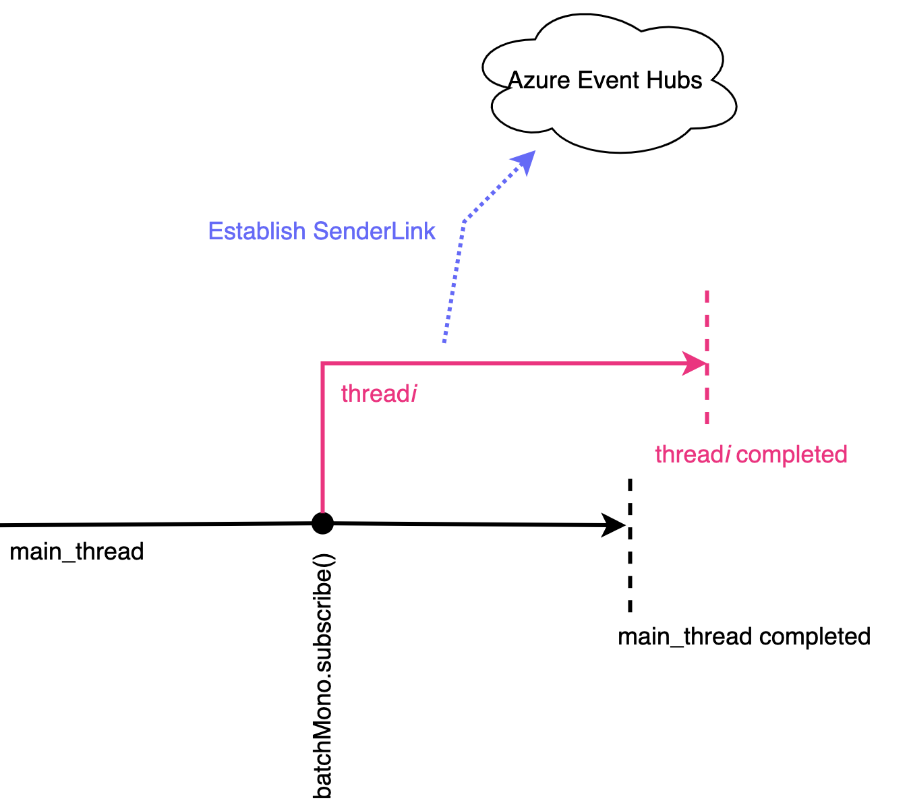
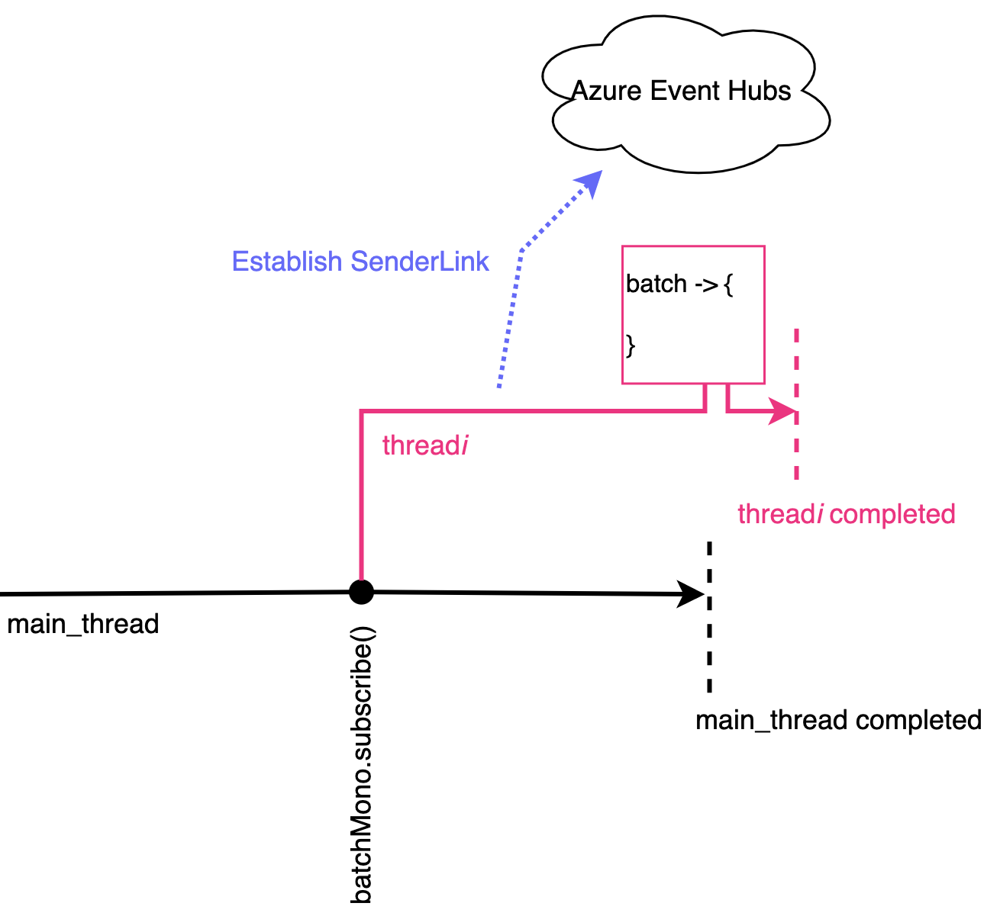
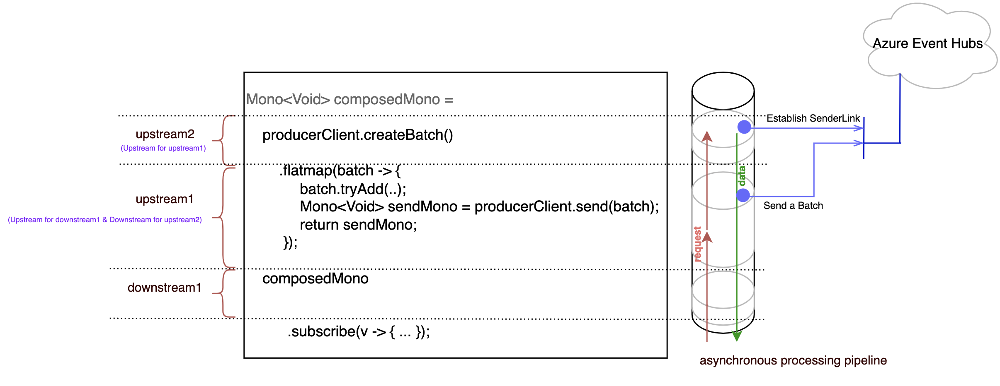
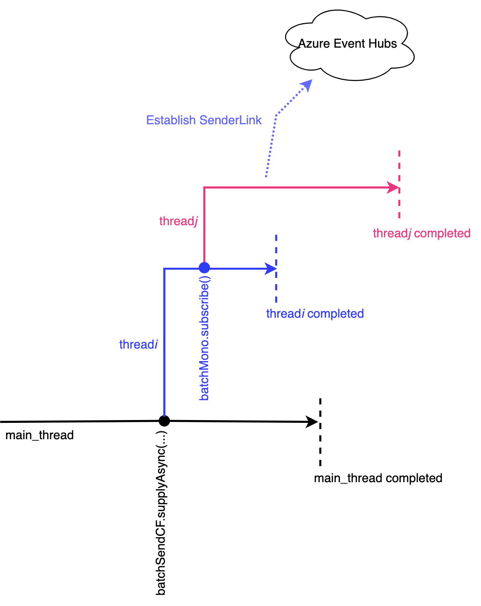

# Async programming in Event Hubs

The Azure SDK Java libraries use project Reactor Reactive APIs to enable the async APIs. This document uses Event Hubs send scenario as an example to walk through the Reactive API. It covers the Reactive concepts - subscription, asynchronous processing pipeline, upstream, downstream, data flow, and backpressure.

Additionally, this document covers bridging two async paradigms - Reactive APIs to CompletableFuture APIs.

## Creating the client

The first step is to obtain the producer (sender) async client.

```java
EventHubProducerAsyncClient producerClient = new EventHubClientBuilder()
    .connectionString(System.getenv("EH_CON_STR"), System.getenv("EH_NAME"))
    .buildAsyncProducerClient();
```

## The Mono - representation of async work

Now that we have the `producerClient` let's start exploring how to use Reactive APIs and types to send a batch of messages to the Event Hubs.

```java
Mono<EventDataBatch> batchMono = producerClient.createBatch();
```

The `EventDataBatch` is the in-memory object to which the application can add the events to be sent to Event Hubs as a batch.

The library has to do some _work_ before it creates and gives `EventDataBatch` object to the application. The _work_ involves negotiating with the Event Hubs service to establish an endpoint (Amqp SenderLink) to send the batch eventually. 

> Note: The library cache and reuse the endpoints, so this _work_ may not always result in network communication each time the application needs an `EventDataBatch` object.

The `createBatch` API returns a project Reactor `Mono<EventDataBatch>` object. The `Mono` object encapsulates the above _work_.  Once the `Mono` object is "triggerred", it starts the _work_ and upon completion it emits `EventDataBatch` object.

## Triggering Mono

When using the project Reactor `Mono` object, you first need to realize that, by default, this object is lazy. The word lazy means, obtaining a `Mono` object doesn't immediately "trigger" it. The triggering has to be initiated separately.

The official Reactive term for initiating the "triggering" of a `Mono` is called "Subscribing to the `Mono`". Once "triggered", the _work_ may happen in the background (e.g., on a different thread).

There are two ways the subscription to the `Mono` object can happen - _explicit_ and _implicit_. The _explicit_ subscription occurs when the application explicitly calls `subscribe()` on the `Mono` object (we'll cover the _implicit_ subscription later in this document).

```java
Mono<EventDataBatch> batchMono = producerClient.createBatch();
batchMono.subscribe();
```



Here the async work executed and produced results in a different thread thread _i_. The thread _i_ is a forked execution and is not synchronized with the main_thread. To receive the result, the application needs to hook up a callback.

```java
Mono<EventDataBatch> batchMono = producerClient.createBatch();
batchMono.subscribe(batch -> {

});
```



## Composing async work

Often followed by an async work, the application might want to perform another async work, then another, and so on. In our example, after obtaining the `EventDataBatch` object `batch`, the application wants to use it to add some events and send them to Event Hubs.

The API to send the batch is

```java
Mono<Void> sendMono = producerClient.send(batch);
```

Note: The `batchMono` (of type Mono&lt;EventDataBatch&gt;) signals its completion by producing `EventDataBatch` as data. The declaration of `sendMono` indicates it does not produce any data (`Void`); for such `Mono` objects, we can use the `subscribe()` overload with three callback arguments, where the last callback argument is invoked upon completion.

Now one may develop the following (_incorrect_) code to compose the async calls.

```java
Mono<EventDataBatch> batchMono = producerClient.createBatch();
batchMono.subscribe(batch ->  {
    batch.tryAdd(new EventData("msg"));
    Mono<Void> sendMono = producerClient.send(batch);
    sendMono.subscribe(__ -> {}, __ -> {}, () -> { System.out.println("msg sent"); });
});
```

i.e., a `subscribe()` call nested inside another; while this works, it's not the right way of writing a reactive program. 

> When you see nested subscribe() calls or a series of subscribe() calls, often it's an anti-pattern.

The Reactor library exposes many operators to compose the async works. Let's remove the nested `subscribe()` call using a Reactor Operator `flatmap`.

```java
Mono<EventDataBatch> batchMono = producerClient.createBatch();

Mono<Void> composedMono = batchMono.flatmap(batch ->  {
    batch.tryAdd(new EventData("msg"));
    Mono<Void> sendMono = producerClient.send(batch);
    return sendMono;
});
```

The application can continue composing other async works using further Reactor operators. The Reactor operators allow chaining the async works producing an "asynchronous processing pipeline".

The entire pipeline will be still represented using a `Mono` (or `Flux`) object. In the above example, `composedMono` is a `Mono` object representing the asynchronous processing pipeline with two stages, where each stage represents an async work (stage1: create a batch, stage2: send batch).

Now the application can subscribe to the `composedMono`, which triggers the pipeline execution.

```java
composedMono.subscribe(
        __ -> {}, 
        __ -> {}, 
        () -> { System.out.println("msg sent"); });
```

## Upstream, Downstream and data flow

You will often see the terms `Upstream` and `Downstream` in the Reactive world. In simple words, in an "asynchronous processing pipeline", the `Upstream` produces the value, and `Downstream` consumes it.

The following diagram shows how the concepts such as Upstream, Downstream, "asynchronous processing pipeline" fit into the code we are already familiar with at this point.



The execution sequence of the pipeline is -

1. The `subscribe()` call on downstream1 requests that it's `Upstream` upstream1 run the async work.
2. For upstream1 to run its async work, the upstream2 should produce the batch object, a request is sent to upstream2 to run its async work.
3. There is no `Upstream` for upstream2; upstream2 executes its async work and flows the data (batch object) to its `Downstream` (== upstream1).
4. The upstream1 add message to the batch object, execute its async work, and flow the data (completion signal of the async work) to its `Downstream` (== downstream1)
5. The downstream1 flow the data (completion signal) to the callback registered via the `subscribe()` call.

In short, the asynchronous processing pipeline is a bi-directional channel with request flowing from `Downstream` to `Upstream` and data flowing from `Upstream` to `Downstream`.

Earlier it was stated that there are two ways of doing subscription - _explicit_ and _implicit_.

When the application makes an _explicit_ `subscribe()` call on the pipeline, it will result in each intermediate stage in the pipeline to subscribe to the stage above it (inside the operator resulting _implicit_ subscription). E.g., the `flatmap` operator does an _implicit_ subscription to Mono returned from `createBatch` API.

## Repeating asynchronous processing pipeline

Now that we have a pipeline defined to send one message, how can we leverage it to send multiple messages?

One might come up with the below code (_incorrect_) that uses "imperative for-loop" to make a series of N `subscribe()` calls on the pipeline.


```java
for (int i = 0; i < N; i++) {
    producerClient.createBatch()
      .flatmap(batch ->  {
          batch.tryAdd(new EventData("msg#" + i));
          Mono<Void> sendMono = producerClient.send(batch);
          return sendMono;
       })
       .subscribe();
}
```

But this is not the right way to author a Reactive program; remember the earlier note 

> When you see nested `subscribe()` calls or a series of `subscribe()` calls, often it's an anti-pattern.

Another issue with "imperative for-loop" in the above code is, it "eagerly" triggers N `Mono`, attempting to start N concurrent works. When N is large, such usage can impend resource (heap, threads, network) bottlenecks and decrease the application's throughput.

### Switching from imperative to async for-loop

We can replace the "imperative for-loop" with the Reactor "range" operator (think of it as "async for-loop"); we'll add a new stage to the pipeline using the "range" operator.

```java
Mono<Void> composedMono = Flux.range(0, N)
    .flatMap(eventData -> {
        return producerClient.createBatch()
            .flatMap(batch -> {
                batch.tryAdd(new EventData("msg#" + i)); 
                return producerClient.send(batch);
            });
    })
    .then();
```

### Addressing eager triggering of Mono objects - backpressure

How will this new pipeline with "range" stage address the "eager" triggering of N `Mono`, possibly affecting the application throughput?

As stated earlier, the asynchronous processing pipeline is a bi-directional channel with request flowing from `Downstream` to `Upstream` and result flowing from `Upstream` to `Downstream`, to add to that, the pipleine allows sending multiple requests to the `Upstream`, in response to that multiple results can flow `Downstream`.

In our example, the `flatmap` can send a request through the pipeline requesting the "range" operator to produce only M values then pause (instead of "eagerly" producing N values).
The emission of those M values will start M concurrent works (one work = create batch + send batch) in the `Downstream`. Once the `flatmap` operator finds that a certain fraction of those M works
are completed, it will send another request through the pipeline requesting the "range" operator to resume and produce more values. This way of two-way communication ensures that the concurrent works (requiring system resources - heap, IO) are capped to M and eventually complete once the entire N values are emitted.

The official Reactive term for controlling the rate at which `Upstream` producing values is called "backpressure". The parameter of the `flatmap` operator that controls the "backpressure" is called "concurrency". It's named "concurrency" because it internally subscribes to M async works, "triggering" M concurrent works.
In the current version of Reactor (3.x), this is default to 256 (subject to change).
The developer may tune this parameter based on the expected workload, resource availability in the environment.

## Bridging async patterns - Reactive to CompletableFuture

As you may already know, another way of doing Async programming in Java is using `CompletableFuture`.  "Reactor" and "CompletableFuture" are two different async constructs.

### Triggering async constructs

Both `Mono` and `CompletableFuture` can represent an async work. One of the main differences is how they are "triggered" to run the async work.

The `Mono` is lazy, and the "triggering" of async work has to happen _explicitly_ via a direct `subscribe()` call or _implicitly_ if the `Mono` is an intermediate stage in the "asynchronous processing pipeline". The _implicit_ triggering happens due to _explicit_ trigger later in the `Downstream`.

The `CompletableFuture` is eager, meaning that the async work is already started or scheduled to start by the time you obtain an object of it.

### Controlling concurrency

As explained earlier, the built-in backpressure feature in Reactor's "asynchronous processing pipeline" enables controlling the concurrency as simple as setting a parameter. 

The ability to pause-resume Upstreams in the pipeline (stages) combined with the lazy nature of Mono is a powerful technique enabling Reactor's "backpressure" feature. When the critical stages (that puts pressure on heap, CPU, network) of the application is Reactive, the "backpressure" allows scaling the application well.

Unfortunately, when using `CompletableFeature`, though its chaining methods allow building the pipeline, no "backpressure" is built into it. It's on the application developer to write the necessary coordination logic (_mostly_ _complex_) to control concurrency.

### Reactor to CompletableFuture

Let's say we got an application with public APIs exposing `CompletableFuture` based async API. If the internal implementation of those public APIs uses Reactor based libraries, we need to bridge Reactor to `CompletableFuture`. 

Combining the understanding of the lazy nature of `Mono` and eager triggering nature of `CompletableFuture`, we may come up with the following code (_incorrect_)

```java
public CompletableFuture<Void> batchSend(String message) {
    CompletableFuture<Void> batchSendCF = CompletableFuture.supplyAsync(new Supplier<>() {
        @Override
        public Void get() {
            // Here some business logic to inspect the message.
            // Now send the inspected message using Reactive API.
            Mono<Void> composedMono = producerClient.createBatch()
                    .flatMap(batch -> {
                        batch.tryAdd(new EventData(message));
                        Mono<Void> sendMono = producerClient.send(batch);
                        return sendMono;
                    });

            composedMono.subscribe(); // trigger Reactive Mono
            return null;
        }
    });

    return batchSendCF;
}
```

As shown below, the _supplyAsync_ fork the execution and starts running the provided Supplier function on a thread from ForkJoinPool, thread _i_. Within the supplier, the invocation of `subscribe()` starts another forked execution running the batch and sending API in thread _j_.



From the picture, it is clear that there is no synchronization between thread _i_ and thread _j_, the thread _i_ completes before the real async work in thread _j_ completes.

The `CompletableFuture` object is unaware of the work happening in thread _j_, so it assumes the immediate termination of thread _i_ as the completion of the entire async work and marks itself as "completed", breaking the `CompletableFuture` contract.

How do we address this issue? Fortunately, the Reactive library provides functions to convert Reactor type to CompletableFuture, which takes care of everything needed to synchronize between two async patterns.

```java
public static CompletableFuture<Void> batchSend(String message) {
    Mono<Void> composedMono = producerClient.createBatch()
            .flatMap(batch -> {
                batch.tryAdd(new EventData(message));
                Mono<Void> sendMono = producerClient.send(batch);
                return sendMono;
            });
    return composedMono.toFuture();
}
```

Now that we know how to bride correctly, let's see how some public API consumers scenarios will be impacted had we used `subscribe()` within CompletableFuture.

1. If the consumer of the public API wants to run an async work after sending the message, they will chain their async work to the returned `CompletableFuture`. Since public API broke the contract, the new async work will run along with batch-send async work, leading to unexpected behavior.

2. Sometimes the consumer might want to cancel the in-progress async work initiated by the public API. Since there is no synchronization between Reactor async work and `CompletableFuture`, the cancellation signal will never be propagated. The consumer may assume operation gets canceled and could kick off more async work, leading to many coexisting orphaned async work, consuming resources, and leading to crash / OOM.

3. The below code shows how someone would use our `CompletableFuture` public API  to send messages concurrently. The messages are sent group by group.  One group makes `maxConcurrency` calls. The logic ensures that only one group is active, which puts a cap on concurrency. If we break the `CompletableFuture` contract in public API, it is easy to imagine how the following code can result in too much concurrency putting pressure on system resources.

```java
public static CompletableFuture<Void> sendAll(final int pending, final int maxConcurrency) {
    if (pending <= 0) {
        return CompletableFuture.completedFuture(null);
    }

    final int concurrency = pending < maxConcurrency ? pending : maxConcurrency;
    return doConcurrentSend(concurrency)
            // wait for the concurrent calls to completes..
            .thenCompose(new Function<Void, CompletionStage<Void>>() {
                @Override
                public CompletionStage<Void> apply(Void ignored) {
                    // ..then send another group concurrently
                    final int nextPending = pending - concurrency;
                    return sendAll(nextPending, maxConcurrency);
                }
            });
}
```

```java

public static CompletableFuture<Void> doConcurrentSend(final int concurrency) {
    final List<CompletableFuture<Void>> concurrentFutures = new ArrayList<>();

    for (int i = 0; i < concurrency; i++) {
        final CompletableFuture<Void> future = batchSend("msg#" + UUID.randomUUID());
        concurrentFutures.add(future);
    }

    final CompletableFuture<Void> composedFuture
            = CompletableFuture.allOf(concurrentFutures.toArray(CompletableFuture[]::new));

    return composedFuture;
}
```

## Reference

[Azure SDK Blog on Introduction to Reactive Programming][azsdkreactiveintro]

[Project Reactor Offical documentation][projectreactor]

<!-- Links --->
[azsdkreactiveintro]: https://devblogs.microsoft.com/azure-sdk/async-programming-with-project-reactor/
[projectreactor]: https://projectreactor.io/docs/core/release/reference/