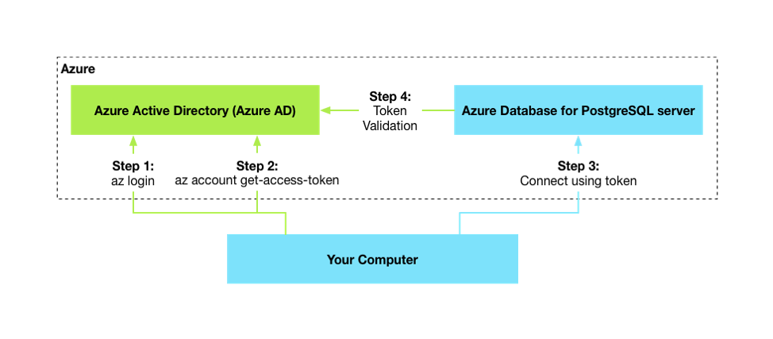
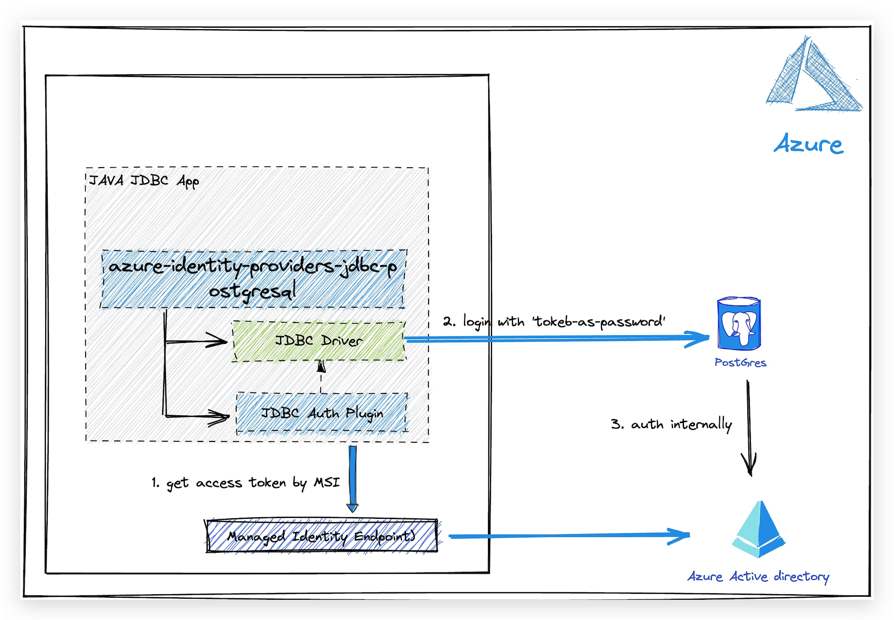

- [Azure identity JDBC PostgreSQL plugin library for Java](#azure-identity-jdbc-postgresql-plugin-library-for-java)
  - [Getting started](#getting-started)
    - [Prerequisites](#prerequisites)
    - [Include the package](#include-the-package)
      - [Include direct dependency](#include-direct-dependency)
    - [Prepare the Azure Database for PostgreSQL](#prepare-the-azure-database-for-postgresql)
      - [Prepare the working environment](#prepare-the-working-environment)
      - [Create an Azure Database for PostgreSQL server](#create-an-azure-database-for-postgresql-server)
      - [Configure a firewall rule for your PostgreSQL server](#configure-a-firewall-rule-for-your-postgresql-server)
      - [Enable Microsoft Entra-based authentication](#enable-azure-ad-based-authentication)
  - [Key concepts](#key-concepts)
    - [Microsoft Entra authentication with PostgreSQL](#azure-ad-authentication-with-postgresql)
    - [Architecture](#architecture)
    - [Token as password](#token-as-password)
  - [Examples](#examples)
    - [Authenticating with DefaultAzureCredential](#authenticating-with-defaultazurecredential)
    - [Connect using managed identity](#connect-using-managed-identity)
    - [Connect using service principal](#connect-using-service-principal)
    - [Cloud Configuration](#cloud-configuration)
    - [Customize Credential](#customize-credential)
      - [Customize CredentialProvider](#customize-credentialprovider)
      - [Configure CredentialProvider](#configure-credentialprovider)
  - [JDBC Parameters](#jdbc-parameters)
  - [Troubleshooting](#troubleshooting)
  - [Next steps](#next-steps)
  - [Contributing](#contributing)

# Azure identity JDBC PostgreSQL plugin library for Java

This package contains the JDBC authentication plugin to authenticate with Microsoft Entra ID for Azure-hosted PostgreSQL databases.

[Source code][postgresql_source] | [API reference documentation][docs] | [Product documentation][postgresql_product_docs]
| [Quickstart][quick_start_postgresql]

## Getting started

### Prerequisites

- An Azure account with an active subscription. [Create an account for free](https://azure.microsoft.com/free/).
- [Java Development Kit (JDK)][jdk] with version 8 or above.
- [Apache Maven](https://maven.apache.org/download.cgi).
- Azure Database for PostgreSQL instance.
    - Step-by-step guide for [creating a PostgreSQL instance using the Azure Portal](https://learn.microsoft.com/azure/postgresql/single-server/quickstart-create-server-database-portal)

### Include the package

The package is not part of the `azure-sdk-bom` now, so it can only be included via a direct dependency.

#### Include direct dependency

[//]: # ({x-version-update-start;com.azure:azure-identity-extensions;current})

```xml

<dependency>
    <groupId>com.azure</groupId>
    <artifactId>azure-identity-extensions</artifactId>
    <version>1.1.18</version> 
</dependency>
```

[//]: # ({x-version-update-end})

### Prepare the Azure Database for PostgreSQL

#### Prepare the working environment

First, use the following command to set up some environment variables.

```bash
export AZ_RESOURCE_GROUP=database-workshop
export AZ_DATABASE_NAME={YOUR_DATABASE_NAME}
export AZ_LOCATION={YOUR_AZURE_REGION}
export AZ_POSTGRESQL_AD_ADMIN_USERNAME=demo@tenant.com
export AZ_POSTGRESQL_AD_NON_ADMIN_USERNAME={YOUR_POSTGRESQL_AD_NON_ADMIN_USERNAME}
export AZ_LOCAL_IP_ADDRESS={YOUR_LOCAL_IP_ADDRESS}
```

Replace the placeholders with the following values, which are used throughout this article:

- ${YOUR_DATABASE_NAME}: The name of your PostgreSQL server. It should be unique across Azure.
- ${YOUR_AZURE_REGION}: The Azure region you'll use. You can use eastus by default, but we recommend that you configure a
  region closer to where you live. You can have the full list of available regions by entering az account
  list-locations.
- ${YOUR_POSTGRESQL_AD_NON_ADMIN_USERNAME}: The username of your PostgreSQL database server. Make ensure the username is
  a valid user in your Microsoft Entra tenant.
- ${YOUR_LOCAL_IP_ADDRESS}: The IP address of your local computer, from which you'll run your Spring Boot application.
  One convenient way to find it is to point your browser to [whatismyip.akamai.com][whatismyip.akamai.com].

#### Create an Azure Database for PostgreSQL server

```Azure CLI
az postgres server create \
    --resource-group $AZ_RESOURCE_GROUP \
    --name $AZ_DATABASE_NAME \
    --location $AZ_LOCATION \
    --sku-name B_Gen5_1 \
    --storage-size 5120 \
    --output tsv
```

#### Configure a firewall rule for your PostgreSQL server

If you are going to connect to the PostgreSQL server from local machine, you need to create a firewall rule to enable
it.

```Azure CLI
az postgres server firewall-rule create \
    --resource-group $AZ_RESOURCE_GROUP \
    --name $AZ_DATABASE_NAME-database-allow-local-ip \
    --server $AZ_DATABASE_NAME \
    --start-ip-address $AZ_LOCAL_IP_ADDRESS \
    --end-ip-address $AZ_LOCAL_IP_ADDRESS \
    --output tsv
```

#### Enable Microsoft Entra ID-based authentication

To use Microsoft Entra access with Azure Database for PostgreSQL, you should set the Microsoft Entra admin user first.
Only a Microsoft Entra admin user can create/enable users for Microsoft Entra-based authentication.

```Azure CLI
az postgres server ad-admin create \
    --resource-group $AZ_RESOURCE_GROUP \
    --server-name $AZ_DATABASE_NAME \
    --display-name $AZ_POSTGRESQL_AD_ADMIN_USERNAME \
    --object-id `(az ad signed-in-user show --query id -o tsv)`
```

## Key concepts

### Microsoft Entra authentication with PostgreSQL

Microsoft Entra authentication is a mechanism of connecting to Azure Database for PostgreSQL
using identities defined in Microsoft Entra ID. With Microsoft Entra authentication, you can manage database user identities and other
Microsoft services in a central location, which simplifies permission management.

The following high-level diagram summarizes how authentication works using Microsoft Entra authentication with Azure Database
for PostgreSQL. The arrows indicate communication pathways.



To learn more about using Microsoft Entra ID with PostgreSQL, see (Use Microsoft Entra ID for authenticating with
PostgreSQL)[Use Microsoft Entra ID for authenticating with PostgreSQL].

### Architecture

This picture shows how the JDBC authentication plugin for PostgreSQL authenticating with managed identity.



1. The JDBC auth plugin will get an access token from Microsoft Entra ID.
2. The JDBC driver will take the token obtained from step 1 as the password ( `token as password`) to connect with the PostgreSQL server.
3. The PostgreSQL server will check the access token and authenticate internally.

### Token as password

Instead of using a password directly, using a token as the password is recommended. Access tokens can have restricted permissions and expiration time. From a security point of view, using shorter-lived access tokens is much safer than using a password.


## Examples

### Authenticating with DefaultAzureCredential

```java
Properties properties=new Properties();
properties.put("sslmode","require");
properties.put("authenticationPluginClassName","com.azure.identity.extensions.jdbc.postgresql.AzurePostgresqlAuthenticationPlugin");
properties.put("user","${YOUR_POSTGRESQL_USERNAME}@${AZ_DATABASE_NAME}");
String url="${YOUR_JDBC_URL}";
Connection connection=DriverManager.getConnection(url,properties);
```

### Connect using managed identity

```java
Properties properties=new Properties();
properties.put("sslmode","require");
properties.put("authenticationPluginClassName","com.azure.identity.extensions.jdbc.postgresql.AzurePostgresqlAuthenticationPlugin");
properties.put("azure.managedIdentityEnabled","true");
properties.put("user","${YOUR_POSTGRESQL_USERNAME}@${AZ_DATABASE_NAME}");
String url="${YOUR_JDBC_URL}";
Connection connection=DriverManager.getConnection(url,properties);
```

### Connect using service principal

```java
Properties properties=new Properties();
properties.put("sslmode","require");
properties.put("authenticationPluginClassName","com.azure.identity.extensions.jdbc.postgresql.AzurePostgresqlAuthenticationPlugin");
properties.put("azure.clientId","${YOUR_CLIENT_ID}");
properties.put("azure.clientSecret","${YOUR_CLIENT_SECRET}");
properties.put("azure.tenantId","${YOUR_TENANT_ID}");
properties.put("user","${YOUR_POSTGRESQL_USERNAME}@${AZ_DATABASE_NAME}");
String url="${YOUR_JDBC_URL}";

Connection connection=DriverManager.getConnection(url,properties);
```

### Cloud Configuration

Credentials default to authenticating to the Microsoft Entra endpoint for Azure Public Cloud. To access resources
in other clouds, such as Azure Government or a private cloud, configure credentials with the `azure.authorityHost`
argument. [AzureAuthorityHosts](https://learn.microsoft.com/java/api/com.azure.identity.azureauthorityhosts?view=azure-java-stable)
defines authorities for well-known clouds:

```java
Properties properties=new Properties();
properties.put("sslmode","require");
properties.put("authenticationPluginClassName","com.azure.identity.extensions.jdbc.postgresql.AzurePostgresqlAuthenticationPlugin");
properties.put("azure.managedIdentityEnabled","true");
properties.put("user","${YOUR_POSTGRESQL_USERNAME}@${AZ_DATABASE_NAME}");
properties.put("azure.authorityHost",AzureAuthorityHosts.AZURE_GOVERNMENT);
String url="${YOUR_JDBC_URL}";

Connection connection=DriverManager.getConnection(url,properties);
```


### Customize Credential

By default, the JDBC authentication plugin will authenticate with built-in credentials, but users can also authenticate with their credentials by providing customized `TokenCredentialProvider`.

#### Customize CredentialProvider

Create a class called **InteractiveBrowserCredentialProvider.java** which implements **TokenCredentialProvider**:

```java
public class InteractiveBrowserCredentialProvider implements TokenCredentialProvider {

    public InteractiveBrowserCredentialProvider(TokenCredentialProviderOptions options) {
    }

    @Override
    public TokenCredential get() {
        return new InteractiveBrowserCredentialBuilder()
                .build();
    }
}

```

#### Configure CredentialProvider

```java
Properties properties=new Properties();
properties.put("sslmode","require");
properties.put("authenticationPluginClassName","com.azure.identity.extensions.jdbc.postgresql.AzurePostgresqlAuthenticationPlugin");
properties.put(AuthProperty.TOKEN_CREDENTIAL_PROVIDER_CLASS_NAME.getPropertyKey(), InteractiveBrowserCredentialProvider.class.getCanonicalName());
properties.put("user","${YOUR_POSTGRESQL_USERNAME}@${AZ_DATABASE_NAME}");
String url="${YOUR_JDBC_URL}";

Connection connection=DriverManager.getConnection(url,properties);
```

## JDBC Parameters

| Parameter Key                          | Description|
|----------------------------------------|---|
| azure.clientId                         |Client ID to use when performing service principal authentication with Azure.|
| azure.clientSecret                     |Client secret to use when performing service principal authentication with Azure.|
| azure.clientCertificatePath            |Path of a PEM/PFX certificate file to use when performing service principal authentication with Azure.|
| azure.clientCertificatePassword        |Password of the certificate file.|
| azure.username                         |Username to use when performing username/password authentication with Azure.|
| azure.password                         |Password to use when performing username/password authentication with Azure.|
| azure.managedIdentityEnabled           |Whether to enable managed identity to authenticate with Azure.|
| azure.authorityHost                    |The well known authority hosts for the Azure Public Cloud and sovereign clouds.|
| azure.tenantId                         |Tenant ID for Azure resources.|
| azure.claims                           |Claims for Azure resources.|
| azure.scopes                           |Scopes for Azure resources.|
| azure.accessTokenTimeoutInSeconds      |Max time to get an access token.|
| azure.tokenCredentialProviderClassName |The canonical class name of a class that implements 'TokenCredentialProvider'.|
| azure.tokenCredentialBeanName          |The given bean name of a TokenCredential bean in the Spring context.|

## Troubleshooting

If you encounter any bugs, please file issues via [Issues](https://github.com/Azure/azure-sdk-for-java/issues).

## Next steps

## Contributing

For details on contributing to this repository, see
the [contributing guide](https://github.com/Azure/azure-sdk-for-java/blob/main/CONTRIBUTING.md).

1. Fork it
1. Create your feature branch (`git checkout -b my-new-feature`)
1. Commit your changes (`git commit -am 'Add some feature'`)
1. Push to the branch (`git push origin my-new-feature`)
1. Create new Pull Request

<!-- LINKS -->

[jdk]: https://learn.microsoft.com/java/azure/jdk/
[azure_subscription]: https://azure.microsoft.com/free/
[postgresql_source]: https://github.com/Azure/azure-sdk-for-java/tree/main/sdk/identity/azure-identity-extensions
[docs]: https://azure.github.io/azure-sdk-for-java/
[postgresql_product_docs]: https://learn.microsoft.com/azure/postgresql/single-server/overview
[quick_start_postgresql]: https://aka.ms/passwordless/quickstart/postgresql
[Use Microsoft Entra ID for authenticating with PostgreSQL]:https://learn.microsoft.com/azure/postgresql/single-server/concepts-azure-ad-authentication
[whatismyip.akamai.com]: https://whatismyip.akamai.com/
