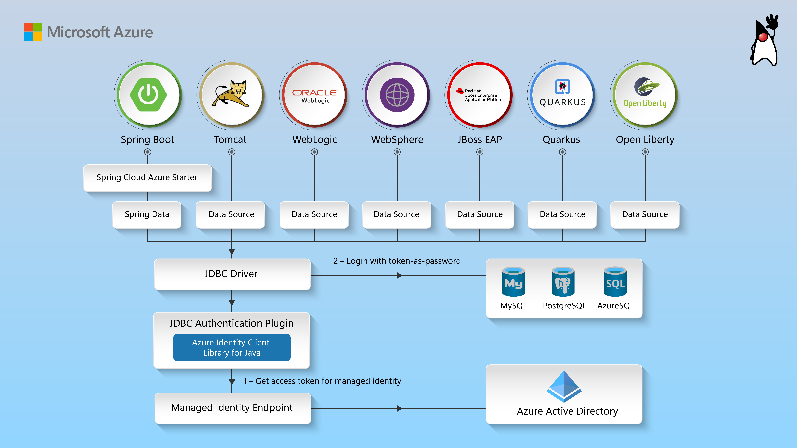

- [Azure identity authentication extensions plugin library for Java](#azure-identity-authentication-extensions-plugin-library-for-java)
  - [Getting started](#getting-started)
    - [Prerequisites](#prerequisites)
  - [Key concepts](#key-concepts)
  - [Architecture](#architecture)
    - [Authenticating with JDBC](#authenticating-with-jdbc)
  - [Examples](#examples)
  - [Troubleshooting](#troubleshooting)
  - [Next steps](#next-steps)
  - [Contributing](#contributing)
    
# Azure identity authentication extensions plugin library for Java

This package contains authentication extensions to get a token from Microsoft Entra ID for Azure services, like Azure Database for MySQL.

## Getting started

### Prerequisites

- An Azure account with an active subscription. [Create an account for free](https://azure.microsoft.com/free/).
- [Java Development Kit (JDK)][jdk] with version 8 or above.
- [Apache Maven](https://maven.apache.org/download.cgi).

## Key concepts

Azure Identity Extensions contains a common template framework for users to get a token from Microsoft Entra ID and
use the token as a password. For example, to connect Azure hosted MySQL, get a token from Microsoft Entra ID and use the
token as a password to connect with MySQL.

## Architecture

### Authenticating with JDBC

This picture shows how the JDBC authentication plugins provided by Azure Identity Extensions authenticate with managed identity.

## Examples
For documentation on how to use this package, please refer to [Quickstart:Use Java and JDBC with Azure Database for MySQL](https://aka.ms/passwordless/quickstart/mysql) and [Quickstart:Use Java and JDBC with Azure Database for PostgreSQL](https://aka.ms/passwordless/quickstart/postgresql).

## Troubleshooting
If you encounter any bugs, please file issues via [Issues](https://github.com/Azure/azure-sdk-for-java/issues).

## Next steps
Other useful docs are:
* [With Azure Database for MySQL][azure-identity-extensions-jdbc-mysql]:  Azure identity extensions for Azure Database for MySQL.
* [With Azure Database for PostgreSQL][azure-identity-extensions-jdbc-postgresql]:  Azure identity extensions for Azure Database for PostgreSQL.

## Contributing

For details on contributing to this repository, see the [contributing guide](https://github.com/Azure/azure-sdk-for-java/blob/main/CONTRIBUTING.md).

<!-- LINKS -->
[jdk]: https://learn.microsoft.com/java/azure/jdk/
[azure-identity-extensions-jdbc-mysql]: https://github.com/Azure/azure-sdk-for-java/tree/main/sdk/identity/azure-identity-extensions/Azure-Database-for-MySQL-README.md
[azure-identity-extensions-jdbc-postgresql]: https://github.com/Azure/azure-sdk-for-java/tree/main/sdk/identity/azure-identity-extensions/Azure-Database-for-PostgreSQL-README.md
