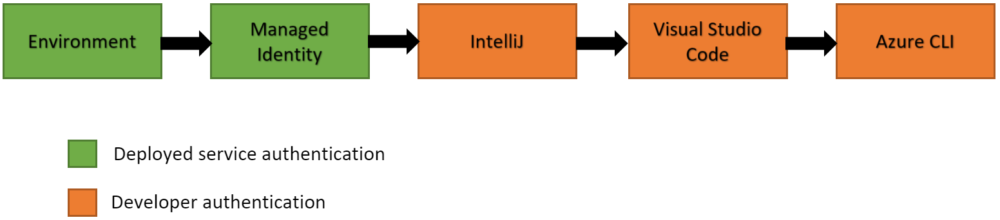

# Azure Identity shared library for Java
The Azure Identity library provides Azure Active Directory token authentication support across the Azure SDK. It provides a set of TokenCredential implementations which can be used to construct Azure SDK clients which support AAD token authentication.

 This library currently supports:
  - [Service principal authentication](https://docs.microsoft.com/azure/active-directory/develop/app-objects-and-service-principals)
  - [Managed identity authentication](https://docs.microsoft.com/azure/active-directory/managed-identities-azure-resources/overview)
  - [Device code authentication](https://docs.microsoft.com/azure/active-directory/develop/v2-oauth2-device-code)
  - Interactive browser authentication, based on [OAuth2 authentication code](https://docs.microsoft.com/azure/active-directory/develop/v2-oauth2-auth-code-flow)
  - [Username + password authentication](https://docs.microsoft.com/en-us/azure/active-directory/develop/v2-oauth-ropc)
  - IntelliJ authentication, with the login information saved in Azure Toolkit for IntelliJ
  - Visual Studio Code authentication, with the login information saved in Azure plugin for Visual Studio Code
  - Azure CLI authentication, with the login information saved in Azure CLI
  - Shared Token Cache credential, which shares login information with Visual Studio, Azure CLI, and more

  [Source code][source] | [API reference documentation][javadoc] | [Azure Active Directory documentation][aad_doc]

## Getting started
### Include the package

Maven dependency for Azure Secret Client library. Add it to your project's pom file.

[//]: # ({x-version-update-start;com.azure:azure-identity;current})
```xml
<dependency>
    <groupId>com.azure</groupId>
    <artifactId>azure-identity</artifactId>
    <version>1.0.9</version>
</dependency>
```
[//]: # ({x-version-update-end})

### Prerequisites
* [Java Development Kit (JDK)][jdk] with version 8 or above
* An [Azure subscription][azure_sub].
* The Azure CLI can also be useful for authenticating in a development environment, creating accounts, and managing account roles.

### Authenticate the client

When debugging and executing code locally it is typical for a developer to use their own account for authenticating calls to Azure services. There are several developer tools which can be used to perform this authentication in your development environment:

- [Azure Toolkit for IntelliJ](https://github.com/Azure/azure-sdk-for-java/wiki/Set-up-Your-Environment-for-Authentication#sign-in-azure-toolkit-for-intellij-for-intellijcredential)
- [Visual Studio Code Azure Account Extension](https://github.com/Azure/azure-sdk-for-java/wiki/Set-up-Your-Environment-for-Authentication#sign-in-visual-studio-code-azure-account-extension-for-visualstudiocodecredential)
- [Azure CLI](https://github.com/Azure/azure-sdk-for-java/wiki/Set-up-Your-Environment-for-Authentication#sign-in-azure-cli-for-azureclicredential)
- [Visual Studio 2019 (Shared token cache)](https://github.com/Azure/azure-sdk-for-java/wiki/Set-up-Your-Environment-for-Authentication#enable-applications-for-shared-token-cache-credential)

Click on each item above to learn about how to configure them for Azure Identity authentication.

## Key concepts
### Credentials

A credential is a class which contains or can obtain the data needed for a service client to authenticate requests. Service clients across Azure SDK accept credentials when they are constructed and use those credentials to authenticate requests to the service.Azure Identity offers a variety of credential classes in the `azure-identity` package capable of acquiring an AAD token. All of these credential classes are implementations of the `TokenCredential` abstract class in [Azure Core][azure_core_library], and can be used by any service client which can be constructed with a `TokenCredential`.

The credential types in Azure Identity differ in the types of AAD identities they can authenticate and how they are configured:
        
<table border="1">
  <thead>
    <tr>
      <th>credential class</th>
      <th>identity</th>
      <th>configuration</th>
    </tr>
  </thead>
  <tbody>
    <tr>
      <td><code>DefaultAzureCredential</code></td>
      <td>service principal, user account, or managed identity</td>
      <td><a href="#environment-variables">environment variables</a> for service principal, optional for managed identities or shared token cache</td>
    </tr>
    <tr>
      <td><code>ManagedIdentityCredential</code></td>
      <td>managed identity</td>
      <td><code>ManagedIdentityCredentialBuilder</code></td>
    </tr>
    <tr>
      <td><code>EnvironmentCredential</code></td>
      <td>service principal or user account</td>
      <td><a href="#environment-variables">environment variables</a></td>
    </tr>
    <tr>
      <td><code>ClientSecretCredential</code></td>
      <td>service principal</td>
      <td><code>ClientSecretCredentialBuilder</code></td>
    </tr>
    <tr>
      <td><code>ClientCertificateCredential</code></td>
      <td>service principal</td>
      <td><code>ClientCertificateCredentialBuilder</code></td>
    </tr>
    <tr>
      <td><code>DeviceCodeCredential</code></td>
      <td>user account</td>
      <td><code>DeviceCodeCredentialBuilder</code></td>
    </tr>
    <tr>
      <td><code>InteractiveBrowserCredential</code></td>
      <td>user account</td>
      <td><code>InteractiveBrowserCredentialBuilder</code></td>
    </tr>
    <tr>
      <td><code>UsernamePasswordCredential</code></td>
      <td>user account</td>
      <td><code>UsernamePasswordCredentialBuilder</code></td>
    </tr>
    <tr>
      <td><code>AzureCliCredential</code></td>
      <td>service principal or user account</td>
      <td><code>AzureCliCredentialBuilder</code></td>
    </tr>
    <tr>
      <td><code>VisualStudioCodeCredential</code></td>
      <td>user account</td>
      <td><code>VisualStudioCodeCredentialBuilder</code></td>
    </tr>
    <tr>
      <td><code>IntelliJCredential</code></td>
      <td>user account</td>
      <td><code>IntelliJCredentialBuilder</code></td>
    </tr>
  </tbody>
</table>

Credentials can be chained together to be tried in turn until one succeeds using the `ChainedTokenCredential`; see [chaining credentials](#chaining-credentials) for details.

### DefaultAzureCredential
The `DefaultAzureCredential` is appropriate for most scenarios where the application is intended to ultimately be run in the Azure Cloud. This is because the `DefaultAzureCredential` combines credentials commonly used to authenticate when deployed, with credentials used to authenticate in a development environment. The `DefaultAzureCredential` will attempt to authenticate via the following mechanisms in order.



 - Environment - The `DefaultAzureCredential` will read account information specified via [environment variables](#Enviornment-variables) and use it to authenticate.
 - Managed Identity - If the application is deployed to an Azure host with Managed Identity enabled, the `DefaultAzureCredential` will authenticate with that account.
 - IntelliJ - If the developer has authenticated via Azure Toolkit for IntelliJ, the `DefaultAzureCredential` will authenticate with that account.
 - Visual Studio Code - If the developer has authenticated via the Visual Studio Code Azure Account plugin, the `DefaultAzureCredential` will authenticate with that account.
 - Azure CLI - If the developer has authenticated an account via the Azure CLI `az login` command, the `DefaultAzureCredential` will authenticate with that account.
 - Interactive - If enabled the `DefaultAzureCredential` will interactively authenticate the developer via the current system's default browser.

### Environment variables

`DefaultAzureCredential` and `EnvironmentCredential` are configured for service
principal authentication with these environment variables:

|variable name|value
|-|-
|`AZURE_CLIENT_ID`|service principal's app id
|`AZURE_TENANT_ID`|id of the principal's Azure Active Directory tenant
|`AZURE_CLIENT_SECRET`|one of the service principal's client secrets

See more about how to create a service principal and get these values in [Creating a Service Principal with the Azure CLI](#creating-a-service-principal-with-the-azure-cli).

## Examples
You can find more examples of using various credentials in [Azure Identity Examples Wiki page](https://github.com/Azure/azure-sdk-for-java/wiki/Azure-Identity-Examples). 

### Authenticating with `DefaultAzureCredential`
This example demonstrates authenticating the `SecretClient` from the [azure-security-keyvault-secrets][secrets_client_library] client library using the `DefaultAzureCredential`. There's also [a compilable sample](../../keyvault/azure-security-keyvault-secrets/src/samples/java/com/azure/security/keyvault/secrets/IdentityReadmeSamples.java) to create a Key Vault secret client you can copy-paste.

<!-- embedme ../../keyvault/azure-security-keyvault-secrets/src/samples/java/com/azure/security/keyvault/secrets/IdentityReadmeSamples.java#L38-L50 -->
```java
/**
 * The default credential first checks environment variables for configuration.
 * If environment configuration is incomplete, it will try managed identity.
 */
public void createDefaultAzureCredential() {
    DefaultAzureCredential defaultCredential = new DefaultAzureCredentialBuilder().build();

    // Azure SDK client builders accept the credential as a parameter
    SecretClient client = new SecretClientBuilder()
        .vaultUrl("https://{YOUR_VAULT_NAME}.vault.azure.net")
        .credential(defaultCredential)
        .buildClient();
}
```

See more how to configure the `DefaultAzureCredential` on your workstation or Azure in [Configure DefaultAzureCredential](#configure-defaultazurecredential).

### Authenticating a user account with IntelliJ IDEA
This example demonstrates authenticating the `KeyClient` from the [azure-security-keyvault-keys][keys_client_library] client library using the `IntelliJCredential` on a workstation with IntelliJ IDEA installed, and the user has signed in with an Azure account.

See more about how to configure your IntelliJ IDEA in [Sign in Azure Toolkit for IntelliJ for IntelliJCredential](#sign-in-azure-toolkit-for-intellij-for-intellijcredential).

<!-- embedme ../../keyvault/azure-security-keyvault-secrets/src/samples/java/com/azure/security/keyvault/secrets/IdentityReadmeSamples.java#L174-L188 -->
```java
/**
 * Authenticate with IntelliJ IDEA.
 */
public void createIntelliJCredential() {
    IntelliJCredential intelliJCredential = new IntelliJCredentialBuilder()
        // KeePass configuration required only for Windows. No configuration needed for Linux / Mac
        .keePassDatabasePath("C:\\Users\\user\\AppData\\Roaming\\JetBrains\\IdeaIC2020.1\\c.kdbx")
        .build();

    // Azure SDK client builders accept the credential as a parameter
    SecretClient client = new SecretClientBuilder()
        .vaultUrl("https://{YOUR_VAULT_NAME}.vault.azure.net")
        .credential(intelliJCredential)
        .buildClient();
}
```

## Troubleshooting
Credentials raise exceptions when they fail to authenticate. `ClientAuthenticationException` has a `message` attribute which
describes why authentication failed. When raised by `ChainedTokenCredential`, the message collects error messages from each credential in the chain.

## Next steps
Currently the following client libraries support authenticating with `TokenCredential` and the Azure Identity library.  You can learn more about their use, and find additional documentation on use of these client libraries along samples with can be found in the links below.

- [azure-eventhubs][eventhubs_client_library]
- [azure-security-keyvault-keys][keys_client_library]
- [azure-security-keyvault-secrets][secrets_client_library]

## Contributing
This project welcomes contributions and suggestions. Most contributions require you to agree to a Contributor License Agreement (CLA) declaring that you have the right to, and actually do, grant us the rights to use your contribution. For details, visit https://cla.microsoft.com.

When you submit a pull request, a CLA-bot will automatically determine whether you need to provide a CLA and decorate the PR appropriately (e.g., label, comment). Simply follow the instructions provided by the bot. You will only need to do this once across all repos using our CLA.

This project has adopted the [Microsoft Open Source Code of Conduct][code_of_conduct]. For more information see the Code of Conduct FAQ or contact opencode@microsoft.com with any additional questions or comments.

<!-- LINKS -->
[azure_cli]: https://docs.microsoft.com/cli/azure
[azure_sub]: https://azure.microsoft.com/free/
[source]: ./
[aad_doc]: https://docs.microsoft.com/azure/active-directory/
[code_of_conduct]: https://opensource.microsoft.com/codeofconduct/
[keys_client_library]: ../../keyvault/azure-security-keyvault-keys
[secrets_client_library]: ../../keyvault/azure-security-keyvault-secrets
[eventhubs_client_library]: ../../eventhubs/azure-messaging-eventhubs
[azure_core_library]: ../../core
[javadoc]: http://azure.github.io/azure-sdk-for-java


