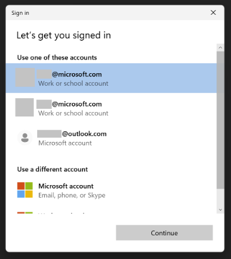

# Troubleshoot Azure Identity authentication issues

This troubleshooting guide covers failure investigation techniques, common errors for the credential types in the Azure Identity Java client library, and mitigation steps to resolve these errors.

## Table of contents
- [Handle Azure Identity exceptions](#handle-azure-identity-exceptions)
    - [ClientAuthenticationException](#clientauthenticationexception)
    - [CredentialUnavailableException](#credentialunavailableexception)
    - [Permission issues](#permission-issues)
- [Find relevant information in exception messages](#find-relevant-information-in-exception-messages)
- [Enable and configure logging](#enable-and-configure-logging)
- [Troubleshoot DefaultAzureCredential authentication issues](#troubleshoot-defaultazurecredential-authentication-issues)
- [Troubleshoot EnvironmentCredential authentication issues](#troubleshoot-environmentcredential-authentication-issues)
- [Troubleshoot ClientSecretCredential authentication issues](#troubleshoot-clientsecretcredential-authentication-issues)
- [Troubleshoot ClientCertificateCredential authentication issues](#troubleshoot-clientcertificatecredential-authentication-issues)
- [Troubleshoot UsernamePasswordCredential authentication issues](#troubleshoot-usernamepasswordcredential-authentication-issues)
- [Troubleshoot ManagedIdentityCredential authentication issues](#troubleshoot-managedidentitycredential-authentication-issues)
    - [Azure Virtual Machine Managed Identity](#azure-virtual-machine-managed-identity)
    - [Azure App Service and Azure Functions Managed Identity](#azure-app-service-and-azure-functions-managed-identity)
- [Troubleshoot VisualStudioCodeCredential authentication issues](#troubleshoot-visualstudiocodecredential-authentication-issues)
- [Troubleshoot AzureCliCredential authentication issues](#troubleshoot-azureclicredential-authentication-issues)
- [Troubleshoot AzureDeveloperCliCredential authentication issues](#troubleshoot-azuredeveloperclicredential-authentication-issues)
- [Troubleshoot AzurePowerShellCredential authentication issues](#troubleshoot-azurepowershellcredential-authentication-issues)
- [Troubleshoot WorkloadIdentityCredential authentication issues](#troubleshoot-workloadidentitycredential-authentication-issues)
- [Troubleshoot IntelliJCredential authentication issues](#troubleshoot-intellijcredential-authentication-issues)
- [Troubleshoot AzurePipelinesCredential authentication issues](#troubleshoot-azurepipelinescredential-authentication-issues)
- [Troubleshoot authentication timeout issues](#troubleshoot-authentication-timeout-issues)
- [Troubleshoot Web Account Manager (WAM) brokered authentication issues](#troubleshoot-web-account-manager-wam-brokered-authentication-issues)
- [Get additional help](#get-additional-help)

## Handle Azure Identity exceptions

### ClientAuthenticationException
Exceptions arising from authentication errors can be raised on any service client method that makes a request to the service. This is because the token is requested from the credential on the first call to the service and on any subsequent requests to the service that need to refresh the token.

To distinguish these failures from failures in the service client, Azure Identity classes raise the `ClientAuthenticationException` with details describing the source of the error in the exception message and possibly the error message. Depending on the application, these errors may or may not be recoverable.

```java
// Create a secret client using the DefaultAzureCredential
        SecretClient client = new SecretClientBuilder()
                .vaultUrl("https://myvault.vault.azure.net/")
                .credential(new DefaultAzureCredentialBuilder().build())
                .buildClient();

        try {
            KeyVaultSecret secret = client.geSecret("secret1");
        } catch (ClientAuthenticationException e) {
            //Handle Exception
            e.printStackTrace();
        }

```
### CredentialUnavailableException

The `CredentialUnavailableExcpetion` is a special exception type derived from `ClientAuthenticationException`. This exception type is used to indicate that the credential can't authenticate in the current environment, due to lack of required configuration or setup. This exception is also used as a signal to chained credential types, such as `DefaultAzureCredential` and `ChainedTokenCredential`, that the chained credential should continue to try other credential types later in the chain.

### Permission issues

Calls to service clients resulting in `HttpResponseException` with a `StatusCode` of 401 or 403 often indicate the caller doesn't have sufficient permissions for the specified API. Check the service documentation to determine which RBAC roles are needed for the specific request, and ensure the authenticated user or service principal have been granted the appropriate roles on the resource.

## Find relevant information in exception messages

`ClientAuthenticationException` is thrown when unexpected errors occurred while a credential is authenticating. This can include errors received from requests to the Microsoft Entra STS and often contains information helpful to diagnosis. Consider the following `ClientAuthenticationException` message.


This error contains several pieces of information:

- __Failing Credential Type__: The type of credential that failed to authenticate. This can be helpful when diagnosing issues with chained credential types such as `DefaultAzureCredential` or `ChainedTokenCredential`.

- __STS Error Code and Message__: The error code and message returned from the Microsoft Entra STS. This can give insight into the specific reason the request failed. For instance, in this specific case because the provided client secret is incorrect. More information on STS error codes can be found [here](https://learn.microsoft.com/entra/identity-platform/reference-error-codes#aadsts-error-codes).

- __Correlation ID and Timestamp__: The correlation ID and call Timestamp used to identify the request in server-side logs. This information can be useful to support engineers when diagnosing unexpected STS failures.

### Enable and configure logging

Azure SDK for Java offers a consistent logging story to help aid in troubleshooting application errors and expedite their resolution. The logs produced will capture the flow of an application before reaching the terminal state to help locate the root issue. View the [logging](https://learn.microsoft.com/azure/developer/java/sdk/logging-overview) documentation for guidance to enable logging.

The underlying MSAL library, MSAL4J, also has detailed logging. It is highly verbose and will include all PII including tokens. This logging is most useful when working with product support. As of v1.10.0, credentials which offer this logging will have a method called `enableUnsafeSupportLogging()`.

> CAUTION: Requests and responses in the Azure Identity library contain sensitive information. Precaution must be taken to protect logs when customizing the output to avoid compromising account security.

## Troubleshoot `DefaultAzureCredential` authentication issues

| Error |Description| Mitigation                                                                                                                                                                                                                                                                                                                                                                                                                                                                                                                                                                                                                                                                                                                                                                                                                                   |
|---|---|---|
|`CredentialUnavailableException` raised with message. "DefaultAzureCredential failed to retrieve a token from the included credentials."|All credentials in the `DefaultAzureCredential` chain failed to retrieve a token, each throwing a `CredentialUnavailableException`| <ul><li>[Enable logging](#enable-and-configure-logging) to verify the credentials being tried, and get further diagnostic information.</li><li>Consult the troubleshooting guide for underlying credential types for more information.</li><ul><li>[EnvironmentCredential](#troubleshoot-environmentcredential-authentication-issues)</li><li>[ManagedIdentityCredential](#troubleshoot-managedidentitycredential-authentication-issues)</li><li>[VisualStudioCodeCredential](#troubleshoot-visualstudiocodecredential-authentication-issues)</li><li>[AzureCLICredential](#troubleshoot-azureclicredential-authentication-issues)</li><li>[AzurePowershellCredential](#troubleshoot-azurepowershellcredential-authentication-issues)</li></ul> |
|`HttpResponseException` raised from the client with a status code of 401 or 403|Authentication succeeded but the authorizing Azure service responded with a 401 (Authenticate), or 403 (Forbidden) status code. This can often be caused by the `DefaultAzureCredential` authenticating an account other than the intended or that the intended account does not have the correct permissions or roles assigned.| <ul><li>[Enable logging](#enable-and-configure-logging) to determine which credential in the chain returned the authenticating token.</li><li>In the case a credential other than the expected is returning a token, look too bypass this by signing out of the corresponding development tool.`</li><li>Ensure that the correct role is assigned to the account being used. For example, a service specific role rather than the subscription Owner role.</li></ul>                                                                                                                                                                                                                                                                                                                                                                         |

## Troubleshoot `EnvironmentCredential` authentication issues
`CredentialUnavailableException`

| Error Message                                  | Description                                              | Mitigation                                                                                                                                                                                                                                                                                                                                                                                                                                                                                                                                                                                                                                                                                                                                                                                                                                    |
|------------------------------------------------|----------------------------------------------------------|-----------------------------------------------------------------------------------------------------------------------------------------------------------------------------------------------------------------------------------------------------------------------------------------------------------------------------------------------------------------------------------------------------------------------------------------------------------------------------------------------------------------------------------------------------------------------------------------------------------------------------------------------------------------------------------------------------------------------------------------------------------------------------------------------------------------------------------------------|
| Environment variables aren't fully configured. | A valid combination of environment variables wasn't set. | Ensure the appropriate environment variables are set **prior to application startup** for the intended authentication method.</p><ul><li>To authenticate a service principal using a client secret, ensure the variables `AZURE_CLIENT_ID`, `AZURE_TENANT_ID` and `AZURE_CLIENT_SECRET` are properly set.</li><li>To authenticate a service principal using a certificate, ensure the variables `AZURE_CLIENT_ID`, `AZURE_TENANT_ID`, `AZURE_CLIENT_CERTIFICATE_PATH` and optionally `AZURE_CLIENT_CERTIFICATE_PASSWORD` are properly set. `AZURE_CLIENT_SEND_CERTIFICATE_CHAIN` may optionally be set to send certificate chain in x5c header to support subject name / issuer based authentication.</li><li>To authenticate a user using a password, ensure the variables `AZURE_USERNAME` and `AZURE_PASSWORD` are properly set.</li></ul> |

## Troubleshoot `ClientSecretCredential` authentication issues
`ClientAuthenticationException`

| Error Code | Issue | Mitigation |
|---|---|---|
|AADSTS7000215|An invalid client secret was provided.|Ensure the `clientSecret` provided when constructing the credential is valid. If unsure, create a new client secret using the Azure portal. Details on creating a new client secret can be found [here](https://learn.microsoft.com/entra/identity-platform/howto-create-service-principal-portal#option-2-create-a-new-application-secret).|
|AADSTS7000222|An expired client secret was provided.|Create a new client secret using the Azure portal. Details on creating a new client secret can be found [here](https://learn.microsoft.com/entra/identity-platform/howto-create-service-principal-portal#option-2-create-a-new-application-secret).|
|AADSTS700016|The specified application wasn't found in the specified tenant.|Ensure the specified `clientId` and `tenantId` are correct for your application registration.  For multi-tenant apps, ensure the application has been added to the desired tenant by a tenant admin. To add a new application in the desired tenant, follow the instructions [here](https://learn.microsoft.com/entra/identity-platform/howto-create-service-principal-portal).|

## Troubleshoot `ClientCertificateCredential` authentication issues
`ClientAuthenticationException`

| Error Code | Description | Mitigation |
|---|---|---|
|AADSTS700027|Client assertion contains an invalid signature.|Ensure the specified certificate has been uploaded to the Microsoft Entra application registration. Instructions for uploading certificates to the application registration can be found [here](https://learn.microsoft.com/entra/identity-platform/howto-create-service-principal-portal#option-1-upload-a-certificate).|
|AADSTS700016|The specified application wasn't found in the specified tenant.| Ensure the specified `clientId` and `tenantId` are correct for your application registration. For multi-tenant apps, ensure the application has been added to the desired tenant by a tenant admin. To add a new application in the desired tenant, follow the instructions [here](https://learn.microsoft.com/entra/identity-platform/howto-create-service-principal-portal).|

## Troubleshoot `ClientAssertionCredential` authentication issues

### AuthenticationRequiredError

| Error Code | Description | Mitigation |
|---|---|---|
|AADSTS700021| Client assertion application identifier doesn't match 'client_id' parameter. Review the documentation at https://learn.microsoft.com/entra/identity-platform/certificate-credentials | Ensure the JWT assertion created has the correct values specified for the `sub` and `issuer` value of the payload, both of these should have the value be equal to `clientId`. Refer documentation for [client assertion format](https://learn.microsoft.com/entra/identity-platform/certificate-credentials)|
|AADSTS700023| Client assertion audience claim does not match Realm issuer. Review the documentation at https://learn.microsoft.com/entra/identity-platform/certificate-credentials. | Ensure the audience `aud` field in the JWT assertion created has the correct value for the audience specified in the payload. This should be set to `https://login.microsoftonline.com/{tenantId}/v2`.|
|AADSTS50027| JWT token is invalid or malformed. | Ensure the JWT assertion token is in the valid format. Refer to the documentation for [client assertion format](https://learn.microsoft.com/entra/identity-platform/certificate-credentials).|

## Troubleshoot `UsernamePasswordCredential` authentication issues
`ClientAuthenticationException`

| Error Code | Issue | Mitigation |
|---|---|---|
|AADSTS50126|The provided username or password is invalid|Ensure the `username` and `password` provided when constructing the credential are valid.|

## Troubleshoot `ManagedIdentityCredential` authentication issues

The `ManagedIdentityCredential` is designed to work on a variety of Azure hosts that provide managed identity. Configuring the managed identity and troubleshooting failures varies from hosts. The below table lists the Azure hosts that can be assigned a managed identity, and are supported by the `ManagedIdentityCredential`.

|Host Environment| | |
|---|---|---|
|Azure App Service and Azure Functions|[Configuration](https://learn.microsoft.com/azure/app-service/overview-managed-identity)|[Troubleshooting](#azure-app-service-and-azure-functions-managed-identity)|
|Azure Arc|[Configuration](https://learn.microsoft.com/azure/azure-arc/servers/managed-identity-authentication)||
|Azure Kubernetes Service|[Configuration](https://azure.github.io/aad-pod-identity/docs/)|[Troubleshooting](#azure-kubernetes-service-managed-identity)|
|Azure Service Fabric|[Configuration](https://learn.microsoft.com/azure/service-fabric/concepts-managed-identity)||
|Azure Virtual Machines and Scale Sets|[Configuration](https://learn.microsoft.com/entra/identity/managed-identities-azure-resources/qs-configure-portal-windows-vm)|[Troubleshooting](#azure-virtual-machine-managed-identity)|

### Azure Virtual Machine Managed Identity

`CredentialUnavailableException`

| Error Message |Description| Mitigation |
|---|---|---|
|The requested identity hasn't been assigned to this resource.|The IMDS endpoint responded with a status code of 400, indicating the requested identity isn't assigned to the VM.|If using a user assigned identity, ensure the specified `clientId` is correct.<p/><p/>If using a system assigned identity, make sure it has been enabled properly. Instructions to enable the system assigned identity on an Azure VM can be found [here](https://learn.microsoft.com/entra/identity/managed-identities-azure-resources/qs-configure-portal-windows-vm#enable-system-assigned-managed-identity-on-an-existing-vm).|
|The request failed due to a gateway error.|The request to the IMDS endpoint failed due to a gateway error, 502 or 504 status code.|Calls via proxy or gateway aren't supported by IMDS. Disable proxies or gateways running on the VM for calls to the IMDS endpoint `http://169.254.169.254/`|
|No response received from the managed identity endpoint.|No response was received for the request to IMDS or the request timed out.|<ul><li>Ensure managed identity has been properly configured on the VM. Instructions for configuring the manged identity can be found [here](https://learn.microsoft.com/entra/identity/managed-identities-azure-resources/qs-configure-portal-windows-vm).</li><li>Verify the IMDS endpoint is reachable on the VM, see [below](#verify-imds-is-available-on-the-vm) for instructions.</li></ul>|
|Multiple attempts failed to obtain a token from the managed identity endpoint.|Retries to retrieve a token from the IMDS endpoint have been exhausted.|<ul><li>Refer to inner exception messages for more details on specific failures. If the data has been truncated, more detail can be obtained by [collecting logs](https://github.com/Azure/azure-sdk-for-java/blob/main/sdk/identity/azure-identity/README.md#enable-client-logging).</li><li>Ensure managed identity has been properly configured on the VM. Instructions for configuring the manged identity can be found [here](https://learn.microsoft.com/entra/identity/managed-identities-azure-resources/qs-configure-portal-windows-vm).</li><li>Verify the IMDS endpoint is reachable on the VM, see [below](#verify-imds-is-available-on-the-vm) for instructions.</li></ul>|

#### Verify IMDS is available on the VM

If you have access to the VM, you can verify the manged identity endpoint is available via the command line using curl.

```bash
curl 'http://169.254.169.254/metadata/identity/oauth2/token?resource=https://management.core.windows.net&api-version=2018-02-01' -H "Metadata: true"
```
> Note that output of this command will contain a valid access token, and SHOULD NOT BE SHARED to avoid compromising account security.
### Azure App Service and Azure Functions Managed Identity
`CredentialUnavailableException`

| Error Message |Description| Mitigation |
|---|---|---|
|ManagedIdentityCredential authentication unavailable.|The environment variables configured by the App Services host weren't present.|<ul><li>Ensure the managed identity has been properly configured on the App Service. Instructions for configuring the managed identity can be found [here](https://learn.microsoft.com/azure/app-service/overview-managed-identity?tabs=dotnet).</li><li>Verify the App Service environment is properly configured and the managed identity endpoint is available. See [below](#verify-the-app-service-managed-identity-endpoint-is-available) for instructions.</li></ul>|

#### Verify the App Service Managed Identity endpoint is available

If you have access to SSH into the App Service, you can verify managed identity is available in the environment. First ensure the environment variables `MSI_ENDPOINT` and `MSI_SECRET` have been set in the environment. Then you can verify the managed identity endpoint is available using curl.
```bash
curl 'http://169.254.169.254/metadata/identity/oauth2/token?resource=https://management.core.windows.net&api-version=2018-02-01' -H "Metadata: true"
```
> Note that the output of this command will contain a valid access token, and SHOULD NOT BE SHARED to avoid compromising account security.

### Azure Kubernetes Service Managed Identity
#### Pod Identity for Kubernetes
`CredentialUnavailableException`

| Error Message |Description| Mitigation |
|---|---|---|
|No Managed Identity endpoint found|The application attempted to authenticate before an identity was assigned to its pod|Verify the pod is labeled correctly. This also occurs when a correctly labeled pod authenticates before the identity is ready. To prevent initialization races, configure NMI to set the Retry-After header in its responses (see [Pod Identity documentation](https://azure.github.io/aad-pod-identity/docs/configure/feature_flags/#set-retry-after-header-in-nmi-response)).|

## Troubleshoot `VisualStudioCodeCredential` authentication issues

> It's a [known issue](https://github.com/Azure/azure-sdk-for-java/issues/27364) that `VisualStudioCodeCredential` doesn't work with [Azure Account extension](https://marketplace.visualstudio.com/items?itemName=ms-vscode.azure-account) versions newer than **0.9.11**. A long-term fix to this problem is in progress. In the meantime, consider [authenticating via the Azure CLI](https://github.com/Azure/azure-sdk-for-java/blob/main/sdk/identity/azure-identity/README.md#authenticating-via-development-tools).

`CredentialUnavailableException`

| Error Message |Description| Mitigation |
|---|---|---|
|Failed To Read VS Code Credentials</p></p>OR</p>Authenticate via Azure Tools plugin in VS Code|No Azure account information was found in the VS Code configuration.|<ul><li>Ensure the [Azure Account plugin](https://marketplace.visualstudio.com/items?itemName=ms-vscode.azure-account) is properly installed</li><li>Use **View > Command Palette** to execute the **Azure: Sign In** command. This command opens a browser window and displays a page that allows you to sign in to Azure.</li><li>If you already had the Azure Account extension installed and had logged in to your account, try logging out and logging in again as that will repopulate the cache and potentially mitigate the error you're getting.</li></ul>|
|MSAL Interaction Required Exception|The `VisualStudioCodeCredential` was able to read the cached credentials from the cache but the cached token is likely expired.|Log into the Azure Account extension via **View > Command Palette** to execute the **Azure: Sign In** command in the VS Code IDE.|
|ADFS tenant not supported|ADFS tenants are not currently supported by Visual Studio `Azure Service Authentication`.|Use credentials from a supported cloud when authenticating with Visual Studio. The supported clouds are:</p><ul><li>AZURE PUBLIC CLOUD - https://login.microsoftonline.com/</li><li>AZURE GERMANY - https://login.microsoftonline.de/</li><li>AZURE CHINA - https://login.chinacloudapi.cn/</li><li>AZURE GOVERNMENT - https://login.microsoftonline.us/</li></ul>|

## Troubleshoot `AzureCliCredential` authentication issues

`CredentialUnavailableException`

| Error Message |Description| Mitigation |
|---|---|---|
|Azure CLI not installed|The Azure CLI isn't installed or couldn't be found.|<ul><li>Ensure the Azure CLI is properly installed. Installation instructions can be found [here](https://learn.microsoft.com/cli/azure/install-azure-cli).</li><li>Validate the installation location has been added to the `PATH` environment variable.</li></ul>|
|Please run 'az login' to set up account|No account is currently logged into the Azure CLI, or the login has expired.|<ul><li>Log into the Azure CLI using the `az login` command. More information on authentication in the Azure CLI can be found [here](https://learn.microsoft.com/cli/azure/authenticate-azure-cli).</li><li>Validate that the Azure CLI can obtain tokens. See [below](#verify-the-azure-cli-can-obtain-tokens) for instructions.</li></ul>|

#### Verify the Azure CLI can obtain tokens

You can manually verify that the Azure CLI is properly authenticated, and can obtain tokens. First use the `account` command to verify the account which is currently logged in to the Azure CLI.

```bash
az account show
```

Once you've verified the Azure CLI is using correct account, you can validate that it's able to obtain tokens for this account.

```bash
az account get-access-token --output json --resource https://management.core.windows.net
```
>Note that output of this command will contain a valid access token, and SHOULD NOT BE SHARED to avoid compromising account security.


## Troubleshoot `AzureDeveloperCliCredential` authentication issues

`CredentialUnavailableException`

| Error Message |Description| Mitigation |
|---|---|---|
|Azure Developer CLI not installed|The Azure Developer CLI isn't installed or couldn't be found.|<ul><li>Ensure the Azure Developer CLI is properly installed. Installation instructions can be found [here](https://learn.microsoft.com/azure/developer/azure-developer-cli/install-azd).</li><li>Validate the installation location has been added to the `PATH` environment variable.</li></ul>|
|Please run 'azd auth login' to set up account|No account is currently logged into the Azure Developer CLI, or the login has expired.|<ul><li>Log into the Azure Developer CLI using the `azd auth login` command.</li><li>Validate that the Azure Developer CLI can obtain tokens. See [below](#verify-the-azure-developer-cli-can-obtain-tokens) for instructions.</li></ul>|

#### Verify the Azure Developer CLI can obtain tokens

You can manually verify that the Azure Developer CLI is properly authenticated, and can obtain tokens. First use the `config` command to verify the account which is currently logged in to the Azure Developer CLI.

```bash
azd config list
```

Once you've verified the Azure Developer CLI is using correct account, you can validate that it's able to obtain tokens for this account.

```bash
azd auth token --output json --scope https://management.core.windows.net/.default
```
>Note that output of this command will contain a valid access token, and SHOULD NOT BE SHARED to avoid compromising account security.

## Troubleshoot `AzurePowerShellCredential` authentication issues

`CredentialUnavailableException`

| Error Message |Description| Mitigation |
|---|---|---|
|PowerShell isn't installed.|No local installation of PowerShell was found.|Ensure that PowerShell is properly installed on the machine. Instructions for installing PowerShell can be found [here](tps://learn.microsoft.com/powershell/scripting/install/installing-powershell).|
|Az.Account module >= 2.2.0 isn't installed.|The Az.Account module needed for authentication in Azure PowerShell isn't installed.|Install the latest Az.Account module. Installation instructions can be found [here](https://learn.microsoft.com/powershell/azure/install-az-ps).|
|Please run 'Connect-AzAccount' to set up account.|No account is currently logged into Azure PowerShell.|<ul><li>Login to Azure PowerShell using the `Connect-AzAccount` command. More instructions for authenticating Azure PowerShell can be found [here](https://learn.microsoft.com/powershell/azure/authenticate-azureps)</li><li>Validate that Azure PowerShell can obtain tokens. See [below](#verify-azure-powershell-can-obtain-tokens) for instructions.</li></ul>|

#### Verify Azure PowerShell can obtain tokens

You can manually verify that Azure PowerShell is properly authenticated, and can obtain tokens. First use the `Get-AzContext` command to verify the account which is currently logged in to the Azure CLI.

```
PS C:\> Get-AzContext

Name                                     Account             SubscriptionName    Environment         TenantId
----                                     -------             ----------------    -----------         --------
Subscription1 (xxxxxxxx-xxxx-xxxx-xxx... test@outlook.com    Subscription1       AzureCloud          xxxxxxxx-x...
```

Once you've verified Azure PowerShell is using correct account, you can validate that it's able to obtain tokens for this account.

```bash
Get-AzAccessToken -ResourceUrl "https://management.core.windows.net"
```
>Note that output of this command will contain a valid access token, and SHOULD NOT BE SHARED to avoid compromising account security.


## Troubleshoot `WorkloadIdentityCredential` authentication issues

| Error | Description                                                                                                                   | Mitigation                                                                                                                                                                                                                                                                                                                                                                                                                                                                                                                                                                                                                                                                                                                                                                                                                                   |  
|---|-------------------------------------------------------------------------------------------------------------------------------|---|  
|`CredentialUnavailableException` raised with message. "WorkloadIdentityCredential authentication unavailable. The workload options are not fully configured."| The `WorkloadIdentityCredential` requires `clientId`, `tenantId` and `tokenFilePath` to authenticate with Microsoft Entra ID. | <ul><li>If using `DefaultAzureCredential` then:</li><ul><li>Ensure client ID is specified via `workloadIdentityClientId` setter or `AZURE_CLIENT_ID` env variable.</li><li>Ensure tenant ID is specified via `AZURE_TENANT_ID` env variable.</li><li>Ensure token file path is specified via `AZURE_FEDERATED_TOKEN_FILE` env variable.</li><li>Ensure authority host is specified via `AZURE_AUTHORITY_HOST` env variable.</ul><li>If using `WorkloadIdentityCredential` then:</li><ul><li>Ensure tenant ID is specified via `tenantId` setter on credential builder or `AZURE_TENANT_ID` env variable.</li><li>Ensure client ID is specified via `clientId` setter on the credential builder or `AZURE_CLIENT_ID` env variable.</li><li>Ensure token file path is specified via `tokenFilePath` setter on the credential builder or `AZURE_FEDERATED_TOKEN_FILE` environment variable. </li></ul></li><li>Consult the [product troubleshooting guide](https://azure.github.io/azure-workload-identity/docs/troubleshooting.html) for other issues.</li></ul>
|`CredentialUnavailableException` raised with message. "WorkloadIdentityCredential authentication unavailable. The request to the authority host was invalid."| The configured properties for workload identity are invalid.                                                                  | Ensure the properties for workload identity are correctly configured on the credential builder and right permissions are assigned to the workload identity.

## Troubleshoot `IntelliJCredential` authentication issues

| Error |Description| Mitigation                                                                                                                                                                                                                                                                                                                                                                                                                                                                                                                                                                                                                                                                                                                                                                                                                                 |
|---|---|---|
|`CredentialUnavailableException` raised with message. "IntelliJ Authentication not available. Please log in with Azure Tools for IntelliJ plugin in the IDE."| The Credential was not able to locate the cached token to use for authentication. | Ensure that you login on the  Azure Tools for IntelliJ plugin, that will populate the cache for the credential to pick up.

## Troubleshoot `AzurePipelinesCredential` authentication issues

## Troubleshoot multi-tenant authentication issues
`ClientAuthenticationException`

| Error Message |Description| Mitigation |
|---|---|---|
|The current credential is not configured to acquire tokens for tenant <tenant ID>|The application must configure the credential to allow acquiring tokens from the requested tenant.|Add the requested tenant ID it to the `additionallyAllowedTenants` on the credential builder, or add \"*\" to `additionallyAllowedTenants` to allow acquiring tokens for any tenant.</p>This exception was added as part of a breaking change to multi tenant authentication in version `1.6.0`. Users experiencing this error after upgrading can find details on the change and migration in [BREAKING_CHANGES.md](https://github.com/Azure/azure-sdk-for-java/blob/main/sdk/identity/azure-identity/BREAKING_CHANGES.md) |

## Troubleshoot authentication timeout issues

### Using Thread pool
The Azure Identity library plays a pivotal role in executing authentication requests. However, a potential concern 
arises when your application concurrently relies on the common fork-join pool. This concurrency scenario can lead to
a deadlock situation, wherein both the Azure Identity library and your application compete for threads from the 
common fork-join pool. In order to prevent such a deadlock and ensure smooth authentication processes, it is 
strongly recommended that you configure a dedicated thread pool specifically for the credentials. By implementing
this configuration, you can ensure that the Azure Identity library and your application do not clash over the 
allocation of threads from the common fork-join pool.

To effectively address this deadlock situation, follow these steps:

* Create a Dedicated Thread Pool: Configure a separate and dedicated thread pool for the credential processes within your application. This ensures that the Azure Identity library does not interfere with your application's use of the common fork-join pool.

* Isolation of Thread Pools: Ensure that the dedicated thread pool for credential operations remains isolated and distinct from the common fork-join pool, which is used by the application.

Here's a code sample below:

```java
ExecutorService executorService = Executors.newCachedThreadPool();

try {
    ClientSecretCredential credential = new ClientSecretCredentialBuilder()
      .clientId("<Client-Id>")
      .tenantId("<Tenant-Id>")
      .clientSecret("<Client-Secret>")
      .executorService(executorService)
      .build();

} finally {
   //Shutdown the thread pool once no longer needed.
   executorService.shutdown();
}
```

You can find more info about Fork Join Pool [here](https://docs.oracle.com/javase/8/docs/api/java/util/concurrent/ForkJoinPool.html).

## Troubleshoot Web Account Manager (WAM) brokered authentication issues

| Error Message |Description| Mitigation |
|---|---|---|
|AADSTS50011|The application is missing the expected redirect URI.|Ensure that one of redirect URIs registered for the Microsoft Entra application matches the following URI pattern: `ms-appx-web://Microsoft.AAD.BrokerPlugin/{client_id}`|

### Unable to log in with Microsoft account (MSA) on Windows

When using `InteractiveBrowserBrokerCredential` via the `azure-identity-broker` package on Windows, only Microsoft Entra accounts are listed by default:


If you choose "Use another account", and type in an MSA outlook.com account, it fails:


You can call `InteractiveBrowserBrokerCredentialBuilder.enableLegacyMsaPassthrough()` when constructing the credential, and MSA outlook.com accounts that are logged in to Windows are automatically listed:



You may also log in another MSA account by selecting "Microsoft account":


## Get additional help

Additional information on ways to reach out for support can be found in the [SUPPORT.md](https://github.com/Azure/azure-sdk-for-java/blob/main/SUPPORT.md) at the root of the repo.
