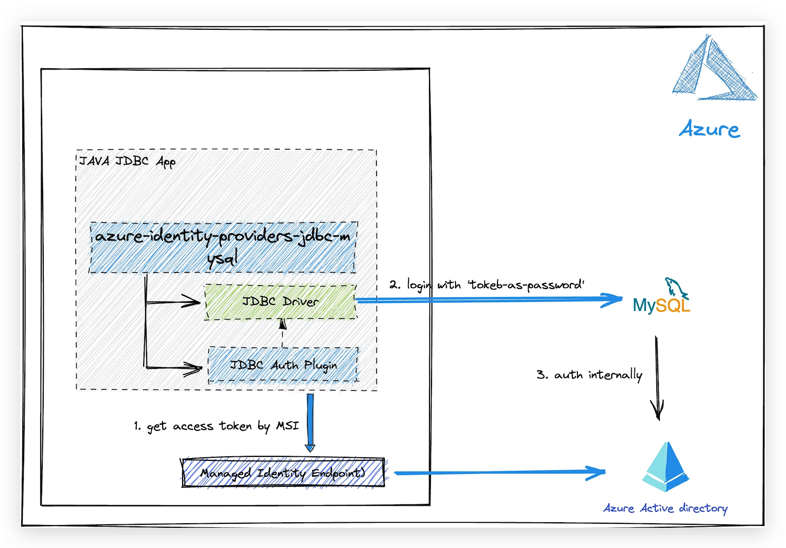

# Azure identity JDBC MySQL plugin library for Java

This package contains the jdbc authentication plugin to authenticate with Azure AD for Azure hosted MySQL services.

## Getting started

### Prerequisites

- An Azure account with an active subscription. [Create an account for free](https://azure.microsoft.com/free/?WT.mc_id=A261C142F).
- [Java Development Kit (JDK)][jdk] with version 8 or above.
- [Apache Maven](https://maven.apache.org/download.cgi).


### Include the package

[//]: # ({x-version-update-start;com.azure:azure-identity-providers-jdbc-mysql;current})
```xml
<dependency>
    <groupId>com.azure</groupId>
    <artifactId>azure-identity-providers-jdbc-mysql</artifactId>
    <version>1.0.0-beta.1</version> <!-- {x-version-update;com.azure:azure-identity-providers-jdbc-mysql;current} -->
</dependency>
```
[//]: # ({x-version-update-end})

## Key concepts

This picture shows how the jdbc authentication plugin for MySQL authenticating with MSI.



## Examples
For documentation on how to use this package, please refer to [Quickstart:Use Java and JDBC with Azure Database for MySQL](https://aka.ms/quickstart-jdbc-mysql).

## Troubleshooting
If you encounter any bugs, please file issues via [Issues](https://github.com/Azure/azure-sdk-for-java/issues).

## Next steps

## Contributing

For details on contributing to this repository, see the [contributing guide](https://github.com/Azure/azure-sdk-for-java/blob/main/CONTRIBUTING.md).

1. Fork it
1. Create your feature branch (`git checkout -b my-new-feature`)
1. Commit your changes (`git commit -am 'Add some feature'`)
1. Push to the branch (`git push origin my-new-feature`)
1. Create new Pull Request


<!-- LINKS -->
[jdk]: https://docs.microsoft.com/java/azure/jdk/
[azure_subscription]: https://azure.microsoft.com/free/
