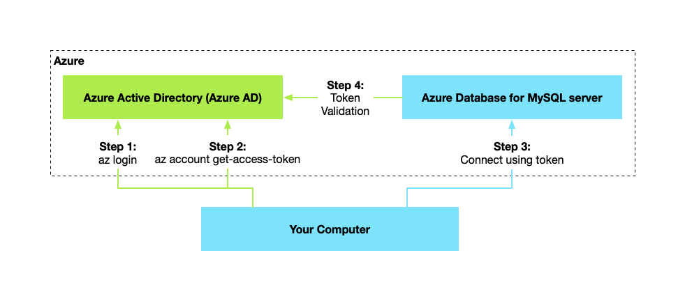

# Azure identity JDBC MySQL plugin library for Java

This package contains the jdbc authentication plugin to authenticate with Azure AD for Azure hosted MySQL services.

[Source code][source] | [API reference documentation][docs] | [Product documentation][product_docs]
| [Quick start][quick_start_mysql]

## Getting started

### Prerequisites

- An Azure account with an active subscription. [Create an account for free](https://azure.microsoft.com/free/).
- [Java Development Kit (JDK)][jdk] with version 8 or above.
- [Apache Maven](https://maven.apache.org/download.cgi).
- Azure Database for MySQL instance.
    - Step-by-step guide for [creating a MySQL instance using the Azure Portal](https://learn.microsoft.com/azure/mysql/single-server/quickstart-create-mysql-server-database-using-azure-portal)

### Include the package

Now the package is not included in the `azure-sdk-bom`, so it can only be included via a direct dependency.

#### Include direct dependency

[//]: # ({x-version-update-start;com.azure:azure-identity-providers-jdbc-mysql;current})

```xml

<dependency>
    <groupId>com.azure</groupId>
    <artifactId>azure-identity-providers-jdbc-mysql</artifactId>
    <version>1.0.0-beta.1</version> <!-- {x-version-update;com.azure:azure-identity-providers-jdbc-mysql;dependency} -->
</dependency>
```

[//]: # ({x-version-update-end})

### Prepare the Azure Database for MySQL

#### Prepare the working environment

First, use the following command to set up some environment variables.

```bash
export AZ_RESOURCE_GROUP=database-workshop
export AZ_DATABASE_NAME=<YOUR_DATABASE_NAME>
export AZ_LOCATION=<YOUR_AZURE_REGION>
export AZ_MYSQL_AD_ADMIN_USERNAME=demo
export AZ_MYSQL_AD_NON_ADMIN_USERNAME=demo-non-admin
export AZ_LOCAL_IP_ADDRESS=<YOUR_LOCAL_IP_ADDRESS>
```

Replace the placeholders with the following values, which are used throughout this article:

- <YOUR_DATABASE_NAME>: The name of your MySQL server. It should be unique across Azure.
- <YOUR_AZURE_REGION>: The Azure region you'll use. You can use eastus by default, but we recommend that you configure a
  region closer to where you live. You can have the full list of available regions by entering az account
  list-locations.
- <YOUR_LOCAL_IP_ADDRESS>: The IP address of your local computer, from which you'll run your Spring Boot application.
  One convenient way to find it's to point your browser to [whatismyip.akamai.com][whatismyip.akamai.com].

#### Create an Azure Database for MySQL server

```Azure CLI
az mysql server create \
    --resource-group $AZ_RESOURCE_GROUP \
    --name $AZ_DATABASE_NAME \
    --location $AZ_LOCATION \
    --sku-name B_Gen5_1 \
    --storage-size 5120 \
    --output tsv
```

#### Configure a firewall rule for your MySQL server

If you are going to connect to the MySQL server from local machine, you need to create a firewall rule to enable it.

```Azure CLI
az mysql server firewall-rule create \
    --resource-group $AZ_RESOURCE_GROUP \
    --name $AZ_DATABASE_NAME-database-allow-local-ip \
    --server $AZ_DATABASE_NAME \
    --start-ip-address $AZ_LOCAL_IP_ADDRESS \
    --end-ip-address $AZ_LOCAL_IP_ADDRESS \
    --output tsv
   
```

#### Enable Azure AD-based authentication

To use Azure Active Directory access with Azure Database for MySQL, you should set the Azure AD admin user first. Only
an Azure AD Admin user can create/enable users for Azure AD-based authentication.

```Azure CLI
az mysql server ad-admin create \
    --resource-group $AZ_RESOURCE_GROUP \
    --server-name $AZ_DATABASE_NAME \
    --display-name $AZ_MYSQL_AD_ADMIN_USERNAME \
    --object-id `(az ad signed-in-user show --query id -o tsv)`
```

## Key concepts

### Azure AD authentication with MySQL

Microsoft Azure Active Directory (Azure AD) authentication is a mechanism of connecting to Azure Database for MySQL
using identities defined in Azure AD. With Azure AD authentication, you can manage database user identities and other
Microsoft services in a central location, which simplifies permission management.

The following high-level diagram summarizes how authentication works using Azure AD authentication with Azure Database
for MySQL. The arrows indicate communication pathways.



To learn more about using Azure AD with MySQL, see Use (Azure Active Directory for authenticating with
MySQL)[Azure Active Directory for authenticating with MySQL]

### Architecture

This picture shows how the jdbc authentication plugin for MySQL authenticating with MSI.


## Examples

### Authenticating with DefaultAzureCredential

```java
Properties properties=new Properties();
properties.put("useSSL","true");
properties.put("sslMode","REQUIRED");
properties.put("defaultAuthenticationPlugin","com.azure.identity.providers.mysql.AzureIdentityMysqlAuthenticationPlugin");
properties.put("authenticationPlugins","com.azure.identity.providers.mysql.AzureIdentityMysqlAuthenticationPlugin");
properties.put("user","${YOUR_MYSQL_USERNAME}@${AZ_DATABASE_NAME}");
String url="${YOUR_JDBC_URL}";
Connection connection=DriverManager.getConnection(url,properties);
```

### Connect using managed identity

```java
Properties properties=new Properties();
properties.put("useSSL","true");
properties.put("sslMode","REQUIRED");
properties.put("defaultAuthenticationPlugin","com.azure.identity.providers.mysql.AzureIdentityMysqlAuthenticationPlugin");
properties.put("authenticationPlugins","com.azure.identity.providers.mysql.AzureIdentityMysqlAuthenticationPlugin");
properties.put("azure.managedIdentityEnabled","true");
properties.put("user","${YOUR_MYSQL_USERNAME}@${AZ_DATABASE_NAME}");
String url="${YOUR_JDBC_URL}";
Connection connection=DriverManager.getConnection(url,properties);
```

### Connect using service principal

```java
Properties properties=new Properties();
properties.put("useSSL","true");
properties.put("sslMode","REQUIRED");
properties.put("defaultAuthenticationPlugin","com.azure.identity.providers.mysql.AzureIdentityMysqlAuthenticationPlugin");
properties.put("authenticationPlugins","com.azure.identity.providers.mysql.AzureIdentityMysqlAuthenticationPlugin");
properties.put("azure.clientId","${YOUR_CLIENT_ID}");
properties.put("azure.clientSecret","${YOUR_CLIENT_SECRET}");
properties.put("azure.tenantId","${YOUR_TENANT_ID}");
properties.put("user","${YOUR_MYSQL_USERNAME}@${AZ_DATABASE_NAME}");
String url="${YOUR_JDBC_URL}";

Connection connection=DriverManager.getConnection(url,properties);
```

### Cloud Configuration

Credentials default to authenticating to the Azure Active Directory endpoint for Azure Public Cloud. To access resources
in other clouds, such as Azure Government or a private cloud, configure credentials with the `azure.authorityHost`
argument. [AzureAuthorityHosts](https://docs.microsoft.com/java/api/com.azure.identity.azureauthorityhosts?view=azure-java-stable)
defines authorities for well-known clouds:

```java
Properties properties=new Properties();
properties.put("useSSL","true");
properties.put("sslMode","REQUIRED");
properties.put("defaultAuthenticationPlugin","com.azure.identity.providers.mysql.AzureIdentityMysqlAuthenticationPlugin");
properties.put("authenticationPlugins","com.azure.identity.providers.mysql.AzureIdentityMysqlAuthenticationPlugin");
properties.put("azure.managedIdentityEnabled","true");
properties.put("user","${YOUR_MYSQL_USERNAME}@${AZ_DATABASE_NAME}");
properties.put("azure.authorityHost",AzureAuthorityHosts.AZURE_GOVERNMENT);
String url="${YOUR_JDBC_URL}";

Connection connection=DriverManager.getConnection(url,properties);
```

## JDBC Parameters

|Parameter Key| Description|
|---|---|
|azure.clientId|Client ID to use when performing service principal authentication with Azure.|
|azure.clientSecret|Client secret to use when performing service principal authentication with Azure.|
|azure.clientCertificatePath|Path of a PEM/PFX certificate file to use when performing service principal authentication with Azure.|
|azure.clientCertificatePassword|Password of the certificate file.|
|azure.username|Username to use when performing username/password authentication with Azure.|
|azure.password|Password to use when performing username/password authentication with Azure.|
|azure.managedIdentityEnabled|Whether to enable managed identity to authenticate with Azure.|
|azure.authorityHost|The well known authority hosts for the Azure Public Cloud and sovereign clouds.|
|azure.tenantId|Tenant ID for Azure resources.|
|azure.claims|Claims for Azure resources.|
|azure.scopes|Scopes for Azure resources.|
|azure.accessTokenTimeoutInSeconds|Max time to get an access token.|
|azure.tokenCredentialProviderClassName|The canonical class name of a class that implements 'TokenCredentialProvider'.|
|azure.tokenCredentialBeanName|The given bean name of a TokenCredential bean in the Spring context.|

## Troubleshooting

If you encounter any bugs, please file issues via [Issues](https://github.com/Azure/azure-sdk-for-java/issues).

## Next steps

## Contributing

For details on contributing to this repository, see
the [contributing guide](https://github.com/Azure/azure-sdk-for-java/blob/main/CONTRIBUTING.md).

<!-- LINKS -->

[jdk]: https://docs.microsoft.com/java/azure/jdk/
[azure_subscription]: https://azure.microsoft.com/free/
[azure-identity-providers-jdbc-postgresql]: https://github.com/Azure/azure-sdk-for-java/blob/31c42eac4fa6e8a3bb00c2e01f80e9a8bacd1d78/sdk/jdbc/azure-identity-providers-jdbc-postgresql
[azure-identity-providers-core]: https://github.com/Azure/azure-sdk-for-java/blob/31c42eac4fa6e8a3bb00c2e01f80e9a8bacd1d78/sdk/jdbc/azure-identity-providers-core
[source]: https://github.com/Azure/azure-sdk-for-java/blob/31c42eac4fa6e8a3bb00c2e01f80e9a8bacd1d78/sdk/jdbc/azure-identity-providers-jdbc-mysql
[docs]: https://azure.github.io/azure-sdk-for-java/
[product_docs]: https://docs.microsoft.com/azure/mysql/single-server/overview
[quick_start_mysql]: https://aka.ms/passwordless/quickstart/mysql
[Azure Active Directory for authenticating with MySQL]:https://docs.microsoft.com/azure/mysql/single-server/concepts-azure-ad-authentication
[whatismyip.akamai.com]: https://whatismyip.akamai.com/
