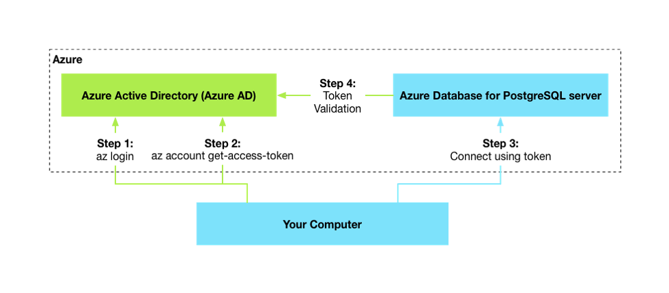
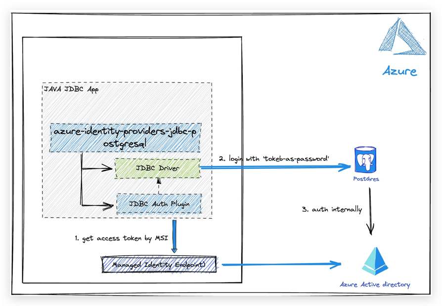

# Azure identity JDBC PostgreSQL plugin library for Java

This package contains the jdbc authentication plugin to authenticate with Azure AD for Azure hosted PostgreSQL services.

## Getting started

### Prerequisites

- An Azure account with an active subscription. [Create an account for free](https://azure.microsoft.com/free/?WT.mc_id=A261C142F).
- [Java Development Kit (JDK)][jdk] with version 8 or above.
- [Apache Maven](https://maven.apache.org/download.cgi).

### Include the package

#### Include direct dependency
There is no GA version of the library now, so you can't include the azure-sdk-bom to your project to take dependency,
instead you need to add the direct dependency to your project as follows.

[//]: # ({x-version-update-start;com.azure:azure-identity-providers-jdbc-postgresql;current})
```xml
<dependency>
    <groupId>com.azure</groupId>
    <artifactId>azure-identity-providers-jdbc-postgresql</artifactId>
    <version>1.0.0-beta.1</version> <!-- {x-version-update;com.azure:azure-identity-providers-jdbc-postgresql;current} -->
</dependency>
```
[//]: # ({x-version-update-end})

### Prepare the working environment
First, use the following command to set up some environment variables.
```bash
export AZ_RESOURCE_GROUP=database-workshop
export AZ_DATABASE_NAME=<YOUR_DATABASE_NAME>
export AZ_LOCATION=<YOUR_AZURE_REGION>
export AZ_POSTGRESQL_AD_ADMIN_USERNAME=demo@tenant.com
export AZ_POSTGRESQL_AD_NON_ADMIN_USERNAME=<YOUR_POSTGRESQL_AD_NON_ADMIN_USERNAME>
export AZ_LOCAL_IP_ADDRESS=<YOUR_LOCAL_IP_ADDRESS>
```

Replace the placeholders with the following values, which are used throughout this article:

- <YOUR_DATABASE_NAME>: The name of your PostgreSQL server. It should be unique across Azure.
- <YOUR_AZURE_REGION>: The Azure region you'll use. You can use eastus by default, but we recommend that you configure a region closer to where you live. You can have the full list of available regions by entering az account list-locations.
- <YOUR_POSTGRESQL_AD_NON_ADMIN_USERNAME>: The username of your PostgreSQL database server. Make ensure the username is a valid user in your Azure AD tenant.
- <YOUR_LOCAL_IP_ADDRESS>: The IP address of your local computer, from which you'll run your Spring Boot application. One convenient way to find it is to point your browser to [whatismyip.akamai.com][whatismyip.akamai.com].

### Create an Azure Database for PostgreSQL server

```Azure CLI
az postgres server create \
    --resource-group $AZ_RESOURCE_GROUP \
    --name $AZ_DATABASE_NAME \
    --location $AZ_LOCATION \
    --sku-name B_Gen5_1 \
    --storage-size 5120 \
    --output tsv
```
### Configure a firewall rule for your PostgreSQL server

```Azure CLI
az postgres server firewall-rule create \
    --resource-group $AZ_RESOURCE_GROUP \
    --name $AZ_DATABASE_NAME-database-allow-local-ip \
    --server $AZ_DATABASE_NAME \
    --start-ip-address $AZ_LOCAL_IP_ADDRESS \
    --end-ip-address $AZ_LOCAL_IP_ADDRESS \
    --output tsv
```

### Enable Azure AD-based authentication
To use Azure Active Directory access with Azure Database for PostgreSQL, you should set the Azure AD admin user first. Only an Azure AD Admin user can create/enable users for Azure AD-based authentication.

```Azure CLI
az postgres server ad-admin create \
    --resource-group $AZ_RESOURCE_GROUP \
    --server-name $AZ_DATABASE_NAME \
    --display-name $AZ_POSTGRESQL_AD_ADMIN_USERNAME \
    --object-id `(az ad signed-in-user show --query id -o tsv)`
```

## Key concepts

### Azure AD authentication with PostgreSQL
Microsoft Azure Active Directory (Azure AD) authentication is a mechanism of connecting to Azure Database for PostgreSQL using identities defined in Azure AD. With Azure AD authentication, you can manage database user identities and other Microsoft services in a central location, which simplifies permission management.

The following high-level diagram summarizes how authentication works using Azure AD authentication with Azure Database for PostgreSQL. The arrows indicate communication pathways.



To learn more about using Azure AD with PostgreSQL, see Use (Use Azure Active Directory for authenticating with PostgreSQL)[Use Azure Active Directory for authenticating with PostgreSQL]

### Architecture

This picture shows how the jdbc authentication plugin for PostgreSQl authenticating with MSI.



## Examples
For documentation on how to use this package, please refer to [Quickstart:Use Java and JDBC with Azure Database for PostgreSQL][quick_start]

## Troubleshooting
If you encounter any bugs, please file issues via [Issues](https://github.com/Azure/azure-sdk-for-java/issues).

## Next steps
Other useful packages are:
* [azure-identity-providers-core][azure-identity-providers-core]: Contains core classes and functionality used by this library.
* [azure-identity-providers-jdbc-mysql][azure-identity-providers-jdbc-mysql]:  Azure identity JDBC MySQL plugin library for Java.

## Contributing

For details on contributing to this repository, see the [contributing guide](https://github.com/Azure/azure-sdk-for-java/blob/main/CONTRIBUTING.md).

1. Fork it
1. Create your feature branch (`git checkout -b my-new-feature`)
1. Commit your changes (`git commit -am 'Add some feature'`)
1. Push to the branch (`git push origin my-new-feature`)
1. Create new Pull Request


<!-- LINKS -->
[jdk]: https://docs.microsoft.com/java/azure/jdk/
[azure-identity-providers-jdbc-mysql]: https://github.com/Azure/azure-sdk-for-java/blob/c04bd10d2bc9a49b18c63ec91a1c0e64043f21bf/sdk/jdbc/azure-identity-providers-jdbc-mysql
[azure-identity-providers-core]: https://github.com/Azure/azure-sdk-for-java/blob/c04bd10d2bc9a49b18c63ec91a1c0e64043f21bf/sdk/jdbc/azure-identity-providers-core
[source]: https://github.com/Azure/azure-sdk-for-java/blob/c04bd10d2bc9a49b18c63ec91a1c0e64043f21bf/sdk/jdbc/azure-identity-providers-jdbc-postgresql
[docs]: https://azure.github.io/azure-sdk-for-java/
[product_docs]: https://docs.microsoft.com/azure/postgresql/single-server/overview
[quick_start]: https://aka.ms/passwordless/quickstart/postgresql
[Use Azure Active Directory for authenticating with PostgreSQL]:https://docs.microsoft.com/azure/postgresql/single-server/concepts-azure-ad-authentication
[whatismyip.akamai.com]: http://whatismyip.akamai.com/
