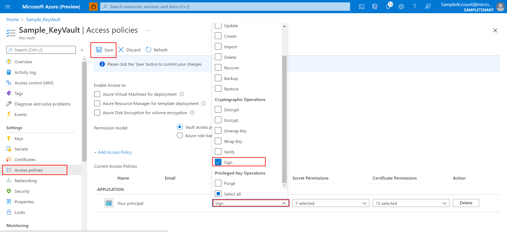

# Azure Key Vault JCA client library for Java
The JCA Provider for Azure Key Vault is a Java Cryptography Architecture provider for certificates in
Azure Key Vault. It is built on four principles:

1. Must be extremely thin to run within a JVM.
2. Must not introduce any library version conflicts with Java app code dependencies.
3. Must not introduce any class loader hierarchy conflicts with Java app code dependencies.
4. Must be ready for "never trust, always verify and credential-free" Zero Trust environments.

[Source code] | [API reference documentation] | [Product documentation] | [Samples]

## Getting started
### Adding the package to your project
Maven dependency for the Azure Key Vault JCA client library. Add it to your project's POM file.

[//]: # ({x-version-update-start;com.azure:azure-security-keyvault-jca;current})
```xml
<dependency>
    <groupId>com.azure</groupId>
    <artifactId>azure-security-keyvault-jca</artifactId>
    <version>2.0.0-beta.1</version>
</dependency>
```
[//]: # ({x-version-update-end})

### Prerequisites
- A [Java Development Kit (JDK)][jdk_link], version 8 or later.
- [Azure Subscription][azure_subscription]
- An existing [Azure Key Vault][azure_keyvault]. If you need to create a Key Vault, you can use the [Azure Cloud Shell][azure_cloud_shell] to create one with this Azure CLI command. Replace `<your-resource-group-name>` and `<your-key-vault-name>` with your own, unique names:

```Bash
az keyvault create --resource-group <your-resource-group-name> --name <your-key-vault-name>
```

## Key concepts

## Examples
### Server side SSL
If you are looking to integrate the JCA provider to create an SSLServerSocket see the example below.

<!-- embedme ./src/samples/java/com/azure/security/keyvault/jca/ServerSSLSample.java#L18-L36 -->
```java
KeyVaultJcaProvider provider = new KeyVaultJcaProvider();
Security.addProvider(provider);

KeyStore keyStore = KeyStore.getInstance("AzureKeyVault");
KeyVaultLoadStoreParameter parameter = new KeyVaultLoadStoreParameter(
    System.getProperty("azure.keyvault.uri"),
    System.getProperty("azure.keyvault.tenant-id"),
    System.getProperty("azure.keyvault.client-id"),
    System.getProperty("azure.keyvault.client-secret"));
keyStore.load(parameter);

KeyManagerFactory managerFactory = KeyManagerFactory.getInstance(KeyManagerFactory.getDefaultAlgorithm());
managerFactory.init(keyStore, "".toCharArray());

SSLContext context = SSLContext.getInstance("TLS");
context.init(managerFactory.getKeyManagers(), null, null);

SSLServerSocketFactory socketFactory = context.getServerSocketFactory();
SSLServerSocket serverSocket = (SSLServerSocket) socketFactory.createServerSocket(8765);
```

Note if you want to use Azure Managed Identity, you should set the value of `azure.keyvault.uri`, and the rest of the parameters would be `null`.

### Client side SSL
If you are looking to integrate the JCA provider for client side socket connections, see the Apache HTTP client example below.

<!-- embedme ./src/samples/java/com/azure/security/keyvault/jca/ClientSSLSample.java#L28-L67 -->
```java
KeyVaultJcaProvider provider = new KeyVaultJcaProvider();
Security.addProvider(provider);

KeyStore keyStore = KeyStore.getInstance("AzureKeyVault");
KeyVaultLoadStoreParameter parameter = new KeyVaultLoadStoreParameter(
    System.getProperty("azure.keyvault.uri"),
    System.getProperty("azure.keyvault.tenant-id"),
    System.getProperty("azure.keyvault.client-id"),
    System.getProperty("azure.keyvault.client-secret"));
keyStore.load(parameter);

SSLContext sslContext = SSLContexts
    .custom()
    .loadTrustMaterial(keyStore, new TrustSelfSignedStrategy())
    .build();

SSLConnectionSocketFactory sslConnectionSocketFactory = new SSLConnectionSocketFactory(
    sslContext, (hostname, session) -> true);

PoolingHttpClientConnectionManager manager = new PoolingHttpClientConnectionManager(
    RegistryBuilder.<ConnectionSocketFactory>create()
        .register("https", sslConnectionSocketFactory)
        .build());

String result = null;

try (CloseableHttpClient client = HttpClients.custom().setConnectionManager(manager).build()) {
    HttpGet httpGet = new HttpGet("https://localhost:8766");
    ResponseHandler<String> responseHandler = (HttpResponse response) -> {
        int status = response.getStatusLine().getStatusCode();
        String result1 = "Not success";
        if (status == 204) {
            result1 = "Success";
        }
        return result1;
    };
    result = client.execute(httpGet, responseHandler);
} catch (IOException ioe) {
    ioe.printStackTrace();
}
```

Note if you want to use Azure managed identity, you should set the value of `azure.keyvault.uri`, and the rest of the parameters would be `null`.

### File-System certificates
You can load the certificate in the file system as a trusted certificate by configure the following properties.

```yaml
azure:
  cert-path:
    well-known:     # The file location where you store the well-known certificate
    custom:         # The file location where you store the custom certificate
```

### Key-Less certificates
You can set the private key as [non-exportable] to ensure the security of the key.

Note if you want to use key less certificate, you must add `sign` permission to the principal.


### Supported key type
Content Type | Key Type | Key Size or Elliptic curve name | Sign algorithm  | Support |
-------------|----------|---------------------------------|---------------- |-------- |
PKCS #12     | RSA      | 2048                            | RSASSA-PSS      | ✔       |     
PKCS #12     | RSA      | 3072                            | RSASSA-PSS      | ✔       |
PKCS #12     | RSA      | 4096                            | RSASSA-PSS      | ✔       |
PKCS #12     | EC       | P-256                           | SHA256withECDSA | ✔       |
PKCS #12     | EC       | P-384                           | SHA384withECDSA | ✔       |
PKCS #12     | EC       | P-521                           | SHA512withECDSA | ✔       |
PKCS #12     | EC       | P-256K                          |                 | ✘       |
PEM          | RSA      | 2048                            | RSASSA-PSS      | ✔       |
PEM          | RSA      | 3072                            | RSASSA-PSS      | ✔       |
PEM          | RSA      | 4096                            | RSASSA-PSS      | ✔       |
PEM          | EC       | P-256                           | SHA256withECDSA | ✔       |
PEM          | EC       | P-384                           | SHA384withECDSA | ✔       |
PEM          | EC       | P-521                           | SHA512withECDSA | ✔       | 
PEM          | EC       | P-256K                          |                 | ✘       |

## Troubleshooting
### General
Azure Key Vault JCA clients raise exceptions. For example, if you try to check a client's identity with a certificate chain that does not include a trusted certificate, a `CertificateException` will be thrown. In the following snippet, the error is handled gracefully by catching the exception and displaying additional information about the error.

```java
try {
    KeyVaultJcaProvider provider = new KeyVaultJcaProvider();
    Security.addProvider(provider);
    ...
    // Start SSL server socket
    ...
} catch (CertificateException e) {
    System.out.println(e.getMessage());
}
```

## Next steps
### Spring Boot
For Spring Boot applications see our [Spring Boot starter][spring_boot_starter].

### References
1. [Java Cryptography Architecture (JCA) Reference Guide][jca_reference_guide]

### Additional documentation
For more extensive documentation on Azure Key Vault, see the [API reference documentation].

## Contributing
This project welcomes contributions and suggestions. Most contributions require you to agree to a Contributor License Agreement (CLA) declaring that you have the right to, and actually do, grant us the rights to use your contribution. For details, visit https://cla.microsoft.com.

When you submit a pull request, a CLA-bot will automatically determine whether you need to provide a CLA and decorate the PR appropriately (e.g., label, comment). Simply follow the instructions provided by the bot. You will only need to do this once across all repos using our CLA.

This project has adopted the [Microsoft Open Source Code of Conduct][microsoft_code_of_conduct]. For more information see the Code of Conduct FAQ or contact <opencode@microsoft.com> with any additional questions or comments.

<!-- LINKS -->
[Source code]: https://github.com/Azure/azure-sdk-for-java/blob/main/sdk/keyvault/azure-security-keyvault-jca/src
[API reference documentation]: https://azure.github.io/azure-sdk-for-java/keyvault.html#azure-security-keyvault-jca
[Product documentation]: https://docs.microsoft.com/azure/key-vault/
[Samples]: https://github.com/Azure/azure-sdk-for-java/blob/main/sdk/keyvault/azure-security-keyvault-jca/src/samples/java/com/azure/security/keyvault/jca
[azure_subscription]: https://azure.microsoft.com/
[azure_keyvault]: https://docs.microsoft.com/azure/key-vault/keys/quick-create-portal
[jdk_link]: https://docs.microsoft.com/java/azure/jdk/?view=azure-java-stable
[azure_cloud_shell]: https://shell.azure.com/bash
[spring_boot_starter]: https://github.com/Azure/azure-sdk-for-java/blob/main/sdk/spring/azure-spring-boot-starter-keyvault-certificates/README.md
[jca_reference_guide]: https://docs.oracle.com/javase/8/docs/technotes/guides/security/crypto/CryptoSpec.html
[microsoft_code_of_conduct]: https://opensource.microsoft.com/codeofconduct/
[non-exportable]: https://docs.microsoft.com/azure/key-vault/certificates/about-certificates#exportable-or-non-exportable-key


