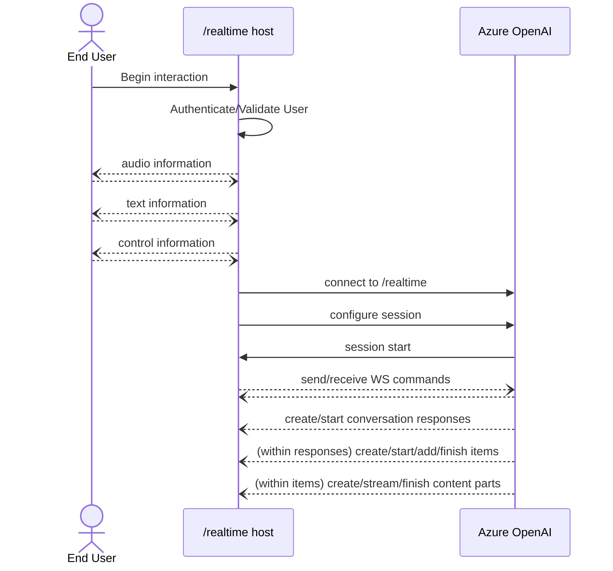

# Azure OpenAI Realtime client library for Java (experimental)

This preview introduces a new `/realtime` API endpoint for the `gpt-4o-realtime-preview` model family. `/realtime`:

- Supports low-latency, "speech in, speech out" conversational interactions
- Works with text messages, function tool calling, and many other existing capabilities from other endpoints like `/chat/completions`
- Is a great fit for support agents, assistants, translators, and other use cases that need highly responsive back-and-forth with a user

`/realtime` is built on [the WebSockets API](https://developer.mozilla.org/en-US/docs/Web/API/WebSockets_API) to facilitate fully asynchronous streaming communication between the end user and model. It's designed to be used in the context of a trusted, intermediate service that manages both connections to end users and model endpoint connections; it **is not** designed to be used directly from untrusted end user devices, and device details like capturing and rendering audio data are outside the scope of the `/realtime` API.

At a summary level, the architecture of an experience built atop `/realtime` looks something like the following (noting that the user interactions, as previously mentioned, are not part of the API itself):



Note that `/realtime` is in **public preview**. API changes, code updates, and occasional service disruptions are expected.

This client library is currently made available **only in our dev feed**. For detailed instructions see the [dev feed documentation.][dev_feed_instructions]

## Getting started

### Prerequisites

- [Java Development Kit (JDK)][jdk] with version 8 or above
- [Azure Subscription][azure_subscription]
- [Azure OpenAI access][azure_openai_access]
- [Quickstart: GPT-4o Realtime API for speech and audio (Preview)][quickstart]

### Adding the package to your project

This project is currently only available in the dev feed. For detailed instructions on how to set up your project to consume the dev feed
please visit the [dev feed documentation page.][dev_feed_instructions] Here you can find the steps for the `maven` and `gradle setup.

#### Maven dev feed setup

##### Step 1: get a PAT (Personal Access Token)

generate a [Personal Access Token](https://dev.azure.com/azure-sdk/_details/security/tokens) with *Packaging* read & write scopes.

##### Step 2: Project setup

Add the repo to **both** your pom.xml's `<repositories>` and `<distributionManagement>` sections

```xml
<repository>
  <id>azure-sdk-for-java</id>
  <url>https://pkgs.dev.azure.com/azure-sdk/public/_packaging/azure-sdk-for-java/maven/v1</url>
  <releases>
    <enabled>true</enabled>
  </releases>
  <snapshots>
    <enabled>true</enabled>
  </snapshots>
</repository>
```

Add or edit the `settings.xml` file in `${user.home}/.m2`

```xml
    <server>
      <id>azure-sdk-for-java</id>
      <username>azure-sdk</username>
      <password>[PERSONAL_ACCESS_TOKEN]</password>
    </server>
```

Replace `[PERSONAL_ACCESS_TOKEN]` in the `<password>` tag with the PAT you generated in [step 1.](#step-1-get-a-pat-personal-access-token)

Then run 

```commandline
mvn install
```

##### Step 3: Add project dependency

Add to your project's pom.xml file

[//]: # ({x-version-update-start;com.azure:azure-ai-openai-realtime;current})
```xml
<dependency>
    <groupId>com.azure</groupId>
    <artifactId>azure-ai-openai-realtime</artifactId>
    <version>1.0.0-beta.1</version>
</dependency>
```
[//]: # ({x-version-update-end})

#### Gradle setup

##### Step 1: get a PAT (Identical to the step for Maven setup)

generate a [Personal Access Token](https://dev.azure.com/azure-sdk/_details/security/tokens) with *Packaging* read & write scopes.

##### Step 2: Project setup

Add this section to your `build.gradle` file in **both** the `repositories` and `publishing.repositories` containers.

```groovy
maven {
    url 'https://pkgs.dev.azure.com/azure-sdk/public/_packaging/azure-sdk-for-java/maven/v1'
    name 'azure-sdk-for-java'
    credentials(PasswordCredentials)
    authentication {
        basic(BasicAuthentication)
    }
}
```

Add or edit the `gradle.properties` file in `${user.home}/.gradle`

```groovy
azure-sdk-for-javaUsername=azure-sdk
azure-sdk-for-javaPassword=PERSONAL_ACCESS_TOKEN
```

Replace `PERSONAL_ACCESS_TOKEN` being assign to `azure-sdk-for-javaPassword` with the PAT you generated in [step 1.](#step-1-get-a-pat-personal-access-token)

Then run

```commandline
gradle build
```

##### Step 3: Add project dependency

Add to your project setup

```groovy
compile(group: 'com.azure', name: 'azure-ai-openai-realtime', version: '1.0.0-beta.1')
```

### Authentication

TODO

## Key concepts

For a more detailed guide please refer to the [Azure OpenAI realtime][aoai_samples_readme] general API guide.

- A caller establishes a connection to `/realtime`, which starts a new `session`
- The `session` can be configured to customize input and output audio behavior, voice activity detection behavior, and other shared settings
- A `session` automatically creates a default `conversation`
    - Note: in the future, multiple concurrent conversations may be supported -- this is not currently available
- The `conversation` accumulates input signals until a `response` is started, either via a direct command by the caller or automatically by voice-activity-based turn detection
- Each `response` consists of one or more `items`, which can encapsulate messages, function calls, and other information
- Message `item`s have `content_part`s, allowing multiple modalities (text, audio) to be represented across a single item
- The `session` manages configuration of caller input handling (e.g. user audio) and common output/generation handling
- Each caller-initiated `response.create` can override some of the output `response` behavior, if desired
- Server-created `item`s and the `content_part`s in messages can be populated asynchronously and in parallel, e.g. receiving audio, text, and function information concurrently (round-robin)

## Examples

TODO

## Troubleshooting

### Enable client logging
You can set the `AZURE_LOG_LEVEL` environment variable to view logging statements made in the client library. For
example, setting `AZURE_LOG_LEVEL=2` would show all informational, warning, and error log messages. The log levels can
be found here: [log levels][log_levels].

### Default HTTP Client
All client libraries by default use the Netty HTTP client. Adding the above dependency will automatically configure
the client library to use the Netty HTTP client. Configuring or changing the HTTP client is detailed in the
[HTTP clients wiki](https://learn.microsoft.com/azure/developer/java/sdk/http-client-pipeline#http-clients).

### Default SSL library
All client libraries, by default, use the Tomcat-native Boring SSL library to enable native-level performance for SSL
operations. The Boring SSL library is an uber jar containing native libraries for Linux / macOS / Windows, and provides
better performance compared to the default SSL implementation within the JDK. For more information, including how to
reduce the dependency size, refer to the [performance tuning][performance_tuning] section of the wiki.

## Next steps

- Samples are explained in detail [here][samples_readme].

## Contributing

For details on contributing to this repository, see the [contributing guide](https://github.com/Azure/azure-sdk-for-java/blob/main/CONTRIBUTING.md).

1. Fork it
2. Create your feature branch (`git checkout -b my-new-feature`)
3. Commit your changes (`git commit -am 'Add some feature'`)
4. Push to the branch (`git push origin my-new-feature`)
5. Create new Pull Request

<!-- LINKS -->
[aoai_samples_readme]: https://github.com/Azure-Samples/aoai-realtime-audio-sdk/blob/main/README.md
[aoai_samples_readme_api_concepts]: https://github.com/Azure-Samples/aoai-realtime-audio-sdk/blob/main/README.md#api-concepts
[azure_subscription]: https://azure.microsoft.com/free/
[azure_openai_access]: https://learn.microsoft.com/azure/cognitive-services/openai/overview#how-do-i-get-access-to-azure-openai
[jdk]: https://docs.microsoft.com/java/azure/jdk/
[dev_feed_instructions]: https://github.com/Azure/azure-sdk-for-java/blob/main/CONTRIBUTING.md#dev-feed
[log_levels]: https://github.com/Azure/azure-sdk-for-java/blob/main/sdk/core/azure-core/src/main/java/com/azure/core/util/logging/ClientLogger.java
[performance_tuning]: https://github.com/Azure/azure-sdk-for-java/wiki/Performance-Tuning
[samples_readme]: https://github.com/Azure/azure-sdk-for-java/tree/main/sdk/openai/azure-ai-openai-realtime/src/samples
[quickstart]: https://learn.microsoft.com/azure/ai-services/openai/realtime-audio-quickstart