# Azure Key Vault Certificates Spring Boot starter client library for Java
Azure Key Vault Certificates Spring Boot Starter is Spring starter for [Azure Key Vault Certificates](https://docs.microsoft.com/rest/api/keyvault/about-keys--secrets-and-certificates#BKMK_WorkingWithSecrets), it allows you to securely manage and tightly control your certificates.

[Package (Maven)][package] | [API reference documentation][refdocs] | [Samples][sample]

## Getting started
### Prerequisites
- [Java Development Kit (JDK)][jdk_link] with version 8 or above
- [Azure Subscription][azure_subscription]
- [Maven](https://maven.apache.org/) 3.0 and above
- [Build developing version artifacts if needed][build-developing-version-artifacts-if-needed]

### Include the package
[//]: # ({x-version-update-start;com.azure.spring:azure-spring-boot-starter-keyvault-certificates;current})
```xml
<dependency>
    <groupId>com.azure.spring</groupId>
    <artifactId>azure-spring-boot-starter-keyvault-certificates</artifactId>
    <version>3.0.0-beta.4</version>
</dependency>
```
[//]: # ({x-version-update-end})

### Creating an Azure Key Vault

1. Log into <https://portal.azure.com>.

1. Click `Create a resource`.

1. Input `Key Vault`.

1. Click `Key Vault`
    

    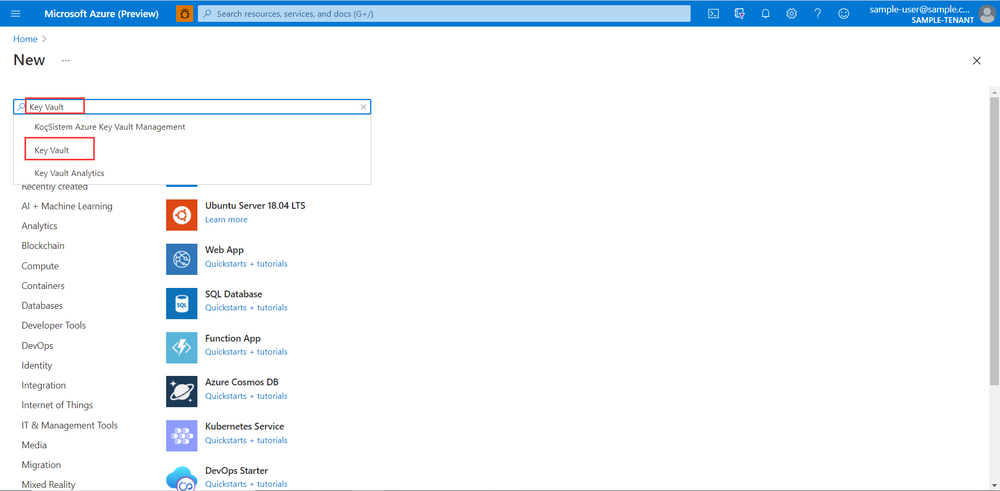

1. Click **Create**.

    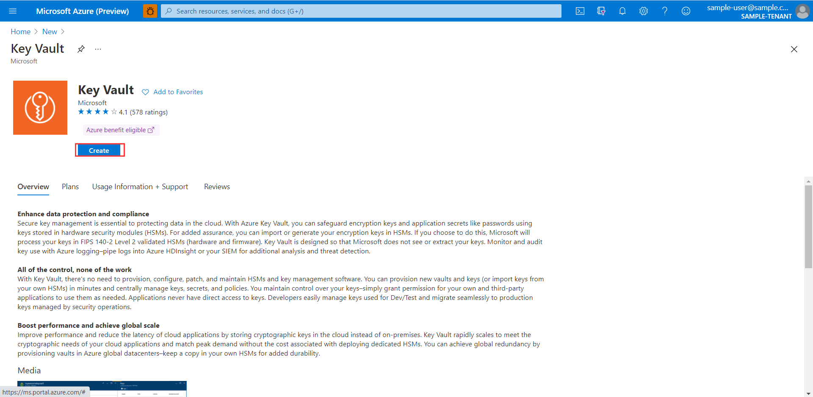

1. On the **Create key vault** page, input `Subscription`, `Resource group`, `Key vault name` and `Pricing tier`, then click `Review + Create`.

    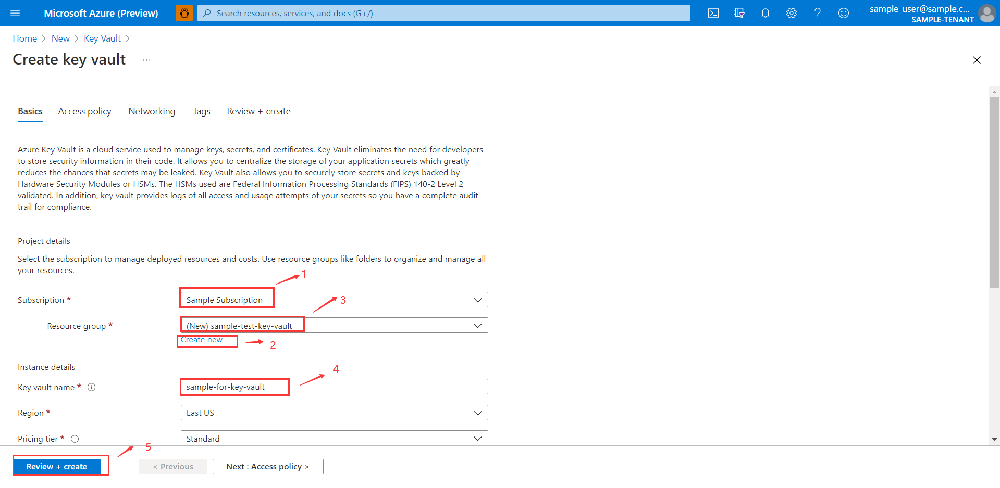

    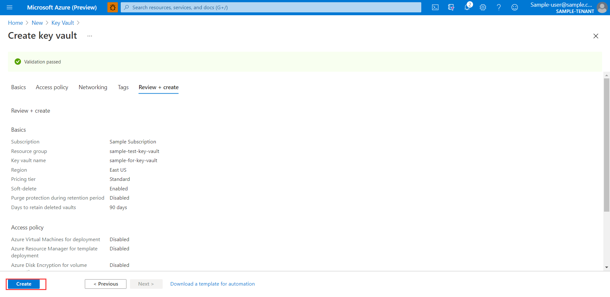

1. When complete, click `Go to resource`.

    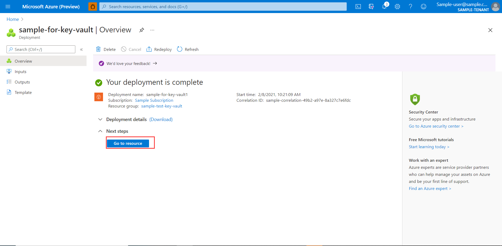

1. When the page for your app registration appears, copy your **Vault URI**;

    

1. Click **Certificates** in the left navigation pane.  Then click **Generate/Import**.

    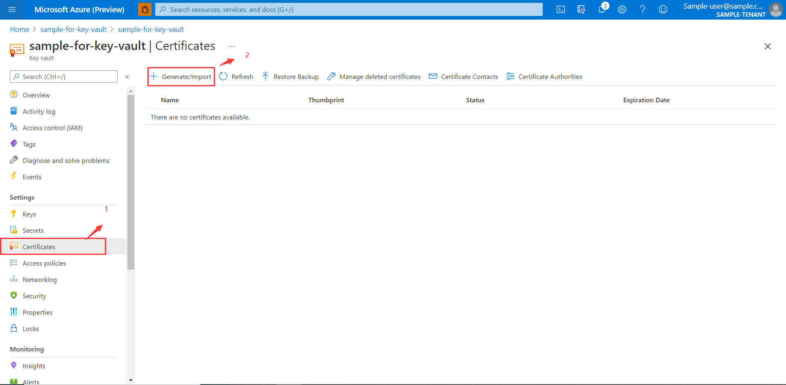

1. Enter a **Certificates name**, and enter a **Subject** like `CN=mydomain.com`. then click **create**.

    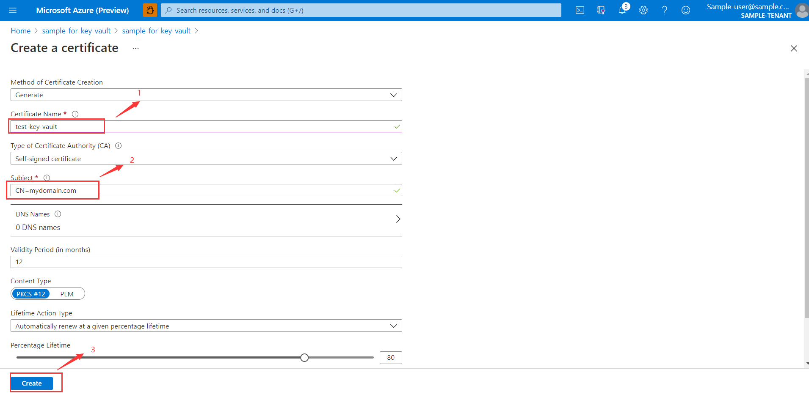

1. After the certificate is successfully created, it takes a while for the status to become `Enabled`. You can click **refresh** to check current status.

    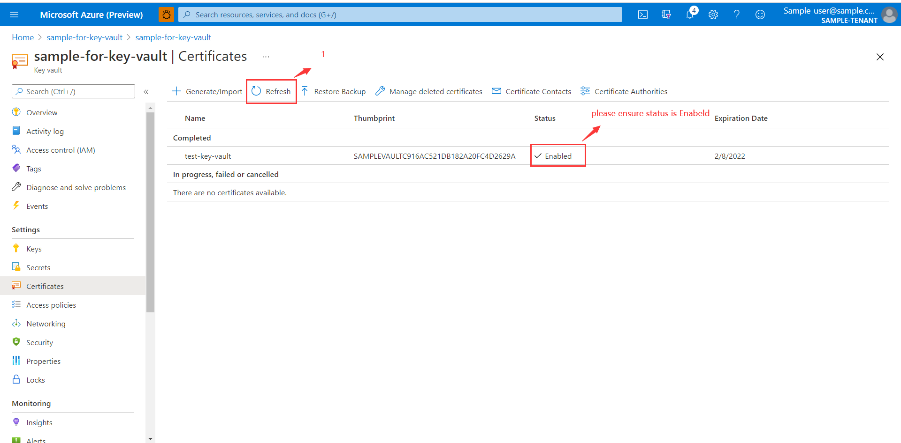

## Key concepts
This starter allows you to securely manage and tightly control your certificates by using Azure Key Vault or side-load certificates by supplying them as part of the application.

## Examples
### Server side SSL

#### Using a client ID and client secret

1. Click **Show portal menu**

2. Click **Azure Active Directory**.

    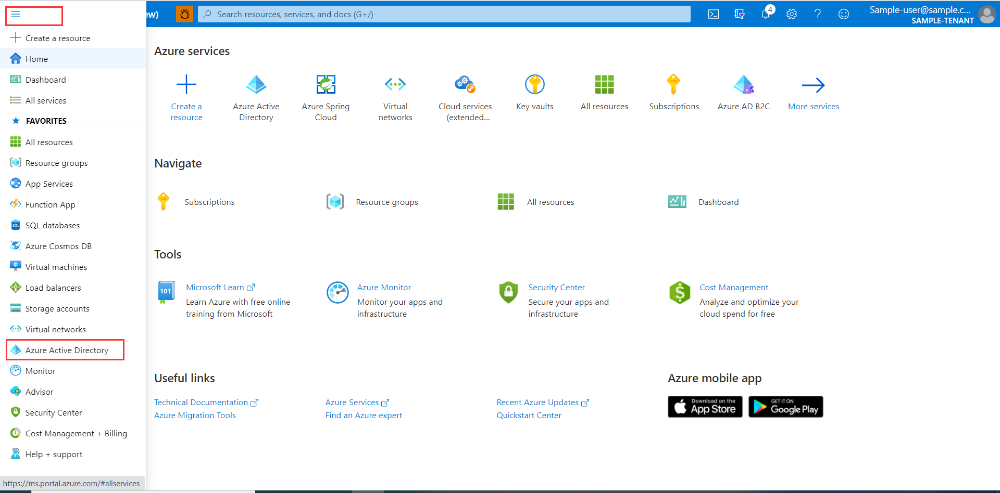

1. From the portal menu, Click **App registrations**,

1. Click **New registration**.

    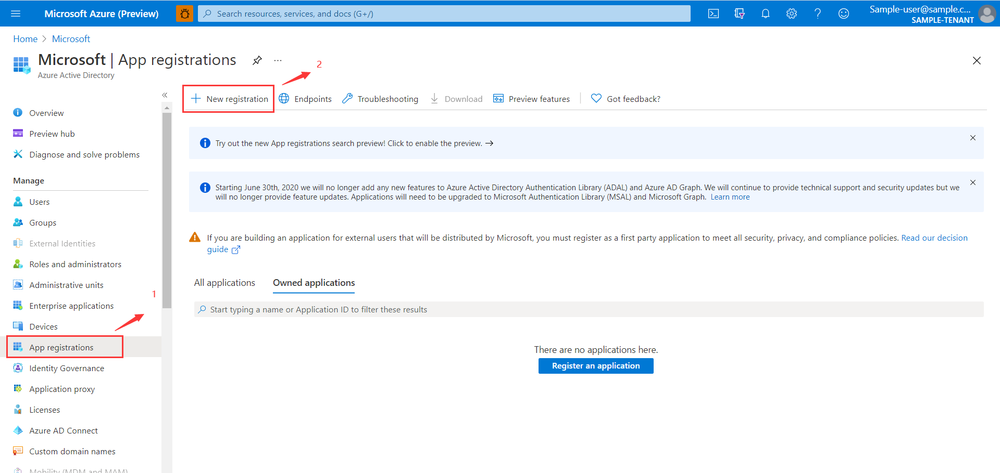

1. Specify your application, and then Click **Register**.

    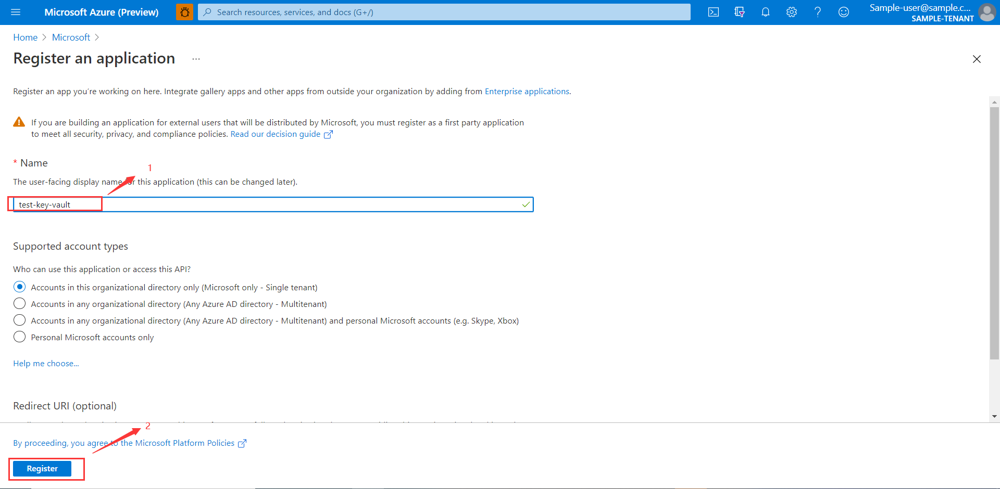

1. When the page for your app registration appears, copy your **Application ID** and the **Tenant ID**;

    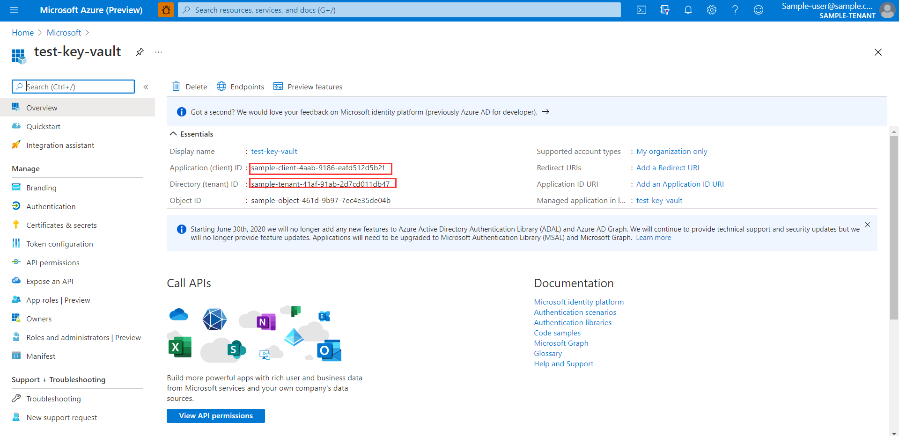

1. Click **Certificates & secrets** in the left navigation pane.  Then click **New client secret**.

1. Add a **Description** and click duration in the **Expires** list.  Click **Add**. The value for the key will be automatically filled in.
   
    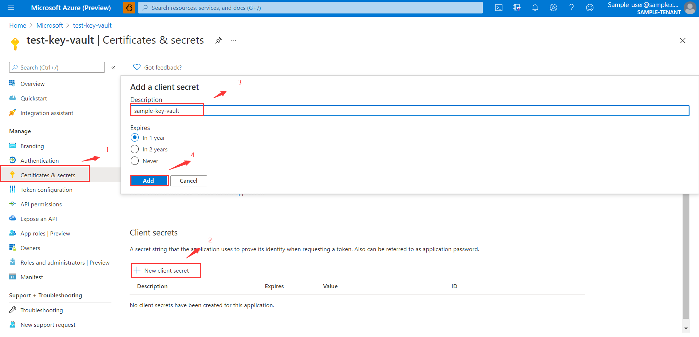

1. Copy and save the value of the client secret. (You will not be able to retrieve this value later.)

    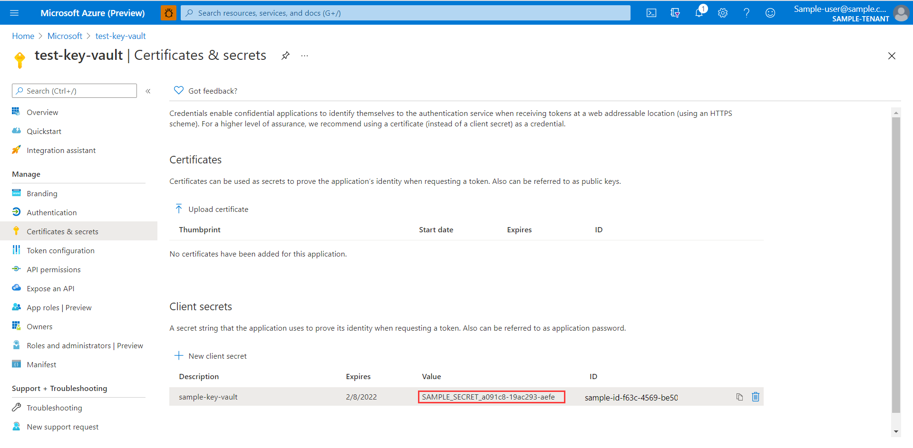

To use the starter for server side SSL, you will need to add the following to
your `application.yml` (if the application is using Spring Cloud Config 
Server for its configuration add it to the `bootstrap.yml` of the application)

```yaml
azure:
  keyvault:
    uri: <the URI of the Azure Key Vault to use>
    tenant-id: <the ID of your Azure tenant>
    client-id: <the client ID with access to Azure Key Vault>
    client-secret: <the client secret associated wit the client ID>
server:
  ssl:
    key-alias: <the name of the certificate in Azure Key Vault to use>
    key-store-type: AzureKeyVault
```

Note: make sure the client ID has access to the Azure Key Vault to access
keys, secrets and certificates.

Follow the steps below to grant a client with access to Azure Key Vault to access keys, secrets and certificates.

1. Type your key vault name in **Search resources, services, and docs** and click your key vault created before.

    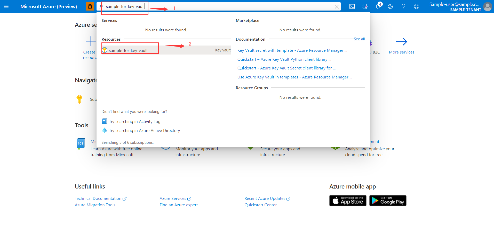

1. Click **Access policies** in the left navigation pane. Then click **Add Access Policy**.

    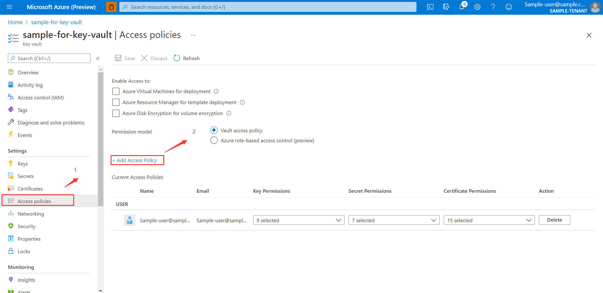

1. Select **Key, Secret, &Certificate Management** as **Configure for template(optional)**. Permissions will be added automatically. 

    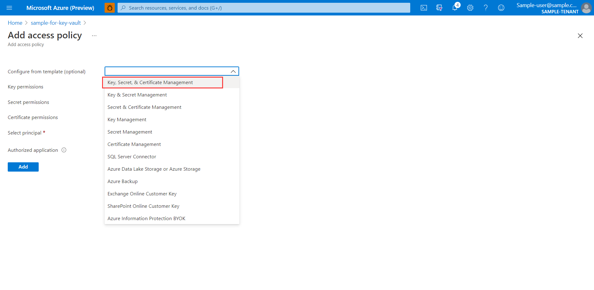

1. Click **None selected** and choose application created before, click **Select**, then click **Add**.

    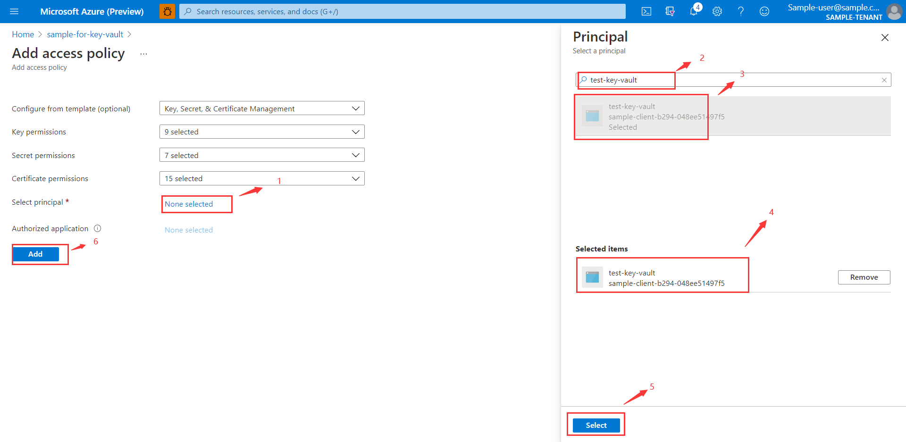

1. Click **Save**.

    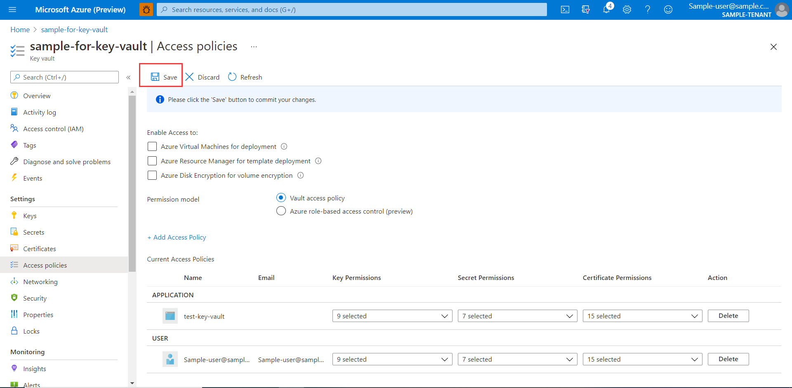

#### Using a managed identity

To use the starter for server side SSL, you will need to add the following to
your `application.yml` (if the application is using Spring Cloud Config 
Server for its configuration add it to the `bootstrap.yml` of the application)

```yaml
azure:
  keyvault:
    uri: <the URI of the Azure Key Vault to use>
server:
  ssl:
    key-alias: <the name of the certificate in Azure Key Vault to use>
    key-store-type: AzureKeyVault
```

Note: make sure the managed identity has access to the Azure Key Vault to access
keys, secrets and certificates.

### Enable mutual SSL on the server side

Only some minor changes need to be done to the server side SSL example 
mentioned above.

The following additional application.yml need to be added:

```yaml
server:
  ssl:
    client-auth: need
    trust-store-type: AzureKeyVault
```


### Client side SSL

#### Using a client ID and client secret

To use the starter for client side SSL, you will need to add the following to
your `application.yml` (if the application is using Spring Cloud Config 
Server for its configuration add it to the `bootstrap.yml` of the application)

```yaml
azure:
  keyvault:
    uri: <the URI of the Azure Key Vault to use>
    tenant-id: <the ID of your Azure tenant>
    client-id: <the client ID with access to Azure Key Vault>
    client-secret: <the client secret associated wit the client ID>
```

Note: make sure the client ID has access to the Azure Key Vault to access
keys, secrets and certificates.

Then if you are using `RestTemplate` use the code below as a starting
point:

<!-- embedme ../azure-spring-boot/src/samples/java/com/azure/spring/keyvault/KeyVaultJcaClientSample.java#L21-L41 -->
```java
@Bean
public RestTemplate restTemplate() throws Exception {
    KeyStore ks = KeyStore.getInstance("AzureKeyVault");
    SSLContext sslContext = SSLContexts.custom()
        .loadTrustMaterial(ks, new TrustSelfSignedStrategy())
        .build();

    HostnameVerifier allowAll = (String hostName, SSLSession session) -> true;
    SSLConnectionSocketFactory csf = new SSLConnectionSocketFactory(sslContext, allowAll);

    CloseableHttpClient httpClient = HttpClients.custom()
        .setSSLSocketFactory(csf)
        .build();

    HttpComponentsClientHttpRequestFactory requestFactory =
                new HttpComponentsClientHttpRequestFactory();

    requestFactory.setHttpClient(httpClient);
    RestTemplate restTemplate = new RestTemplate(requestFactory);
    return restTemplate;
}
```

#### Using a managed identity

To use the starter for client side SSL, you will need to add the following to
your `application.yml` (if the application is using Spring Cloud Config 
Server for its configuration add it to the `bootstrap.yml` of the application)

```yaml
azure:
  keyvault:
    uri: <the URI of the Azure Key Vault to use>
```
Note: make sure the managed identity has access to the Azure Key Vault to access
keys, secrets and certificates.

If you are using `RestTemplate` use code similar to the example below.

<!-- embedme ../azure-spring-boot/src/samples/java/com/azure/spring/keyvault/KeyVaultJcaManagedIdentitySample.java#L19-L38 -->
```java
@Bean
public RestTemplate restTemplate() throws Exception {
    KeyStore ks = KeyStore.getInstance("AzureKeyVault");
    SSLContext sslContext = SSLContexts.custom()
        .loadTrustMaterial(ks, new TrustSelfSignedStrategy())
        .build();

    SSLConnectionSocketFactory csf = new SSLConnectionSocketFactory(sslContext);

    CloseableHttpClient httpClient = HttpClients.custom()
        .setSSLSocketFactory(csf)
        .build();

    HttpComponentsClientHttpRequestFactory requestFactory =
                new HttpComponentsClientHttpRequestFactory();

    requestFactory.setHttpClient(httpClient);
    RestTemplate restTemplate = new RestTemplate(requestFactory);
    return restTemplate;
}
```

### Enable mutual SSL on the client side

Only some minor changes need to be done to the client side SSL example 
mentioned above.

1. The SSL context needs to take a ClientPrivateKeyStrategy

An example is show below:

<!-- embedme ../azure-spring-boot/src/samples/java/com/azure/spring/keyvault/KeyVaultMutualTlsOnTheClientSide.java#L27-L30 -->
```java
SSLContext sslContext = SSLContexts.custom()
                                   .loadKeyMaterial(ks, "".toCharArray(), new ClientPrivateKeyStrategy())
                                   .loadTrustMaterial(ks, new TrustSelfSignedStrategy())
                                   .build();
```

2. A ClientPrivateKeyStrategy needs to be defined.

An example is show below:

<!-- embedme ../azure-spring-boot/src/samples/java/com/azure/spring/keyvault/KeyVaultMutualTlsOnTheClientSide.java#L32-L37 -->
```java
private static class ClientPrivateKeyStrategy implements PrivateKeyStrategy {
    @Override
    public String chooseAlias(Map<String, PrivateKeyDetails> map, Socket socket) {
        return "self-signed";
    }
}
```

### Configuring Spring Cloud Gateway

To configure Spring Cloud Gateway for outbound SSL you will need
to add the following configuration:

```yaml
azure:
  keyvault:
    uri: <the URI of the Azure Key Vault to use>
    jca: 
      overrideTrustManagerFactory: true
```

Note: if any of your routes point to a service where the FQDN does not match the
issued certificate you will need to disable hostname verification. This will
be the case if your service is dynamically assigned a hostname by the hosting
platform you use. In this particular case add the configuration below to disable
hostname verification:

```yaml
azure:
  keyvault:
    jca:
      disableHostnameVerification: true
```

If you are developing you can completely disable the certificate and hostname
validation altogether by using the configuration below. **Note this is NOT 
recommended for production!**

```yaml
spring:
  cloud:
    gateway:
      httpclient:
        ssl:
          useInsecureTrustManager: true
```

### Side-loading certificates

This starter allows you to side-load certificates by supplying them as part of
the application. 

To side-load add your certificates to the `src/main/resources/keyvault` folder.

Notes: 
1. The alias (certificate name) is constructed from the filename of the 
certificate (minus the extension). So if your filename is `mycert.x509` the
certificate will be added with the alias of `mycert`. 
2. Certificates coming from Azure Key Vault take precedence over 
side-loaded certificates.


### Testing the current version under development 

If you want to test the current version under development you will have to

1. Build and install the [Azure Key Vault JCA client library for Java](https://github.com/Azure/azure-sdk-for-java/blob/master/sdk/keyvault/azure-security-keyvault-jca/README.md)
1. Build and install this starter.

To build and install the starter use the following command line:

```
  mvn clean install -DskipTests=true
```

## Troubleshooting
### Enable client logging
Azure SDKs for Java offers a consistent logging story to help aid in troubleshooting application errors and expedite their resolution. The logs produced will capture the flow of an application before reaching the terminal state to help locate the root issue. View the [logging][logging] wiki for guidance about enabling logging.

### Enable Spring logging
Spring allow all the supported logging systems to set logger levels set in the Spring Environment (for example, in application.yml) by using `logging.level.<logger-name>=<level>` where level is one of TRACE, DEBUG, INFO, WARN, ERROR, FATAL, or OFF. The root logger can be configured by using logging.level.root.

The following example shows potential logging settings in `application.yml`:

```yaml
logging:
  level:
    root: WARN
    org:
      springframework.web: DEBUG
      hibernate: ERROR
```

For more information about setting logging in spring, please refer to the [official doc](https://docs.spring.io/spring-boot/docs/current/reference/html/features.html#features.logging).

## Next steps
The following section provide a sample project illustrating how to use the starter.
### More sample code
- [Key Vault Certificates][sample]

## Contributing
This project welcomes contributions and suggestions.  Most contributions require you to agree to a Contributor License Agreement (CLA) declaring that you have the right to, and actually do, grant us the rights to use your contribution. For details, visit https://cla.microsoft.com.

Please follow [instructions here](https://github.com/Azure/azure-sdk-for-java/blob/master/sdk/spring-2-3/CONTRIBUTING.md) to build from source or contribute.

<!-- LINKS -->
[refdocs]: https://azure.github.io/azure-sdk-for-java/springboot.html#azure-spring-boot
[package]: https://mvnrepository.com/artifact/com.azure.spring/azure-spring-boot-starter-keyvault-certificates
[sample]: https://github.com/Azure/azure-sdk-for-java/tree/master/sdk/spring-2-3/azure-spring-boot-samples/azure-spring-boot-sample-keyvault-certificates
[logging]: https://github.com/Azure/azure-sdk-for-java/wiki/Logging-with-Azure-SDK#use-logback-logging-framework-in-a-spring-boot-application
[azure_subscription]: https://azure.microsoft.com/free
[jdk_link]: https://docs.microsoft.com/java/azure/jdk/?view=azure-java-stable
[build-developing-version-artifacts-if-needed]: https://github.com/Azure/azure-sdk-for-java/tree/master/sdk/spring/build-developing-version-artifacts-if-needed.md

