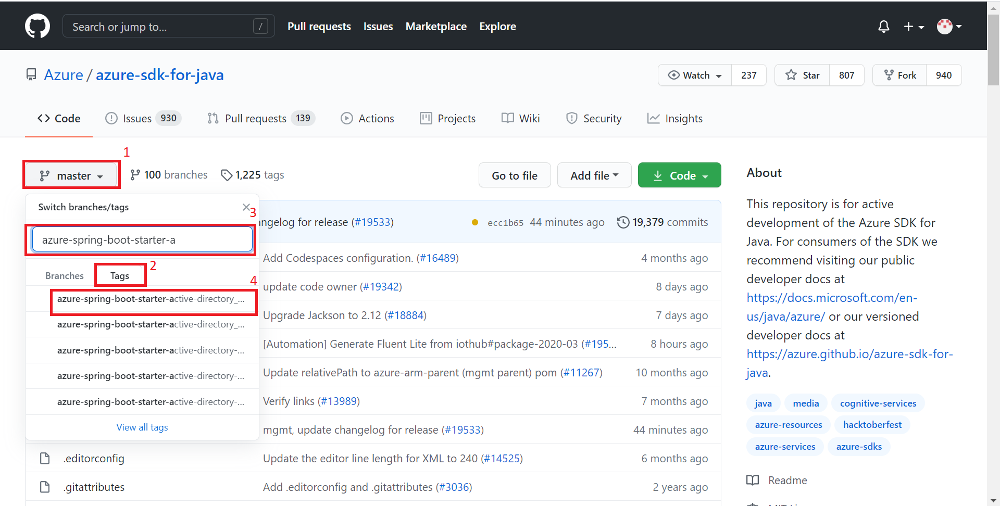
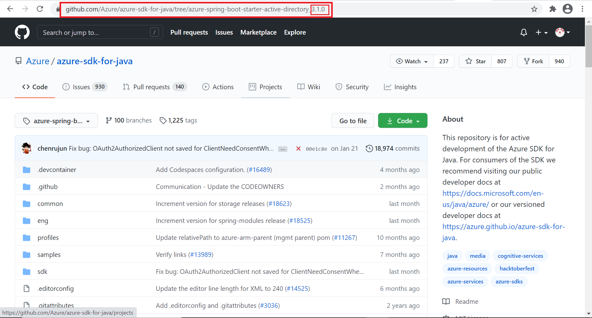

## Ready to run checklist

### Prerequisites
- [Azure Subscription][azure_subscription]
- [Java Development Kit (JDK)][jdk_link] with version 8 or above
- [Maven][maven] 3.0 or above
- Git

### Use the released version

#### Find the release tag
We **highly recommend** you refer to the `README.md` files of the released versions.
Here are the steps to get `README.md` files of the released version:  
  
1. On GitHub, navigate to the main page of the repository.  
1. Click the `main` button, then click `Tags`.   
1. In the "Find a tag" text box, input and enter the module name you want to search, such as `azure-spring-boot-starter-xxx`.  
  
1. Click one of the searched tags. (You will find that the address in your browser bar changes to that specific version. You can manually edit the address with other versions, then quickly switch to other versions.)  
  
1. Then check the README.md file there.  

#### Clone from specific version tag (recommend)
It means cloning the branch of the specific release version, replace the tag name you found in the following command.

```shell script
git clone -b <replace-the-tag> --depth 1 https://github.com/Azure/azure-sdk-for-java.git
```

### Use development version

#### Clone project from main branch
It means cloning the main branch, all the code, dependencies, and readme files are up to date.

```shell script
git clone -b main --depth 1 https://github.com/Azure/azure-sdk-for-java.git
```

#### Build module

For example, if you want to build `azure-spring-boot-starter-active-directory`, you can execute commands:

```shell script
cd azure-sdk-for-java
mvn clean install -pl .\sdk\spring\azure-spring-boot-starter-active-directory\ -am
```

You can refer [Maven CLI Options] for more detail about `-pl` and `-am`.

[Maven CLI Options]: https://maven.apache.org/ref/3.1.0/maven-embedder/cli.html
[maven]: https://maven.apache.org/
[jdk_link]: https://docs.microsoft.com/java/azure/jdk/?view=azure-java-stable
[azure_subscription]: https://azure.microsoft.com/free
