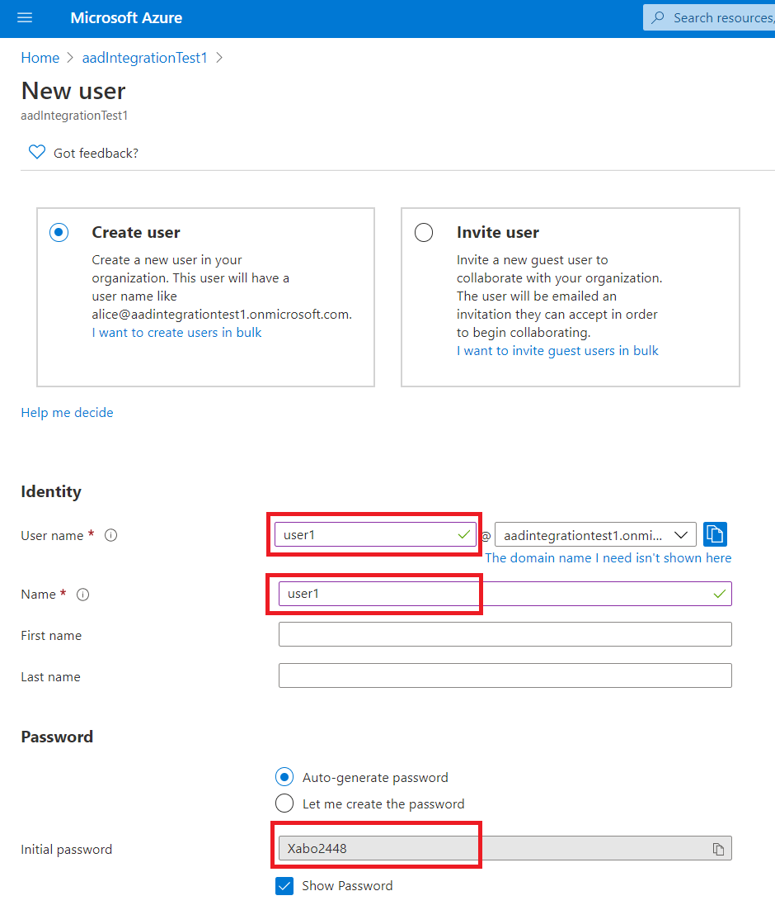
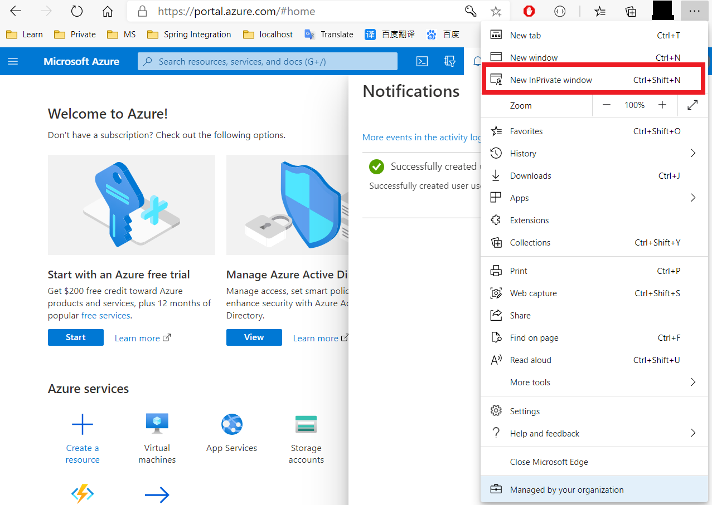
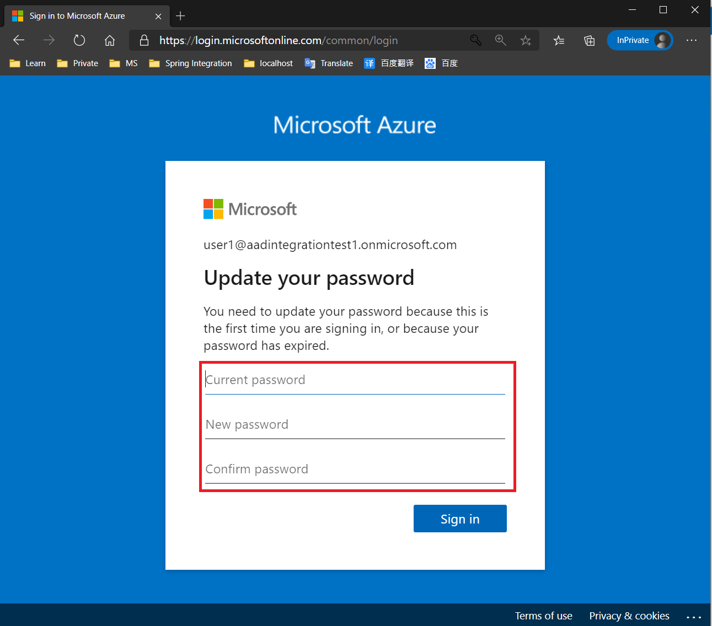
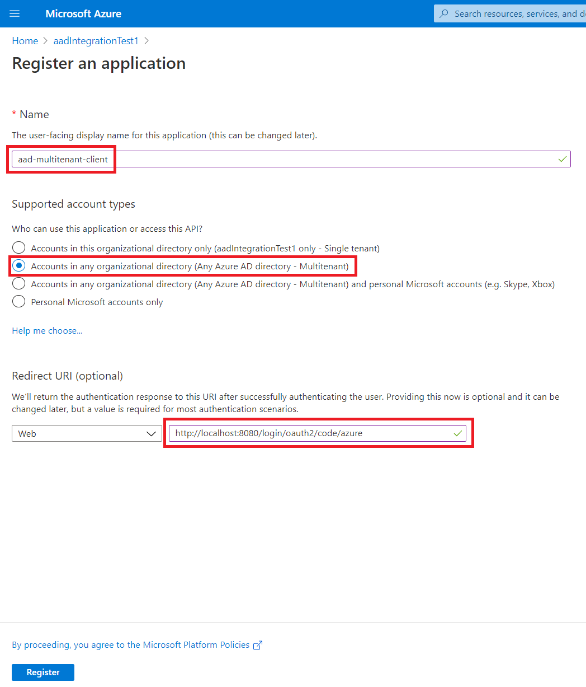
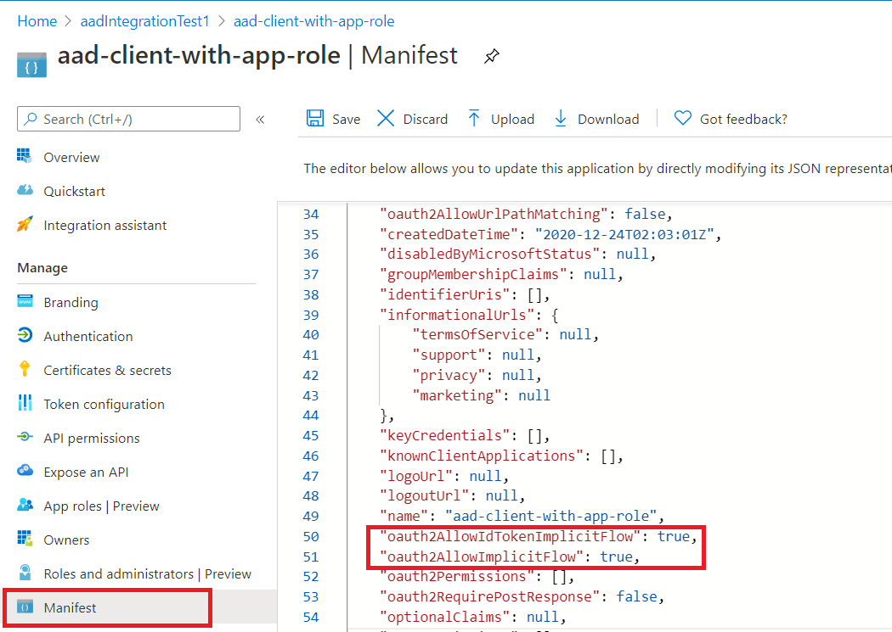
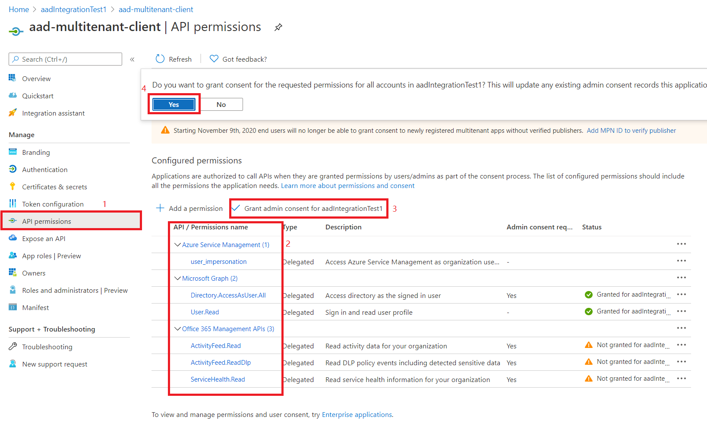
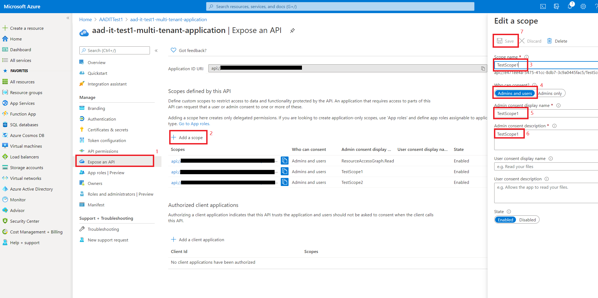
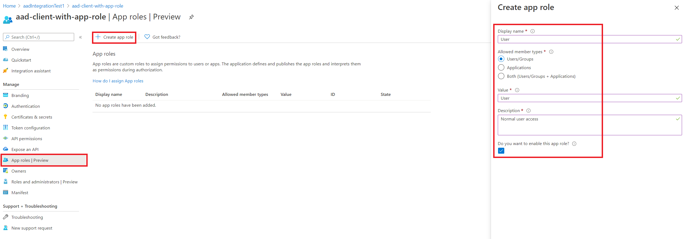

# How to run AAD integration test in localhost

## Create environment variables

Here is the list of all required environment variables:
```
AAD_TENANT_ID_1
AAD_USER_NAME_1
AAD_USER_PASSWORD_1
AAD_TENANT_ID_2
AAD_USER_NAME_2
AAD_USER_PASSWORD_2
AAD_MULTI_TENANT_CLIENT_ID
AAD_MULTI_TENANT_CLIENT_SECRET
AAD_SINGLE_TENANT_CLIENT_ID
AAD_SINGLE_TENANT_CLIENT_SECRET
AAD_SINGLE_TENANT_CLIENT_ID_WITH_ROLE
AAD_SINGLE_TENANT_CLIENT_SECRET_WITH_ROLE
```

Let's go through this document to get all these variables.

### `AAD_TENANT_ID_1`

The first tenant-id we need for AAD test.

1. Create a new tenant named `aadIntegrationTest1`. Refs: [Create a new tenant in Azure Active Directory].

2. After the tenant created successfully. Click `Tenant creation was successful. Click here to navigate to your new tanent: aadIntegrationTest1`.


3. Copy `Tenant ID`. Then we get the value of `AAD_TENANT_ID_1`.


### `AAD_USER_NAME_1`, `AAD_USER_PASSWORD_1`

1. Create a new user named `user1`. Refs: [Add or delete users using Azure Active Directory].

2. Copy the user name and initial password. In the following image, user name = `user1@aadIntegrationTest1.onmicrosoft.com`, initial password = `Xabo2448`.


3. In Edge, open an InPrivate window to change password for new created user.



4. Now we get the value of `AAD_USER_NAME_1`, `AAD_USER_PASSWORD_1`.

### `AAD_TENANT_ID_2`, `AAD_USER_NAME_2`, `AAD_USER_PASSWORD_2` 
Get `AAD_TENANT_ID_2`, `AAD_USER_NAME_2`, `AAD_USER_PASSWORD_2` with the same method.

### `AAD_MULTI_TENANT_CLIENT_ID`, `AAD_MULTI_TENANT_CLIENT_SECRET`.

1. Register an application in the new created tenant (`aadIntegrationTest1`). Refs: [Register an application with the Microsoft identity platform]


2. Create secret for `aad-multitenant-client`. Refs: [Create a new application secret]

3. Allow implicit flow


4. Add API permissions. Grant admin consent.


5. Expose API: `ResourceAccessGraph.Read`, `TestScope1`, `TestScope2`.

 
6. Now we get value of `AAD_MULTI_TENANT_CLIENT_ID`, `AAD_MULTI_TENANT_CLIENT_SECRET`.

### `AAD_SINGLE_TENANT_CLIENT_ID`, `AAD_SINGLE_TENANT_CLIENT_SECRET`
Get `AAD_SINGLE_TENANT_CLIENT_ID`, `AAD_SINGLE_TENANT_CLIENT_SECRET` with the same method.

### `AAD_SINGLE_TENANT_CLIENT_ID_WITH_ROLE`, `AAD_SINGLE_TENANT_CLIENT_SECRET_WITH_ROLE`
Get `AAD_SINGLE_TENANT_CLIENT_ID_WITH_ROLE`, `AAD_SINGLE_TENANT_CLIENT_SECRET_WITH_ROLE` with the same method.

More steps needed for this client is to set App roles.
1. Create roles


2. Assign roles by clicking: "Azure Active Directory" -> "Enterprise Application" -> choose your application -> "Users and groups" -> assign the new roles to user1. (assignment of roles to groups is not available in the free tier of AAD).

### Create groups
1. Create 2 groups: group1 and group2. Add user1 in group1, and user2 in group2.
Refs: [Create a basic group and add members using Azure Active Directory]

2. (Optional. Skip this step if you don't run `AADGroupsCountIT`, or you can ignore the test failure of `AADGroupsCountIT`) Create 111 groups: from `group1` to `group111`. Add `user1` into these groups. It's used in `AADGroupsCountIT`.


## Export environment variables

If you are using PowerShell, you can use following command to export these environment variables:
```
$env:AZURE_TEST_MODE='LIVE'
$env:AAD_TENANT_ID_1='xxxxxxxx-xxxx-xxxx-xxxx-xxxxxxxxxxxx'
$env:AAD_USER_NAME_1='user1@aadIntegrationTest1.onmicrosoft.com'
$env:AAD_USER_PASSWORD_1='xxxxxxxx'
$env:AAD_TENANT_ID_2='xxxxxxxx-xxxx-xxxx-xxxx-xxxxxxxxxxxx'
$env:AAD_USER_NAME_2='user2@aadIntegrationTest1.onmicrosoft.com'
$env:AAD_USER_PASSWORD_2='xxxxxxxx'
$env:AAD_MULTI_TENANT_CLIENT_ID='xxxxxxxx-xxxx-xxxx-xxxx-xxxxxxxxxxxx'
$env:AAD_MULTI_TENANT_CLIENT_SECRET='xxxxxxxx'
$env:AAD_SINGLE_TENANT_CLIENT_ID='xxxxxxxx-xxxx-xxxx-xxxx-xxxxxxxxxxxx'
$env:AAD_SINGLE_TENANT_CLIENT_SECRET='xxxxxxxx'
$env:AAD_SINGLE_TENANT_CLIENT_ID_WITH_ROLE='xxxxxxxx-xxxx-xxxx-xxxx-xxxxxxxxxxxx'
$env:AAD_SINGLE_TENANT_CLIENT_SECRET_WITH_ROLE='xxxxxxxx'
```

## Run AAD integration test by maven.
azure-spring-boot-test-aad:
```
mvn -f .\sdk\spring\azure-spring-boot-test-aad\pom.xml --fail-at-end "-Dmaven.javadoc.skip=true" "-Drevapi.skip=true" "-DskipSpringITs=false" verify
```
azure-spring-boot-test-aad-webapp-and-resource-server-with-obo:
```
mvn -f .\sdk\spring\azure-spring-boot-test-aad-webapp-and-resource-server-with-obo\pom.xml --fail-at-end "-Dmaven.javadoc.skip=true" "-Drevapi.skip=true" "-DskipSpringITs=false" verify
```
azure-spring-boot-test-aad-resource-server:
```
mvn -f .\sdk\spring\azure-spring-boot-test-aad-resource-server\pom.xml --fail-at-end "-Dmaven.javadoc.skip=true" "-Drevapi.skip=true" "-DskipSpringITs=false" verify
```
azure-spring-boot-test-aad-resource-server-by-filter:
```
mvn -f .\sdk\spring\azure-spring-boot-test-aad-resource-server-by-filter\pom.xml --fail-at-end "-Dmaven.javadoc.skip=true" "-Drevapi.skip=true" "-DskipSpringITs=false" verify
```


[Create a new tenant in Azure Active Directory]: https://docs.microsoft.com/azure/active-directory/fundamentals/active-directory-access-create-new-tenant
[Add or delete users using Azure Active Directory]: https://docs.microsoft.com/azure/active-directory/fundamentals/add-users-azure-active-directory
[Register an application with the Microsoft identity platform]: https://docs.microsoft.com/graph/auth-register-app-v2
[Create a new application secret]: https://docs.microsoft.com/azure/active-directory/develop/howto-create-service-principal-portal#option-2-create-a-new-application-secret
[Create a basic group and add members using Azure Active Directory]: https://docs.microsoft.com/azure/active-directory/fundamentals/active-directory-groups-create-azure-portal

