# Sample for Azure AD B2C Resource server Spring Boot client library for Java

## Key concepts
This sample illustrates how to use `azure-spring-boot-starter-active-directory-b2c` package to work in a resource server and valiate tokens. 

1. Constructs trusted iss by configuring tenant id.
2. Obtain the access token from the HTTP request header.
3. Analyze access token to `iss` and construct `JwtDecoder` by `AADIssuerJWSKeySelector`.
4. Use `JwtDecoder` to parse the access token into `Jwt`.
5. Verify `aud`, `iss`, `nbf`, `exp` claims in access token.

## Getting started
### Prerequisites
- [Environment checklist][environment_checklist]

### Create and consent Application and Delegated permissions 
1. On the **Azure AD B2C** Portal, select the application that requires roles to be added, select **Manifest**.
2. Find the `appRoles` configuration item, and add the following configuration, then click the **Save** button.
```json
  {
    "allowedMemberTypes": [
      "Application"
    ],
    "description": "Task.read",
    "displayName": "Task.read",
    "id": "d2bec026-b75f-418d-9493-8462f54f25d9",
    "isEnabled": true, 
    "value": "Test.read"
  },
  {
    "allowedMemberTypes": [
      "Application"
    ],
    "description": "Task.wirte",
    "displayName": "Task.wirte",
    "id": "1ab4eeda-d07e-4bce-8f77-b0a84c97c34f",
    "isEnabled": true,
    "value": "Test.wirte"
  }
```

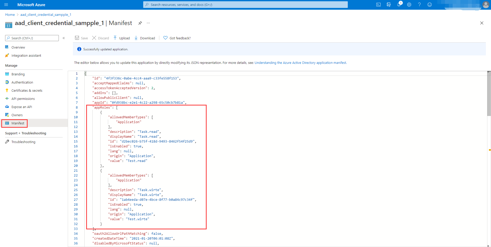

3. Find the application permissions need to use.

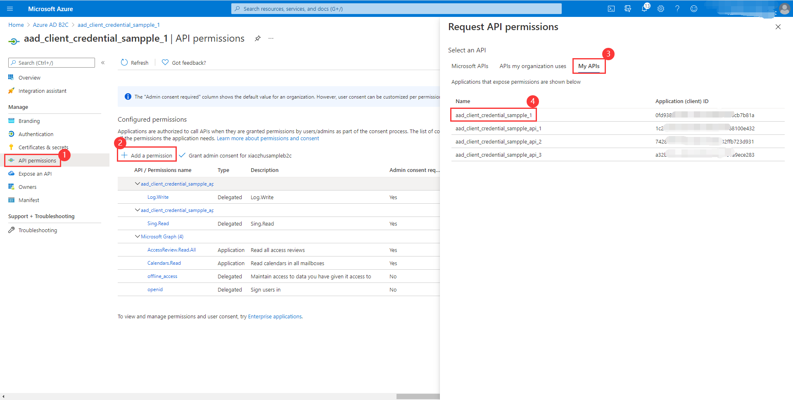
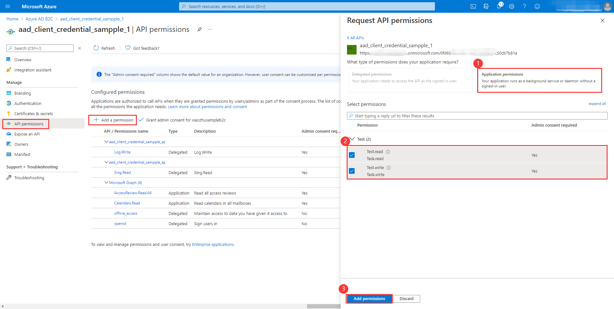

4. Expose an api.

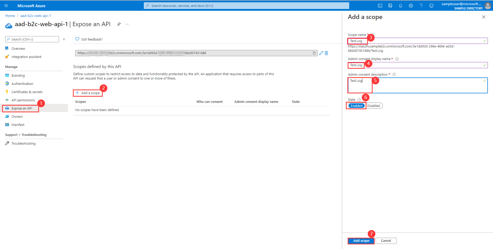

5. Add the delegated permissions.

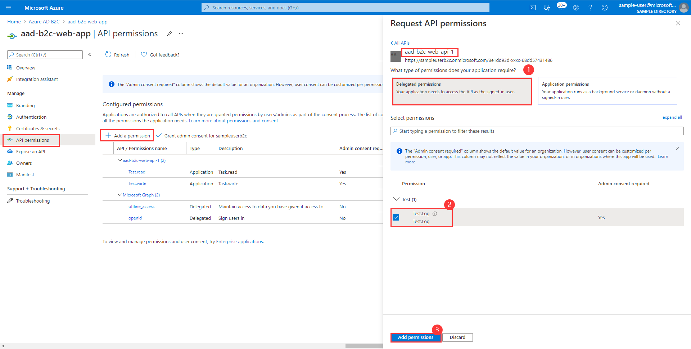

6. Consent Application permissions.

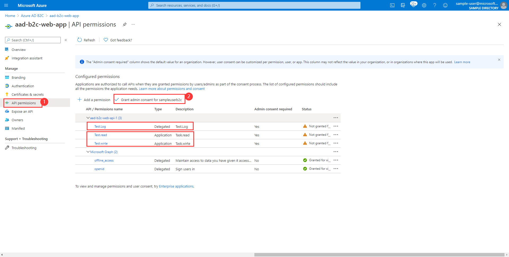

7. In the end, configuration is as follows.
   
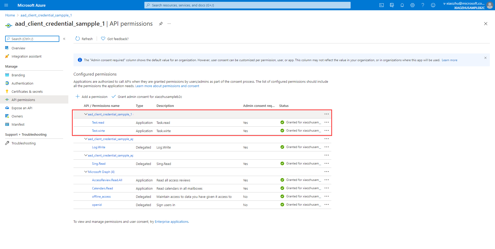

### Create User Flow
1. Add user flow on the portal.
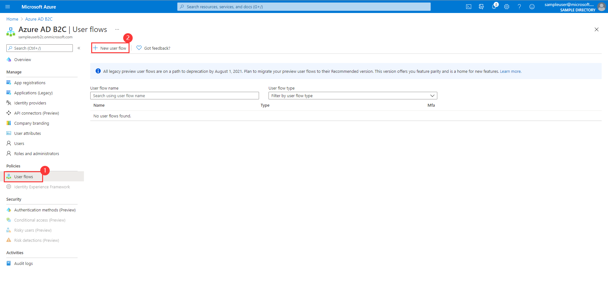
   
2. Select a user flow type.
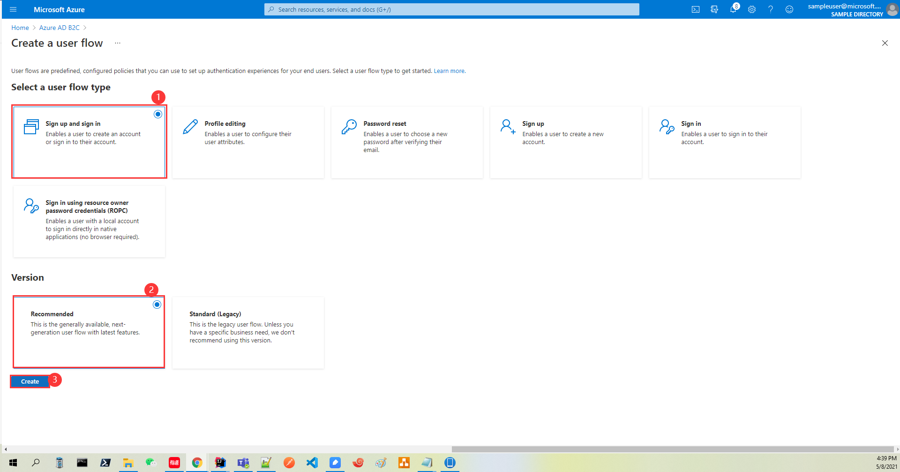

3. Setting Relevant Content.
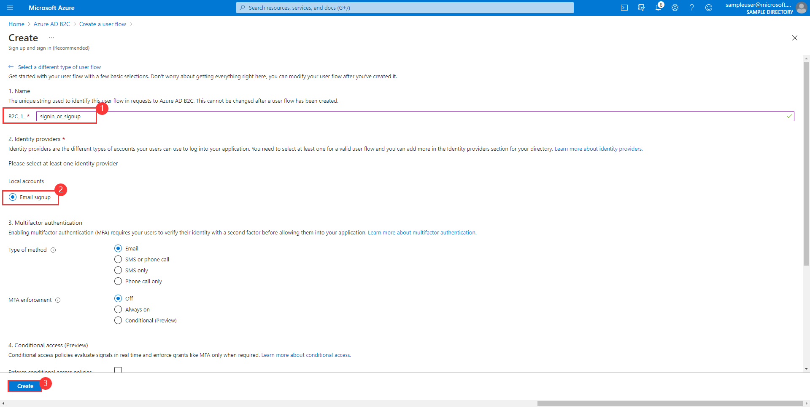
   
4. Finally, configuration is as follows.
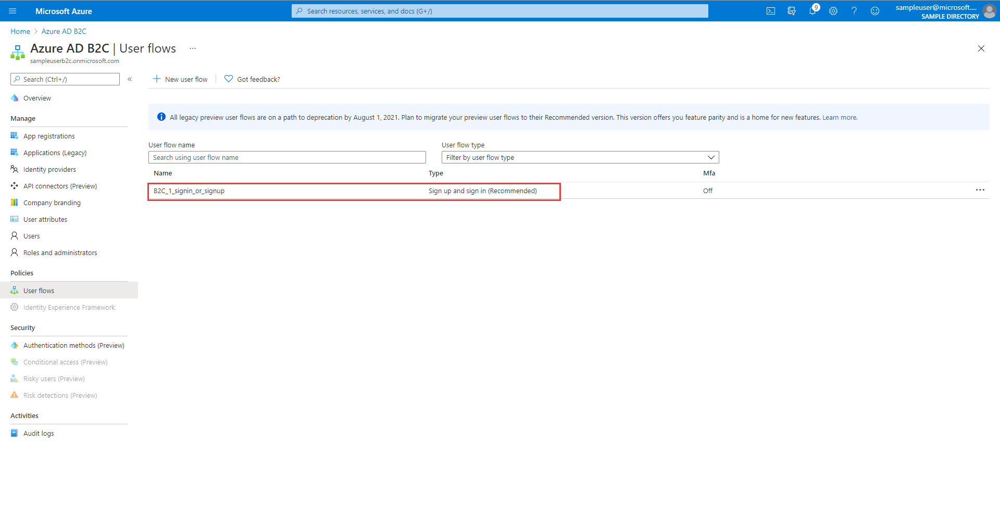
   
## Examples
### Configure the sample
#### application.yml

```yaml
# In v2.0 tokens, `aud` is always the client ID of the API, while in v1.0 tokens it can be the app id uri.
azure:
  activedirectory:
    b2c:
      tenant-id: ${your-tenant-id}
      app-id-uri: ${your-app-id-uri}         # If you are using v1.0 token, please configure app-id-uri for `aud` verification
      client-id: ${your-client-id}           # If you are using v2.0 token, please configure client-id for `aud` verification
      base-uri: ${your-base-uri}             # Such as: https://xxxxb2c.b2clogin.com
      user-flows:
        sign-up-or-sign-in: ${sign-up-or-sign-in-user-flow-name}
```

### Run with Maven
```
cd azure-spring-boot-samples/azure-spring-boot-sample-active-directory-b2c-resource-server
mvn spring-boot:run
```

### Access the Web API
We could use Postman to simulate a Web APP to send a request to a Web API.

```http request
GET /write HTTP/1.1
Authorization: Bearer eyJ0eXAiO ... 0X2tnSQLEANnSPHY0gKcgw
```
```http request
GET /read HTTP/1.1
Authorization: Bearer eyJ0eXAiO ... 0X2tnSQLEANnSPHY0gKcgw
```
```http request
GET /log HTTP/1.1
Authorization: Bearer eyJ0eXAiO ... 0X2tnSQLEANnSPHY0gKcgw
```

## Troubleshooting
- `WWW-Authenticate: Bearer error="invalid_token", error_description="An error occurred while attempting to decode the Jwt: Couldn't retrieve remote JWK set: Read timed out",`
  
    While running sample, if error occurs with logs above:
    - `azure-activedirectory-b2c:jwt-read-timeout` to set longer read time in `application.yml`.
    
### FAQ
#### How do I delete or modify Application Permissions in Portal?
You can set `isEnabled` to `false` in the manifest's JSON configuration.Then delete or modify it.

## Next steps
## Contributing
<!-- LINKS -->
[environment_checklist]: https://github.com/Azure/azure-sdk-for-java/blob/master/sdk/spring/ENVIRONMENT_CHECKLIST.md#ready-to-run-checklist
