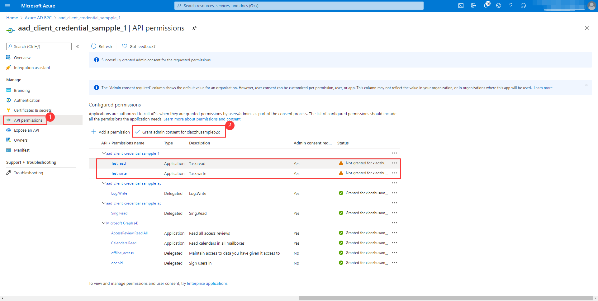

# Sample for Azure AD B2C Resource server Spring Boot client library for Java

## Key concepts
This sample illustrates how to use `azure-spring-boot-starter-active-directory-b2c` package to work with OAuth 2.0 and OpenID Connect protocols with Azure AD B2C to secure web services.

## Getting started

### Environment checklist
We need to ensure that this [environment checklist][ready-to-run-checklist] is completed before the run.

### Create your Azure Active Directory B2C tenant
Follow the guide of [AAD B2C tenant creation](https://docs.microsoft.com/azure/active-directory-b2c/tutorial-create-tenant).

### Register your Azure Active Directory B2C application
Follow the guide of [AAD B2C application registry](https://docs.microsoft.com/azure/active-directory-b2c/tutorial-register-applications).
Please ensure that your b2c application's `Redirect URL` is configured to `http://localhost:8080/login/oauth2/code/`.

### Create user flows
Follow the guide of [AAD B2C user flows creation](https://docs.microsoft.com/azure/active-directory-b2c/tutorial-create-user-flows).

### Create and consent Application permissions
1. On the **Azure AD B2C** Portal, select the application that requires roles to be added, select **Manifest**.
2. Find the `appRoles` configuration item, and add the following configuration, then click the **Save** button.
```json
  {
    "allowedMemberTypes": [
      "Application"
    ],
    "description": "Task.read",
    "displayName": "Task.read",
    "id": "d2bec026-b75f-418d-9493-8462f54f25d9",
    "isEnabled": true, 
    "value": "Test.read"
  },
  {
    "allowedMemberTypes": [
      "Application"
    ],
    "description": "Task.wirte",
    "displayName": "Task.wirte",
    "id": "1ab4eeda-d07e-4bce-8f77-b0a84c97c34f",
    "isEnabled": true,
    "value": "Test.wirte"
  }
```

3. Find the application permissions need to use.
4. Consent Application permissions.
5. In the end, configuration is as follows:

## Examples
### Configure the sample

#### application.yml

1. Fill in `${your-tenant-authorization-server-base-uri}` from **Azure AD B2C** portal `App registrations` page, select **Endpoints**, copy the base endpoint uri(Global cloud format may looks like
`https://{your-tenant-name}.b2clogin.com/{your-tenant-name}.onmicrosoft.com`, China Cloud looks like `https://{your-tenant-name}.b2clogin.cn/{your-tenant-name}.partner.onmschina.cn`).
  
    **NOTE**: The `azure.activedirectory.b2c.tenant` has been deprecated. Please use `azure.activedirectory.b2c.base-uri` instead.

2. Select one registered instance under `Applications` from portal, and then:
    1. Fill in `${your-client-id}` from `Application ID`.
    2. Fill in `${your-client-secret}` from one of `Keys`.
3. Add your user flows defined on the Azure Portal under the `user-flows` configuration, which is a map, you can give each user flow a key and the value will be the name of user flow defined in AAD B2C. 
   By default, we use the key `sign-up-or-sign-in` for a **login** user flow and `password-reset` for the **Password reset** type user flow, you can choose to override them.
4. Fill in `${your-login-user-flow-key}` with the key of your login user flow, we will use the value `sign-up-or-sign-in` to look up the user-flows map if this property is not provided.   
5. Replace `${your-logout-success-url}` to `http://localhost:8080/login`.

```yaml
azure:
  activedirectory:
    b2c:
      base-uri: ${your-tenant-authorization-server-base-uri}
      client-id: ${your-client-id}
      client-secret: ${your-client-secret}
      login-flow: ${your-login-user-flow-key}               # default to sign-up-or-sign-in, will look up the user-flows map with provided key.
      logout-success-url: ${your-logout-success-url}
      user-flows:
        password-reset: ${your-profile-edit-user-flow}
        profile-edit: ${your-password-reset-user-flow}
        sign-up-or-sign-in: ${your-sign-up-or-in-user-flow}
      user-name-attribute-name: ${your-user-name-claim}
      tenant-id: ${your-tenant-id}
      app-id-uri: ${your-app-id-uri}         # If you are using v1.0 tokens, configure app-id-uri to properly complete the audience validation. 
```

**NOTE**: If both `tenant` and `baseUri` are configured at the same time, only `baseUri` takes effect.

### Run with Maven
```
cd azure-spring-boot-samples/azure-spring-boot-sample-active-directory-b2c-resource-server
mvn spring-boot:run
```

### Validation

1. Access `http://localhost:8080/` as index page.
2. Sign up/in.
3. Profile edit.
4. Password reset.
5. Log out.
6. Sign in.

### Access the Web API
We could use Postman to simulate a Web APP to send a request to a Web API.

**NOTE**: The `aud` in access token should be the current Web API.

```http request
GET /write HTTP/1.1
Authorization: Bearer eyJ0eXAiO ... 0X2tnSQLEANnSPHY0gKcgw
```
```http request
GET /read HTTP/1.1
Authorization: Bearer eyJ0eXAiO ... 0X2tnSQLEANnSPHY0gKcgw
```

## Troubleshooting
- `Missing attribute 'name' in attributes `

  ```
  java.lang.IllegalArgumentException: Missing attribute 'name' in attributes
  	at org.springframework.security.oauth2.core.user.DefaultOAuth2User.<init>(DefaultOAuth2User.java:67) ~[spring-security-oauth2-core-5.3.6.RELEASE.jar:5.3.6.RELEASE]
  	at org.springframework.security.oauth2.core.oidc.user.DefaultOidcUser.<init>(DefaultOidcUser.java:89) ~[spring-security-oauth2-core-5.3.6.RELEASE.jar:5.3.6.RELEASE]
  	at org.springframework.security.oauth2.client.oidc.userinfo.OidcUserService.loadUser(OidcUserService.java:144) ~[spring-security-oauth2-client-5.3.6.RELEASE.jar:5.3.6.RELEASE]
  	at org.springframework.security.oauth2.client.oidc.userinfo.OidcUserService.loadUser(OidcUserService.java:63) ~[spring-security-oauth2-client-5.3.6.RELEASE.jar:5.3.6.RELEASE]
  ```

  While running sample, if error occurs with logs above:

  - make sure that while creating user workflow by following this [guide](https://docs.microsoft.com/azure/active-directory-b2c/tutorial-create-user-flows), for **User attributes and claims** , attributes and claims for **Display Name** should be chosen.
---
- `Missing 'tenant-id' in application.yml`
    
    ```
    Method springSecurityFilterChain in org.springframework.security.config.annotation.web.configuration.WebSecurityConfiguration required a bean of type 'org.springframework.security.oauth2.jwt.JwtDecoder' that could not be found.
        The following candidates were found but could not be injected:
        - Bean method 'jwtDecoder' in 'AADResourceServerConfiguration' not loaded because @ConditionalOnResource did not find resource 'classpath:aad.enable.config'
        - Bean method 'jwtDecoder' in 'AADB2CResourceServerAutoConfiguration' not loaded because @ConditionalOnProperty (azure.activedirectory.b2c.tenant-id) did not find property 'tenant-id'
        - Bean method 'jwtDecoderByIssuerUri' in 'OAuth2ResourceServerJwtConfiguration.JwtDecoderConfiguration' not loaded because OpenID Connect Issuer URI Condition did not find issuer-uri property
        - Bean method 'jwtDecoderByJwkKeySetUri' in 'OAuth2ResourceServerJwtConfiguration.JwtDecoderConfiguration' not loaded because @ConditionalOnProperty (spring.security.oauth2.resourceserver.jwt.jwk-set-uri) did not find property 'spring.security.oauth2.resourceserver.jwt.jwk-set-uri'
        - Bean method 'jwtDecoderByPublicKeyValue' in 'OAuth2ResourceServerJwtConfiguration.JwtDecoderConfiguration' not loaded because Public Key Value Condition did not find public-key-location property
    ```

    While running sample, if error occurs with logs above:
    - `azure-activedirectory-b2c:tenant-id` should be added to the `application.yml`.
---
- `WWW-Authenticate: Bearer error="invalid_token", error_description="An error occurred while attempting to decode the Jwt: Couldn't retrieve remote JWK set: Read timed out",`
  
    While running sample, if error occurs with logs above:
    - `azure-activedirectory-b2c:jwt-read-timeout` to set longer read time in `application.yml`.
    
### FAQ
#### Sign in with loops to B2C endpoint ?
This issue almost due to polluted cookies of `localhost`. Clean up cookies of `localhost` and try it again.

#### More identity providers from AAD B2C login ?
Follow the guide of [Set up Google account with AAD B2C](https://docs.microsoft.com/azure/active-directory-b2c/active-directory-b2c-setup-goog-app).
And also available for Amazon, Azure AD, FaceBook, Github, Linkedin and Twitter.

#### How do I delete or modify Application Permissions in Portal?
You Can set `isEnabled` to `false` in the manifest's JSON configuration.Then delete or modify it.

## Next steps
## Contributing
<!-- LINKS -->

[ready-to-run-checklist]: https://github.com/Azure/azure-sdk-for-java/blob/master/sdk/spring/azure-spring-boot-samples/README.md#ready-to-run-checklist
