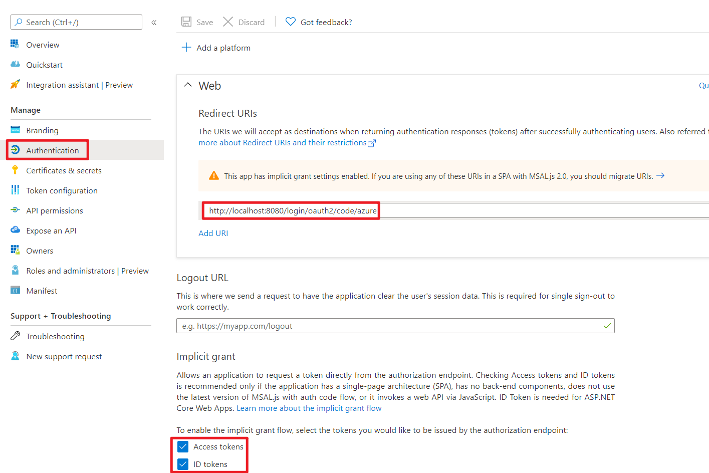
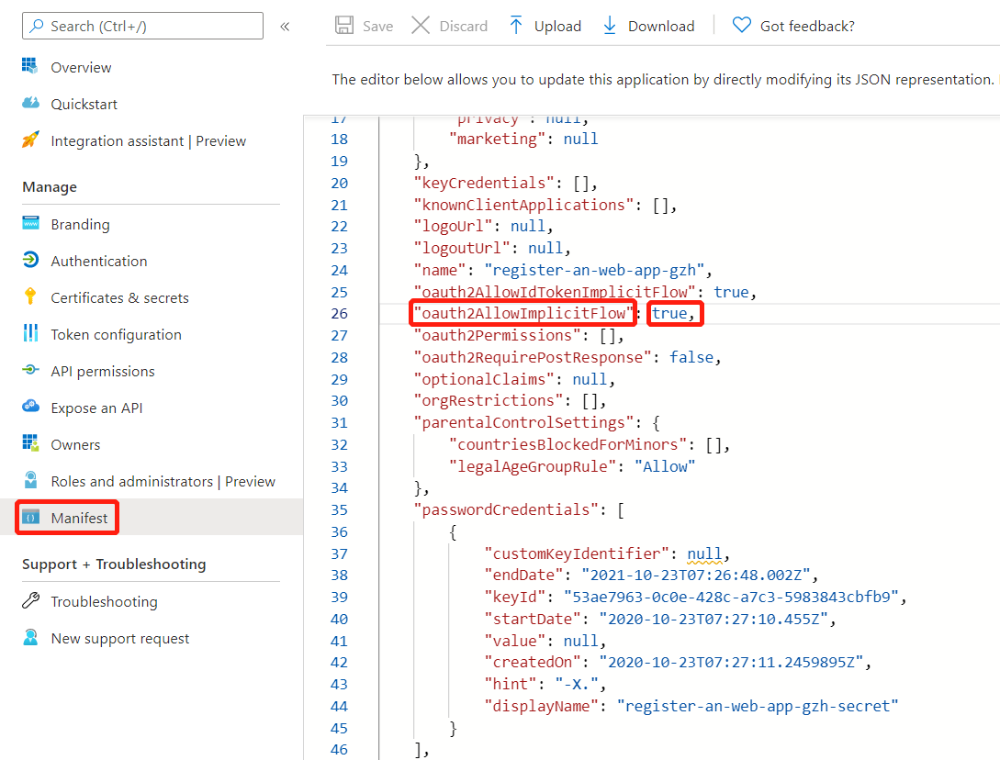

# OAuth 2.0 Sample for Azure AD Spring Boot Starter client library for Java

## Key concepts
This sample illustrates how to use `azure-spring-boot-starter-active-directory` package to work with OAuth 2.0 and OpenID Connect protocols on Azure. This sample will use default Azure Active Directory Graph API to query user info.

## Getting started

### Environment setup
We need to ensure that this [environment setup][environment-setup] is completed before the run.

### Register your application with your Azure Active Directory Tenant

Follow the guide [here](https://docs.microsoft.com/azure/active-directory/develop/active-directory-protocols-oauth-code#register-your-application-with-your-ad-tenant).

### Platform configurations



- Set redirect URIs with `http://localhost:8080/login/oauth2/code/azure`.
- Ensure **Access tokens** and **ID tokens** are selected.

### Configure groups for sign in user

In order to try the authorization action with this sample with minimum effort, [configure the user and groups in Azure Active Directory](https://docs.microsoft.com/azure/active-directory/active-directory-groups-create-azure-portal), configure the user with `group1`. 

## Examples

### Configure application.properties
```properties
azure.activedirectory.tenant-id=xxxxxx-your-tenant-id-xxxxxx
spring.security.oauth2.client.registration.azure.client-id=xxxxxx-your-client-id-xxxxxx
spring.security.oauth2.client.registration.azure.client-secret=xxxxxx-your-client-secret-xxxxxx
# It's suggested the logged in user should at least belong to one of the below groups
# If not, the logged in user will not be able to access any authorization controller rest APIs
azure.activedirectory.user-group.allowed-groups=group1, group2
```

If `azure.activedirectory.tenant-id` is configured, `AADOAuth2LoginSecurityConfig` will take effect and this app will use AAD to authentication and authorization.
If `azure.activedirectory.tenant-id` is **NOT** configured, `NoLoginSecurityConfig` will take effect and this app will **NOT** use AAD to  authentication and authorization.


### Run with Maven
```shell
cd azure-spring-boot-samples/azure-spring-boot-sample-active-directory-backend
mvn spring-boot:run
```

### Check the authentication and authorization
	
1. Access http://localhost:8080
2. Login
3. Access `group1 Message` link, should success
4. Access `group2 Message` link, should fail with forbidden error message


## Troubleshooting

### If registered application is multi-tenanted, how to run this sample?
Set `azure.activedirectory.tenant-id=common` in your application.properties file:
```properties
azure.activedirectory.tenant-id=common
```
----
### Meet with `AADSTS240002: Input id_token cannot be used as 'urn:ietf:params:oauth:grant-type:jwt-bearer' grant` error.
In Azure portal, app registration Manifest page, configure `oauth2AllowImplicitFlow` in your application manifest to be `true`.   
See [this issue][issuecomment-387090099] for details on this workaround.



## Next steps
## Contributing
<!-- LINKS -->

[environment-setup]: https://github.com/Azure/azure-sdk-for-java/blob/master/sdk/spring/azure-spring-boot-samples/README.md#environment-setup
[issuecomment-387090099]: https://github.com/MicrosoftDocs/azure-docs/issues/8121#issuecomment-387090099
