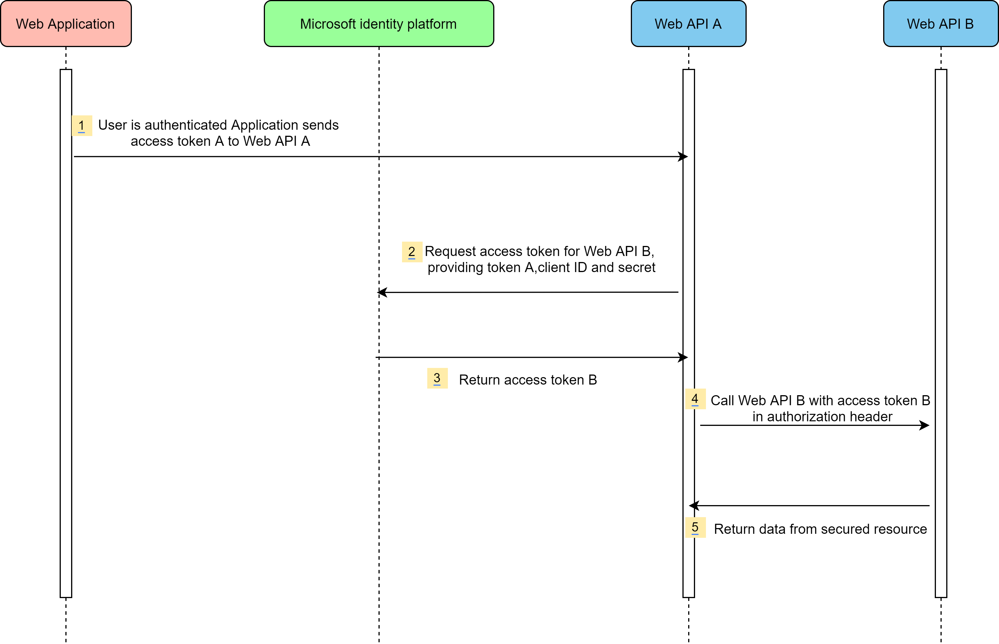
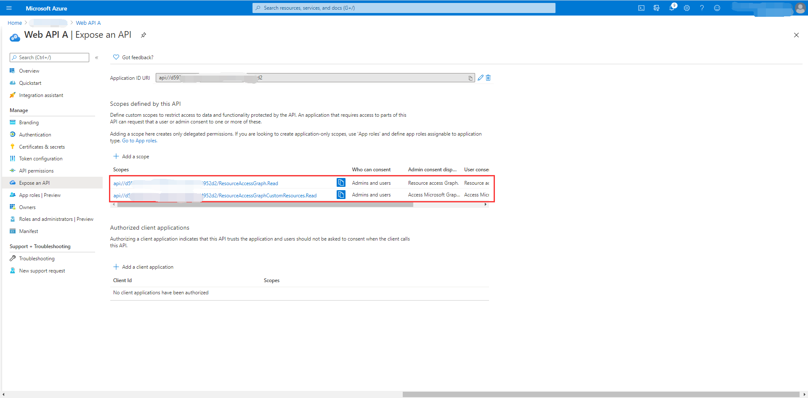
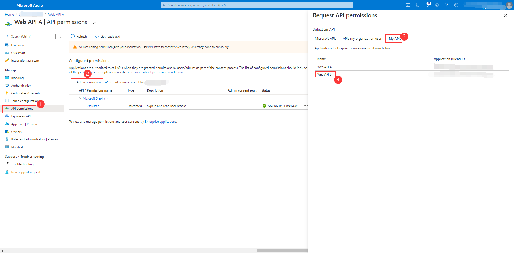
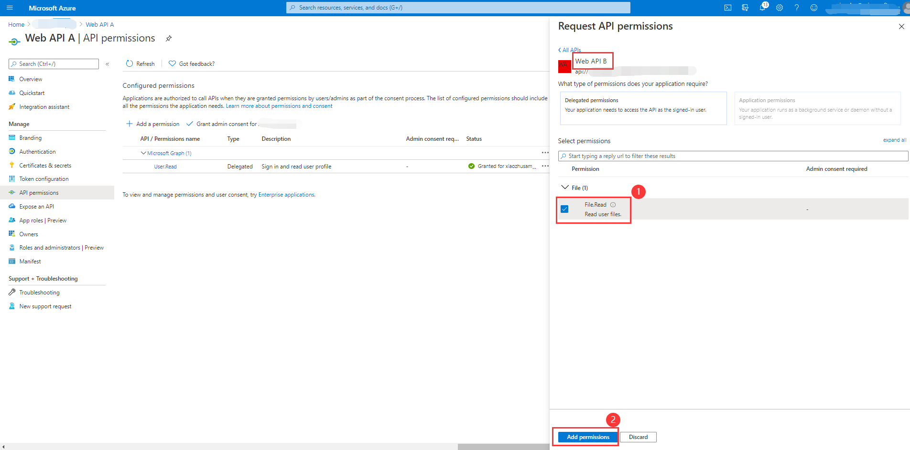
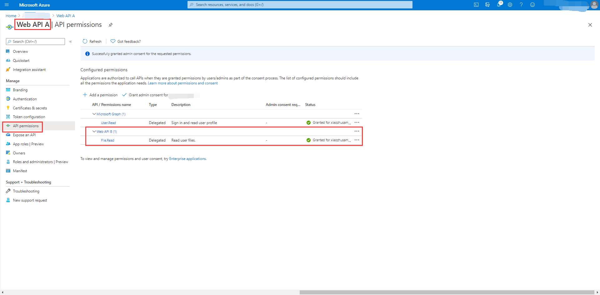

# OAuth 2.0 Sample for azure-spring-boot-sample-active-directory-resource-server-obo library for Java

## Key concepts
[Resource server access other resources usage] is an extension scenario of the *azure-spring-boot-sample-active-directory-resource-server* sample. Similarly, this sample illustrates how to protect a Java web API by restricting access to its resources to authorized accounts, and the restricted resource will access other restricted resource, such as Graph API and Custom API.

### Protocol diagram
Assume that the user has been authenticated on an application using the OAuth 2.0 authorization code grant flow or another login flow. At this point, the application has an access token for API A (token A) with the user's claims and consent to access the middle-tier web API (API A). Now, API A needs to make an authenticated request to the downstream web API (API B).
The steps that follow constitute the OBO flow and are explained with the help of the following diagram.


1. The client application makes a request to API A with token A (with an aud claim of API A).
2. API A authenticates to the Microsoft identity platform token issuance endpoint and requests a token to access API B.
4. The Microsoft identity platform token issuance endpoint validates API A's credentials along with token A and issues the access token for API B (token B) to API A.
4. Token B is set by API A in the authorization header of the request to API B.
5. Data from the secured resource is returned by API B to API A, and from there to the client.

## Getting started
We will prepare two application to demonstrate the dependent calls of resources. 
Another sample [azure-spring-boot-sample-active-directory-resource-server] will be as Custom API resource (let's call it Web API B).

### Environment checklist
We need to ensure that this [environment checklist][ready-to-run-checklist] is completed before the run.

### Configure your middle-tier Web API A
1. Expose two scopes for ***Web API A***, `Obo.Graph.Read` and `Obo.File.Read`. The **Application ID URI** is generated by default.  

2. Select **API permissions** > **Add a permission** > **My APIs**, select ***Web API B*** application name. 
3. **Delegated permissions** is selected by default， Select **File** > **File.Read** permission, select **Add permission** to complete the process.
4. Grant admin consent for ***Web API B*** permissions.

See [OAuth 2.0 On-Behalf-Of flow] for more information about OBO.

## Examples
### Configure application.yml
```yaml
azure:
  activedirectory:
    client-id: <Web-API-A-client-id>
    client-secret: <Web-API-A-client-secret>
    tenant-id: <tenant-id-registered-by-application>
    app-id-uri: <Web-API-A-app-id-url>
    authorization-clients:
      graph:
        scopes:
          - https://graph.microsoft.com/User.Read
      custom:
        scopes:
          - <Web-API-B-app-id-url>/File.Read
```

### Run with Maven
```shell
cd azure-spring-boot-samples/azure-spring-boot-sample-active-directory-resource-server-obo
mvn spring-boot:run
```

### Access the Web API A
First, you need to obtain an access token to access Web API A.
- Web API A will call Graph resource. 
```shell script
# Replace to valid access token.
curl localhost:8081/call-graph -H "Authorization: Bearer <replace-the-access-token>"
```
Verify response:
```text
Graph response success.
```

- Web API A will call Graph resource through `OAuth2AuthorizedClientRepository`. 

```shell script
# Replace to valid access token.
curl localhost:8081/call-graph-with-repository -H "Authorization: Bearer <replace-the-access-token>"
```

Verify response:
```text
Graph response success.
```

- Web API A will call Custom(Web API B) resources. 

```shell script
# Replace to valid access token.
curl localhost:8081/call-custom -H "Authorization: Bearer <replace-the-access-token>"
```

Verify response:
```text
Custom response success.
```

## Troubleshooting

## Next steps
## Contributing

<!-- LINKS -->
[Azure portal]: https://portal.azure.com/
[ready-to-run-checklist]: https://github.com/Azure/azure-sdk-for-java/blob/master/sdk/spring/azure-spring-boot-samples/README.md#ready-to-run-checklist
[Resource server access other resources usage]: https://github.com/Azure/azure-sdk-for-java/tree/master/sdk/spring/azure-spring-boot-starter-active-directory#resource-server-access-other-resources-usage
[azure-spring-boot-sample-active-directory-resource-server]: https://github.com/Azure/azure-sdk-for-java/tree/master/sdk/spring/azure-spring-boot-samples/azure-spring-boot-sample-active-directory-resource-server
[OAuth 2.0 On-Behalf-Of flow]: https://docs.microsoft.com/azure/active-directory/develop/v2-oauth2-on-behalf-of-flow
