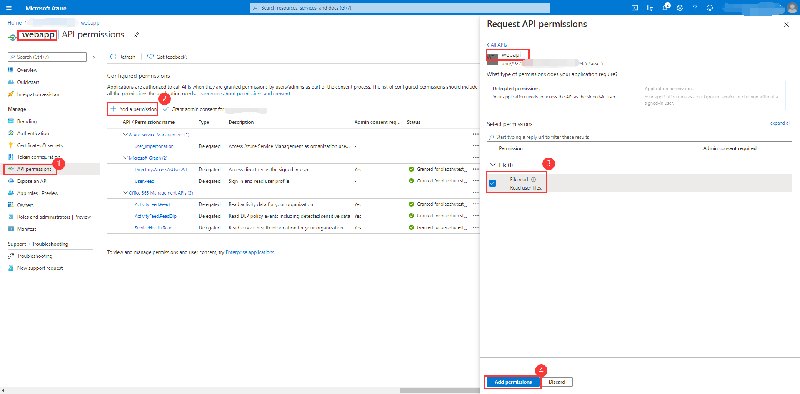
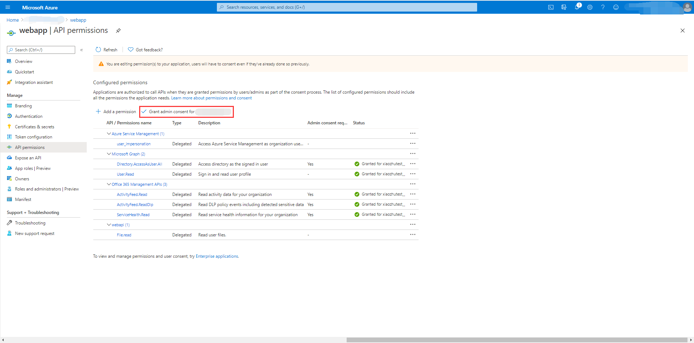
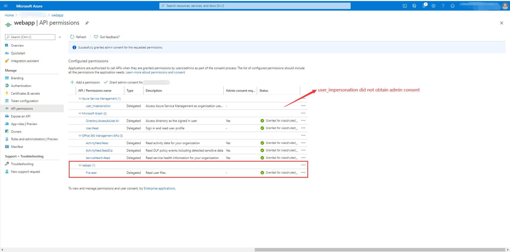

# OAuth 2.0 Sample for Azure AD Spring Boot Starter Resource Server library for Java

## Key concepts
This sample illustrates how to protect a Java web API by restricting access to its resources to authorized accounts only.

1. Obtain the access token from the HTTP request header.
2. Use `JwtDecoder` to parse the access token into `Jwt`.
3. Verify `aud`, `iss`, `nbf`, `exp` claims in access token.
4. Extract information from JWT and wrap them in `AADOAuth2AuthenticatedPrincipal` object.
5. Save the `AADOAuth2AuthenticatedPrincipal` into SecurityContext.

## Getting started
### Environment checklist
We need to ensure that this [environment checklist][ready-to-run-checklist] is completed before the run.

### Include the package
```xml
<dependencies>
    <dependency>
      <groupId>com.azure.spring</groupId>
      <artifactId>azure-spring-boot-starter-active-directory</artifactId>
    </dependency>
    <dependency>
      <groupId>org.springframework.security</groupId>
      <artifactId>spring-security-oauth2-resource-server</artifactId>
    </dependency>
    <dependency>
      <groupId>org.springframework.security</groupId>
      <artifactId>spring-security-oauth2-jose</artifactId>
    </dependency>
  </dependencies>
```

### Configure web api
1. Search for and select your tenant in **Azure Active Directory**.
2. Under **Manage** In the same tenant, select **App registrations** -> **New registration**.
3. The registered application name is filled into `webapi`, select **Accounts in this organizational directory only**, click the **register** button.
4. Under **webapi** application, select **Certificates & secrets** -> **new client secret**, expires select **Never**, click the **add** button.(Remember to save the secrets here and use them later.)
5. Under **webapi** application, select **Expose an API** -> **Add a scope**, Use the default Application ID URI, click **Save and continue** button.
6. After step five,the page will refresh again. Then set the **Scope name** to `File.Read`.(This scope will be used in application.yml.)
7. Finally, the api exposed in `webapi`.

See [Expose scoped permission to web api] for more information about web api.

### Configure web app
If you are not familiar with web app, you can refer this [azure-spring-boot-sample-active-directory-webapp].
1. Add custom apis in the `webapi` to `webapp`.
2. Under **webapp** application, select **API permissions** -> **Add a permission** -> **My APIS**, select **webapi** tab, add **File.read** permission,click **Add permissions** button.
3. click **Grant admin consent for...**.
4. Manually remove the admin consent for **user_impersonation**.(Ensure that the authorization in `webapp` is not changed.)

See [Configure a client application to access a web api] for more information about web app.

## Examples
### Configure application.yml

Add the following to appapplication.yml in webapp.
```yaml
azure:
  activedirectory:
    authorization:
      webapi:
        scopes: api://xxxxx-xxxxxxx-xxxxxxx/File.read
  ```

Modify application.yml in webapi.
```yaml
#If we configure the azure.activedirectory.client-id or azure.activedirectory.app-id-uri will be to check the audience.
#In v2.0 tokens, this is always client id of the app, while in v1.0 tokens it can be the client id or the application id url used in the request.
#If you are using v1.0 tokens, configure both to properly complete the audience validation.

azure:
  activedirectory:
    client-id: <client-id>
    app-id-uri: <app-id-uri>
```
**NOTE**：Set the `server.port` in the application.yml of `webapp` and `webapi` to different value.

### If you want to create your own webapi
Add code(The code here is just an example to show the process.) to webapp's `ClientController.java`.
```java
@GetMapping("/webapi")
@ResponseBody
public String webapi(
@RegisteredOAuth2AuthorizedClient("webapi") OAuth2AuthorizedClient oAuth2AuthorizedClient) {
    String accessToken = oAuth2AuthorizedClient.getAccessToken().getTokenValue();
    //The URL of a protected resource in webapi.
    String webapiUrl = "http://localhost:<your-Configured-server-port>/file";
    //String webapiUrl = "http://localhost:<your-Configured-server-port>/user";
    RestTemplate client = new RestTemplate();
    HttpHeaders headers = new HttpHeaders();
    HttpMethod method = HttpMethod.GET;
    headers.set("Authorization", "Bearer " + accessToken);
    HttpEntity<MultiValueMap<String, String>> requestEntity = new HttpEntity<>(headers);
    ResponseEntity<String> response = client
    .exchange(webapiUrl, method, requestEntity, String.class);
    return response.getBody();
}
```

### Run with Maven 
First, let's start `azure-spring-boot-sample-active-directory-resource-server`.
```shell
# Under sdk/spring project root directory
cd azure-spring-boot-samples/azure-spring-boot-sample-active-directory-resource-server
mvn spring-boot:run
```

Then start `azure-spring-boot-sample-active-directory-webapp`.
```shell
# Under sdk/spring project root directory
cd azure-spring-boot-samples/azure-spring-boot-sample-active-directory-webapp
mvn spring-boot:run
```

### Check the authentication and authorization
1. If the webapp access is webapi's `http://localhost:<your-Configured-server-port>/file` link: success.
2. If the webapp access is webapi's `http://localhost:<your-Configured-server-port>/user` link: fail with error message.

## Troubleshooting

## Next steps
## Contributing
<!-- LINKS -->
[jdk_link]: https://docs.microsoft.com/java/azure/jdk/?view=azure-java-stable
[ready-to-run-checklist]: https://github.com/Azure/azure-sdk-for-java/blob/master/sdk/spring/azure-spring-boot-samples/README.md#ready-to-run-checklist
[Expose scoped permission to web api]: https://docs.microsoft.com/azure/active-directory/develop/quickstart-configure-app-expose-web-apis
[azure-spring-boot-sample-active-directory-webapp]: https://github.com/Azure/azure-sdk-for-java/blob/master/sdk/spring/azure-spring-boot-samples/azure-spring-boot-sample-active-directory-webapp/README.md
[Configure a client application to access a web api]: https://docs.microsoft.com/azure/active-directory/develop/quickstart-configure-app-access-web-apis
