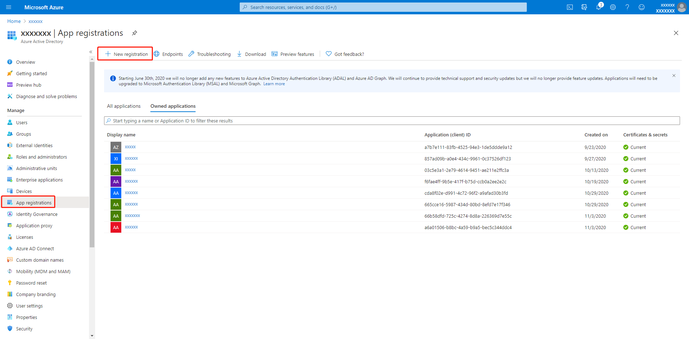
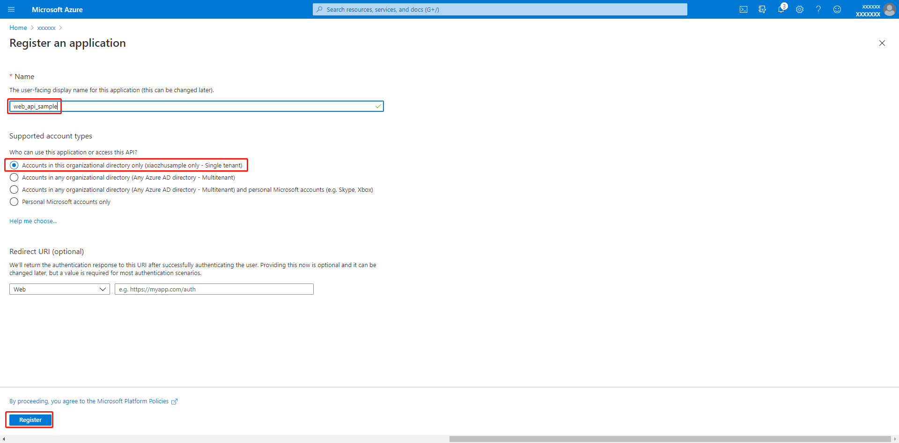
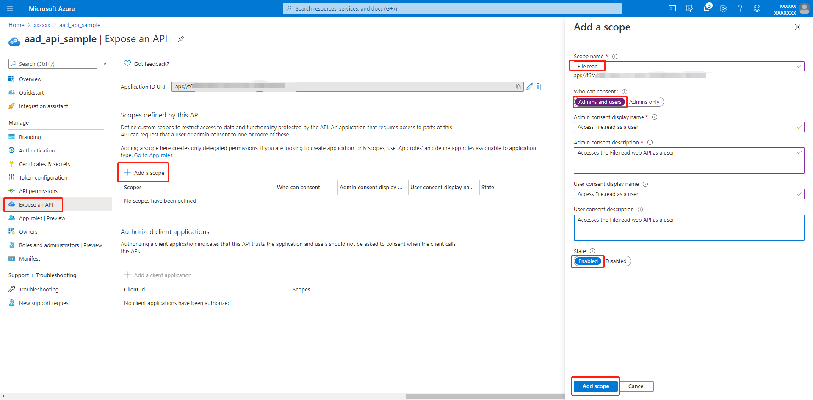

# OAuth 2.0 Sample for Azure AD Spring Boot Starter Resource Server library for Java

## Key concepts
This sample illustrates how to protect a Java web API by restricting access to its resources to authorized accounts only.
The bearer token is obtained in the request header and analyzed and validated. After verification,
add AzureOAuth2AuthenticatedPrincipal object to SecurityContext, the object that is associated with the current user request thread.
Token ClaimsSet, Authorities, JWS headers etc. are accessible from the object.


## Getting started

To run this sample, you'll need:

- A [Java Development Kit (JDK)][jdk_link], version 1.8 or above.
- [Maven](https://maven.apache.org/) 3.0 or above
- An Internet connection
- A Window machine (necessary if you want to run the app on Windows)
- An OS X machine (necessary if you want to run the app on Mac)
- A Linux machine (necessary if you want to run the app on Linux)
- An Azure Active Directory (Azure AD) tenant. For more information on how to get an Azure AD tenant, see [How to get an Azure AD tenant](https://azure.microsoft.com/documentation/articles/active-directory-howto-tenant/)
- You register your web APP in App registrations in the Azure portal.
- A Web APP runtime that requires access to a Web API.

## Include the package
```xml
  <dependencies>
    <dependency>
      <groupId>com.azure.spring</groupId>
      <artifactId>azure-spring-boot-starter-active-directory</artifactId>
    </dependency>
    <dependency>
      <groupId>org.springframework.security</groupId>
      <artifactId>spring-security-oauth2-resource-server</artifactId>
    </dependency>
    <dependency>
      <groupId>org.springframework.security</groupId>
      <artifactId>spring-security-oauth2-jose</artifactId>
    </dependency>
  </dependencies>
```

## Register your web API
In this section, you register your web API in App registrations in the Azure portal.
    
### Choose your Azure AD tenant

To register your apps manually, choose the Azure Active Directory (Azure AD) tenant where you want to create your apps.

1. Sign in to the [Azure portal](https://portal.azure.com/) with either a work or school account or a personal Microsoft account.
2. If your account is present in more than one Azure AD tenant, select your profile at the upper right, and then select **Switch directory**.
3. Change your portal session to the Azure AD tenant you want to use.

### Register the web API

1. Go to the Microsoft identity platform for developers App registrations portal.

2. Select New registration.
    

3. When the Register an application page opens, enter your application's registration information:
    
        
4. In the **Expose an API** section, select **Add a scope**, accept the proposed Application ID URI `(api://{clientId})` (back up the Application ID URI here,which will be used in the properties file) by selecting **Save and Continue**.
   
   Then enter the following information:
   - For **Scope name**, enter **File.read**.
   - For **Who can consent**, ensure that the **Admins and users** option is selected.
   - In the **Admin consent display name** box, enter **Access File.read as a user**.
   - In the **Admin consent description** box, enter **Accesses the File.read web API as a user**.
   - In the **User consent display name** box, enter **Access File.read as a user**.
   - In the **User consent description** box, enter **Accesses the File.read web API as a user**.
   - For **State**, keep **Enabled**.
   - Select **Add scope**.
   

## Examples

### Configure application.properties

```properties
azure.activedirectory.app-id-uri=xxxxxxxx-app-id-uri-xxxxxxxxxx
azure.activedirectory.session-stateless=true
#Use a port that is not occupied
server.port=8081
```

### Run with Maven 
First, we need to ensure that this [instruction] is completed before run.
```shell
# Under sdk/spring project root directory
mvn clean install -DskipTests
cd azure-spring-boot-samples/azure-spring-boot-sample-active-directory-spring-oauth2-resource-server
mvn spring-boot:run
```

### Access the Web App Url

Access a URL in the browser that requires you to go to webAPI for a resource.

### Check authorization

1. Access `file read` link, should success.
2. Access `user read` link, should fail.

## Troubleshooting

## Next steps
## Contributing
<!-- LINKS -->
[jdk_link]: https://docs.microsoft.com/java/azure/jdk/?view=azure-java-stable
[instruction]: https://github.com/Azure/azure-sdk-for-java/blob/master/sdk/spring/CONTRIBUTING.md#building-from-source