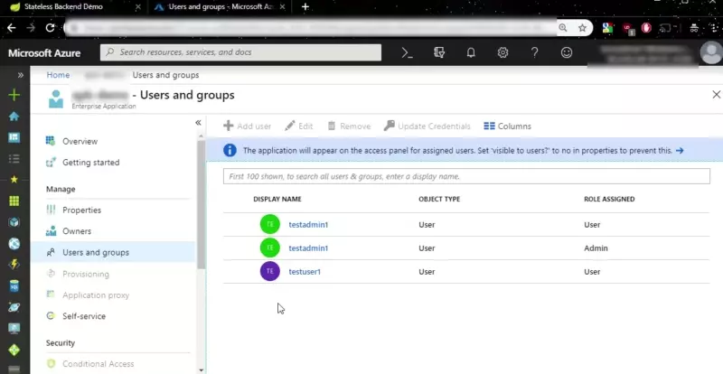

## About this sample

### Overview
This demo project  explains the usage of the stateless authentication filter `AADAppRoleStatelessAuthenticationFilter`.
This project is composed of a vue.js frontend and a simple backend with three endpoints
* `/public` (accessible by anyone)
* `/authorized` (role "user" required)
* `/admin/demo` (role "admin" required).

### Get started
The sample is composed of two layers: vue.js client and Spring Boot RESTful Web Service. You need to make some changes 
to get it working with your Azure AD tenant on both sides.

### How to configure

#### Register your application with your Azure Active Directory Tenant

Follow the guide [here](https://docs.microsoft.com/en-us/azure/active-directory/develop/v1-protocols-openid-connect-code#register-your-application-with-your-ad-tenant).

#### Configure appRoles

In order to use only the `id_token` for our authentication and authorization purposes we will use the
`appRoles` feature which AAD provides. Follow the guide 
[Add app roles in your application](https://docs.microsoft.com/en-us/azure/active-directory/develop/howto-add-app-roles-in-azure-ad-apps)

For the test SPA provided with this example you should create the following roles in your manifest:

```
  "appRoles": [
    {
      "allowedMemberTypes": [
        "User"
      ],
      "displayName": "Admin",
      "id": "2fa848d0-8054-4e11-8c73-7af5f1171001",
      "isEnabled": true,
      "description": "Full admin access",
      "value": "Admin"
    },
    {
      "allowedMemberTypes": [
        "User"
      ],
      "displayName": "User",
      "id": "f8ed78b5-fabc-488e-968b-baa48a570001",
      "isEnabled": true,
      "description": "Normal user access",
      "value": "User"
    }
  ],
```

After you've created the roles go to your Enterprise Application in Azure Portal, select "Users and groups" and 
assign the new roles to your Users (assignment of roles to groups is not available in the free tier of AAD).

Furthermore enable the implicit flow in the manifest for the demo application 
(or if you have SPAs calling you):

```
"oauth2AllowImplicitFlow": "true",
```

#### Configure application.properties

You have to activate the stateless app-role auth filter and configure the `client-id`of your application registration:

```properties
azure.activedirectory.session-stateless=true
azure.aad.app-role.client-id=xxxxxx-your-client-id-xxxxxx
```

#### Configure Webapp

Add your `tenant-id` and `client-id` in `src/main/resources/static/index.html`:

```
      data: {
        clientId: 'xxxxxxxx-your-client-id-xxxxxxxxxxxx',
        tenantId: 'xxxxxxxx-your-tenant-id-xxxxxxxxxxxx',
        tokenType: 'id_token',
        token: null,
        log: null
      },
``` 

### How to run

   - Use Maven 

     ```
     mvn clean package spring-boot:run
     ```

### Check the authentication and authorization
	
1. Access http://localhost:8080
2. Without logging in try the three endpoints (public, authorized and admin). While the public 
   endpoint should work without a token the other two will return a 403.
3. Insert your `client-id` and `tenant-id` and perform a log in. If successfull the token textarea
   should get populated. Also the token header and token payload field will be populated.   
4. Again access the three endpoints. Depending on your user and the assigned `appRoles` you should
   be able to call the authorized and admin endpoints.
   
#### Demo



