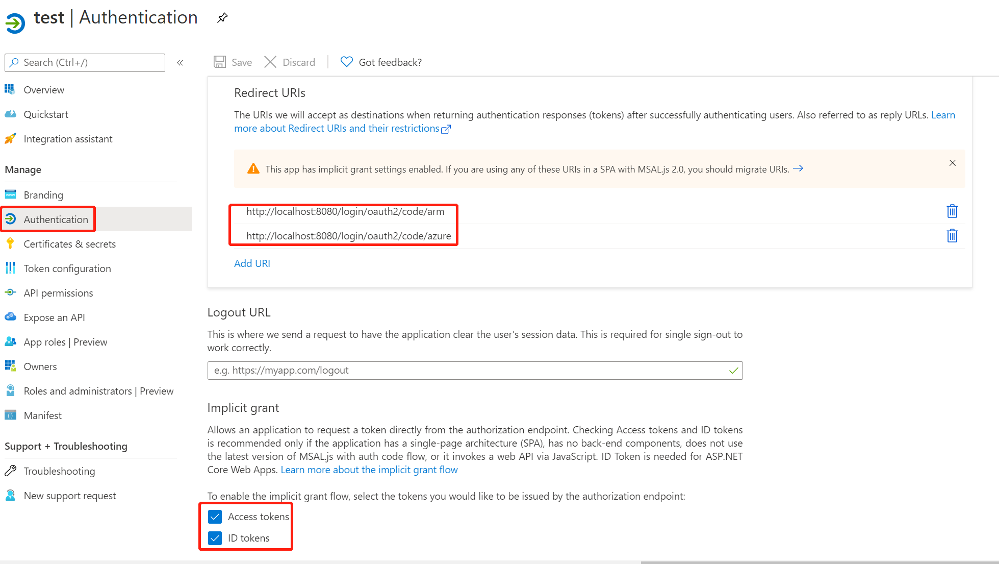

# OAuth 2.0 Sample for Azure AD Spring Boot Starter client library for Java

## Key concepts
This sample illustrates how to use `azure-spring-boot-starter-active-directory` package to work with OAuth 2.0 and OpenID Connect protocols on Auzre. This sample will use Microsoft Graph API to retrieve user infomation

## Getting started

### Environment checklist
We need to ensure that this [environment checklist][ready-to-run-checklist] is completed before the run.

### Register your application with your Azure Active Directory Tenant

Follow the guide [here](https://docs.microsoft.com/azure/active-directory/develop/quickstart-register-app).
### Platform configurations



- Set redirect URIs with `http://localhost:8080/login/oauth2/code/azure`.
- Ensure **Access tokens** and **ID tokens** are selected.
- To use on-demand authorization of certain resource, you need to add redirect URIs of `http://localhost:8080/login/oauth2/code/{registration-id}`. In this sample, set redirect URIs with `http://localhost:8080/login/oauth2/code/arm`.
### Configure necessary API permissions
The sample retrieves user's group memberships using Microsoft graph API which requires the registered app to have `Directory.AccessAsUser.All` permission under `Delegated Permissions` of `Microsoft Graph`, which can allow an application to access the directory as the signed-in user. Also, to display the function of calling multiple resources, this sample will acquire `ActivityFeed.Read` permission under `Office 365 Management APIs` resource. You need AAD admin privilege to be able to grant the permission in API ACCESS -> Required permission. You can follow the below steps:	

* In the list of pages for the app, select **API permissions**	
   - Click the **Add a permission** button	
   - Ensure that the **Microsoft APIs** tab is selected	
   - In the *Commonly used Microsoft APIs* section, click on **Microsoft Graph**	
   - In the **Delegated permissions** section, ensure that the right permissions are checked: **Directory.AccessAsUser.All**	
   - Select the **Add permissions** button
   - Under **Office 365 Management APIs** tab
   - Select **Delegated permissions**, and then click **ActivityFeed.Read**
   - Select the **Add permissions** button
   - Click **Grant Permissions...** and Yes when prompted.

### Configure groups for sign in user

In order to try the authorization action with this sample with minimum effort, [configure the user and groups in Azure Active Directory](https://docs.microsoft.com/azure/active-directory/active-directory-groups-create-azure-portal), configure the user with `group1`. 


## Examples

### Configure application.yml

```yaml
azure:
  activedirectory:
    client-id: <client-id>
    client-secret: <client-secret>
    tenant-id: <tenant-id>
    user-group:
      allowed-groups: group1, group2
# It's suggested the logged in user should at least belong to one of the above groups
# If not, the logged in user will not be able to access any authorization controller rest APIs
```
### Run with Maven
```shell
cd azure-spring-boot-samples/azure-spring-boot-sample-active-directory-webapp
mvn spring-boot:run
```

### Check the authentication and authorization
	
1. Access http://localhost:8080
2. Login
3. Access `Group1 Message` link: success
4. Access `Group2 Message` link: fail with forbidden error message
5. Access `Graph Client` link: access token for `Microsoft Graph` will be acquired, and the content of customized **OAuth2AuthorizedClient** instance for `Microsoft Graph` resource will be displayed.
6. Access `Office Client` link: access token for `Office 365 Management APIs` will be acquired, the content of customized **OAuth2AuthorizedClient** instance for `Office 365 Management APIs` resource will be displayed.
7. Access `Arm Client` link: page will be redirected to Consent page for on-demand authorization of `user_impersonation` permission in `Azure Service Management` resource. Clicking on `Consent`, access token for `Azure Service Management` will be acquired, the content of customized **OAuth2AuthorizedClient** instance for `Azure Service Management` resource will be displayed.
## Troubleshooting

### If registered application is multi-tenanted, how to run this sample?
Set `azure.activedirectory.tenant-id=common` in your application.properties file:
```yaml
azure:
  activedirectory:
    tenant-id: common
```
---
### Meet with `AADSTS240002: Input id_token cannot be used as 'urn:ietf:params:oauth:grant-type:jwt-bearer' grant` error.
In Azure portal, app registration manifest page, configure `oauth2AllowImplicitFlow` in your application manifest to `true`. See [this issue](https://github.com/MicrosoftDocs/azure-docs/issues/8121#issuecomment-387090099) for details on this workaround.

## Next steps
## Contributing
<!-- LINKS -->
[ready-to-run-checklist]: https://github.com/Azure/azure-sdk-for-java/blob/master/sdk/spring/azure-spring-boot-samples/README.md#ready-to-run-checklist