# OAuth 2.0 Sample for Azure AD Spring Boot Starter client library for Java

## Key concepts
This sample illustrates how to use `azure-spring-boot-starter-active-directory` package to work with OAuth 2.0 and OpenID Connect protocols on Auzre. This sample will use Microsoft Graph API to retrieve user infomation.

## Getting started
### Environment checklist
We need to ensure that this [environment checklist][ready-to-run-checklist] is completed before the run.

### Configure web api
1. Search for and select Azure Active Directory.
2. Under Manage, select **App registrations** -> **New registration**.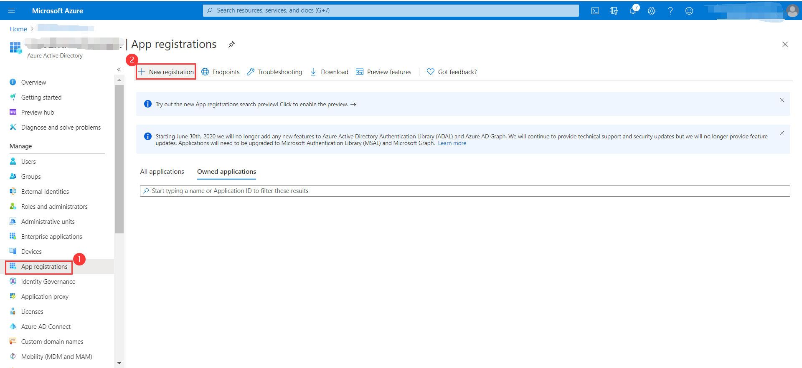
3. The registered application name is filled into **arm**, select **Accounts in this organizational directory only**, click **register** button.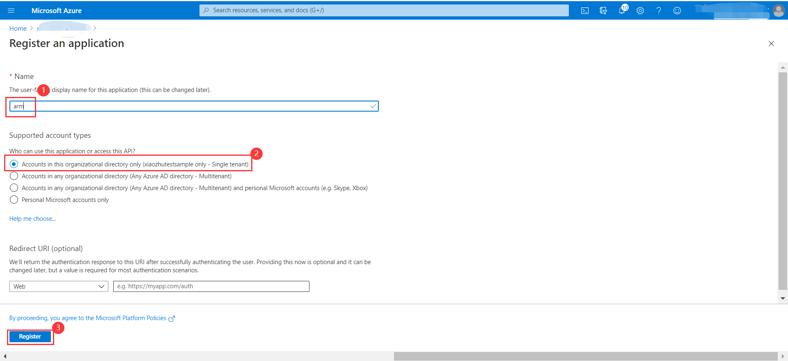
4. Under **arm** application, select **Certificates & secrets** -> **new client secret**, expires select **Never**, click **add** button.(Remember to save the secrets here and use it later)
5. Under **arm** application, select **Expose an API** -> **Add a scope**, Use the default **Application ID URI**, click **Save and continue** button.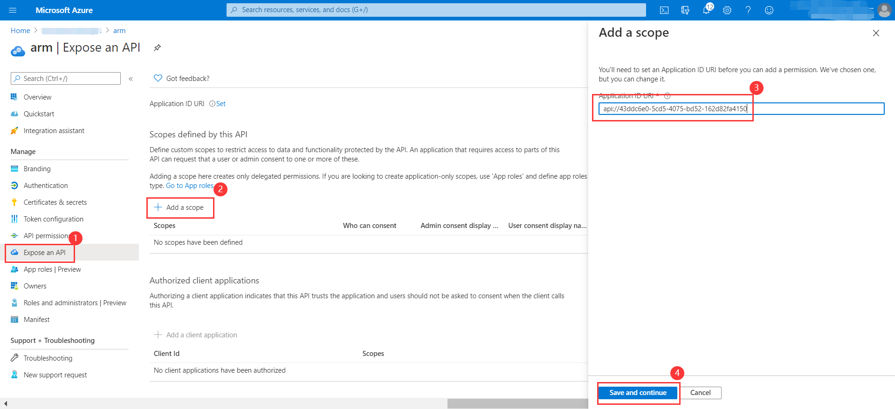
6. After step five,the page will refresh again.Then set the **Scope name** to *Files.read*.(This scope will be used in Application.yml)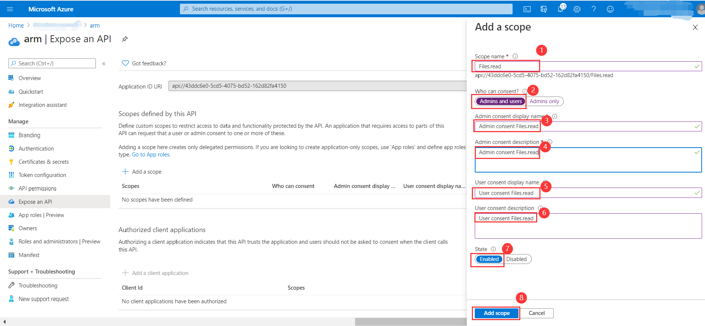
7. Expose scopes in web API registration.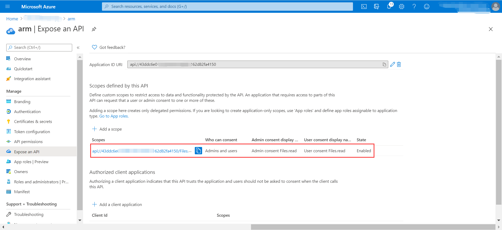

See [Register app or web api], [Expose scopes in web api registration] for more information about the Web API.

### Configure web app
1. Under Manage In the same tenant, select **App registrations** -> **New registration**.
2. The registered application name is filled into **webapp**, select **Accounts in this organizational directory only**, click the **register** button.
3. Under **webapp** application, select **Certificates & secrets** -> **new client secret**, expires select **Never**, click the **add** button.(Remember to save the secrets here and use them later)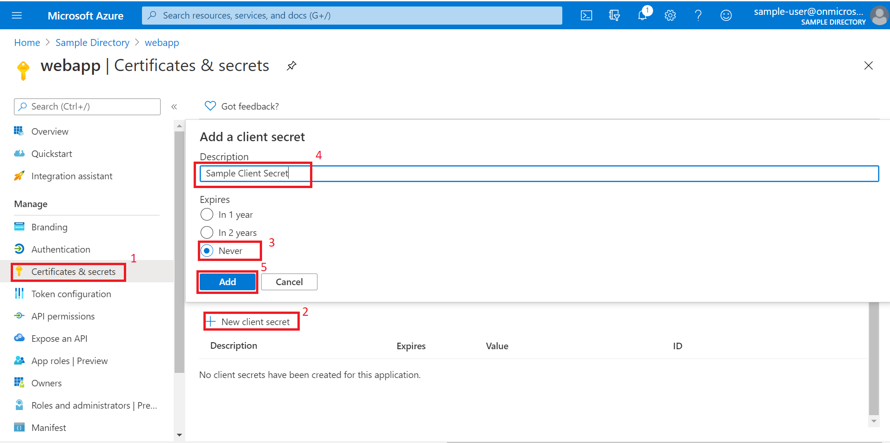
4. Under **webapp** application, select **Authentication** -> **Add a platform**, select **web** platform, redirect urls set to `http://localhost:8080/login/oauth2/code/azure`, check the Access Token and ID Token checkboxes, click **configure** button.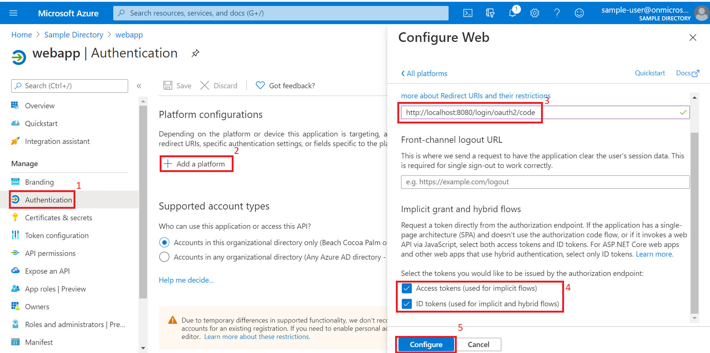
5. Under **webapp** application, select **Authentication** -> **Add URI**, you need to add redirect URIs of `http://localhost:8080/login/oauth2/code/arm`. 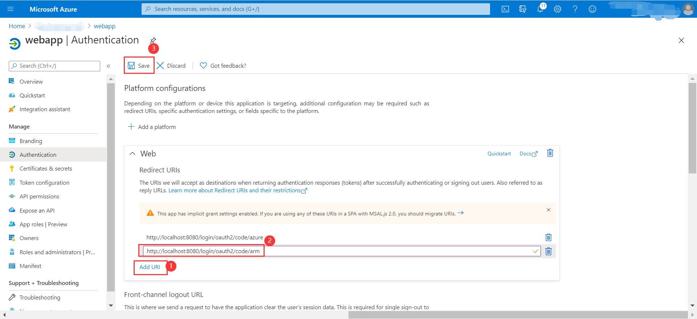
6. Under **webapp** application, select **API permissions** -> **Add a permission**, select **Microsoft Graph**. Next, search **Calendar.Read** via select Permissions, check the check box,click **add permissions** button.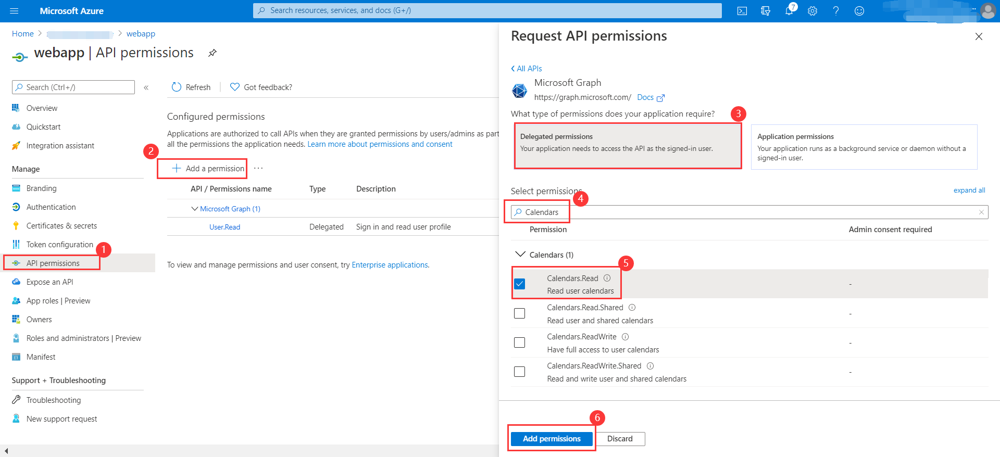
7. Similarly, add **Directory.AccessAsUser.All** permission in **Microsoft Graph** and add **ActivityFeed.Read** permission in **Office 365 Management APIs**.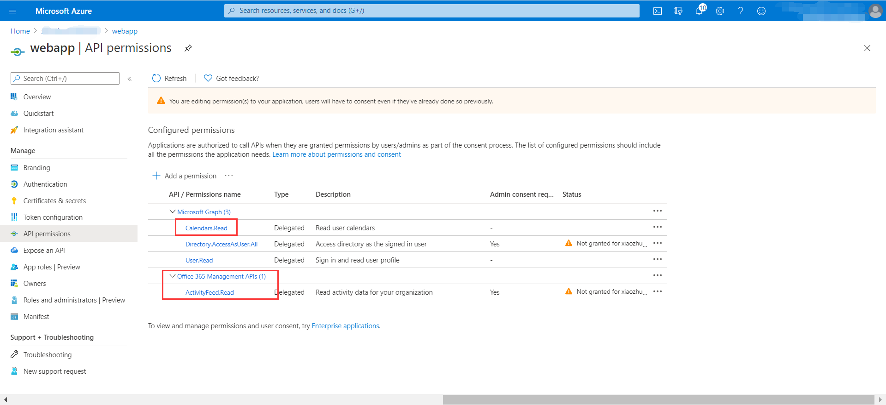
8. Continue to select **API permissions** -> **Add a permission** -> **My APIS**, select **arm** tab, add **Files.read** permission,click **Add permissions** button.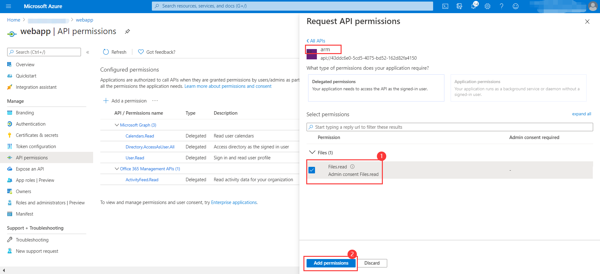
9. click **Grant admin consent for...**.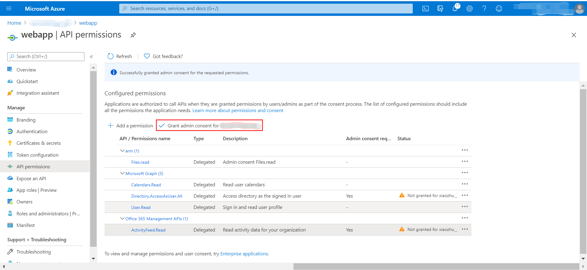
10. Finally.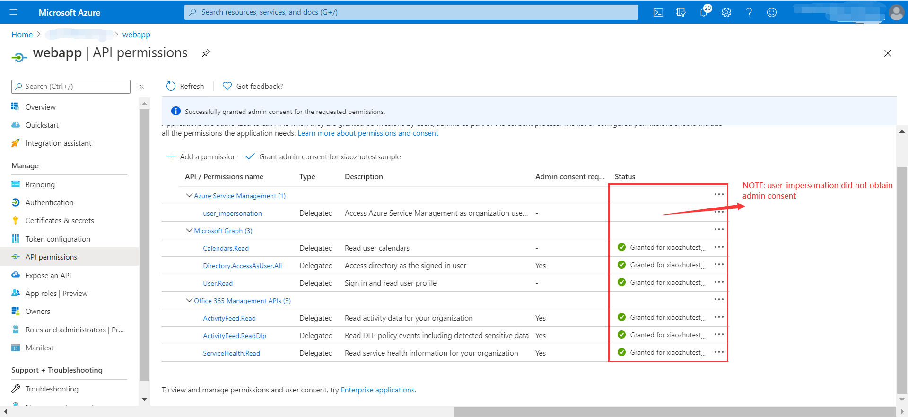

See [Register app or web api], [Grant scoped permission] for more information about the Web APP.

### Configure groups for sign in user
In order to try the authorization action with this sample with minimum effort, [configure the user and groups in Azure Active Directory], configure the user with `group1`.

## Examples
### Configure application.yml
```yaml
azure:
  activedirectory:
    authorization:
      arm:
        on-demand: true
        scopes: <your-arm-scope-url>
      graph:
        scopes: https://graph.microsoft.com/Calendars.Read
      office:
        scopes: https://manage.office.com/ActivityFeed.Read
    client-id: <webapp-client-id>
    client-secret: <webapp-client-secret>
    tenant-id: <tenant-id>
    user-group:
      allowed-groups: group1, group2
# It's suggested the logged in user should at least belong to one of the above groups
# If not, the logged in user will not be able to access any authorization controller rest APIs
```

### Run with Maven
```shell
cd azure-spring-boot-samples/azure-spring-boot-sample-active-directory-webapp
mvn spring-boot:run
```

### Check the authentication and authorization
1. Access http://localhost:8080
2. Login
3. Access `Group1 Message` link: success
4. Access `Group2 Message` link: fail with forbidden error message
5. Access `Graph Client` link: access token for `Microsoft Graph` will be acquired, and the content of customized **OAuth2AuthorizedClient** instance for `Microsoft Graph` resource will be displayed.
6. Access `Office Client` link: access token for `Office 365 Management APIs` will be acquired, the content of customized **OAuth2AuthorizedClient** instance for `Office 365 Management APIs` resource will be displayed.
7. Access `Arm Client` link: page will be redirected to Consent page for on-demand authorization of `user_impersonation` permission in `Azure Service Management` resource. Clicking on `Consent`, access token for `Azure Service Management` will be acquired, the content of customized **OAuth2AuthorizedClient** instance for `Azure Service Management` resource will be displayed.

## Troubleshooting
### If registered application is multi-tenanted, how to run this sample?
Set `azure.activedirectory.tenant-id=common` in your application.properties file:
```yaml
azure:
  activedirectory:
    tenant-id: common
```
---
### Meet with `AADSTS240002: Input id_token cannot be used as 'urn:ietf:params:oauth:grant-type:jwt-bearer' grant` error.
In Azure portal, app registration manifest page, configure `oauth2AllowImplicitFlow` in your application manifest to `true`. See [this issue] for details on this workaround.

## Next steps
## Contributing
<!-- LINKS -->
[ready-to-run-checklist]: https://github.com/Azure/azure-sdk-for-java/blob/master/sdk/spring/azure-spring-boot-samples/README.md#ready-to-run-checklist
[Register app or web API]: https://docs.microsoft.com/azure/active-directory/develop/quickstart-register-app
[Expose scopes in web API registration]: https://docs.microsoft.com/azure/active-directory/develop/quickstart-configure-app-expose-web-apis
[Grant scoped permission]: https://docs.microsoft.com/azure/active-directory/develop/quickstart-configure-app-access-web-apis
[configure the user and groups in Azure Active Directory]: https://docs.microsoft.com/azure/active-directory/active-directory-groups-create-azure-portal
[this issue]: https://github.com/MicrosoftDocs/azure-docs/issues/8121#issuecomment-387090099