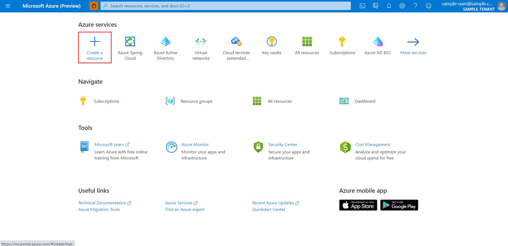
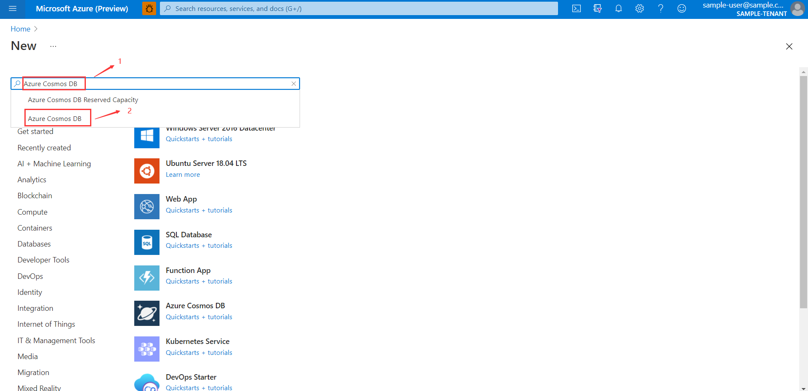
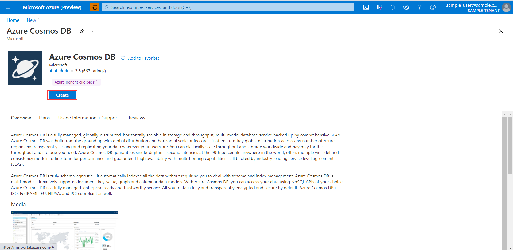
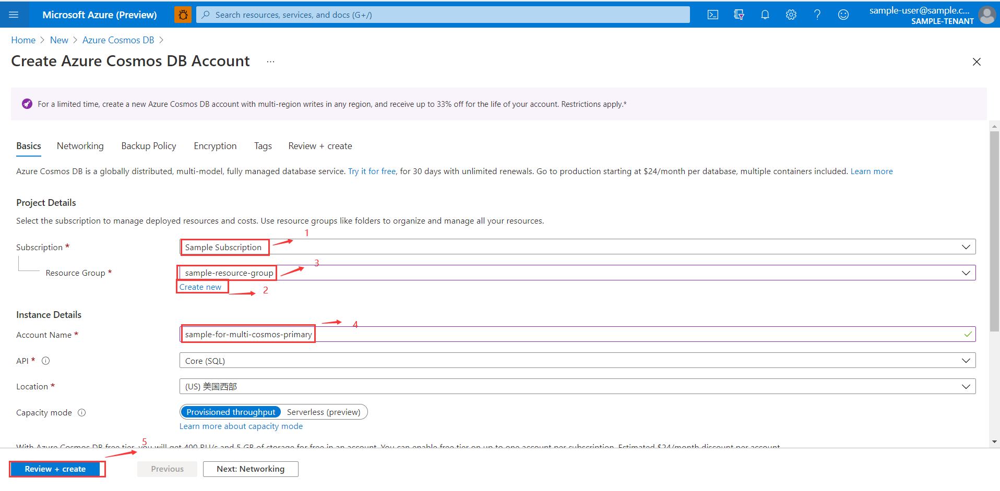
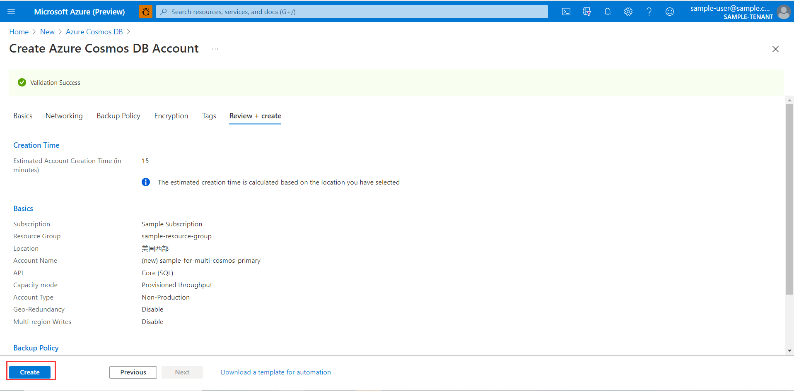
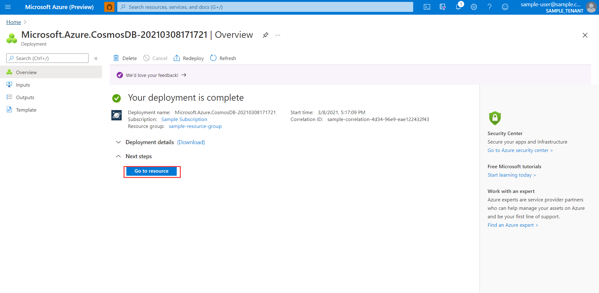
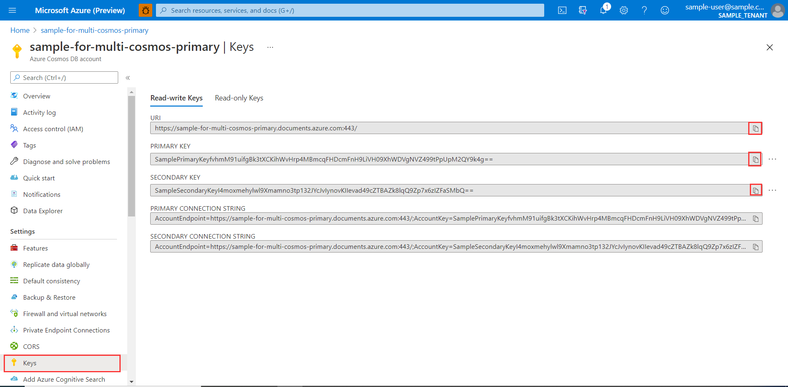
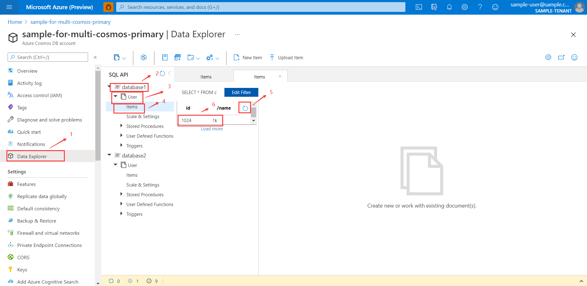
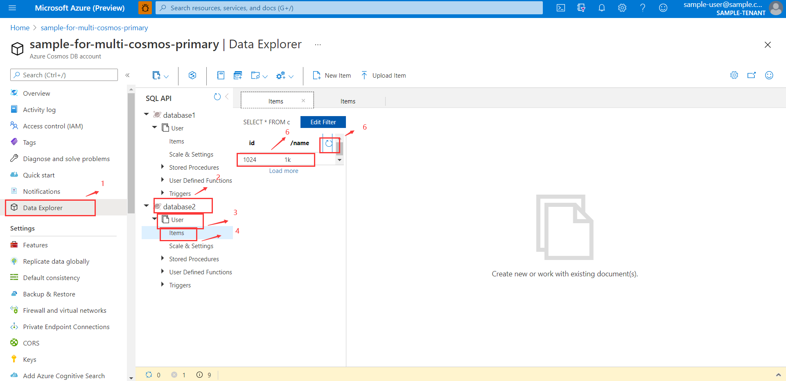

# Azure Spring Boot Sample Cosmos Multi Database Single Account for Java

## Key concepts
## Getting started

### Prerequisites
- [Environment checklist][environment_checklist]

### Configure Cosmos Database
1. Log into <https://portal.azure.com>.

1. Click `Create a resource`.

1. Input `Azure Cosmos DB`.

1. Click `Azure Cosmos DB`
    

    

1. Click **Create**.

    

1. On the **Create key vault** page, input `Subscription`, `Resource group`, `Account Name`, then click `Review + Create`.

    

    

1. When complete, click `Go to resource`.

    

1. Click **Keys** in the left navigation pane, copy your **URI**, the **PRIMARY KEY** and **SECONDARY KEY**;

    

## Key concepts
## Examples
### Configure application.yml
```yaml
azure.cosmos.uri=your-cosmosDb-uri
azure.cosmos.key=your-cosmosDb-key
azure.cosmos.secondary-key=your-cosmosDb-secondary-key
azure.cosmos.database=your-cosmosDb-dbName
azure.cosmos.populate-query-metrics=if-populate-query-metrics
```

### Run with Maven
```shell
cd azure-spring-boot-samples/azure-spring-boot-sample-multi-database
mvn spring-boot:run
```

Verify Result:
The corresponding data is added to cosmos database
    
    
    
## Troubleshooting
## Next steps
## Contributing

<!-- LINKS -->
[environment_checklist]: https://github.com/Azure/azure-sdk-for-java/blob/main/sdk/spring/ENVIRONMENT_CHECKLIST.md#ready-to-run-checklist
