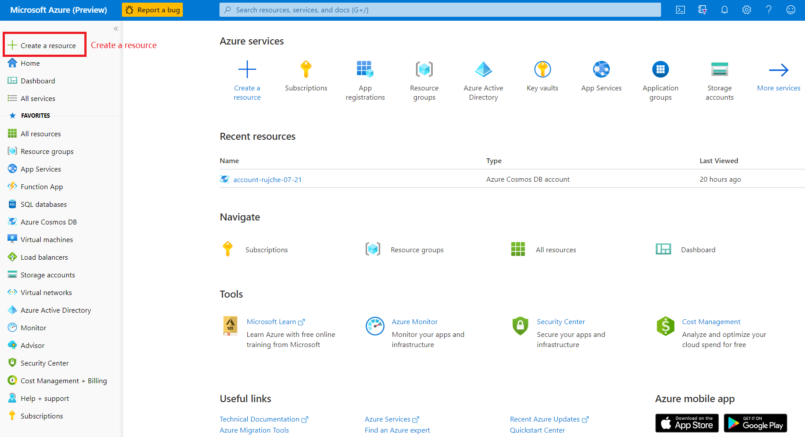
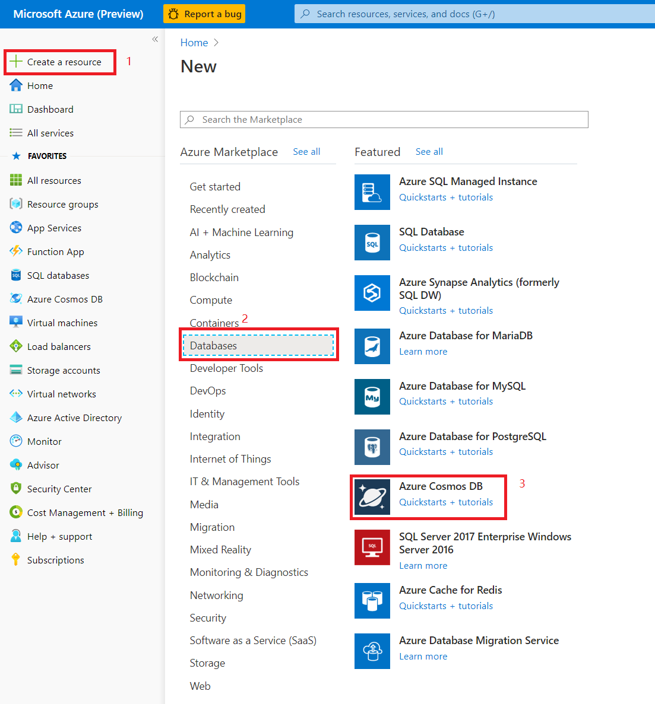
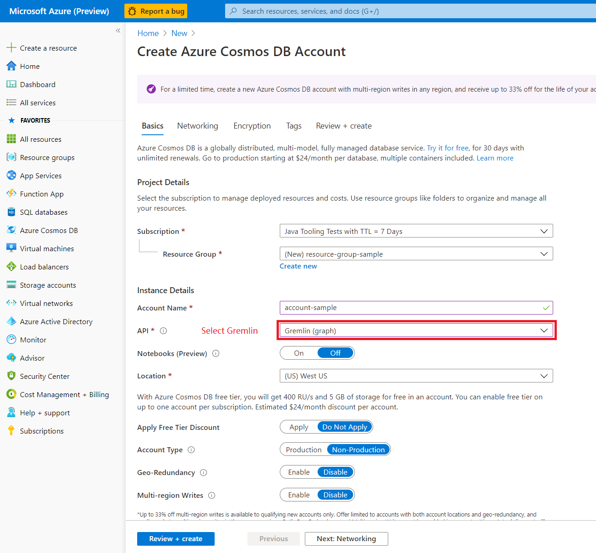
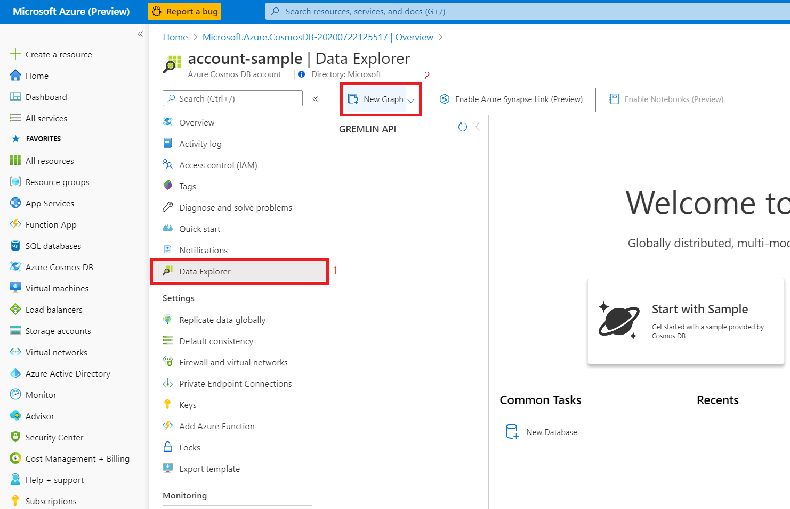
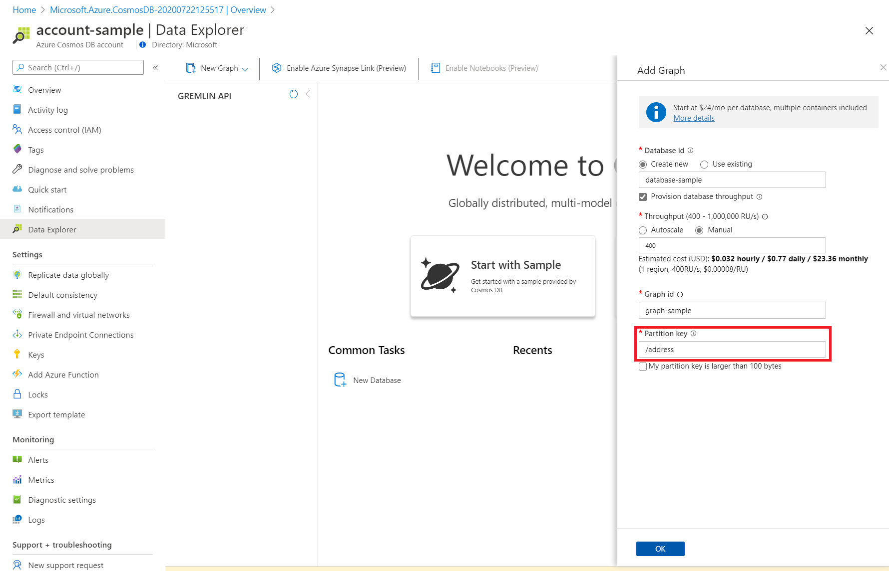
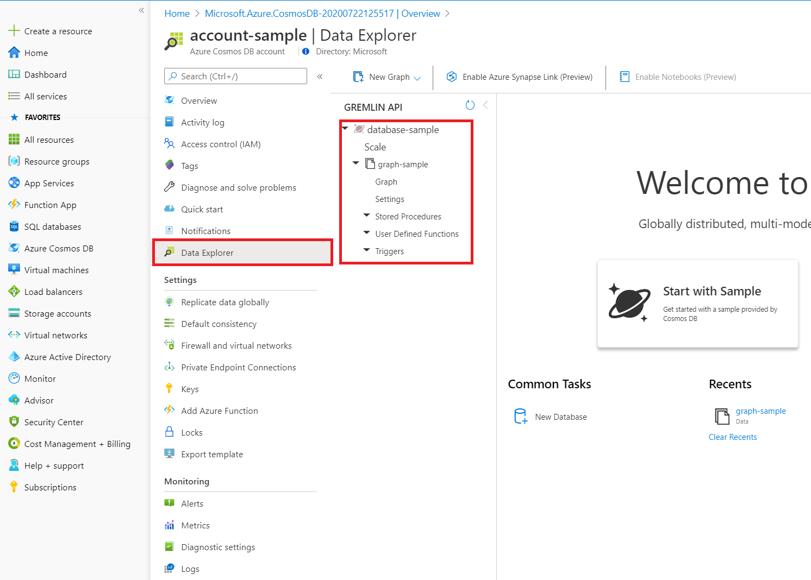
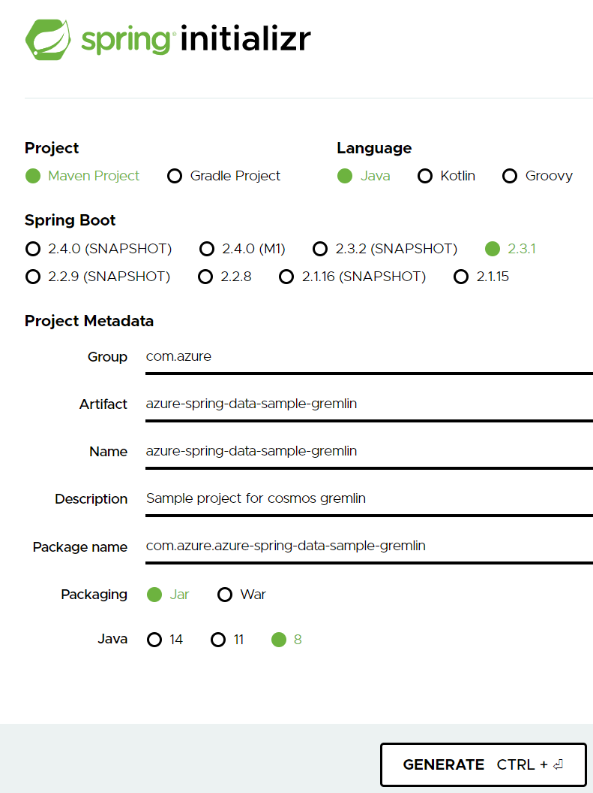

# How to use azure-spring-data-gremlin

## Overview

This article demonstrates how to use `azure-spring-data-gremlin` to store / retrieve data in `Azure Cosmos DB`.

## Prerequisites

The following prerequisites are required in order to follow the steps in this article:

* An Azure subscription. If you don't know what is `Azure subscription`, please read [this document](https://docs.microsoft.com/en-us/office365/enterprise/subscriptions-licenses-accounts-and-tenants-for-microsoft-cloud-offerings).
* A supported Java Development Kit (JDK). For more information about the JDKs available for use when developing on Azure, see <https://aka.ms/azure-jdks>.
* [Apache Maven](http://maven.apache.org/), version 3.0 or later.

## Create Resource

### Create Azure Cosmos DB

1. Browse to the Azure portal at <https://portal.azure.com/> and click `+Create a resource`.

   

1. Click `Databases`, and then click `Azure Cosmos DB`.

   

1. On the `Azure Cosmos DB` page, enter the following information:

   * Choose the `Subscription` that you want to use for your database.
   * Specify whether to create a new `Resource Group` for your database, or choose an existing resource group.
   * Enter a unique `Account Name` to use as part of the Gremlin URI for your database. For example: if you entered `account-sample` for the `Account Name`, the Gremlin URI would be `account-samplewingtiptoysdata.gremlin.cosmosdb.azure.com`.
   * Choose `Gremlin (Graph)` for the API.
   * Specify the `Location` for your database.
   
When you have specified these options, click `Review + create`.

   

Review the specification and click `Create` to create your database.

### Add a graph to your Azure Cosmos Database

1. In CosmosDb page, Click `Data Explorer`, and then click `New Graph`.

   

1. When the `Add Graph` is displayed, enter the following information:

   * Specify a unique `Database id` for your database.
   * You can choose to specify your `Storage capacity`, or you can accept the default.
   * Specify a unique `Graph id` for your graph.
   * Specify a `Partition key`. For more information see [Using a partitioned graph in Azure Cosmos DB](https://docs.microsoft.com/en-us/azure/cosmos-db/graph-partitioning).
Click `OK`.
   
   When you have specified these options, click `OK` to create your graph.

   

1. After your graph has been created, you can use the `Data Explorer` to view it.

   
   
   

## Create simple Spring Boot application with the Spring Initializr

1. Browse to <https://start.spring.io/>.

1. Fill project metadata then click `GENERATE`:

   

1. 

   

1. When your database has been created, Click `Go to resource`. It is also listed on your Azure `Dashboard`, as well as under the `All Resources` and `Azure Cosmos DB` pages. You can click on your database on any of those locations to open the properties page for your cache.

1. In CosmosDb overview page, click `Keys` and copy your URI and access keys for your database; you will use these values in your Spring Boot application.

   ![Access keys][AZ05]