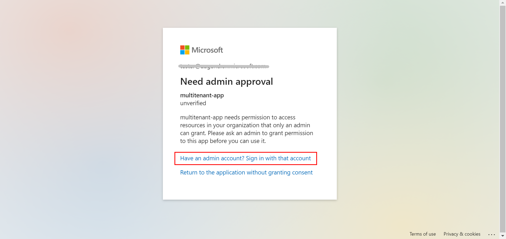
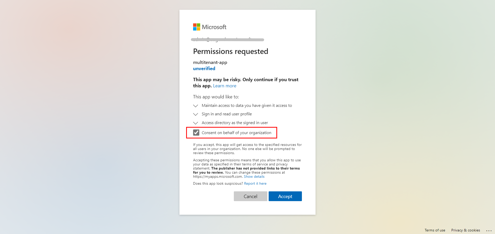
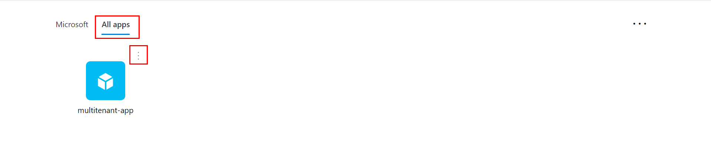
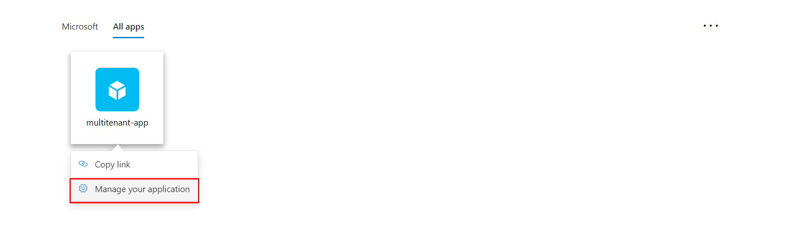
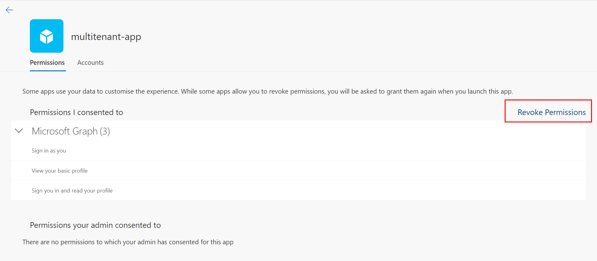
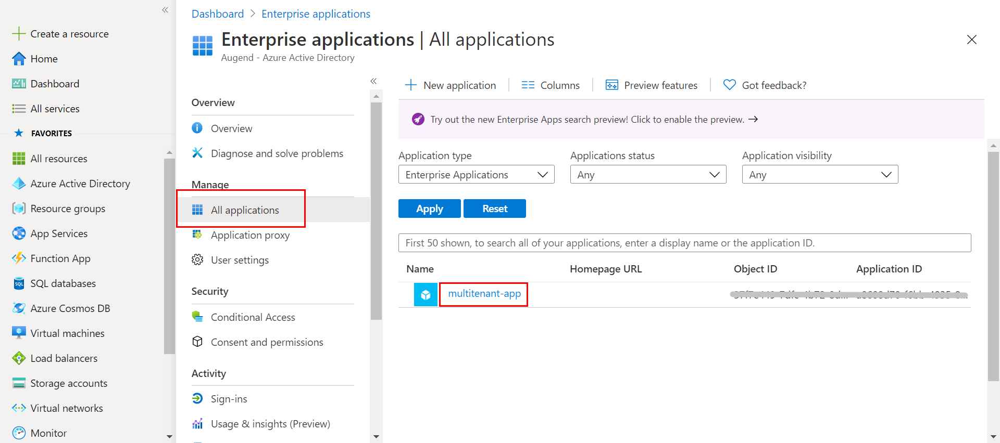
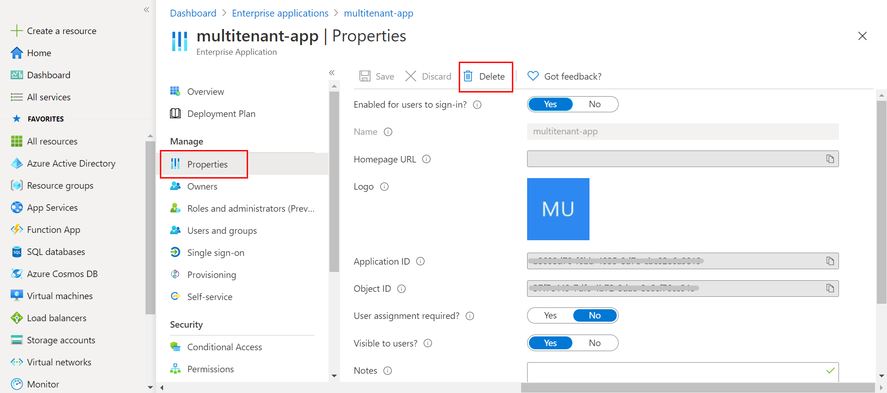

# Access to multi-tenant app

* Do not configure **tenantId** in the **application.properties/.yml** of a multi-tenant app or configure it to "common" to use the login process of multi-tenant access. Otherwise, users of other tenants will not be able to access the protected resources of the app.

* The administrator's consent is required for the first visit.

* Sign in with an administrator account and approve.
* Before accepting, make sure that **"Consent on behalf of your organization"** is checked.

* If you forget to check "Consent on behalf of your organization", there are two ways to revoke your consent.

* Users revoke access to individual applications by removing them from their [Access Panel Applications list](https://myapps.microsoft.com/).

* Administrators revoke access to applications by removing them using the Enterprise applications section of the [Azure portal](https://portal.azure.com/).

