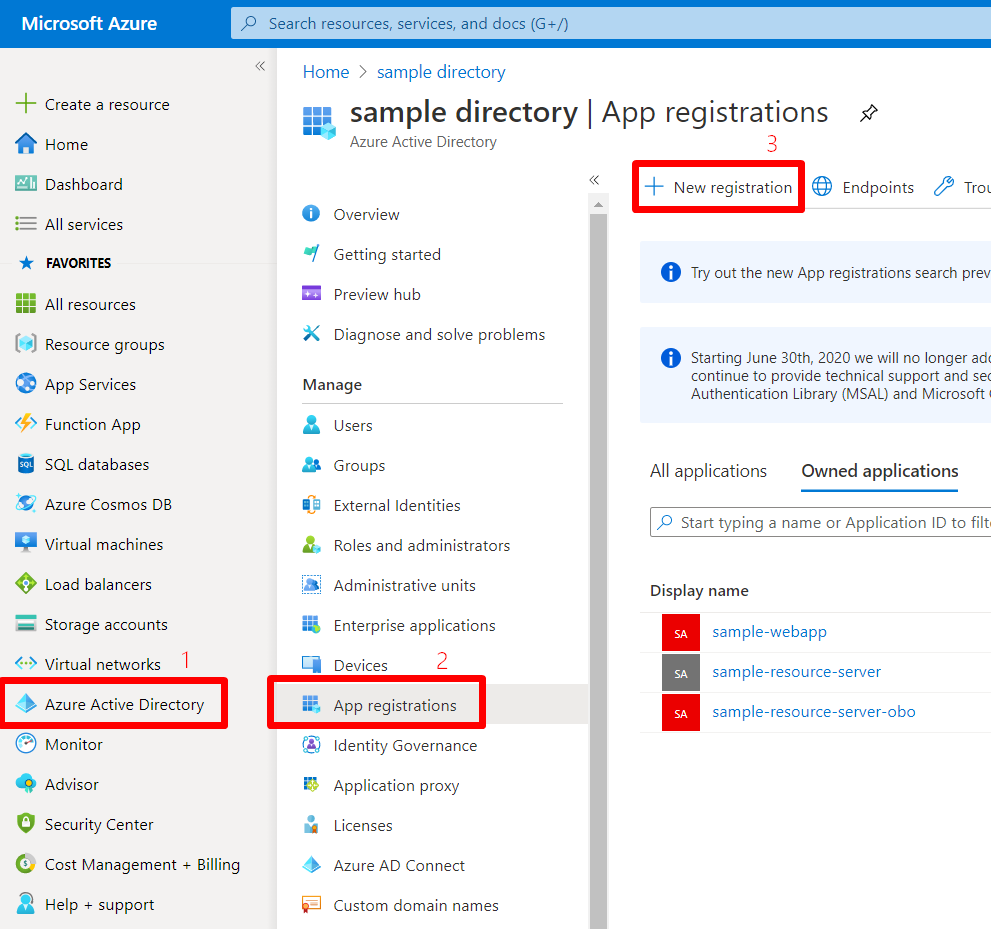
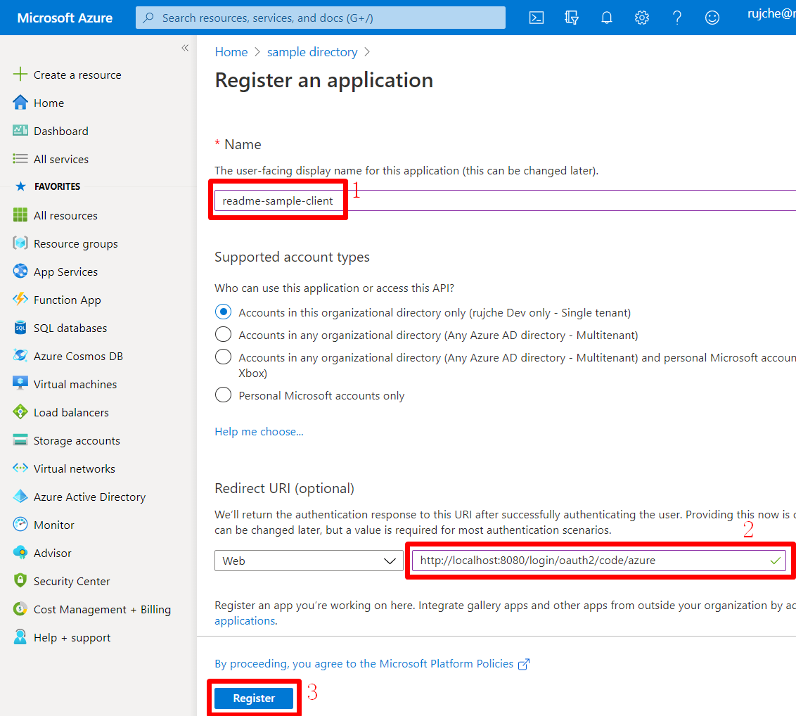
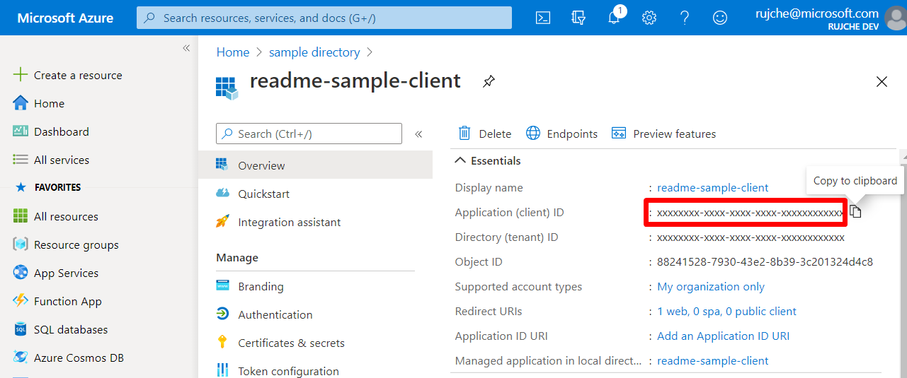
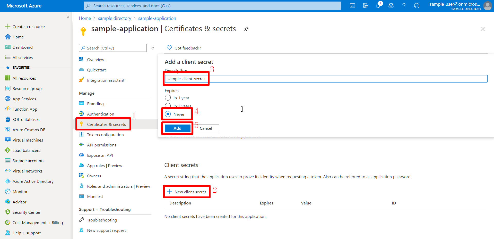
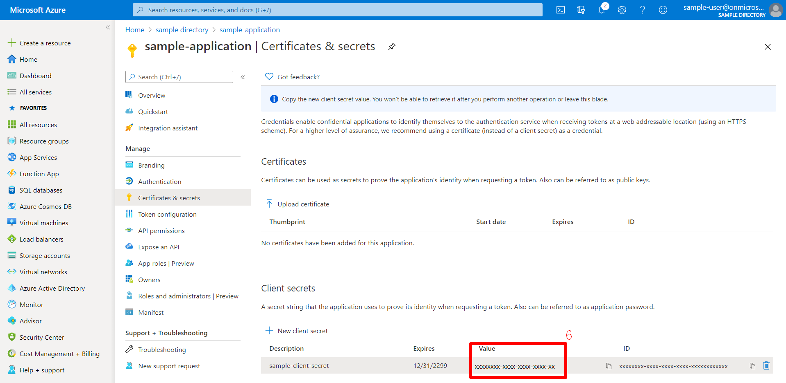

# Azure AD Spring Boot Starter client library for Java

**azure-spring-boot-starter-active-directory** (**aad-starter** for short) supports Oauth 2.0 authentication for a `web application`. It can also protect a `resource server` by validating JWT token. Here `web application` and `resource server` are protected by Azure Active Directory.

[Package (Maven)][package] | [API reference documentation][refdocs] | [Product documentation][docs] | [Samples][sample]

## Getting started
### Prerequisites
- [Java Development Kit (JDK)][jdk_link] with version 8 or above
- [Azure Subscription][azure_subscription]
- [Maven](https://maven.apache.org/) 3.0 and above

### Register the Application in Azure AD

* **Create a new App registration**: 
1. Go to [Azure Portal].
1. Click `Azure Active Directory`.
1. Click `App registrations`.
1. Click `New application`.

1. Input `Name`. For example: `readme-sample-client`.
1. (Optional, only required for web application) Input `Redirect URI(optional)`: `http://localhost:8080/login/oauth2/code/`.
1. Click `Register`.

1. Copy tenant-id and client-id. We will need it later.


* **Create a client secret key for the application**:
1. Click `Certificates & secrets`.
1. Click `New client secret`.
1. Input `Description`.
1. Click `Add`.

1. Copy client-secret. We will need it later.



## Key concepts
**aad-starter** supports 2 types of web server: Web application and resource server. 

1. `Web application`: Support login by Microsoft account.
1. `Resource server`: Not support login. Just protect the server by validating the access_token, and if valid, serves the request.

Both `web application` and `resource server` support extra function: itself can access other resource servers which are protected by Azure Active Directory. So there are 4 scenarios:

1. Web application.
1. Web application visiting resource servers.
1. Resource server.
1. Resource server visiting other resource servers.

The following content will introduce the 4 scenarios one by one.

### Web application

This scenario support login by Microsoft account, **aad-starter** use [The OAuth 2.0 authorization code grant] to deal with logins.

**System diagram**:


To use **aad-starter** in this scenario, we need these steps:

* Step 1: Add the following dependencies in you pom.xml.

[//]: # "{x-version-update-start;com.azure.spring:azure-spring-boot-starter-active-directory;current}"
```xml
<dependency>
    <groupId>com.azure.spring</groupId>
    <artifactId>azure-spring-boot-starter-active-directory</artifactId>
    <version>3.2.0-beta.1</version>
</dependency>
<dependency>
    <groupId>org.springframework.boot</groupId>
    <artifactId>spring-boot-starter-oauth2-client</artifactId>
</dependency>
```
[//]: # "{x-version-update-end}"
   
* Step 2: Add properties in application.yml:
```yaml
azure:
  activedirectory:
    tenant-id: xxxxxx-your-tenant-id-xxxxxx
    client-id: xxxxxx-your-client-id-xxxxxx
    client-secret: xxxxxx-your-client-secret-xxxxxx
```

* Step 3: Write Java code:

`AADWebSecurityConfigurerAdapter` contains necessary web security configuration for **aad-starter**.

 (A). `DefaultAADWebSecurityConfigurerAdapter` is configured automatically if you not provide one.

 (B). You can provide one by extending `AADWebSecurityConfigurerAdapter` and call `super.configure(http)` explicitly 
in the `configure(HttpSecurity http)` function. Here is an example:
<!-- embedme ../azure-spring-boot/src/samples/java/com/azure/spring/aad/AADOAuth2LoginConfigSample.java#L18-L29 -->
```java
@EnableWebSecurity
@EnableGlobalMethodSecurity(prePostEnabled = true)
public class AADOAuth2LoginConfigSample extends AADWebSecurityConfigurerAdapter {

    @Override
    protected void configure(HttpSecurity http) throws Exception {
        super.configure(http);
        http.authorizeRequests()
            .antMatchers("/login").permitAll()
            .anyRequest().authenticated();
    }
}
```

### Web application visiting resource servers

This scenario support visit resource servers in web application.

**System diagram**:


To use **aad-starter** in this scenario, we need these steps:

* Step 1: Add the following dependencies in you pom.xml.

[//]: # "{x-version-update-start;com.azure.spring:azure-spring-boot-starter-active-directory;current}"
```xml
<dependency>
    <groupId>com.azure.spring</groupId>
    <artifactId>azure-spring-boot-starter-active-directory</artifactId>
    <version>3.2.0-beta.1</version>
</dependency>
<dependency>
    <groupId>org.springframework.boot</groupId>
    <artifactId>spring-boot-starter-oauth2-client</artifactId>
</dependency>
```
[//]: # "{x-version-update-end}"

* Step 2: Add properties in application.yml:
```yaml
azure:
  activedirectory:
    authorization-clients:
      graph:
        scopes: https://graph.microsoft.com/Analytics.Read, email
```
Here, `graph` is the name of `OAuth2AuthorizedClient`, `scopes` means the scopes need to consent when login.

* Step 3: Write Java code:
```java
@GetMapping("/graph")
@ResponseBody
public String graph(@RegisteredOAuth2AuthorizedClient("graph") OAuth2AuthorizedClient graphClient) {
    // toJsonString() is just a demo.
    // graphClient contains access_token. We can use this access_token to access resource server.
    return toJsonString(graphClient);
}
```
Here, `graph` is the client name configured in step 2. OAuth2AuthorizedClient contains access_token. 
access_token can be used to access resource server.

### Resource server
This scenario not support login. Just protect the server by validating the access_token, and if valid, serves the request.

**System diagram**:


To use **aad-starter** in this scenario, we need these steps:

* Step 1: Add the following dependencies in you pom.xml.

[//]: # "{x-version-update-start;com.azure.spring:azure-spring-boot-starter-active-directory;current}"
```xml
<dependency>
    <groupId>com.azure.spring</groupId>
    <artifactId>azure-spring-boot-starter-active-directory</artifactId>
    <version>3.2.0-beta.1</version>
</dependency>
<dependency>
    <groupId>org.springframework.boot</groupId>
    <artifactId>spring-boot-starter-oauth2-resource-server</artifactId>
</dependency>
```
[//]: # "{x-version-update-end}"

* Step 2: Add properties in application.yml:
```yaml
azure:
  activedirectory:
    client-id: <client-id>
    app-id-uri: <app-id-uri>
```
Both `client-id` and `app-id-uri` can be used to verify access token. `app-id-uri` can be get in Azure Portal:


* Step 3: Write Java code:

Write your own adapter class which extends `WebSecurityConfigurerAdapter`, 
and `AzureJwtBearerTokenAuthenticationConverter` need to be included.
```java
@EnableWebSecurity
@EnableGlobalMethodSecurity(prePostEnabled = true)
public class AADOAuth2ResourceServerSecurityConfig extends WebSecurityConfigurerAdapter {
    @Override
    protected void configure(HttpSecurity http) throws Exception {
        http.authorizeRequests((requests) -> requests.anyRequest().authenticated())
            .oauth2ResourceServer()
            .jwt()
            .jwtAuthenticationConverter(new AzureJwtBearerTokenAuthenticationConverter());
            // Note that AzureJwtBearerTokenAuthenticationConverter need to be included.
    }
}
```

### Resource server visiting other resource servers

This scenario support visit other resource servers in resource servers.

**System diagram**:


To use **aad-starter** in this scenario, we need these steps:

* Step 1: Add the following dependencies in you pom.xml.

[//]: # "{x-version-update-start;com.azure.spring:azure-spring-boot-starter-active-directory;current}"
```xml
<dependency>
    <groupId>com.azure.spring</groupId>
    <artifactId>azure-spring-boot-starter-active-directory</artifactId>
    <version>3.2.0-beta.1</version>
</dependency>
<dependency>
    <groupId>org.springframework.boot</groupId>
    <artifactId>spring-boot-starter-oauth2-resource-server</artifactId>
</dependency>
<dependency>
    <groupId>org.springframework.boot</groupId>
    <artifactId>spring-boot-starter-oauth2-client</artifactId>
</dependency>
```
[//]: # "{x-version-update-end}"

* Step 2: Add properties in application.yml:
```yaml
azure:
   activedirectory:
      tenant-id: <Tenant-id-registered-by-application>
      client-id: <Web-API-A-client-id>
      client-secret: <Web-API-A-client-secret>
      app-id-uri: <Web-API-A-app-id-url>
      authorization-clients:
         graph:
            scopes:
               - https://graph.microsoft.com/User.Read
```

* Step 3: Write Java code:
Using `@RegisteredOAuth2AuthorizedClient` to access related resource server:
```java
@GetMapping("call-graph")
public String callGraph(@RegisteredOAuth2AuthorizedClient("graph") OAuth2AuthorizedClient graph) {
    return callMicrosoftGraphMeEndpoint(graph);
}
```

### Configurable properties

This starter provides following properties:

| Properties                                                              | Description                                                                                    |
| ----------------------------------------------------------------------- | ---------------------------------------------------------------------------------------------- |
| **azure.activedirectory**.app-id-uri                                    | It used in resource server, used to validate the audience in access_token. access_token is valid only when the audience in access_token equal to client-id or app-id-uri    |
| **azure.activedirectory**.authorization-clients                         | A map configure the resource APIs the application is going to visit. Each item corresponding to one resource API the application is going to visit. In Spring code, each item corresponding to one OAuth2AuthorizedClient object|
| **azure.activedirectory**.authorization-clients.{client-name}.scopes    | API permissions of a resource server that the application is going to acquire.                 |
| **azure.activedirectory**.authorization-clients.{client-name}.on-demand | This is used for incremental consent. The default value is false. If it's true, it's not consent when user login, when application needs the additional permission, incremental consent is performed with one OAuth2 authorization code flow.|
| **azure.activedirectory**.base-uri                                      | Base uri for authorization server, the default value is `https://login.microsoftonline.com/`.  |
| **azure.activedirectory**.client-id                                     | Registered application ID in Azure AD.                                                         |
| **azure.activedirectory**.client-secret                                 | client secret of the registered application.                                                   |
| **azure.activedirectory**.graph-membership-uri                          | It's used to load users' groups. The default value is `https://graph.microsoft.com/v1.0/me/memberOf`, this uri just get direct groups. To get all transitive membership, set it to `https://graph.microsoft.com/v1.0/me/transitiveMemberOf`. The 2 uris are both Azure Global, check `Property example 1` if you want to use Azure China.|
| **azure.activedirectory**.post-logout-redirect-uri                      | Redirect uri for posting log-out.                            |
| **azure.activedirectory**.tenant-id                                     | Azure Tenant ID.                                             |
| **azure.activedirectory**.user-group.allowed-groups                     | Expected user groups that an authority will be granted to if found in the response from the MemeberOf Graph API Call. |

Here are some examples about how to use these properties:

#### Property example 1: Use [Azure China] instead of Azure Global.

* Step 1: Add property in application.yml
```yaml
azure:
  activedirectory:
    base-uri: https://login.partner.microsoftonline.cn
    graph-base-uri: https://microsoftgraph.chinacloudapi.cn
```

#### Property example 2: Use `group name` to protect some method in web application.

* Step 1: Add property in application.yml
```yaml
azure:
  activedirectory:
    user-group:
      allowed-groups: group1, group2
```

* Step 2: Add `@EnableGlobalMethodSecurity(prePostEnabled = true)` in web application:

<!-- embedme ../azure-spring-boot/src/samples/java/com/azure/spring/aad/AADOAuth2LoginConfigSample.java#L18-L29 -->
```java
@EnableWebSecurity
@EnableGlobalMethodSecurity(prePostEnabled = true)
public class AADOAuth2LoginConfigSample extends AADWebSecurityConfigurerAdapter {

    @Override
    protected void configure(HttpSecurity http) throws Exception {
        super.configure(http);
        http.authorizeRequests()
            .antMatchers("/login").permitAll()
            .anyRequest().authenticated();
    }
}
```

Then we can protect the method by `@PreAuthorize` annotation:
```java
@Controller
public class RoleController {
    @GetMapping("group1")
    @ResponseBody
    @PreAuthorize("hasRole('ROLE_group1')")
    public String group1() {
        return "group1 message";
    }

    @GetMapping("group2")
    @ResponseBody
    @PreAuthorize("hasRole('ROLE_group2')")
    public String group2() {
        return "group2 message";
    }
}
```

#### Property example 3: [Incremental consent] in Web application visiting resource servers.

* Step 1: Add property in application.yml
```yaml
azure:
  activedirectory:
    authorization-clients:
      graph:
        scopes: https://graph.microsoft.com/Analytics.Read, email
      arm: # client registration id
        on-demand: true  # means incremental consent
        scopes: https://management.core.windows.net/user_impersonation
```

* Step 2: Write Java code:
```java
@Controller
public class OnDemandClientController {

    @GetMapping("/arm")
    @ResponseBody
    public String arm(
        @RegisteredOAuth2AuthorizedClient("arm") OAuth2AuthorizedClient oAuth2AuthorizedClient
    ) {
        // toJsonString() is just a demo.
        // oAuth2AuthorizedClient contains access_token. We can use this access_token to access resource server.
        return toJsonString(oAuth2AuthorizedClient);
    }
}
```

After these steps. `arm`'s scopes (https://management.core.windows.net/user_impersonation) doesn't 
need to be consented at login time. When user request `/arm` endpoint, user need to consent the 
scope. That's `incremental consent` means.

After the scopes have been consented, AAD server will remember that this user has already granted 
the permission to the web application. So incremental consent will not happen anymore after user 
consented.

## Examples

### Web application visiting resource servers
Please refer to [azure-spring-boot-sample-active-directory-webapp].

### Resource server
Please refer to [azure-spring-boot-sample-active-directory-resource-server].

### Resource server visiting other resource servers
Please refer to [azure-spring-boot-sample-active-directory-resource-server-obo].

## Troubleshooting
### Enable client logging
Azure SDKs for Java offers a consistent logging story to help aid in troubleshooting application errors and expedite their resolution. The logs produced will capture the flow of an application before reaching the terminal state to help locate the root issue. View the [logging][logging] wiki for guidance about enabling logging.

### Enable Spring logging
Spring allow all the supported logging systems to set logger levels set in the Spring Environment (for example, in application.properties) by using `logging.level.<logger-name>=<level>` where level is one of TRACE, DEBUG, INFO, WARN, ERROR, FATAL, or OFF. The root logger can be configured by using logging.level.root.

The following example shows potential logging settings in `application.properties`:

```properties
logging.level.root=WARN
logging.level.org.springframework.web=DEBUG
logging.level.org.hibernate=ERROR
```

For more information about setting logging in spring, please refer to the [official doc].

## Next steps

## Contributing
This project welcomes contributions and suggestions.  Most contributions require you to agree to a Contributor License Agreement (CLA) declaring that you have the right to, and actually do, grant us the rights to use your contribution. For details, visit https://cla.microsoft.com.

Please follow [instructions here] to build from source or contribute.

<!-- LINKS -->
[Azure Portal]: https://ms.portal.azure.com/#home
[The OAuth 2.0 authorization code grant]: https://docs.microsoft.com/azure/active-directory/develop/v2-oauth2-auth-code-flow
[azure_subscription]: https://azure.microsoft.com/free
[azure-spring-boot-sample-active-directory-webapp]: https://github.com/Azure/azure-sdk-for-java/blob/master/sdk/spring/azure-spring-boot-samples/azure-spring-boot-sample-active-directory-webapp
[azure-spring-boot-sample-active-directory-resource-server]: https://github.com/Azure/azure-sdk-for-java/blob/master/sdk/spring/azure-spring-boot-samples/azure-spring-boot-sample-active-directory-resource-server/README.md
[azure-spring-boot-sample-active-directory-resource-server-obo]: https://github.com/ZhuXiaoBing-cn/azure-sdk-for-java/tree/master/sdk/spring/azure-spring-boot-samples/azure-spring-boot-sample-active-directory-resource-server-obo
[azure-spring-boot-sample-active-directory-resource-server-by-filter]: https://github.com/Azure/azure-sdk-for-java/blob/master/sdk/spring/azure-spring-boot-samples/azure-spring-boot-sample-active-directory-resource-server-by-filter
[AAD App Roles feature]: https://docs.microsoft.com/azure/architecture/multitenant-identity/app-roles#roles-using-azure-ad-app-roles
[client credentials grant flow]: https://docs.microsoft.com/azure/active-directory/develop/v1-oauth2-client-creds-grant-flow
[configured in your manifest]: https://docs.microsoft.com/azure/active-directory/develop/howto-add-app-roles-in-azure-ad-apps#examples
[docs]: https://docs.microsoft.com/azure/developer/java/spring-framework/configure-spring-boot-starter-java-app-with-azure-active-directory
[graph-api-list-member-of]: https://docs.microsoft.com/graph/api/user-list-memberof?view=graph-rest-1.0
[graph-api-list-transitive-member-of]: https://docs.microsoft.com/graph/api/user-list-transitivememberof?view=graph-rest-1.0
[instructions here]: https://github.com/Azure/azure-sdk-for-java/blob/master/sdk/spring/CONTRIBUTING.md
[jdk_link]: https://docs.microsoft.com/java/azure/jdk/?view=azure-java-stable
[logging]: https://github.com/Azure/azure-sdk-for-java/wiki/Logging-with-Azure-SDK#use-logback-logging-framework-in-a-spring-boot-application
[official doc]: https://docs.spring.io/spring-boot/docs/current/reference/html/spring-boot-features.html#boot-features-logging
[OAuth 2.0 implicit grant flow]: https://docs.microsoft.com/azure/active-directory/develop/v1-oauth2-implicit-grant-flow
[package]: https://mvnrepository.com/artifact/com.azure.spring/azure-spring-boot-starter-active-directory
[refdocs]: https://azure.github.io/azure-sdk-for-java/springboot.html#azure-spring-boot
[sample]: https://github.com/Azure/azure-sdk-for-java/tree/master/sdk/spring/azure-spring-boot-samples
[set up in the manifest of your application registration]: https://docs.microsoft.com/azure/active-directory/develop/howto-add-app-roles-in-azure-ad-apps
[Azure China]: https://docs.microsoft.com/azure/china/resources-developer-guide#check-endpoints-in-azure
[Incremental consent]: https://docs.microsoft.com/azure/active-directory/azuread-dev/azure-ad-endpoint-comparison#incremental-and-dynamic-consent
