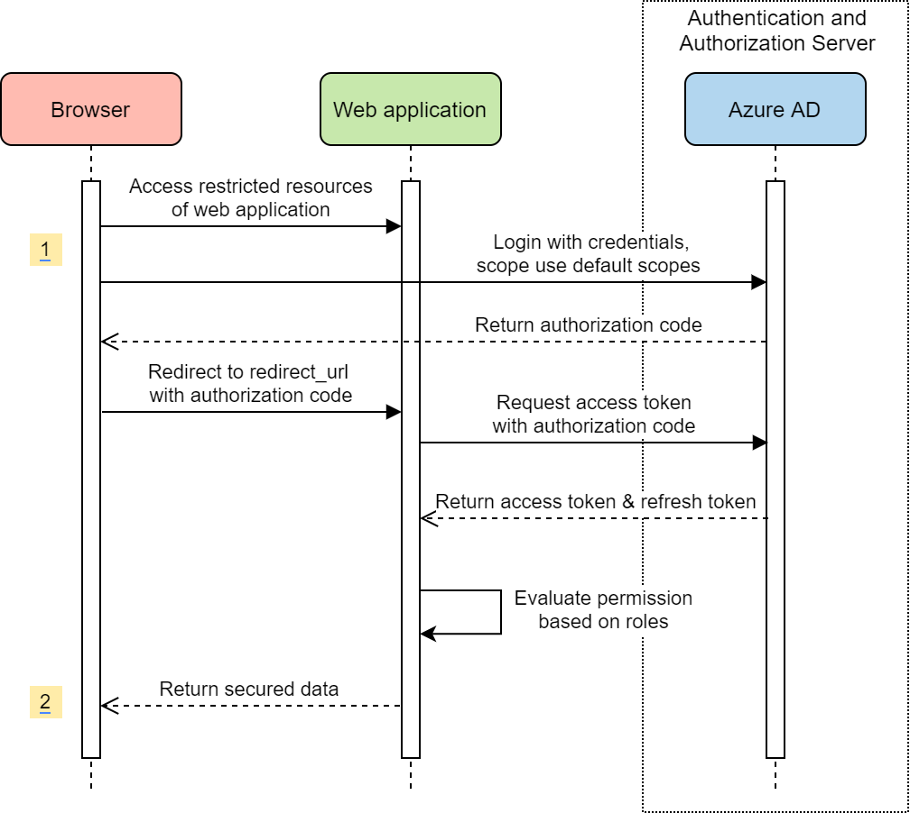
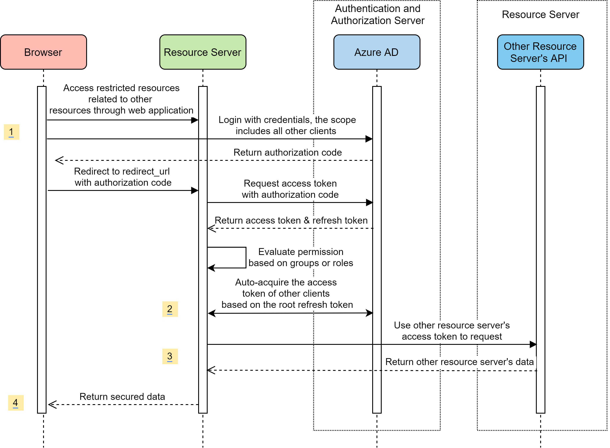

# Azure AD Spring Boot Starter client library for Java

With Spring Starter for Azure Active Directory, now you can get started quickly to build the authentication workflow for a web application that uses Azure AD and OAuth 2.0 to secure its back end. It also enables developers to create a role based authorization workflow for a Web API secured by Azure AD, with the power of the Spring Security Filter Chain. 

[Package (Maven)][package] | [API reference documentation][refdocs] | [Product documentation][docs] | [Samples][sample]

## Getting started
### Prerequisites
- [Java Development Kit (JDK)][jdk_link] with version 8 or above
- [Azure Subscription][azure_subscription]
- [Maven](https://maven.apache.org/) 3.0 and above

### Register the Application in Azure AD
* **Register a new application**: Go to Azure Portal - Azure Active Directory - App registrations - New application registration to register the application in Azure Active Directory.  `Application ID` is `client-id` in `application.properties`.
* **Grant permissions to the application**: After application registration succeeded, go to API ACCESS - Required permissions - DELEGATED PERMISSIONS, tick `Access the directory as the signed-in user` and `Sign in and read user profile`. Click `Grant Permissions` (Note: you will need administrator privilege to grant permission).
* **Create a client secret key for the application**: Go to API ACCESS - Keys to create a secret key (`client-secret`).

### Include the package
[//]: # "{x-version-update-start;com.azure.spring:azure-spring-boot-starter-active-directory;current}"
```xml
<dependency>
    <groupId>com.azure.spring</groupId>
    <artifactId>azure-spring-boot-starter-active-directory</artifactId>
    <version>3.0.0-beta.1</version>
</dependency>
```
[//]: # "{x-version-update-end}"

## Key concepts
This package provides 2 ways to integrate with Spring Security and authenticate with Azure Active Directory.

The authorization flow is composed of 3 phrases:
* Login with credentials and validate id_token from Azure AD 
* Get On-Behalf-Of token and membership info from Azure AD Graph API
* Evaluate the permission based on membership info to grant or deny access

### Group membership
The way to get group relationship depends on the graph api used, the default to get membership is the direct group of the user. 
To get all transitive relationships, the following configuration is required:

```yaml
azure:
  activedirectory:
    graph-membership-uri: https://graph.microsoft.com/v1.0/me/transitiveMemberOf
``` 

### Web application
Based on Azure AD as a Web application, it uses OAuth2 authorization code flow to authentication, and authorizes resources based on the groups or roles claim in the access token. 

This starter provides a convenient way to quickly access resource servers.
1. Resource servers should be registered as `ClientRegistration`.
2. In Controller, `@RegisteredOAuth2AuthorizedClient` can be used to  get `OAuth2AuthorizedClient`. 
   `OAuth2AuthorizedClient` contains accessToken to access related client resource.
#### On-demand authorization
By default, the starter will launch the Oauth2 Authorization Code flow for a logging in user. During the authorization flow, `azure-spring-boot-starter-active-directory` adds all the configured scopes except **on-demand** ones into authorization code requests to ask for user's authorization consent. The authorization flow of `on-demand` resources will be launched at the first time the user wants to access them.

#### Standalone web application usage
Only as a Web application, no further access to other resources protected by Azure AD.


* Access restricted resources of web application, login with credentials using default scopes.
* Return secured data.

#### Web application access resources usage
Web application and resource server use scenarios, web application access the resources of resource server which is protected by Azure AD.


* Login with credentials, the scope includes all other clients. 
* Auto-acquire the access token of other clients based on the root refresh token.
* Use each client's access token to request restricted resource.
* Return secured data.

### Resource Server
Based on Azure AD as a Resource Server, it uses `BearerTokenAuthenticationFilter` authorize request. The current resource server also can access other resources, there's a similar method to the web application usage to obtain access to the client access token, the difference is the access token obtained based on the `MSAL On-Behalf-Of` process.

#### Standalone resource server usage
Only as a Resource Server, no further access to other resources protected by Azure AD.


* Access restricted resources of Resource Server.
* Validate access token.
* Return secured data.

#### Resource server access other resources usage
Resource server accesses other resource servers which are protected by Azure AD.


* Access restricted resources related to Graph and Custom resources through resource server.
* Auto On-Behalf-Of to request an access token for other clients.
* Use each client's access token to request restricted resource.
* Return secured data.

## Examples

Refer to different samples for different authentication ways. 

**Note**: `AADAppRoleStatelessAuthenticationFilter` and `AADAuthenticationFilter` will be deprecated. [Click here](https://github.com/Azure/azure-sdk-for-java/issues/17860) to replace it.

### Authenticate in webapp

Please refer to [azure-spring-boot-sample-active-directory-webapp](https://github.com/Azure/azure-sdk-for-java/blob/master/sdk/spring/azure-spring-boot-samples/azure-spring-boot-sample-active-directory-webapp/README.md) for authenticate in backend.

####  Configure application.yml:
```yaml
azure:
  activedirectory:
    tenant-id: xxxxxx-your-tenant-id-xxxxxx
    client-id: xxxxxx-your-client-id-xxxxxx
    client-secret: xxxxxx-your-client-secret-xxxxxx
    user-group:
      allowed-groups: group1, group2
    post-logout-redirect-uri: http://localhost:8080 # optional
```

#### If you want to create your own configuration class:
<!-- embedme ../azure-spring-boot/src/samples/java/com/azure/spring/aad/AADOAuth2LoginConfigSample.java#L18-L26 -->
```java
@EnableWebSecurity
@EnableGlobalMethodSecurity(prePostEnabled = true)
public class AADOAuth2LoginConfigSample extends AADWebSecurityConfigurerAdapter {

    @Override
    protected void configure(HttpSecurity http) throws Exception {
        super.configure(http);
    }
}
```

### Authenticate in frontend

Please refer to [azure-active-directory-spring-boot-sample-with-filter](https://github.com/Azure/azure-sdk-for-java/blob/master/sdk/spring/azure-spring-boot-samples/azure-spring-boot-sample-active-directory-resource-server-with-filter/README.md) for how to integrate Spring Security and Azure AD for authentication and authorization in a Single Page Application (SPA) scenario.

#### Configure application.yml:
```yaml
azure:
  activedirectory:
    client-id: xxxxxx-your-client-id-xxxxxx
    client-secret: xxxxxx-your-client-secret-xxxxxx
    user-group:
      allowed-groups: group1, group2
```

#### Autowire `AADAuthenticationFilter` in `WebSecurityConfig.java` file
<!-- embedme ../azure-spring-boot/src/samples/java/com/azure/spring/aad/AADAuthenticationFilterConfigSample.java#L18-L23 -->
```java
@EnableGlobalMethodSecurity(securedEnabled = true, prePostEnabled = true)
public class AADAuthenticationFilterConfigSample extends WebSecurityConfigurerAdapter {

    @Autowired
    private AADAuthenticationFilter aadAuthFilter;
}
```

* Role-based Authorization with annotation `@PreAuthorize("hasRole('GROUP_NAME')")`
* Role-based Authorization with method `isMemberOf()`


### Authenticate stateless APIs using AAD app roles
This scenario fits best for stateless Spring backends exposing an API to SPAs ([OAuth 2.0 implicit grant flow](https://docs.microsoft.com/azure/active-directory/develop/v1-oauth2-implicit-grant-flow)) 
or service-to-service access using the [client credentials grant flow](https://docs.microsoft.com/azure/active-directory/develop/v1-oauth2-client-creds-grant-flow).

The stateless processing can be activated with the `azure.activedirectory.session-stateless` property. 
The authorization is using the [AAD AppRole feature](https://docs.microsoft.com/azure/architecture/multitenant-identity/app-roles#roles-using-azure-ad-app-roles),
so instead of using the `groups` claim the token has a `roles` claim which contains roles [configured in your manifest](https://docs.microsoft.com/azure/active-directory/develop/howto-add-app-roles-in-azure-ad-apps#examples). 

#### Configure your `application.yml`:

```yaml
azure:
  activedirectory:
    session-stateless: true
  client-id: xxxxxx-your-client-id-xxxxxx
```

#### Define your roles in your application registration manifest: 
```json
  "appRoles": [
    {
      "allowedMemberTypes": [
        "User"
      ],
      "displayName": "My demo",
      "id": "00000000-0000-0000-0000-000000000000",
      "isEnabled": true,
      "description": "My demo role.",
      "value": "MY_ROLE"
    }
  ],
```

#### Autowire the auth filter and attach it to the filter chain:
<!-- embedme ../azure-spring-boot/src/samples/java/com/azure/spring/aad/AADAppRoleStatelessAuthenticationFilterConfigSample.java#L22-L37 -->
```java
@EnableWebSecurity
@EnableGlobalMethodSecurity(prePostEnabled = true)
public class AADAppRoleStatelessAuthenticationFilterConfigSample extends WebSecurityConfigurerAdapter {

    @Autowired
    private AADAppRoleStatelessAuthenticationFilter appRoleAuthFilter;

    @Override
    protected void configure(HttpSecurity http) throws Exception {
        http.csrf().disable()
            .sessionManagement().sessionCreationPolicy(SessionCreationPolicy.STATELESS)
            .and()
            .addFilterBefore(appRoleAuthFilter, UsernamePasswordAuthenticationFilter.class);
    }

}
```

* Role-based Authorization with annotation `@PreAuthorize("hasRole('MY_ROLE')")`
* Role-based Authorization with method `isMemberOf()`

The roles you want to use within your application have to be [set up in the manifest of your
application registration](https://docs.microsoft.com/azure/active-directory/develop/howto-add-app-roles-in-azure-ad-apps).

### Configure scopes of multiple resources

By default, `azure-spring-boot-starter-active-directory` configures scopes of `openid`, `profile` and `https://graph.microsoft.com/user.read` to implement OpenID Connect protocol and access of membership information of logging in users.

To customize scope configurations of multiple resources, developers need to configure the registration id and scopes in the `application.yml` as needed. Here the {registration-id} is defined by developers themselves to generate correspondding `OAuth2AuthorizedClient` to acquire access tokens, and scope names should follow the specification of `resource-uri/permission`.
```yaml
azure:
  activedirectory:
    authorization:
      graph:
        scopes: https://graph.microsoft.com/Analytics.Read, email
      {registration-id}:
        scopes: {scope1}, {scope2}
``` 

### Configure on-demand resource authorization 
To configure the authorization of certain resource as on-demand, developers need to add following property in `application.yml`:
```yaml
azure:
  activedirectory:
    authorization:
      {registration-id}:
        on-demand: true
        scopes: {scope1}, {scope2}
``` 

### Protect the Resource API through Resource Server
Please refer to [azure-spring-boot-sample-active-directory-spring-oauth2-resource-server][resource-server] for access resource api.

#### Include the package
```xml
  <dependencies>
    <dependency>
      <groupId>com.azure.spring</groupId>
      <artifactId>azure-spring-boot-starter-active-directory</artifactId>
    </dependency>
    <dependency>
      <groupId>org.springframework.security</groupId>
      <artifactId>spring-security-oauth2-resource-server</artifactId>
    </dependency>
    <dependency>
      <groupId>org.springframework.security</groupId>
      <artifactId>spring-security-oauth2-jose</artifactId>
    </dependency>
  </dependencies>
```

#### Using `AADOAuth2ResourceServerSecurityConfig` to extends `WebSecurityConfigurerAdapter`:

```java
@EnableWebSecurity
@EnableGlobalMethodSecurity(prePostEnabled = true)
public class AADOAuth2ResourceServerSecurityConfig extends WebSecurityConfigurerAdapter {

    @Override
    protected void configure(HttpSecurity http) throws Exception {
        http.authorizeRequests((requests) -> requests.anyRequest().authenticated())
            .oauth2ResourceServer()
            .jwt()
            .jwtAuthenticationConverter(new AzureJwtBearerTokenAuthenticationConverter());
    }
}
```

## Troubleshooting
### Enable client logging
Azure SDKs for Java offers a consistent logging story to help aid in troubleshooting application errors and expedite their resolution. The logs produced will capture the flow of an application before reaching the terminal state to help locate the root issue. View the [logging][logging] wiki for guidance about enabling logging.

### Enable Spring logging
Spring allow all the supported logging systems to set logger levels set in the Spring Environment (for example, in application.properties) by using `logging.level.<logger-name>=<level>` where level is one of TRACE, DEBUG, INFO, WARN, ERROR, FATAL, or OFF. The root logger can be configured by using logging.level.root.

The following example shows potential logging settings in `application.properties`:

```properties
logging.level.root=WARN
logging.level.org.springframework.web=DEBUG
logging.level.org.hibernate=ERROR
```

For more information about setting logging in spring, please refer to the [official doc](https://docs.spring.io/spring-boot/docs/current/reference/html/spring-boot-features.html#boot-features-logging).
 

## Next steps
The following section provides sample projects illustrating how to use the starter in different cases.
### More sample code
- [Azure Active Directory for Resource Server with Filter(Deprecated)](https://github.com/Azure/azure-sdk-for-java/blob/master/sdk/spring/azure-spring-boot-samples/azure-spring-boot-sample-active-directory-resource-server-with-filter)
- [Azure Active Directory for Web Application](https://github.com/Azure/azure-sdk-for-java/blob/master/sdk/spring/azure-spring-boot-samples/azure-spring-boot-sample-active-directory-webapp)

## Contributing
This project welcomes contributions and suggestions.  Most contributions require you to agree to a Contributor License Agreement (CLA) declaring that you have the right to, and actually do, grant us the rights to use your contribution. For details, visit https://cla.microsoft.com.

Please follow [instructions here](https://github.com/Azure/azure-sdk-for-java/blob/master/sdk/spring/CONTRIBUTING.md) to build from source or contribute.

<!-- LINKS -->
[docs]: https://docs.microsoft.com/azure/developer/java/spring-framework/configure-spring-boot-starter-java-app-with-azure-active-directory
[refdocs]: https://azure.github.io/azure-sdk-for-java/springboot.html#azure-spring-boot
[package]: https://mvnrepository.com/artifact/com.microsoft.azure/azure-active-directory-spring-boot-starter
[sample]: https://github.com/Azure/azure-sdk-for-java/tree/master/sdk/spring/azure-spring-boot-samples
[logging]: https://github.com/Azure/azure-sdk-for-java/wiki/Logging-with-Azure-SDK#use-logback-logging-framework-in-a-spring-boot-application
[azure_subscription]: https://azure.microsoft.com/free
[jdk_link]: https://docs.microsoft.com/java/azure/jdk/?view=azure-java-stable

[graph-api-list-member-of]: https://docs.microsoft.com/graph/api/user-list-memberof?view=graph-rest-1.0
[graph-api-list-transitive-member-of]: https://docs.microsoft.com/graph/api/user-list-transitivememberof?view=graph-rest-1.0
[resource-server]: https://github.com/Azure/azure-sdk-for-java/blob/master/sdk/spring/azure-spring-boot-samples/azure-spring-boot-sample-active-directory-resource-server/README.md
