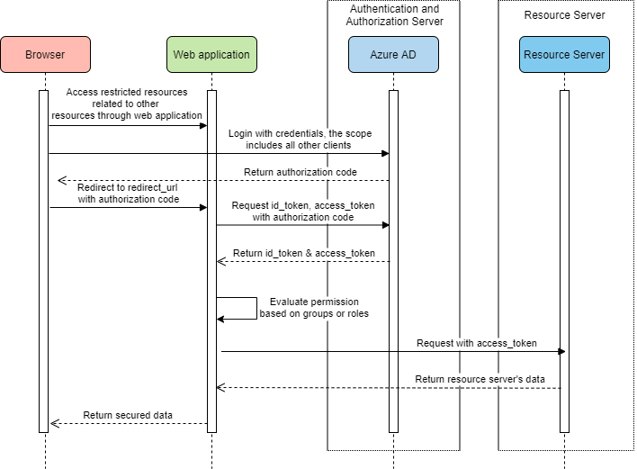

# Azure AD Spring Boot Starter client library for Java

With Spring Starter for Azure Active Directory, now you can get started quickly to build the authentication workflow for a web application that uses Azure AD and OAuth 2.0 to secure its back end. It also enables developers to create a role based authorization workflow for a Web API secured by Azure AD, with the power of the Spring Security Filter Chain. 

[Package (Maven)][package] | [API reference documentation][refdocs] | [Product documentation][docs] | [Samples][sample]

## Getting started
### Prerequisites
- [Java Development Kit (JDK)][jdk_link] with version 8 or above
- [Azure Subscription][azure_subscription]
- [Maven](https://maven.apache.org/) 3.0 and above

### Register the Application in Azure AD
* **Register a new application**: Go to Azure Portal - Azure Active Directory - App registrations - New application registration to register the application in Azure Active Directory.  `Application ID` is `client-id` in `application.properties`.
* **Grant permissions to the application**: After application registration succeeded, go to API ACCESS - Required permissions - DELEGATED PERMISSIONS, tick `Access the directory as the signed-in user` and `Sign in and read user profile`. Click `Grant Permissions` (Note: you will need administrator privilege to grant permission).
* **Create a client secret key for the application**: Go to API ACCESS - Keys to create a secret key (`client-secret`).

## Key concepts
This package provides 2 ways to integrate with Spring Security and authenticate with Azure Active Directory, which are designed for scenarios of web application and resource server.

The authorization flow for web application includes:
* Login with credentials by self-defined `azure` client registration and trigger **authorization code flow**. Application gets user's consent for all configured scopes except on-demand resources' scopes, and acquires an access token only for scopes of `openid, profile, offline_access, https://graph.microsoft.com/User.Read`.
* When other resources are visited, associated clients will be loaded to trigger **refresh token flow** for authorization, and acquire an access token for configured scopes of that resource.
* When on-demand resources are visited, associated clients will be loaded and trigger **authorization code flow** like the `azure` client.

The authorization flow for resource server:

* Login with credentials and validate id_token from Azure AD 
* Get On-Behalf-Of token and membership info from Azure AD Graph API
* Evaluate the permission based on membership info to grant or deny access

### Web application
Based on Azure AD as a Web application, it uses OAuth2 authorization code flow to authentication, and authorizes resources based on the groups in the access token.

#### System diagram


1. Access restricted resources of web application, login with credentials using default scopes of `openid, profile, offline_access, https://graph.microsoft.com/User.Read`.
2. Return secured data.

#### Include the package
To use the starter in this scenario, please add the following dependencies in you pom.xml

[//]: # "{x-version-update-start;com.azure.spring:azure-spring-boot-starter-active-directory;current}"
```xml
<dependency>
    <groupId>com.azure.spring</groupId>
    <artifactId>azure-spring-boot-starter-active-directory</artifactId>
    <version>3.2.0-beta.1</version>
</dependency>
<dependency>
    <groupId>org.springframework.boot</groupId>
    <artifactId>spring-boot-starter-oauth2-client</artifactId>
</dependency>
```
[//]: # "{x-version-update-end}"
   
#### Configure application.yml:
```yaml
azure:
  activedirectory:
    tenant-id: xxxxxx-your-tenant-id-xxxxxx
    client-id: xxxxxx-your-client-id-xxxxxx
    client-secret: xxxxxx-your-client-secret-xxxxxx
    user-group:
      allowed-groups: group1, group2
    post-logout-redirect-uri: http://localhost:8080 # optional
```

#### Related Java code
If you want to create your own configuration class:
<!-- embedme ../azure-spring-boot/src/samples/java/com/azure/spring/aad/AADOAuth2LoginConfigSample.java#L18-L26 -->
```java
@EnableWebSecurity
@EnableGlobalMethodSecurity(prePostEnabled = true)
public class AADOAuth2LoginConfigSample extends AADWebSecurityConfigurerAdapter {

    @Override
    protected void configure(HttpSecurity http) throws Exception {
        super.configure(http);
    }
}
```

### Web application with function of visiting resource servers

#### System diagram


1. Login with credentials, the scope includes default scopes and all configured scopes. 
2. Auto-acquire the access token of other clients based on the root refresh token.
3. Use each client's access token to request restricted resource.
4. Return secured data.

#### Include the package
To use the starter in this scenario, please add the following dependencies in you pom.xml

[//]: # "{x-version-update-start;com.azure.spring:azure-spring-boot-starter-active-directory;current}"
```xml
<dependency>
    <groupId>com.azure.spring</groupId>
    <artifactId>azure-spring-boot-starter-active-directory</artifactId>
    <version>3.2.0-beta.1</version>
</dependency>
<dependency>
    <groupId>org.springframework.boot</groupId>
    <artifactId>spring-boot-starter-oauth2-client</artifactId>
</dependency>
```
[//]: # "{x-version-update-end}"

#### Configure application.yml:
To customize scope configurations of multiple resources, developers need to configure the registration id and scopes in the `application.yml` as needed. Here the {registration-id} is defined by developers themselves to generate correspondding `OAuth2AuthorizedClient` to acquire access tokens, and scope names should follow the specification of `resource-uri/permission`.
```yaml
azure:
  activedirectory:
    authorization-clients:
      graph:
        scopes: https://graph.microsoft.com/Analytics.Read, email
      {registration-id}:
        scopes: {scope1}, {scope2}
```

By default, the starter will launch the Oauth2 Authorization Code flow for a logging in user. During the authorization flow, `azure-spring-boot-starter-active-directory` adds all the configured scopes except **on-demand** ones into authorization code requests to ask for user's authorization consent. The authorization flow of `on-demand` resources will be launched at the first time the user wants to access them.
To configure the authorization of certain resource as on-demand, developers need to add following property in `application.yml`:
```yaml
azure:
  activedirectory:
    authorization-clients:
      {registration-id}:
        on-demand: true
        scopes: {scope1}, {scope2}
```

#### Related Java code
In Controller, `@RegisteredOAuth2AuthorizedClient` can be used to  get `OAuth2AuthorizedClient`. 
   `OAuth2AuthorizedClient` contains accessToken to access related client resource.
```java
@GetMapping("/graph")
@ResponseBody
public String graph(@RegisteredOAuth2AuthorizedClient("graph") OAuth2AuthorizedClient oAuth2AuthorizedClient) {
    return toJsonString(oAuth2AuthorizedClient);
}

@GetMapping("/office")
@ResponseBody
public String office(@RegisteredOAuth2AuthorizedClient("office") OAuth2AuthorizedClient oAuth2AuthorizedClient) {
    return toJsonString(oAuth2AuthorizedClient);
}
```

### Resource Server
Based on Azure AD as a Resource Server, it uses `BearerTokenAuthenticationFilter` authorize request.
Only as a Resource Server, no further access to other resources protected by Azure AD.

#### System diagram


1. Access restricted resources of Resource Server.
2. Validate access token.
3. Return secured data.

#### Include the package
To use the starter in this scenario, please add the following dependencies in you pom.xml

[//]: # "{x-version-update-start;com.azure.spring:azure-spring-boot-starter-active-directory;current}"
```xml
<dependency>
    <groupId>com.azure.spring</groupId>
    <artifactId>azure-spring-boot-starter-active-directory</artifactId>
    <version>3.2.0-beta.1</version>
</dependency>
<dependency>
    <groupId>org.springframework.boot</groupId>
    <artifactId>spring-boot-starter-oauth2-resource-server</artifactId>
</dependency>
```
[//]: # "{x-version-update-end}"

#### Configure application.yml:
```yaml
azure:
  activedirectory:
    client-id: <client-id>
    app-id-uri: <app-id-uri>
```

#### Related Java code
Using `AADOAuth2ResourceServerSecurityConfig` to extends `WebSecurityConfigurerAdapter`:
```java
@EnableWebSecurity
@EnableGlobalMethodSecurity(prePostEnabled = true)
public class AADOAuth2ResourceServerSecurityConfig extends WebSecurityConfigurerAdapter {

    @Override
    protected void configure(HttpSecurity http) throws Exception {
        http.authorizeRequests((requests) -> requests.anyRequest().authenticated())
            .oauth2ResourceServer()
            .jwt()
            .jwtAuthenticationConverter(new AzureJwtBearerTokenAuthenticationConverter());
    }
}
```

### Resource server with function of visiting other resource servers (by OBO flow)
The current resource server also can access other resources, there's a similar method to the web application usage to obtain access to the client access token, the difference is the access token obtained based on the `MSAL On-Behalf-Of` process.

#### System diagram
.png)

1. Access restricted resources related to Graph and Custom resources through resource server.
2. Auto On-Behalf-Of to request an access token for other clients.
3. Use each client's access token to request restricted resource.
4. Return secured data.

#### Include the package
To use the starter in this scenario, please add the following dependencies in you pom.xml

[//]: # "{x-version-update-start;com.azure.spring:azure-spring-boot-starter-active-directory;current}"
```xml
<dependency>
    <groupId>com.azure.spring</groupId>
    <artifactId>azure-spring-boot-starter-active-directory</artifactId>
    <version>3.2.0-beta.1</version>
</dependency>
<dependency>
    <groupId>org.springframework.boot</groupId>
    <artifactId>spring-boot-starter-oauth2-resource-server</artifactId>
</dependency>
<dependency>
    <groupId>org.springframework.boot</groupId>
    <artifactId>spring-boot-starter-oauth2-client</artifactId>
</dependency>
```
[//]: # "{x-version-update-end}"

#### Configure application.yml:
```yaml
azure:
   activedirectory:
      client-id: <Web-API-A-client-id>
      client-secret: <Web-API-A-client-secret>
      tenant-id: <Tenant-id-registered-by-application>
      app-id-uri: <Web-API-A-app-id-url>
      authorization-clients:
         graph:
            scopes:
               - https://graph.microsoft.com/User.Read
         custom:
            scopes:
               - <Web-API-B-app-id-url>/File.Read
```

#### Related Java code
Using `@RegisteredOAuth2AuthorizedClient` to access related resource server:
```java
@PreAuthorize("hasAuthority('SCOPE_Obo.Graph.Read')")
@GetMapping("call-graph")
public String callGraph(@RegisteredOAuth2AuthorizedClient("graph") OAuth2AuthorizedClient graph) {
    return callMicrosoftGraphMeEndpoint(graph);
}

@PreAuthorize("hasAuthority('SCOPE_Obo.File.Read')")
@GetMapping("call-custom")
public String callCustom(
    @RegisteredOAuth2AuthorizedClient("custom") OAuth2AuthorizedClient custom) {
    return callCustomLocalFileEndpoint(custom);
}
```

### Use Azure China instead of Azure Global
If you use [Azure China] instead of **Azure Global**, you need to configure your `application.yml`:
```yaml
azure:
  activedirectory:
    base-uri: https://login.partner.microsoftonline.cn
    graph-membership-uri: https://microsoftgraph.chinacloudapi.cn/v1.0/me/memberOf
```

### Configurable properties
This starter provides following properties to be customized:


| Properties                                                        | Description                                                         |
| ------------------------------------------------------------ | ------------------------------------------------------------ |
| **azure.activedirectory**.allow-telemetry                        | If telemetry events should be published to Azure AD. The default value is true. |
| **azure.activedirectory**.app-id-uri                             | Used in the "aud" claim of an id token.                      |
| **azure.activedirectory**.authorization-clients                  | Resource server name that the application is going to visit. |
| **azure.activedirectory**.authorization-clients.{client-name}.scopes | API permissions of a resource server that the application is going to acquire. |
| **azure.activedirectory**.authorization-clients.{client-name}.scopes.on-demand | If the authorization flow of current resource server will be executed on demand. The default value is false. |
| **azure.activedirectory**.base-uri                               | Base uri for authorization server, the default value is `https://login.microsoftonline.com/`. |
| **azure.activedirectory**.client-id                              | Registered application ID in Azure AD.                       |
| **azure.activedirectory**.client-secret                          | API Access Key of the registered application.                |
| **azure.activedirectory**.graph-membership-uri                   | The way this starter uses to load users' membership depends on the configured membership URI. By default, the starter uses `https://graph.microsoft.com/v1.0/me/memberOf` to get direct membership of current user. <br>To get all transitive membership, you can configure it as `https://graph.microsoft.com/v1.0/me/transitiveMemberOf`. |
| **azure.activedirectory**.jwk-set-cache-refresh-time             | The refresh time of the cached JWK set before it expires, default is 5 minutes. |
| **azure.activedirectory**.jwt-connect-timeout                    | Connection Timeout for the JWKSet Remote URL call.           |
| **azure.activedirectory**.jwt-read-timeout                       | Read Timeout for the JWKSet Remote URL call.                 |
| **azure.activedirectory**.jwt-set-cache-lifespan                 | The lifespan of the cached JWK set before it expires, default is 5 minutes. |
| **azure.activedirectory**.jwt-size-limit                         | Size limit in Bytes of the JWKSet Remote URL call.           |
| **azure.activedirectory**.post-logout-redirect-uri               | Redirect uri for posting log-out.                            |
| **azure.activedirectory**.redirect-uri-template                  | Used by the authorization server to return responses containing authorization credentials to the client via the resource owner user-agent. |
| **azure.activedirectory**.session-stateless                      | If true, the stateless authentication filter `AADAppRoleStatelessAuthenticationFilter` will be activated. By default, the value is false, which activates `AADAuthenticationFilter`. Note, these two filters are deprecated now.|
| **azure.activedirectory**.tenant-id                              | Azure Tenant ID.                                             |
| **azure.activedirectory**.user-group.allowed-groups              | Expected user groups that an authority will be granted to if found in the response from the MemeberOf Graph API Call. |


## Examples
Refer to different samples for different authentication ways. 

### Web application with function of visiting resource servers
Please refer to [azure-spring-boot-sample-active-directory-webapp] for authenticate in web apps.

### Resource server
Please refer to [azure-spring-boot-sample-active-directory-resource-server] for access resource APIs.

### Resource server with function of visiting other resource servers (by OBO flow)
Please refer to [azure-spring-boot-sample-active-directory-resource-server-obo] for access On-Behalf-Of flow.

## Troubleshooting
### Enable client logging
Azure SDKs for Java offers a consistent logging story to help aid in troubleshooting application errors and expedite their resolution. The logs produced will capture the flow of an application before reaching the terminal state to help locate the root issue. View the [logging][logging] wiki for guidance about enabling logging.

### Enable Spring logging
Spring allow all the supported logging systems to set logger levels set in the Spring Environment (for example, in application.properties) by using `logging.level.<logger-name>=<level>` where level is one of TRACE, DEBUG, INFO, WARN, ERROR, FATAL, or OFF. The root logger can be configured by using logging.level.root.

The following example shows potential logging settings in `application.properties`:

```properties
logging.level.root=WARN
logging.level.org.springframework.web=DEBUG
logging.level.org.hibernate=ERROR
```

For more information about setting logging in spring, please refer to the [official doc].

## Next steps

## Contributing
This project welcomes contributions and suggestions.  Most contributions require you to agree to a Contributor License Agreement (CLA) declaring that you have the right to, and actually do, grant us the rights to use your contribution. For details, visit https://cla.microsoft.com.

Please follow [instructions here] to build from source or contribute.

<!-- LINKS -->
[azure_subscription]: https://azure.microsoft.com/free
[azure-spring-boot-sample-active-directory-webapp]: https://github.com/Azure/azure-sdk-for-java/blob/master/sdk/spring/azure-spring-boot-samples/azure-spring-boot-sample-active-directory-webapp
[azure-spring-boot-sample-active-directory-resource-server]: https://github.com/Azure/azure-sdk-for-java/blob/master/sdk/spring/azure-spring-boot-samples/azure-spring-boot-sample-active-directory-resource-server/README.md
[azure-spring-boot-sample-active-directory-resource-server-obo]: https://github.com/ZhuXiaoBing-cn/azure-sdk-for-java/tree/master/sdk/spring/azure-spring-boot-samples/azure-spring-boot-sample-active-directory-resource-server-obo
[azure-spring-boot-sample-active-directory-resource-server-by-filter]: https://github.com/Azure/azure-sdk-for-java/blob/master/sdk/spring/azure-spring-boot-samples/azure-spring-boot-sample-active-directory-resource-server-by-filter
[AAD App Roles feature]: https://docs.microsoft.com/azure/architecture/multitenant-identity/app-roles#roles-using-azure-ad-app-roles
[client credentials grant flow]: https://docs.microsoft.com/azure/active-directory/develop/v1-oauth2-client-creds-grant-flow
[configured in your manifest]: https://docs.microsoft.com/azure/active-directory/develop/howto-add-app-roles-in-azure-ad-apps#examples
[docs]: https://docs.microsoft.com/azure/developer/java/spring-framework/configure-spring-boot-starter-java-app-with-azure-active-directory
[graph-api-list-member-of]: https://docs.microsoft.com/graph/api/user-list-memberof?view=graph-rest-1.0
[graph-api-list-transitive-member-of]: https://docs.microsoft.com/graph/api/user-list-transitivememberof?view=graph-rest-1.0
[instructions here]: https://github.com/Azure/azure-sdk-for-java/blob/master/sdk/spring/CONTRIBUTING.md
[jdk_link]: https://docs.microsoft.com/java/azure/jdk/?view=azure-java-stable
[logging]: https://github.com/Azure/azure-sdk-for-java/wiki/Logging-with-Azure-SDK#use-logback-logging-framework-in-a-spring-boot-application
[official doc]: https://docs.spring.io/spring-boot/docs/current/reference/html/spring-boot-features.html#boot-features-logging
[OAuth 2.0 implicit grant flow]: https://docs.microsoft.com/azure/active-directory/develop/v1-oauth2-implicit-grant-flow
[package]: https://mvnrepository.com/artifact/com.azure.spring/azure-spring-boot-starter-active-directory
[refdocs]: https://azure.github.io/azure-sdk-for-java/springboot.html#azure-spring-boot
[sample]: https://github.com/Azure/azure-sdk-for-java/tree/master/sdk/spring/azure-spring-boot-samples
[set up in the manifest of your application registration]: https://docs.microsoft.com/azure/active-directory/develop/howto-add-app-roles-in-azure-ad-apps
[Azure China]: https://docs.microsoft.com/azure/china/resources-developer-guide#check-endpoints-in-azure
