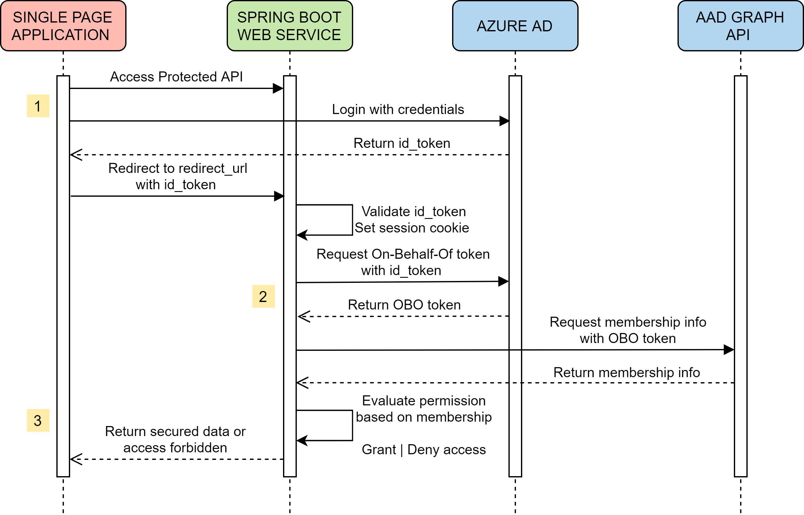
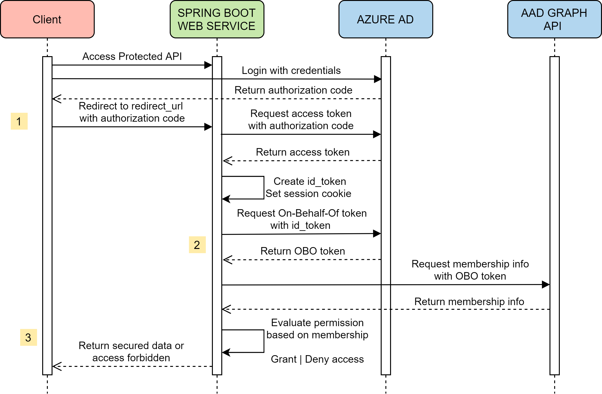
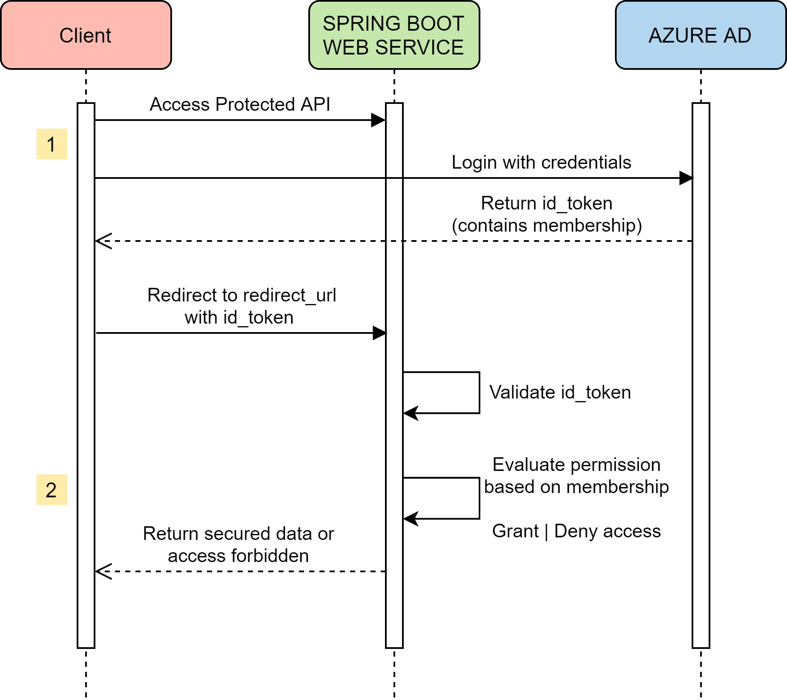

# Azure AD Spring Boot Starter client library for Java

With Spring Starter for Azure Active Directory, now you can get started quickly to build the authentication workflow for a web application that uses Azure AD and OAuth 2.0 to secure its back end. It also enables developers to create a role based authorization workflow for a Web API secured by Azure AD, with the power of the Spring Security Filter Chain. 

[Package (Maven)][package] | [API reference documentation][refdocs] | [Product documentation][docs] | [Samples][sample]

## Getting started
### Prerequisites
- Java Development Kit (JDK) with version 8 or above
- [Azure Subscription][azure_subscription]
- [Maven](http://maven.apache.org/) 3.0 and above

### Register the Application in Azure AD
* **Register a new application**: Go to Azure Portal - Azure Active Directory - App registrations - New application registration to register the application in Azure Active Directory.  `Application ID` is `client-id` in `application.properties`.
* **Grant permissions to the application**: After application registration succeeded, go to API ACCESS - Required permissions - DELEGATED PERMISSIONS, tick `Access the directory as the signed-in user` and `Sign in and read user profile`. Click `Grant Permissions` (Note: you will need administrator privilege to grant permission).
* **Create a client secret key for the application**: Go to API ACCESS - Keys to create a secret key (`client-secret`).

### Include the package
[//]: # "{x-version-update-start;com.microsoft.azure:azure-active-directory-spring-boot-starter;current}"
```xml
<dependency>
    <groupId>com.microsoft.azure</groupId>
    <artifactId>azure-active-directory-spring-boot-starter</artifactId>
    <version>2.3.3</version>
</dependency>
```
[//]: # "{x-version-update-end}"

## Key concepts
This package provides 2 ways to integrate with Spring Security and authenticate with Azure Active Directory.

The authorization flow is composed of 3 phrases:
* Login with credentials and validate id_token from Azure AD 
* Get On-Behalf-Of token and membership info from Azure AD Graph API
* Evaluate the permission based on membership info to grant or deny access

### Authenticate in frontend
Sends bearer authorization code to backend, in backend a Spring Security filter `AADAuthenticationFilter` validates the Jwt token from Azure AD and save authentication. The Jwt token is also used to acquire a On-Behalf-Of token for Azure AD Graph API so that authenticated user's membership information is available for authorization of access of API resources. 
Below is a diagram that shows the layers and typical flow for Single Page Application with Spring Boot web API backend that uses the filter for Authentication and Authorization.



### Authenticate in backend
Auto configuration for common Azure Active Directory OAuth2 properties and `OAuth2UserService` to map authorities are provided.

#### Authorization Code mode usage


#### ID Token mode usage(Stateless implicit)


When the session is stateless, use `AADAppRoleStatelessAuthenticationFilter` as a Spring Security filter to validate the Jwt token from Azure AD and save authentication

## Examples

Refer to different samples for different authentication ways. 

### Authenticate in backend

Please refer to [azure-spring-boot-sample-active-directory-backend](../azure-spring-boot-samples/azure-spring-boot-sample-active-directory-backend/README.md) for authenticate in backend. Or [azure-spring-boot-sample-active-directory-backend-v2](../azure-spring-boot-samples/azure-spring-boot-sample-active-directory-backend-v2/README.md) to use Microsoft Graph API instead of Azure Active Directory Graph API.

####  Configure application.properties:
```properties
spring.security.oauth2.client.registration.azure.client-id=xxxxxx-your-client-id-xxxxxx
spring.security.oauth2.client.registration.azure.client-secret=xxxxxx-your-client-secret-xxxxxx
azure.activedirectory.tenant-id=xxxxxx-your-tenant-id-xxxxxx
azure.activedirectory.user-group.allowed-groups=group1, group2
```

#### Autowire `OAuth2UserService` bean in `WebSecurityConfigurerAdapter`:
<!-- embedme ../azure-spring-boot/src/samples/java/com/azure/spring/aad/AADOAuth2LoginConfigSample.java#L22-L38 -->
```java
@EnableWebSecurity
@EnableGlobalMethodSecurity(prePostEnabled = true)
public class AADOAuth2LoginConfigSample extends WebSecurityConfigurerAdapter {

    @Autowired
    private OAuth2UserService<OidcUserRequest, OidcUser> oidcUserService;

    @Override
    protected void configure(HttpSecurity http) throws Exception {
        http.authorizeRequests()
            .anyRequest().authenticated()
            .and()
            .oauth2Login()
            .userInfoEndpoint()
            .oidcUserService(oidcUserService);
    }
}
```

### Authenticate in frontend

Please refer to [azure-active-directory-spring-boot-sample](../azure-spring-boot-samples/azure-spring-boot-sample-active-directory/README.md) for how to integrate Spring Security and Azure AD for authentication and authorization in a Single Page Application (SPA) scenario.

#### Configure application.properties:
```properties
azure.activedirectory.client-id=Application-ID-in-AAD-App-registrations
azure.activedirectory.client-secret=Key-in-AAD-API-ACCESS
azure.activedirectory.user-group.allowed-groups=Aad-groups e.g. group1,group2,group3
```

If you're using [Azure China](https://docs.microsoft.com/azure/china/china-welcome), please append an extra line to the `application.properties` file:
```properties
azure.activedirectory.environment=cn
```

#### Autowire `AADAuthenticationFilter` in `WebSecurityConfig.java` file
<!-- embedme ../azure-spring-boot/src/samples/java/com/azure/spring/aad/AADAuthenticationFilterConfigSample.java#L18-L24 -->
```java
@EnableGlobalMethodSecurity(securedEnabled = true, prePostEnabled = true)
public class AADAuthenticationFilterConfigSample extends WebSecurityConfigurerAdapter {

    @Autowired
    private AADAuthenticationFilter aadAuthFilter;

}
```

* Role-based Authorization with annotation `@PreAuthorize("hasRole('GROUP_NAME')")`
* Role-based Authorization with method `isMemberOf()`

### Authenticate stateless APIs using AAD app roles
This scenario fits best for stateless Spring backends exposing an API to SPAs ([OAuth 2.0 implicit grant flow](https://docs.microsoft.com/azure/active-directory/develop/v1-oauth2-implicit-grant-flow)) 
or service-to-service access using the [client credentials grant flow](https://docs.microsoft.com/azure/active-directory/develop/v1-oauth2-client-creds-grant-flow).

The stateless processing can be activated with the `azure.activedirectory.session-stateless` property. 
The authorization is using the [AAD AppRole feature](https://docs.microsoft.com/azure/architecture/multitenant-identity/app-roles#roles-using-azure-ad-app-roles),
so instead of using the `groups` claim the token has a `roles` claim which contains roles [configured in your manifest](https://docs.microsoft.com/azure/active-directory/develop/howto-add-app-roles-in-azure-ad-apps#examples). 

#### Configure your `application properties`:

```properties
azure.activedirectory.session-stateless=true
azure.activedirectory.client-id=xxxxxx-your-client-id-xxxxxx
```

#### Define your roles in your application registration manifest: 
```json
  "appRoles": [
    {
      "allowedMemberTypes": [
        "User"
      ],
      "displayName": "My demo",
      "id": "00000000-0000-0000-0000-000000000000",
      "isEnabled": true,
      "description": "My demo role.",
      "value": "MY_ROLE"
    }
  ],
```

#### Autowire the auth filter and attach it to the filter chain:
<!-- embedme ../azure-spring-boot/src/samples/java/com/azure/spring/aad/AADAppRoleStatelessAuthenticationFilterConfigSample.java#L22-L37 -->
```java
@EnableWebSecurity
@EnableGlobalMethodSecurity(prePostEnabled = true)
public class AADAppRoleStatelessAuthenticationFilterConfigSample extends WebSecurityConfigurerAdapter {

    @Autowired
    private AADAppRoleStatelessAuthenticationFilter appRoleAuthFilter;

    @Override
    protected void configure(HttpSecurity http) throws Exception {
        http.csrf().disable()
            .sessionManagement().sessionCreationPolicy(SessionCreationPolicy.STATELESS)
            .and()
            .addFilterBefore(appRoleAuthFilter, UsernamePasswordAuthenticationFilter.class);
    }

}
```

* Role-based Authorization with annotation `@PreAuthorize("hasRole('MY_ROLE')")`
* Role-based Authorization with method `isMemberOf()`

The roles you want to use within your application have to be [set up in the manifest of your
application registration](https://docs.microsoft.com/azure/active-directory/develop/howto-add-app-roles-in-azure-ad-apps).

### Using The Microsoft Graph API
By default, azure-spring-boot is set up to utilize the Azure AD Graph.  If you would prefer, it can be set up to utilize the Microsoft Graph instead.  In order to do this, you will need to update the app registration in Azure to grant the application permissions to the Microsoft Graph API and add some properties to the application.properties file.

* **Grant permissions to the application**: After application registration succeeded, go to API permissions - Add a permission, select `Microsoft Graph`, select Delegated permissions,  tick `Directory.AccessAsUser.All - Access the directory as the signed-in user` and `Use.Read - Sign in and read user profile`. Click `Add Permissions` (Note: you will need administrator privilege to grant permission).  Furthermore, you can remove the API permissions to the Azure Active Directory Graph, as these will not be needed.

* **Configure your `application properties`**:
```properties
azure.activedirectory.environment=global-v2-graph
azure.activedirectory.user-group.key=@odata.type
azure.activedirectory.user-group.value=#microsoft.graph.group
azure.activedirectory.user-group.object-id-key=id
```

If you're using [Azure China](https://docs.microsoft.com/azure/china/china-welcome), please set the environment property in the `application.properties` file to:
```properties
azure.activedirectory.environment=cn-v2-graph
```

Please refer to [azure-spring-boot-sample-active-directory-backend-v2](../azure-spring-boot-samples/azure-spring-boot-sample-active-directory-backend-v2/README.md) to see a sample configured to use the Microsoft Graph API.

### Using Microsoft identity platform endpoints
If you want to use v2 version endpoints to do authorization and authentication, please pay attention to the attributes of claims, because there are some attributes exists in v1 version id-token by default but not in v2 version id-token, if you have to get that attribute, please make sure to add it into your scope.
There is the doc [Difference between v1 and v2](https://docs.microsoft.com/azure/active-directory/develop/azure-ad-endpoint-comparison), For example, the name attribute doesn't exist in v2 token, if you want it, you need add `profile` to your scope, like this:
```properties
spring.security.oauth2.client.registration.azure.scope=openid, https://graph.microsoft.com/user.read, profile
```
You can see more details in this link: [details](https://docs.microsoft.com/azure/active-directory/develop/id-tokens)

### AAD Conditional Access Policy
Now azure-active-directory-spring-boot-starter has supported AAD conditional access policy, if you are using this policy, you need add **AADOAuth2AuthorizationRequestResolver** and **AADAuthenticationFailureHandler** to your WebSecurityConfigurerAdapter.
<!-- embedme ../azure-spring-boot/src/samples/java/com/azure/spring/aad/AADOAuth2LoginConditionalPolicyConfigSample.java#L26-L53 -->
```java
@EnableWebSecurity
@EnableGlobalMethodSecurity(prePostEnabled = true)
public class AADOAuth2LoginConditionalPolicyConfigSample extends WebSecurityConfigurerAdapter {

    @Autowired
    private OAuth2UserService<OidcUserRequest, OidcUser> oidcUserService;

    @Autowired
    ApplicationContext applicationContext;

    @Override
    protected void configure(HttpSecurity http) throws Exception {
        final ClientRegistrationRepository clientRegistrationRepository =
            applicationContext.getBean(ClientRegistrationRepository.class);

        http.authorizeRequests()
            .anyRequest().authenticated()
            .and()
            .oauth2Login()
            .userInfoEndpoint()
            .oidcUserService(oidcUserService)
            .and()
            .authorizationEndpoint()
            .authorizationRequestResolver(new AADOAuth2AuthorizationRequestResolver(clientRegistrationRepository))
            .and()
            .failureHandler(new AADAuthenticationFailureHandler());
    }
}
```

## Troubleshooting
### Enable client logging
Azure SDKs for Java offer a consistent logging story to help aid in troubleshooting application errors and expedite their resolution. The logs produced will capture the flow of an application before reaching the terminal state to help locate the root issue. View the [logging][logging] wiki for guidance about enabling logging.

### Enable Spring logging
Spring allow all the supported logging systems to set logger levels set in the Spring Environment (for example, in application.properties) by using `logging.level.<logger-name>=<level>` where level is one of TRACE, DEBUG, INFO, WARN, ERROR, FATAL, or OFF. The root logger can be configured by using logging.level.root.

The following example shows potential logging settings in `application.properties`:

```properties
logging.level.root=WARN
logging.level.org.springframework.web=DEBUG
logging.level.org.hibernate=ERROR
```

For more information about setting loging in pring, please refer to the [official doc](https://docs.spring.io/spring-boot/docs/current/reference/html/spring-boot-features.html#boot-features-logging).
 

## Next steps
The following section provides sample projects illustrating how to use the starter in different cases.
### More sample code
- [Azure Active Directory for Frontend](../azure-spring-boot-samples/azure-spring-boot-sample-active-directory)
- [Azure Active Directory for Backend](../azure-spring-boot-samples/azure-spring-boot-sample-active-directory-backend)
- [Azure Active Directory for Backend with Microsoft Graph API](../azure-spring-boot-samples/azure-spring-boot-sample-active-directory-backend-v2)

## Contributing
This project welcomes contributions and suggestions.  Most contributions require you to agree to a Contributor License Agreement (CLA) declaring that you have the right to, and actually do, grant us the rights to use your contribution. For details, visit https://cla.microsoft.com.

Please follow [instructions here](../CONTRIBUTING.md) to build from source or contribute.

<!-- LINKS -->
[docs]: https://docs.microsoft.com/azure/developer/java/spring-framework/configure-spring-boot-starter-java-app-with-azure-active-directory
[refdocs]: https://azure.github.io/azure-sdk-for-java/spring.html#azure-active-directory-spring-boot-starter
[package]: https://mvnrepository.com/artifact/com.microsoft.azure/azure-active-directory-spring-boot-starter
[sample]: https://github.com/Azure/azure-sdk-for-java/tree/master/sdk/spring/azure-spring-boot-samples
[logging]: https://github.com/Azure/azure-sdk-for-java/wiki/Logging-with-Azure-SDK#use-logback-logging-framework-in-a-spring-boot-application
[azure_subscription]: https://azure.microsoft.com/free
