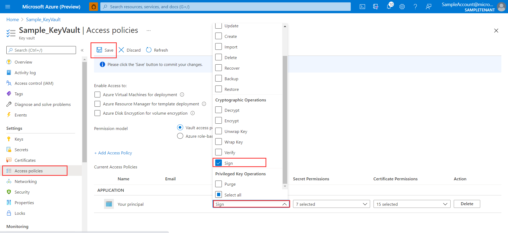

# Azure Key Vault Certificates Spring Boot starter client library for Java
Azure Key Vault Certificates Spring Boot Starter is Spring starter for [Azure Key Vault Certificates](https://docs.microsoft.com/azure/key-vault/certificates/about-certificates), it allows you to securely manage and tightly control your certificates.

[Package (Maven)][package] | [API reference documentation][refdocs] | [Samples][sample]

## Getting started

### Prerequisites
- [Environment checklist][environment_checklist]

### Include the package
[//]: # ({x-version-update-start;com.azure.spring:azure-spring-boot-starter-keyvault-certificates;current})
```xml
<dependency>
    <groupId>com.azure.spring</groupId>
    <artifactId>azure-spring-boot-starter-keyvault-certificates</artifactId>
    <version>3.1.0</version>
</dependency>
```
[//]: # ({x-version-update-end})
### Log into Azure 
```shell
  az login
```
### Create a resource group
To create an Azure resource group, use the command line below. Please replace myresourcegroup with a unique resource group name. 
```shell
  export RESOURCE_GROUP=myresourcegroup
  az group create -l westus -n ${RESOURCE_GROUP}
```
### Create an Azure Key Vault

To create an Azure Key Vault use the command line below. Please replace mykevault with a unique key vault name and store vaultUri returned for later use.

```shell
  export KEY_VAULT=mykeyvault
  az keyvault create --name ${KEY_VAULT} -g ${RESOURCE_GROUP}
```

### Create a self-signed certificate

To create a self-signed certificate use the command line below:

```shell
  export CERTIFICATE_ALIAS=self-signed
  az keyvault certificate create --vault-name ${KEY_VAULT} \
    -n ${CERTIFICATE_ALIAS} -p "$(az keyvault certificate get-default-policy)"
```

## Key concepts
This starter provides a KeyStore (`AzureKeyVault`) which can get certificates from `JRE` / `specific path` / `Azure Key Vault` / `classpath` .

## Examples
### Server side SSL

#### Option 1 - Use an Azure client ID and Azure client secret to identify your app

To create an Azure client and an Azure client secret use the command line below. Please store the values returned such as appId, password, tenant.
```shell
  export APP_NAME=myApp
  az ad sp create-for-rbac --skip-assignment --name ${APP_NAME}
  export CLIENT_ID=$(az ad sp list --display-name ${APP_NAME} | jq -r '.[0].appId')
  az ad app credential reset --id ${CLIENT_ID}
```

Store the values returned, which will be used later.

#### Make sure the client-id can access target Key Vault. Here are steps to configure access policy:

To grant access, use the command line below:

```shell
  az keyvault set-policy --name ${KEY_VAULT} \
        --spn ${CLIENT_ID} \
        --secret-permissions get list \
        --certificate-permissions get list \
        --key-permissions get list
```

#### Add the following items to your `application.yml`:
```yaml
azure:
  keyvault:
    uri:                 # The URI to the Azure Key Vault used. The vaultUri returned from a previous step
    tenant-id:           # The Tenant ID for your Azure Key Vault (needed if you are not using managed identity). The tenant returned from a previous step.
    client-id:           # The Client ID that has been setup with access to your Azure Key Vault (needed if you are not using managed identity). The appId returned from a previous step.  
    client-secret:       # The Client Secret that will be used for accessing your Azure Key Vault (needed if you are not using managed identity). The password returned from a previous step.
server:
  port: 8443
  ssl:
    key-alias:           # The alias corresponding to the certificate in Azure Key Vault. The certificate created in a previous step.
    key-store-type: AzureKeyVault  # The keystore type that enables the use of Azure Key Vault for your server-side SSL certificate.
```

#### Option 2 - Use a managed identity to identify your app. 
If you use managed identity, you need deploy your app on the Azure Spring Cloud or in Azure virtual machine, please refer to [Deploy Application Azure Spring Cloud][Deploy Application Azure Spring Cloud] and [Azure Spring Cloud TLS][Azure Spring Cloud TLS]
If you deploy your app on the Azure Spring Cloud, please refer to the following steps:
Firstly, you need have an Azure Spring Cloud instance. If you don't have one, you can create it via the command line below:

```shell
  export AZURE_SPRING_CLOUD_INSTANCE=myspringcloundinstance
  az spring-cloud create --name ${AZURE_SPRING_CLOUD_INSTANCE} --resource-group ${RESOURCE_GROUP}
```

Secondly, you need create an Apps instance in the Azure Spring Cloud instance via the command line below:
```shell
  export CLOUD_APP_INSTANCE=myappinstance
  az spring-cloud app create --name ${CLOUD_APP_INSTANCE} --resource-group ${RESOURCE_GROUP}  --service ${AZURE_SPRING_CLOUD_INSTANCE} --assign-endpoint true
```

Thirdly, assign a managed identity to Apps instance, use the command line below and store the value returned for later use:

```shell
  az spring-cloud app identity assign --name ${CLOUD_APP_INSTANCE} -g ${RESOURCE_GROUP} -s ${AZURE_SPRING_CLOUD_INSTANCE}
  export MANAGED_IDENTITY=$(az spring-cloud app show \
    --name ${SPRING_CLOUD_APP} --query identity.principalId --output tsv -g ${RESOURCE_GROUP} -s ${AZURE_SPRING_CLOUD_INSTANCE})
  echo ${MANAGED_IDENTITY}
```

Fourthly, enable TLS for your Apps instance, use the command line below:
```shell
  az spring-cloud app update --enable-end-to-end-tls -n ${CLOUD_APP_INSTANCE} -s ${AZURE_SPRING_CLOUD_INSTANCE} -g ${RESOURCE_GROUP}
```

Make sure the managed identity can access target Key Vault. To grant access use the command line below:

```shell
  az keyvault set-policy --name ${KEY_VAULT} \
        --object-id ${MANAGED_IDENTITY} \
        --key-permissions get list \
        --secret-permissions get list \
        --certificate-permissions get list
```
Add the following items to your `application.yml`:

```yaml
azure:
  keyvault:
    uri: <the URI of the Azure Key Vault to use>
#    managed-identity: #  managed identity to use, returned from a previous step. If empty, then system-assigned managed identity will be used.
server:
  ssl:
    key-alias: <the name of the certificate in Azure Key Vault to use>
    key-store-type: AzureKeyVault
```


### Client side SSL

#### Using a client ID and client secret
Add the following items to your `application.yml`:
```yaml
azure:
  keyvault:
    uri:                 # The URI to the Azure Key Vault used
    tenant-id:           # The Tenant ID for your Azure Key Vault (needed if you are not using managed identity).
    client-id:           # The Client ID that has been setup with access to your Azure Key Vault (needed if you are not using managed identity).
    client-secret:       # The Client Secret that will be used for accessing your Azure Key Vault (needed if you are not using managed identity).
```
Make sure the client-id can access target Key Vault. 

Configure a `RestTemplate` bean which set the `AzureKeyVault` as trust store:

<!-- embedme ../azure-spring-boot-samples/azure-spring-boot-sample-keyvault-certificates-client-side/src/main/java/com/azure/spring/security/keyvault/certificates/sample/client/side/SampleApplicationConfiguration.java#L25-L45 -->
```java
@Bean
public RestTemplate restTemplateWithTLS() throws Exception {
    KeyStore azureKeyVaultKeyStore = KeyStore.getInstance("AzureKeyVault");
    KeyVaultLoadStoreParameter parameter = new KeyVaultLoadStoreParameter(
        System.getProperty("azure.keyvault.uri"),
        System.getProperty("azure.keyvault.tenant-id"),
        System.getProperty("azure.keyvault.client-id"),
        System.getProperty("azure.keyvault.client-secret"));
    azureKeyVaultKeyStore.load(parameter);
    SSLContext sslContext = SSLContexts.custom()
                                       .loadTrustMaterial(azureKeyVaultKeyStore, null)
                                       .build();
    SSLConnectionSocketFactory socketFactory = new SSLConnectionSocketFactory(sslContext,
                                                                              (hostname, session) -> true);
    CloseableHttpClient httpClient = HttpClients.custom()
                                                .setSSLSocketFactory(socketFactory)
                                                .build();
    HttpComponentsClientHttpRequestFactory requestFactory = new HttpComponentsClientHttpRequestFactory(httpClient);

    return new RestTemplate(requestFactory);
}
```

#### Using a managed identity

If you are using managed identity instead of App registration, add the following items to your `application.yml`:
```yaml
azure:
  keyvault:
    uri: <the URI of the Azure Key Vault to use>
#    managed-identity:  # client-id of the user-assigned managed identity to use. If empty, then system-assigned managed identity will be used.
```
Make sure the managed identity can access target Key Vault.

Configure a `RestTemplate` bean which set the `AzureKeyVault` as trust store:

<!-- embedme ../azure-spring-boot/src/samples/java/com/azure/spring/keyvault/KeyVaultJcaManagedIdentitySample.java#L22-L40 -->
```java
@Bean
public RestTemplate restTemplateWithTLS() throws Exception {
    KeyStore trustStore = KeyStore.getInstance("AzureKeyVault");
    KeyVaultLoadStoreParameter parameter = new KeyVaultLoadStoreParameter(
        System.getProperty("azure.keyvault.uri"),
        System.getProperty("azure.keyvault.managed-identity"));
    trustStore.load(parameter);
    SSLContext sslContext = SSLContexts.custom()
                                       .loadTrustMaterial(trustStore, null)
                                       .build();
    SSLConnectionSocketFactory socketFactory = new SSLConnectionSocketFactory(sslContext,
        (hostname, session) -> true);
    CloseableHttpClient httpClient = HttpClients.custom()
                                                .setSSLSocketFactory(socketFactory)
                                                .build();
    HttpComponentsClientHttpRequestFactory requestFactory = new HttpComponentsClientHttpRequestFactory(httpClient);

    return new RestTemplate(requestFactory);
}
```


### Enable mutual SSL (mTLS).
 
Step 1. On the server side, add the following items to your `application.yml`:

```yaml
server:
  ssl:
    client-auth: need
    trust-store-type: AzureKeyVault
```

Step 2. On the client side, update `RestTemplate`. Example:

<!-- embedme ../azure-spring-boot-samples/azure-spring-boot-sample-keyvault-certificates-client-side/src/main/java/com/azure/spring/security/keyvault/certificates/sample/client/side/SampleApplicationConfiguration.java#L47-L75 -->
```java
@Bean
public RestTemplate restTemplateWithMTLS() throws Exception {
    KeyStore azureKeyVaultKeyStore = KeyStore.getInstance("AzureKeyVault");
    KeyVaultLoadStoreParameter parameter = new KeyVaultLoadStoreParameter(
        System.getProperty("azure.keyvault.uri"),
        System.getProperty("azure.keyvault.tenant-id"),
        System.getProperty("azure.keyvault.client-id"),
        System.getProperty("azure.keyvault.client-secret"));
    azureKeyVaultKeyStore.load(parameter);
    SSLContext sslContext = SSLContexts.custom()
                                       .loadTrustMaterial(azureKeyVaultKeyStore, null)
                                       .loadKeyMaterial(azureKeyVaultKeyStore, "".toCharArray(), new ClientPrivateKeyStrategy())
                                       .build();
    SSLConnectionSocketFactory socketFactory = new SSLConnectionSocketFactory(sslContext,
        (hostname, session) -> true);
    CloseableHttpClient httpClient = HttpClients.custom()
                                                .setSSLSocketFactory(socketFactory)
                                                .build();
    HttpComponentsClientHttpRequestFactory requestFactory = new HttpComponentsClientHttpRequestFactory(httpClient);

    return new RestTemplate(requestFactory);
}

private static class ClientPrivateKeyStrategy implements PrivateKeyStrategy {
    @Override
    public String chooseAlias(Map<String, PrivateKeyDetails> map, Socket socket) {
        return "self-signed"; // It should be your certificate alias used in client-side
    }
}
```

### Configuring Spring Cloud Gateway

To configure Spring Cloud Gateway for outbound SSL, add the following configuration:

```yaml
azure:
  keyvault:
    uri: <the URI of the Azure Key Vault to use>
    jca: 
      overrideTrustManagerFactory: true
```

Note: if any of your routes point to a service where the FQDN does not match the
issued certificate you will need to disable hostname verification. This will
be the case if your service is dynamically assigned a hostname by the hosting
platform you use. In this particular case add the configuration below to disable
hostname verification:

```yaml
azure:
  keyvault:
    jca:
      disableHostnameVerification: true
```

If you are developing you can completely disable the certificate and hostname
validation altogether by using the configuration below. **Note this is NOT 
recommended for production!**

```yaml
spring:
  cloud:
    gateway:
      httpclient:
        ssl:
          useInsecureTrustManager: true
```

### Refresh certificate periodically

KeyVaultKeyStore can fetch certificates from KeyVault periodically if the following property is configured:

```yaml
azure:
  keyvault:
    jca:
       certificates-refresh-interval: 1800000
```

Its value is 0(ms) by default, and certificate will not automatically refresh when its value <= 0.

### Refresh certificates when have un trust certificate

When the inbound certificate is not trusted, the KeyVaultKeyStore can fetch 
certificates from KeyVault if the following property is configured:

```yaml
azure:
  keyvault:
    jca:
      refresh-certificates-when-have-un-trust-certificate: true
```

Note: If you set refresh-certificates-when-have-un-trust-certificate=true, your server will be vulnerable
to attack, because every untrusted certificate will cause your application to send a re-acquire certificate request.

### Specific path certificates
AzureKeyVault keystore will load certificates in the specific path:

well-know path: /etc/certs/well-known/
custom path: /etc/certs/custom/
The 2 paths can be configured by these propreties:

```yaml
azure:
  cert-path:
    well-known:     # The file location where you store the well-known certificate
    custom:         # The file location where you store the custom certificate
```

### Classpath certificates

AzureKeyVault keystore will load certificates in the classpath.

Add the certificates to `src/main/resources/keyvault` as classpath certificates.

Notes: 
1. The alias (certificate name) is constructed from the filename of the 
certificate (minus the extension). So if your filename is `mycert.x509` the
certificate will be added with the alias of `mycert`. 
2. The priority order of the certificates is: 
    1. Certificates from JRE.
    2. Certificates from well-known file path.
    3. Certificates from custom file path.
    4. Certificates from Azure Key Vault. 
    5. Certificates from classpath.

### Key-Less certificates
You can set the private key as [non-exportable] to ensure the security of the key.

Note if you want to use key less certificate, you must add `sign` permission.

You can add permission in portal: 

Or add permission by cli command:
```shell
  az keyvault set-policy --name ${KEY_VAULT} \
        --object-id ${MANAGED_IDENTITY} \
        --key-permissions get list sign\
        --secret-permissions get list \
        --certificate-permissions get list
```

### Supported key type
Content Type | Key Type | Key Size or Elliptic curve name | Sign algorithm  | Support |
-------------|----------|---------------------------------|---------------- |-------- |
PKCS #12     | RSA      | 2048                            | RSASSA-PSS      | ✔       |     
PKCS #12     | RSA      | 3072                            | RSASSA-PSS      | ✔       |
PKCS #12     | RSA      | 4096                            | RSASSA-PSS      | ✔       |
PKCS #12     | EC       | P-256                           | SHA256withECDSA | ✔       |
PKCS #12     | EC       | P-384                           | SHA384withECDSA | ✔       |
PKCS #12     | EC       | P-521                           | SHA512withECDSA | ✔       |
PKCS #12     | EC       | P-256K                          |                 | ✘       |
PEM          | RSA      | 2048                            | RSASSA-PSS      | ✔       |
PEM          | RSA      | 3072                            | RSASSA-PSS      | ✔       |
PEM          | RSA      | 4096                            | RSASSA-PSS      | ✔       |
PEM          | EC       | P-256                           | SHA256withECDSA | ✔       |
PEM          | EC       | P-384                           | SHA384withECDSA | ✔       |
PEM          | EC       | P-521                           | SHA512withECDSA | ✔       | 
PEM          | EC       | P-256K                          |                 | ✘       |

## Troubleshooting
### Enable client logging
Azure SDKs for Java offers a consistent logging story to help aid in troubleshooting application errors and expedite their resolution. The logs produced will capture the flow of an application before reaching the terminal state to help locate the root issue. View the [logging][logging] wiki for guidance about enabling logging.

### Enable Spring logging
Spring allow all the supported logging systems to set logger levels set in the Spring Environment (for example, in application.yml) by using `logging.level.<logger-name>=<level>` where level is one of TRACE, DEBUG, INFO, WARN, ERROR, FATAL, or OFF. The root logger can be configured by using logging.level.root.

The following example shows potential logging settings in `application.yml`:
```yaml
logging:
  level:
    root: WARN
    org:
      springframework.web: DEBUG
      hibernate: ERROR
```

For more information about setting logging in spring, please refer to the [official doc](https://docs.spring.io/spring-boot/docs/current/reference/html/features.html#boot-features-logging).

## Next steps
The following section provide a sample project illustrating how to use the starter.
### More sample code
- [Key Vault Certificates][sample]

## Contributing
This project welcomes contributions and suggestions.  Most contributions require you to agree to a Contributor License Agreement (CLA) declaring that you have the right to, and actually do, grant us the rights to use your contribution. For details, visit https://cla.microsoft.com.

Please follow [instructions here](https://github.com/Azure/azure-sdk-for-java/blob/main/sdk/spring/CONTRIBUTING.md) to build from source or contribute.

<!-- LINKS -->
[refdocs]: https://azure.github.io/azure-sdk-for-java/springboot.html#azure-spring-boot
[package]: https://mvnrepository.com/artifact/com.azure.spring/azure-spring-boot-starter-keyvault-certificates
[sample]: https://github.com/Azure-Samples/azure-spring-boot-samples/tree/tag_azure-spring-boot_3.6.0/keyvault/azure-spring-boot-sample-keyvault-certificates-server-side
[logging]: https://github.com/Azure/azure-sdk-for-java/wiki/Logging-with-Azure-SDK#use-logback-logging-framework-in-a-spring-boot-application
[environment_checklist]: https://github.com/Azure/azure-sdk-for-java/blob/main/sdk/spring/ENVIRONMENT_CHECKLIST.md#ready-to-run-checklist
[non-exportable]: https://docs.microsoft.com/azure/key-vault/certificates/about-certificates#exportable-or-non-exportable-key
[Azure Spring Cloud TLS]: https://docs.microsoft.com/en-us/azure/spring-cloud/how-to-enable-end-to-end-tls
[Deploy Application Azure Spring Cloud]: https://docs.microsoft.com/en-us/azure/spring-cloud/quickstart?tabs=Azure-CLI&pivots=programming-language-java
