# Azure Spring Boot Integration tests client library for Java

## Key concepts
## Getting started

### How to run AADConditionalAccessIT. 

#####  What is AAD Conditional Access in AAD?

Azure Active Directory is a token-based authentication platform, [On-Behalf-Of flow] is the middle-tier service to make authenticated requests to the downstream service through token.
[Conditional Access] is the tool used by Azure Active Directory to bring signals together, to make decisions, and enforce organizational policies. 
In some scenarios, Conditional Access may cause the token get from middle-tier service was useless. AAD stater can help us complete the verification again and obtain a valid token again.
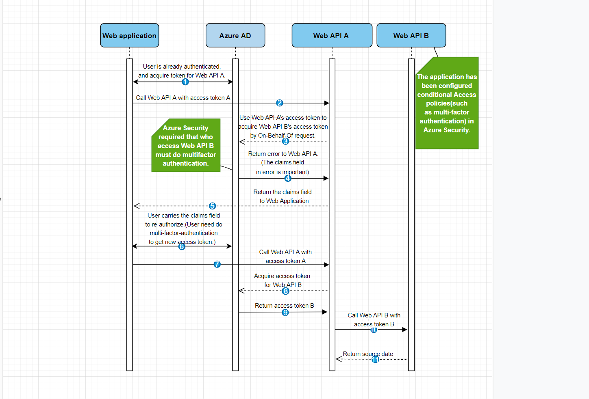

##### Create applications and configure it.
1. First, we need create three applications. The registered application name is ***webapp***, ***webapiA*** and ***webapiB***.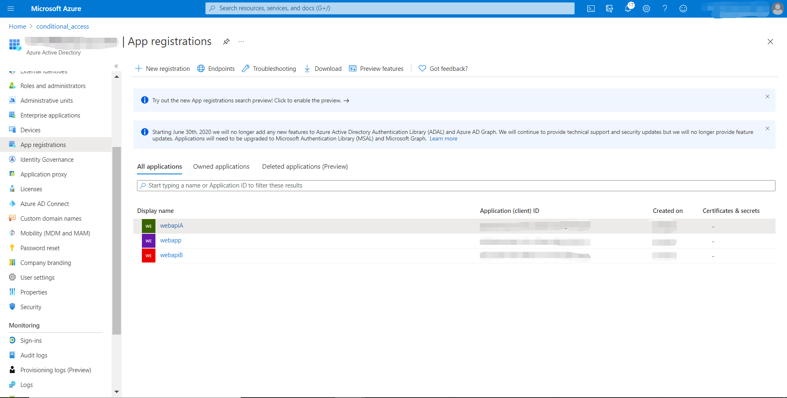
1. Under ***webapiA*** and ***webapiB*** application, select Expose an API -> Add a scope. Then set the Scope name to File.Read. click Add scope button.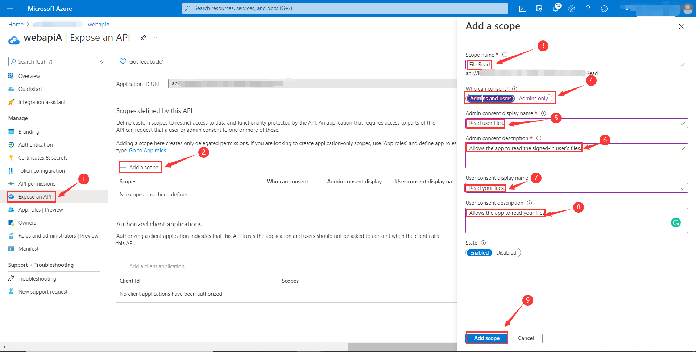 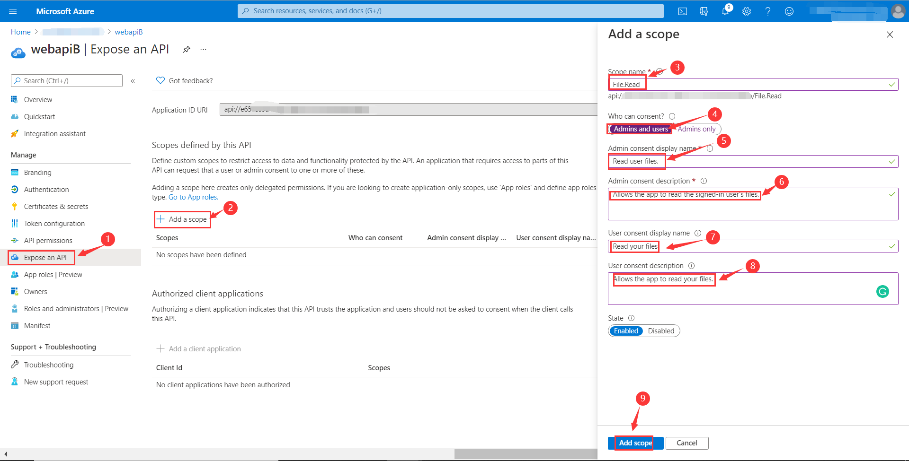
1. After creating the scope. Expose scopes for ***webapp*** and ***webapiA***. Select API permissions > Add a permission > My APIs, select ***webapiA*** or ***webapiB*** application name.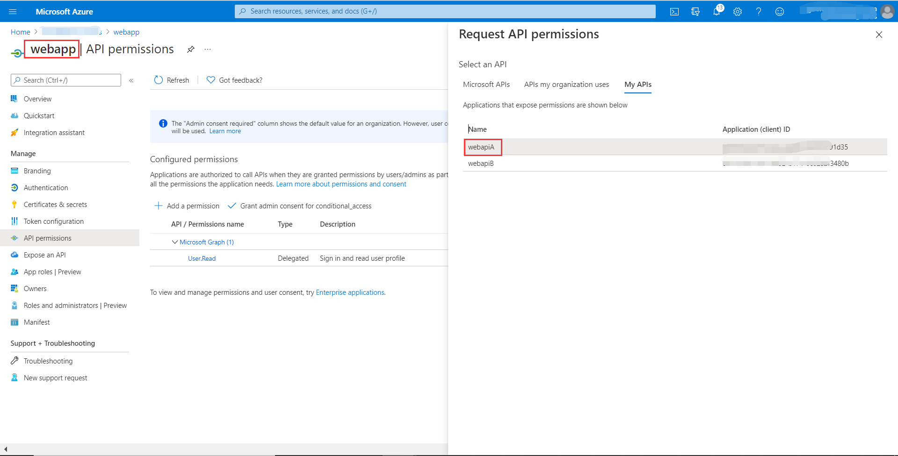 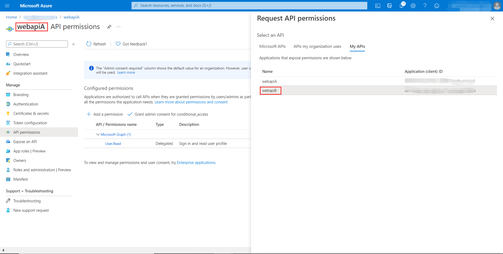
1. **Delegated permissions** is selected by default， Select **File** > **File.Read** permission, select **Add permission** to complete the process. 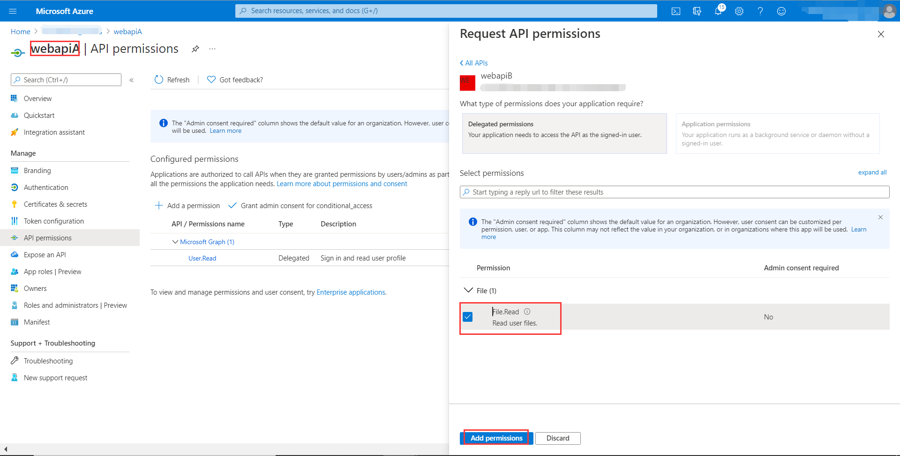
1. Grant admin consent for ***webapiA*** and ***webapiB*** permissions.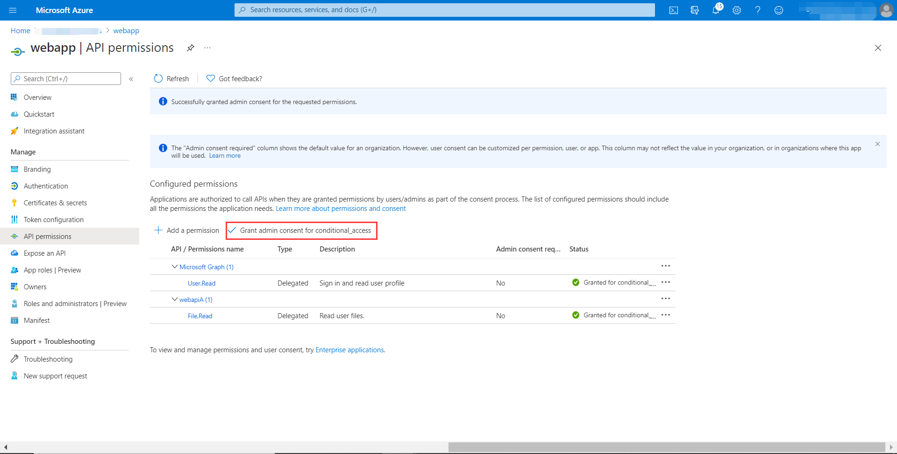 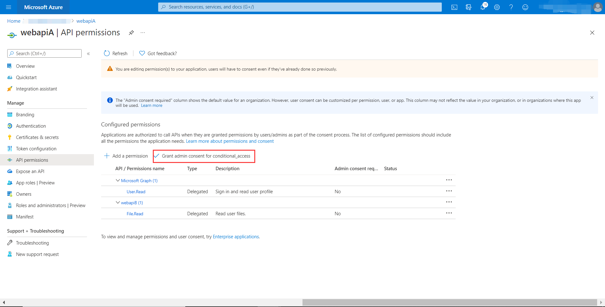

##### Azure subscriptions 

##### Config Conditional Access Policy.
1. Open the home of azure -> Select Security. 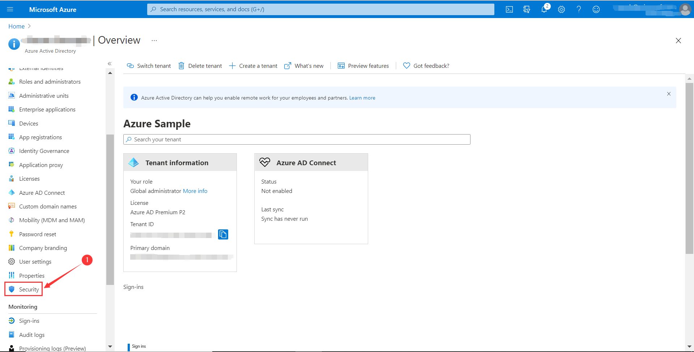
1. Select Conditional Access button.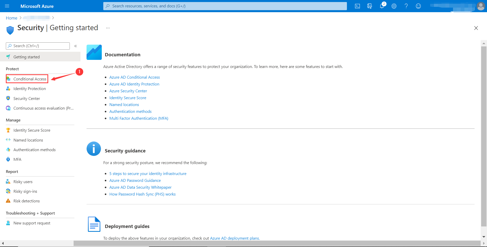
1. Then create a new policy.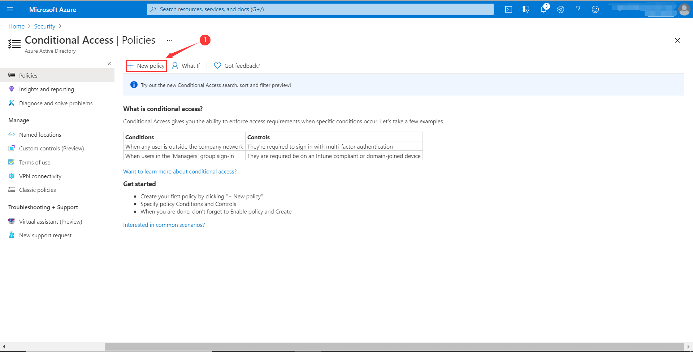
1. We need to prepare a user or a group. As below, we need to configure users or groups to follow this policy.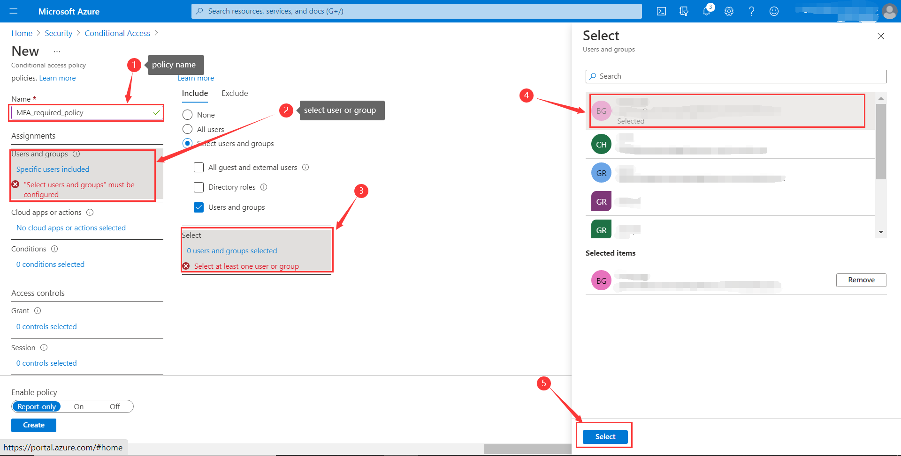
1. As before, we need to configure one or more applications to follow this policy. In our case, we need to configure the ***webapiB*** application.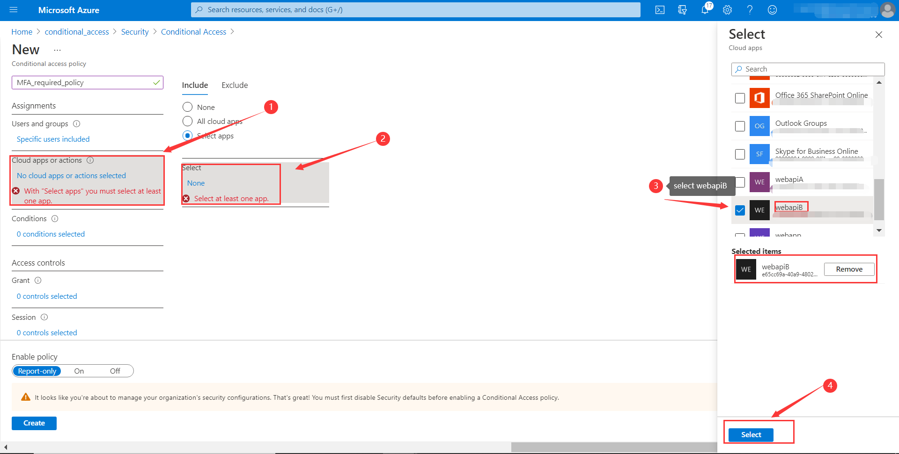
1. In our case, we use [Multi-Factor Authentication] as Conditional Access Policy. So select `Require multi-factor authentication` in ***Grant***.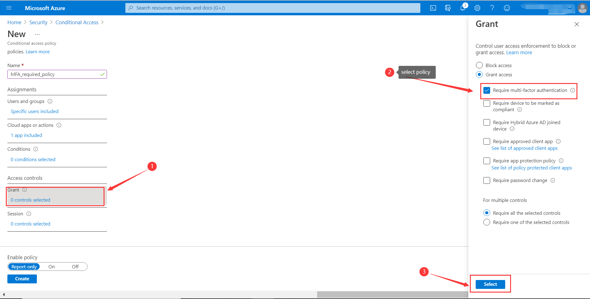
1. Finally, enable it.(If can’t create a policy, maybe you need to close [Access management for Azure resources].)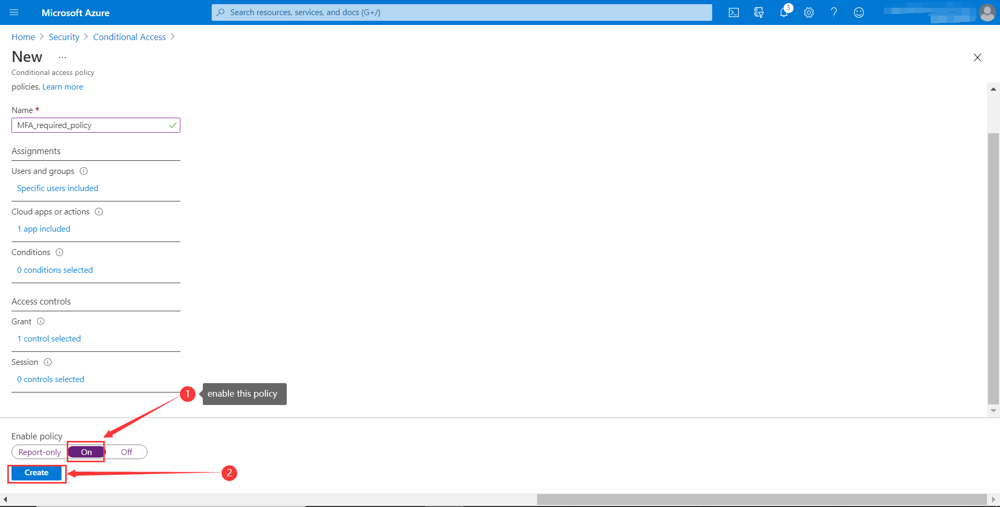

##### Run AADConditionalAccessIT

This case is difficult to run automatically, we need to execute it manually. 
Here are the steps to start this case.

 - Prepare application and Conditional Access Policy as above.
 - Prepare environment variables for `ConditionalAccessPolicyTestWebApiB`(***com.azure.test.aad.conditional.access.webapi.b***) as below. The environment variables are the parameters of our ***webapiB*** application and application server port Will start at 8883.

| webapiB application requires environment variable name | Actual Value | 
| ---: | :----: | 
|   CONDITIONAL_ACCESS_POLICY_TEST_WEB_API_B_CLIENT_ID  | your webapiB application id |

 - Same as `ConditionalAccessPolicyTestWebApiB`, The environment variables of `ConditionalAccessPolicyTestWebApiA`(***com.azure.test.aad.webapi.conditional.access.webapi.a***) is the parameters of our ***webapiA*** application and  application server port Will start at 8882.

| webapiA application requires environment variable name | Actual Value | 
| ---: | :----: | 
|   CONDITIONAL_ACCESS_POLICY_TEST_WEB_API_A_CLIENT_ID  | your webapiA application id |
|   CONDITIONAL_ACCESS_POLICY_TEST_WEB_API_A_CLIENT_SECRET  | your webapiA application secret |
|   CONDITIONAL_ACCESS_POLICY_TEST_WEB_API_B_CLIENT_ID  | your webapiB application id |
|   AAD_TENANT_ID_1  | your tenant id |

 - At last, Prepare the environment variables of `AADConditionalAccessIT` through the parameters of ***webapp*** application.

| webapp application requires environment variable name | Actual Value | 
| ---: | :----: | 
|   CONDITIONAL_ACCESS_POLICY_TEST_WEB_API_A_CLIENT_ID  | your webapiA application id |
|   AAD_SINGLE_TENANT_CLIENT_ID  | your webapp application id |
|   AAD_SINGLE_TENANT_CLIENT_SECRET  | your webapp application secret |
|   AAD_TENANT_ID_1  | your tenant id |
|   AZURE_CLOUD_TYPE  | your azure subscription type |
|   AAD_USER_NAME_1  | your aad user name |
|   AAD_USER_PASSWORD_1  | your aad user password |

 - Start the `conditionalAccessTest()` method.
 - Then our Authenticator App in mobile phone will receive a message that requires your approval for this login request.(If you log in for the first time, you need to follow the instructions to set up the Authenticator App) After we agree, we can obtain a valid token.
 - Finally, we can get the data from ***webapiB***, this case passed.

## Examples
## Troubleshooting
## Next steps
## Contributing

<!-- LINKS -->
[On-Behalf-Of flow]: https://docs.microsoft.com/azure/active-directory/develop/v2-oauth2-on-behalf-of-flow
[Multi-Factor Authentication]: https://docs.microsoft.com/azure/active-directory/authentication/tutorial-enable-azure-mfa
[Conditional Access]: https://docs.microsoft.com/azure/active-directory/conditional-access/overview
[Access management for Azure resources]: https://docs.microsoft.com/azure/active-directory/fundamentals/concept-fundamentals-security-defaults