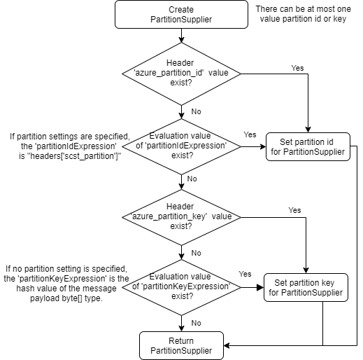

# Azure Event Hubs Spring Cloud Stream Binder client library for Java

The project provides **Spring Cloud Stream Binder for Azure Event Hub** which allows you to build message-driven 
microservice using **Spring Cloud Stream** based on [Azure Event Hub][azure_event_hub] service.

[Source code][src] | [Package (Maven)][package] | [API reference documentation][refdocs] | [Product documentation][docs] | [Samples][sample]

## Getting started

### Prerequisites
- [Environment checklist][environment_checklist]

### Include the package
1. [Add azure-spring-cloud-dependencies].
1. Add dependency. `<version>` can be skipped because we already add `azure-spring-cloud-dependencies`.
```xml
<dependency>
  <groupId>com.azure.spring</groupId>
  <artifactId>spring-cloud-azure-stream-binder-eventhubs</artifactId>
</dependency>
```

## Key concepts

### EventHub Binder Overview

The Spring Cloud Stream Binder for Azure Event Hub provides the binding implementation for the Spring Cloud Stream.
This implementation uses Spring Integration Event Hub Channel Adapters at its foundation. From design's perspective, 
Event Hub is similar as Kafka. Also, Event Hub could be accessed via Kafka API. If your project has tight dependency 
on Kafka API, you can try [Event Hub with Kafka API Sample][kafka_sample]
#### Consumer Group

Event Hub provides similar support of consumer group as Apache Kafka, but with slight different logic. While Kafka 
stores all committed offsets in the broker, you have to store offsets of event hub messages 
being processed manually. Event Hub SDK provide the function to store such offsets inside Azure Storage Account. So 
that's why you have to fill `spring.cloud.stream.eventhub.checkpoint-storage-account`.

#### Partitioning Support

Event Hub provides a similar concept of physical partition as Kafka. But unlike Kafka's auto rebalancing between consumers and partitions, Event Hub provides a kind of preemptive mode. The storage account acts as a lease to determine which partition is owned by which consumer. When a new consumer starts, it will try to steal some partitions
from most heavy-loaded consumers to achieve the workload balancing.

## Examples 

Please use this [sample][sample] as a reference for how to use this binder. 

### Configuration Options 

The binder provides the following configuration options in `application.properties`.

#### Spring Cloud Azure Properties ####

|Name | Description | Required | Default 
|:---|:---|:---|:---
spring.cloud.azure.auto-create-resources | If enable auto-creation for Azure resources |  | false
spring.cloud.azure.region | Region name of the Azure resource group, e.g. westus | Yes if spring.cloud.azure.auto-create-resources is enabled. |
spring.cloud.azure.environment | Azure Cloud name for Azure resources, supported values are  `azure`, `azurechina`, `azure_germany` and `azureusgovernment` which are case insensitive | |azure | 
spring.cloud.azure.client-id | Client (application) id of a service principal or Managed Service Identity (MSI) | Yes if service principal or MSI is used as credential configuration. |
spring.cloud.azure.client-secret | Client secret of a service principal | Yes if service principal is used as credential configuration. |
spring.cloud.azure.msi-enabled | If enable MSI as credential configuration | Yes if MSI is used as credential configuration. | false
spring.cloud.azure.resource-group | Name of Azure resource group | Yes if service principal or MSI is used as credential configuration. |
spring.cloud.azure.subscription-id | Subscription id of an MSI | Yes if MSI is used as credential configuration. |
spring.cloud.azure.tenant-id | Tenant id of a service principal | Yes if service principal is used as credential configuration. |
spring.cloud.azure.eventhub.connection-string | Event Hubs Namespace connection string | Yes if connection string is used as Event Hubs credential configuration |
spring.cloud.azure.eventhub.checkpoint-storage-account | StorageAccount name for message checkpoint | Yes
spring.cloud.azure.eventhub.checkpoint-access-key | StorageAccount access key for message checkpoint | Yes if StorageAccount access key is used as StorageAccount credential configuration
spring.cloud.azure.eventhub.checkpoint-container | StorageAccount container name for message checkpoint | Yes
spring.cloud.azure.eventhub.namespace | Event Hub Namespace. Auto creating if missing | Yes if service principal or MSI is used as credential configuration. |

#### Common Producer Properties ####

You can use the producer configurations of **Spring Cloud Stream**, 
it uses the configuration with the format of `spring.cloud.stream.bindings.<channelName>.producer`.

##### Partition configuration

The system will obtain the parameter `PartitionSupply` to send the message, 
the following is the process of obtaining the priority of the partition ID and key:



The following are configuration items related to the producer:

**_partition-count_**

The number of target partitions for the data, if partitioning is enabled.

Default: 1

**_partition-key-extractor-name_**

The name of the bean that implements `PartitionKeyExtractorStrategy`. 
The partition handler will first use the `PartitionKeyExtractorStrategy#extractKey` method to obtain the partition key value.

Default: null

**_partition-key-expression_**

A SpEL expression that determines how to partition outbound data. 
When interface `PartitionKeyExtractorStrategy` is not implemented, it will be called in the method `PartitionHandler#extractKey`.

Default: null

For more information about setting partition for the producer properties, please refer to the [Producer Properties of Spring Cloud Stream][spring_cloud_stream_current_producer_properties].

#### Event Hub Producer Properties ####

It supports the following configurations with the format of `spring.cloud.stream.eventhub.bindings.<channelName>.producer`.
 
**_sync_**

Whether the producer should act in a synchronous manner with respect to writing messages into a stream. If true, the 
producer will wait for a response from Event Hub after a send operation.

Default: `false`

**_send-timeout_**

Effective only if `sync` is set to true. The amount of time to wait for a response from Event Hub after a send operation, in milliseconds.

Default: `10000`

#### Event Hub Consumer Properties ####

It supports the following configurations with the format of `spring.cloud.stream.eventhub.bindings.<channelName>.consumer`.

**_start-position_**

Whether the consumer receives messages from the beginning or end of event hub. if `EARLIEST`, from beginning. If 
`LATEST`, from end.

Default: `LATEST`

**_checkpoint-mode_**

The mode in which checkpoints are updated.

`RECORD`, checkpoints occur after each record is successfully processed by user-defined message handler without any exception. If you use `StorageAccount` as checkpoint store, this might become botterneck. 

`BATCH`, checkpoints occur after each batch of messages successfully processed by user-defined message handler without any exception. `default` mode. You may experience reprocessing at most one batch of messages when message processing fails. Be aware that batch size could be any value.

`MANUAL`, checkpoints occur on demand by the user via the `Checkpointer`. You can do checkpoints after the message has been successfully processed. `Message.getHeaders.get(AzureHeaders.CHECKPOINTER)`callback can get you the `Checkpointer` you need. Please be aware all messages in the corresponding Event Hub partition before this message will be considered as successfully processed.

`PARTITION_COUNT`, checkpoints occur after the count of messages defined by `checkpoint_count` successfully processed for each partition. You may experience reprocessing at most `checkpoint_count` of  when message processing fails.

`Time`, checkpoints occur at fixed time inerval specified by `checkpoint_interval`. You may experience reprocessing of messages during this time interval when message processing fails.

Default: `BATCH`

**_checkpoint-count_**

Effectively only when `checkpoint-mode` is `PARTITION_COUNT`. Decides the amount of message for each partition to do one checkpoint.

Default: `10`

**_checkpoint-interval_**

Effectively only when `checkpoint-mode` is `Time`. Decides The time interval to do one checkpoint.

Default: `5s`

### Error Channels
**_consumer error channel_**

this channel is open by default, you can handle the error message in this way:
```
    // Replace destination with spring.cloud.stream.bindings.input.destination
    // Replace group with spring.cloud.stream.bindings.input.group
    @ServiceActivator(inputChannel = "{destination}.{group}.errors")
    public void consumerError(Message<?> message) {
        LOGGER.error("Handling customer ERROR: " + message);
    }
```

**_producer error channel_**

this channel is not open by default, if you want to open it. You need to add a configuration in your application.properties, like this:
```
spring.cloud.stream.default.producer.errorChannelEnabled=true
```

you can handle the error message in this way:
```
    // Replace destination with spring.cloud.stream.bindings.output.destination
    @ServiceActivator(inputChannel = "{destination}.errors")
    public void producerError(Message<?> message) {
        LOGGER.error("Handling Producer ERROR: " + message);
    }
```

## Troubleshooting
### Enable client logging
Azure SDKs for Java offers a consistent logging story to help aid in troubleshooting application errors and expedite their resolution. The logs produced will capture the flow of an application before reaching the terminal state to help locate the root issue. View the [logging][logging] wiki for guidance about enabling logging.

### Enable Spring logging
Spring allow all the supported logging systems to set logger levels set in the Spring Environment (for example, in application.properties) by using `logging.level.<logger-name>=<level>` where level is one of TRACE, DEBUG, INFO, WARN, ERROR, FATAL, or OFF. The root logger can be configured by using logging.level.root.

The following example shows potential logging settings in `application.properties`:

```properties
logging.level.root=WARN
logging.level.org.springframework.web=DEBUG
logging.level.org.hibernate=ERROR
```

For more information about setting logging in spring, please refer to the [official doc][logging_doc].
 

## Next steps

The following section provide a sample project illustrating how to use the starter.
### More sample code
- [Eventhubs Binder Sample][sample]
- [Eventhubs Multibinders Sample][eventhubs_multibinders_sample]

## Contributing
This project welcomes contributions and suggestions.  Most contributions require you to agree to a Contributor License Agreement (CLA) declaring that you have the right to, and actually do, grant us the rights to use your contribution. For details, visit https://cla.microsoft.com.

Please follow [instructions here][contributing_md] to build from source or contribute.

<!-- Link -->
[src]: https://github.com/Azure/azure-sdk-for-java/tree/main/sdk/spring/azure-spring-cloud-stream-binder-eventhubs/src
[package]: https://mvnrepository.com/artifact/com.azure.spring/azure-spring-cloud-stream-binder-eventhubs
[refdocs]: https://azure.github.io/azure-sdk-for-java/springcloud.html#azure-spring-cloud-stream-binder-eventhubs
[docs]: https://docs.microsoft.com/azure/developer/java/spring-framework/configure-spring-cloud-stream-binder-java-app-azure-event-hub
[sample]: https://github.com/Azure-Samples/azure-spring-boot-samples/tree/main/eventhubs/azure-spring-cloud-stream-binder-eventhubs
[logging]: https://github.com/Azure/azure-sdk-for-java/wiki/Logging-with-Azure-SDK#use-logback-logging-framework-in-a-spring-boot-application
[logging_doc]: https://docs.spring.io/spring-boot/docs/current/reference/html/features.html#boot-features-logging
[eventhubs_multibinders_sample]: https://github.com/Azure-Samples/azure-spring-boot-samples/tree/main/eventhubs/azure-spring-cloud-stream-binder-eventhubs/eventhubs-multibinders
[contributing_md]: https://github.com/Azure/azure-sdk-for-java/tree/main/sdk/spring/CONTRIBUTING.md
[azure_event_hub]: https://azure.microsoft.com/services/event-hubs/
[environment_checklist]: https://github.com/Azure/azure-sdk-for-java/blob/main/sdk/spring/ENVIRONMENT_CHECKLIST.md#ready-to-run-checklist
[spring_cloud_stream_current_producer_properties]: https://docs.spring.io/spring-cloud-stream/docs/current/reference/html/spring-cloud-stream.html#_producer_properties
[Add azure-spring-cloud-dependencies]: https://github.com/Azure/azure-sdk-for-java/blob/main/sdk/spring/AZURE_SPRING_BOMS_USAGE.md#add-azure-spring-cloud-dependencies
[kafka_sample]: https://github.com/Azure-Samples/azure-spring-boot-samples/tree/main/eventhubs/azure-spring-cloud-starter-eventhubs-kafka/eventhubs-kafka